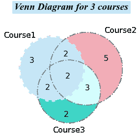
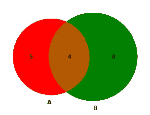
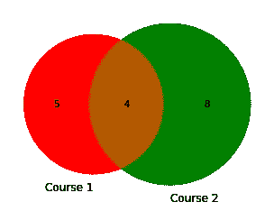
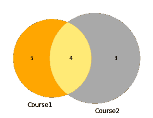
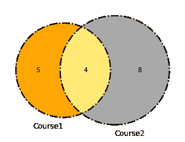
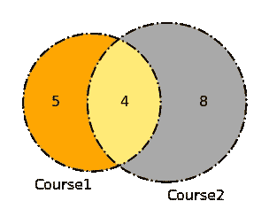
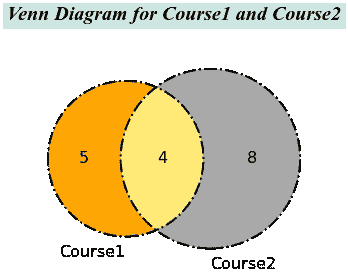
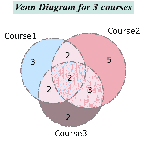
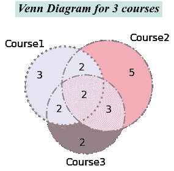
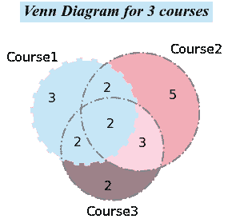

# 如何用 Python 创建一个美化的维恩图

> 原文：<https://towardsdatascience.com/how-to-create-and-beautify-venn-diagrams-in-python-331129bd4ed3?source=collection_archive---------12----------------------->

## 由 matplotlib-venn 授权

维恩图是科研文章中最常见的图，可以用来表示多个数据集之间的关系。从维恩图中，你可以很容易地发现这些数据集之间的共性和差异。本教程将向你展示用 Python 创建维恩图的三种不同方法，以及如何美化这些图。



**第一部分:如何创建维恩图**

*   步骤 1:您需要安装名为 matplotlib-venn 的库。

```
pip install matplotlib-venn
```

*   步骤 2:导入库

```
#Import libraries
from matplotlib_venn import venn2, venn2_circles, venn2_unweighted
from matplotlib_venn import venn3, venn3_circles
from matplotlib import pyplot as plt
%matplotlib inline
```

*   步骤 3:为数据可视化创建数据集

每个数据集中的字母代表学生姓名，我们希望直观显示每门课程有多少学生注册，其中有多少学生注册了两门和三门课程。

```
Course1=[‘A’,’B’,’C’,’E’,’F’,’G’,’I’,’P’,’Q’]
Course2=[‘B’,’E’,’F’,’H’,’K’,’Q’,’R’,’S’,’T’,’U’,’V’,’Z’]
Course3=[‘C’,’E’,’G’,’H’,’J’,’K’,’O’,’Q’,’Z’]
```

*   第四步:可视化维恩图

让我们开始画一张有两组的文氏图。

使用 matplotlib 库制作维恩图有 3 种主要方法，可以得到相同的结果。

方法 1 是最直接的方法。直接放两个数据集。

```
#Method1: put two datasets directly
venn2([set(Course1), set(Course2)])
plt.show()
```

你会得到这样的文氏图:



文氏图 1

对于方法 2，你需要先知道下面的数字。

*   Ab =包含在 ***中的左组*** (此处表示为 A)，但 ***不是右组*** (此处表示为 B)
*   aB =包含在 ***右组*** 中的 B，但 ***不是左组*** 中的 A
*   ab = a⋂b；包含在两组中。

子集参数是一个 3 元素列表，其中数字 5、8、4 对应于 aB、AB、Ab。

```
#Method 2: 
venn2(subsets = (5, 8, 4))
plt.show()
```

你会得到和文氏图 1 一样的图。Matplotlib 自动将 A 和 B 赋给维恩图。

对于方法 3，您需要向参数子集传递一个字典。

```
#Method 3: 
venn2(subsets = {‘10’: 5, ‘01’: 8, ‘11’: 4})
plt.show()
```

关键是二进制编码方法。所以这三个键必须是“10”、“01”和“11”，键后的每个值代表对应区域的大小。

**第二部分:美化维恩图**

1.  更改标签

```
venn2([set(Course1), set(Course2)],set_labels=(‘Course1’, ‘Course2’))
plt.show()
```



2.设置颜色和不透明度

```
venn2([set(Course1), set(Course2)],set_labels=(‘Course1’, ‘Course2’),set_colors=(‘orange’, ‘darkgrey’), alpha = 0.8)
plt.show()
```



3.改变圈子

```
venn2([set(Course1), set(Course2)],set_labels=(‘Course1’, ‘Course2’),set_colors=(‘orange’, ‘darkgrey’), alpha = 0.8)
venn2_circles([set(dataset1), set(dataset2)], linestyle=’-.’, linewidth=2, color=’black’)
plt.show()
```



Matplotlib 提供了各种不同的线型。更多关于 linestyle 的信息可以在 Matplotlib 网站上找到。

4.更改标签和数字的大小

```
vd2=venn2([set(Course1), set(Course2)],set_labels=(‘Course1’, ‘Course2’),set_colors=(‘orange’, ‘darkgrey’), alpha = 0.8)
venn2_circles([set(Course1), set(Course2)], linestyle=’-.’, linewidth=2, color=’black’)
**for text in vd2.set_labels:  #change label size
 text.set_fontsize(16);
for text in vd2.subset_labels:  #change number size
 text.set_fontsize(16)**
plt.show()
```



5.向图表添加标题

要完成文氏图，必须添加标题。

```
vd2=venn2([set(Course1), set(Course2)],set_labels=(‘Course1’, ‘Course2’),set_colors=(‘orange’, ‘darkgrey’), alpha = 0.8)
venn2_circles([set(Course1), set(Course2)], linestyle=’-.’, linewidth=2, color=’black’)for text in vd2.set_labels:
 text.set_fontsize(16);
for text in vd2.subset_labels:
 text.set_fontsize(16)plt.title(‘Venn Diagram for Course1 and Course2’,fontname=’Times New Roman’,fontweight=’bold’,fontsize=20,pad=30,backgroundcolor=’#cbe7e3',color=’black’,style=’italic’);
plt.show()
```



画一个有 3 组的维恩图和生成一个有 2 组的维恩图没有明显的区别。

```
vd3=venn3([set(Course1),set(Course2),set(Course3)],
 set_labels=(‘Course1’, ‘Course2’,’Course3'),
 set_colors=(‘#c4e6ff’, ‘#F4ACB7’,’#9D8189'), 
 alpha = 0.8)
venn3_circles([set(Course1), set(Course2),set(Course3)], linestyle=’-.’, linewidth=2, color=’grey’)
for text in vd3.set_labels:
 text.set_fontsize(16);
for text in vd3.subset_labels:
 text.set_fontsize(16)
plt.title(‘Venn Diagram for 3 courses’,fontname=’Times New Roman’,fontweight=’bold’,fontsize=20,
 pad=30,backgroundcolor=’#cbe7e3',color=’black’,style=’italic’);
plt.show()
```



Matplotlib 允许我们单独定制每个圆。让我们自定义左上角的圆圈。

```
vd3=venn3([set(Course1),set(Course2),set(Course3)],
 set_labels=(‘Course1’, ‘Course2’,’Course3'),
 set_colors=(‘#c4e6ff’, ‘#F4ACB7’,’#9D8189'), 
 alpha = 0.8)
c=venn3_circles([set(Course1), set(Course2),set(Course3)], linestyle=’-.’, linewidth=2, color=’grey’)
for text in vd3.set_labels:
 text.set_fontsize(16);
for text in vd3.subset_labels:
 text.set_fontsize(16)
plt.title(‘Venn Diagram for 3 courses’,fontname=’Times New Roman’,fontweight=’bold’,fontsize=20,
 pad=30,backgroundcolor=’#cbe7e3',color=’black’,style=’italic’);
**c[0].set_lw(3.0) #customize upper left circle 
c[0].set_ls(‘:’)**
plt.show()
```



圆圈的颜色也可以定制。但是，如果我们给圆分配一个新的颜色，它将覆盖我们在 venn3 函数中通过参数 set_colors 设置的颜色。

```
vd3=venn3([set(Course1),set(Course2),set(Course3)],
 set_labels=(‘Course1’, ‘Course2’,’Course3'),
 set_colors=(‘#c4e6ff’, ‘#F4ACB7’,’#9D8189'), 
 alpha = 0.8)
c=venn3_circles([set(Course1), set(Course2),set(Course3)], linestyle=’-.’, linewidth=2, color=’grey’)
for text in vd3.set_labels:
 text.set_fontsize(16);
for text in vd3.subset_labels:
 text.set_fontsize(16)
plt.title(‘Venn Diagram for 3 courses’,fontname=’Times New Roman’,fontweight=’bold’,fontsize=20,
 pad=30,backgroundcolor=’#cbe7e3',color=’black’,style=’italic’);
c[0].set_lw(7.0)
c[0].set_ls(‘:’)
c[0].set_color(‘#c4e6ff’)
plt.show()
```



享受维恩图表！