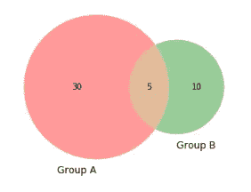
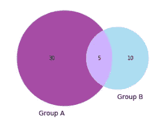
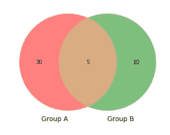
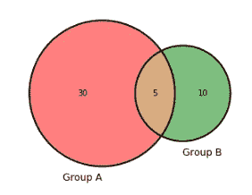
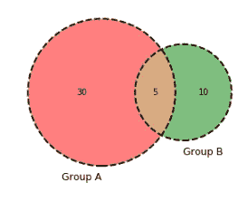
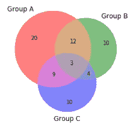
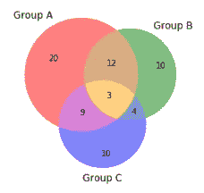
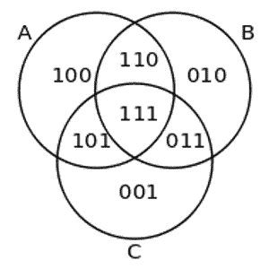

# 如何用 Python 创建和定制维恩图

> 原文：<https://towardsdatascience.com/how-to-create-and-customize-venn-diagrams-in-python-263555527305?source=collection_archive---------1----------------------->

## 用 2 组或 3 组自定义维恩图

维恩图非常适合用来说明两个或三个群体之间的关系；你可以很容易地看到共同点和不同点。本文将向您展示如何用 Python 创建维恩图，以及如何根据您的喜好定制这些图。



# 如何创建维恩图

首先，你必须把这个库安装到你的电脑上。在您的终端中使用以下命令。

```
pip install matplotlib-venn
```

一旦你安装好了，我们就可以开始编码了。我们将导入以下库。

```
#Import libraries
from matplotlib_venn import venn2, venn2_circles, venn2_unweighted
from matplotlib_venn import venn3, venn3_circles
from matplotlib import pyplot as plt
%matplotlib inline
```

# 有两组的文氏图

要创建两个组的文氏图，请使用文 n2。


```
venn2(subsets = (30, 10, 5), set_labels = ('Group A', 'Group B'))
```

子集参数是一个 3 元素列表，其中数字 30、10、5 对应于 aB、AB、Ab。

*   Ab =包含在 A 组，但不包含在 B 组
*   aB =包含在 B 组中，但不是 A 组
*   AB =包含在 A 组和 B 组中

set_labels 参数允许您在维恩图中标记您的两个组。

# 定制维恩图

圆圈的默认颜色是红色和绿色，但好消息是你可以自定义颜色！添加 set_colors 参数来设置组的颜色。此外，您可以使用 alpha 参数来控制透明度。



```
venn2(subsets = (30, 10, 5), set_labels = ('Group A', 'Group B'), set_colors=('purple', 'skyblue'), alpha = 0.7);
```

维恩图最酷的一点是，它会根据圆圈内的项目数量自动确定圆圈的大小。然而，如果你不希望圆被加权，你可以使用未加权的文氏图。



尽管 A 组比 b 组大，但现在这两个组的大小相同。

```
venn2_unweighted(subsets = (30, 10, 5), set_labels = ('Group A', 'Group B'), set_colors=('r', 'g'), alpha = 0.5);
```

您可以通过在原始的圆周上覆盖一个轮廓来进一步定制您的维恩图。请注意，这仅适用于加权文氏图。



```
venn2(subsets = (30, 10, 5), set_labels = ('Group A', 'Group B'), set_colors=('r', 'g'), alpha = 0.5);venn2_circles(subsets = (30, 10, 5));
```

如果您不喜欢实线，可以使用 line style 参数更改为不同的线条样式。您也可以设置线条宽度。



```
venn2(subsets = (30, 10, 5), set_labels = ('Group A', 'Group B'), set_colors=('r', 'g'), alpha = 0.5);venn2_circles(subsets = (30, 10, 5), linestyle='dashed', linewidth=2, color='k');
```

最后，让我们给图表一个标题！


```
plt.title(“I made a Venn Diagram!”);
```

# 三组维恩图

为了创建具有 3 组而不是 2 组的文氏图，我们从文 n2 切换到文 n3。



```
venn3(subsets = (20, 10, 12, 10, 9, 4, 3), set_labels = ('Group A', 'Group B', 'Group C'), alpha = 0.5);
```

您可以使用 *get_patch_by_id* 方法定制图表中每个区域的颜色。请注意，三个圆重叠的中间区域现在是橙色的。



```
v.get_patch_by_id('111').set_color('orange')
```

请参见下图，了解每个区域的呼叫 id。



来源:https://en.wikipedia.org/wiki/Venn_diagram

最后，我想告诉你的是如何改变每个单独的圆圈的线条宽度。如果我将维恩图圆设置为变量 c，我可以调用每个单独的圆 c[0]、c[1]或 c[2]并设置线条宽度。


```
c = venn3_circles(subsets = (20, 10, 12, 10, 9, 4, 3), linestyle='dashed', linewidth=1, color=”grey”)c[0].set_lw(5.0)
c[1].set_lw(8.0)
c[2].set_lw(2.0)
```

如果你想跟随我的 Jupyter 笔记本，你可以在这里找到它[。](https://github.com/julia-git/venn_diagrams)

最后，如果你正在处理超过 2 或 3 个集合，查看扰乱图库([https://pypi.org/project/UpSetPlot/](https://pypi.org/project/UpSetPlot/))。感谢 [Renato Bellotti](https://medium.com/u/d1d8dafc4536?source=post_page-----263555527305--------------------------------) 让我注意到这一点。

快乐的维恩图解！干杯。