# 如何使用 AWS CLI 创建和运行 EMR 集群

> 原文：<https://towardsdatascience.com/how-to-create-and-run-an-emr-cluster-using-aws-cli-3a78977dc7f0?source=collection_archive---------7----------------------->

## 技术提示

## 为初学者编写的清晰易懂的教程

# **简介**

## **简单介绍一下 Apache Spark 和 AWS EMR 上的 Spark 集群**

[Apache Spark 是用于大规模数据处理的统一分析引擎](https://spark.apache.org/docs/latest/)。Spark 被认为是“***‘大数据’丛林之王*** ”，在数据分析、机器学习、流和图形分析等方面有着多种应用。有 4 种不同的 Spark 模式:(1) ***本地模式*** :笔记本电脑等单机上的 Spark，用于学习语法和项目原型化；另外 3 种模式是集群管理器模式:(2) ***单机模式*** 用于在私有集群上工作；(3) ***纱*** 和(4) ***Mesos 模式*** 在与团队共享集群时使用。在独立模式下，Spark 部署在私有集群上，比如 Amazon Web Service AWS 上的 EC2。一个火花簇包括多个机器。要在每台机器上使用 Spark 代码，Spark 及其依赖项需要手动下载和安装。有了 ***弹性地图还原服务，EMR*** ，来自 AWS，一切都是现成可用，无需任何手动安装。因此，我们不使用 EC2，而是使用 EMR 服务来建立 Spark 集群。

## 本教程的动机

我确实花了很多时间使用 ***AWS 命令行界面、AWS CLI*** 在 EMR 上创建、设置和运行 Spark 集群。虽然我找到了一些关于这个任务的教程，或者是通过课程提供的，但是大部分都很难理解。有的不够清晰；有些人错过了一些关键步骤；或者假设学习者知道一些关于 AWS、CLI 配置等的先验知识。成功设置并运行集群后，我才知道**这个任务** ***其实没那么复杂；我们应该轻松地完成它。我不想再看到人们为此而挣扎。*** 因此，我决定做这个教程。

本文假设您已经对 Spark、PySpark、命令行环境和 AWS 有了一定的了解。具体来说， ***这篇文章是写给知道为什么需要创建 Spark 集群的读者的:)。*** 更多关于 Spark 的内容，请在这里阅读参考文献[。](https://spark.apache.org/docs/latest/)

这是一个很长很详细的教程。简而言之，所有步骤包括:

1.  [创建一个 AWS 账户](#f203)
2.  [创建一个 IAM 用户](#c46c)
3.  [在 EC2 中设置凭证](#9e7d)
4.  [创建一个 S3 存储桶来存储集群产生的日志文件](#d889)
5.  [安装 AWS CLI 包](#6df6) `[awscli](#6df6)`
6.  [设置 AWS CLI 环境(创建凭证和配置文件)](#6cd9)
7.  [创建一个 EMR 集群](#5b72)
8.  [允许 SSH 访问](#2517)
9.  [创建与集群主节点的 SSH 连接](#9d31)
10.  [开始使用 EMR 集群](#aa90)

请随意跳过任何你已经知道的步骤。本教程的 Jupyter 笔记本版本，以及关于 Spark 的其他教程和更多数据科学教程可以在 [my Github](https://github.com/nhntran/aws_spark_cluster_tutorial) 上找到。现在，让我们开始吧！

我很高兴你们中的许多人发现这个教程很有用。我很荣幸能和大家一起讨论你在电子病历创建过程中遇到的任何问题。基于我们的一些讨论， [***下面是对本教程***](#4b3f) ***的一些更新。***

> **一些注意事项:**
> 
> 1.对于本教程，应该使用 **AWS 常规帐户**而不是 AWS 教育帐户。AWS 常规帐户为用户提供对 AWS 资源和 IAM 角色的完全访问权限；而教育帐户具有一些有限访问权限。
> 
> 2.您有责任监控您使用的 AWS 帐户的使用费。每次完成工作时，请记住终止集群和其他相关资源。我已经多次实现了 EMR 集群；本教程在 AWS 上应该没有成本或成本低于 0.5 美元。
> 
> 3.AWS 控制台和 Udacity 的内容会随着时间的推移而变化/升级，因此我建议您搜索 AWS 网站和 Udacity 的课程，以获取任何更新的教程/指南。本教程根据 2020 年 7 月的 AWS 控制台生成。
> 
> 4.本教程是用 Chrome 和 Mac OS X 制作的，在 Windows 平台上应该不会有太大区别。

## 参考

*   一些材料来自 Udacity 上的数据工程师纳米学位项目。
*   一些想法和问题是从 Knowledge-uda city 问答平台和学生中心-uda city 聊天平台收集的。

# 在 AWS CLI 上创建、设置和运行 EMR 集群的具体步骤

## **第一步:创建一个 AWS 账户**

*   如果您还没有 AWS 帐户，请创建一个。该说明在 [AWS 网站](https://aws.amazon.com/premiumsupport/knowledge-center/create-and-activate-aws-account/)上非常容易理解。
*   登录你的 AWS 账户。
*   (可选)为了提高 AWS 资源的安全性，您可以根据此处的简易 [AWS 指南](https://docs.aws.amazon.com/IAM/latest/UserGuide/id_credentials_mfa_enable_virtual.html)[配置并启用虚拟多因素身份验证(MFA)](https://docs.aws.amazon.com/IAM/latest/UserGuide/id_credentials_mfa.html) 设备。

## 步骤 2:创建 IAM 用户

从 AWS 控制台，点击`Service`，输入‘IAM’进入 IAM 控制台:

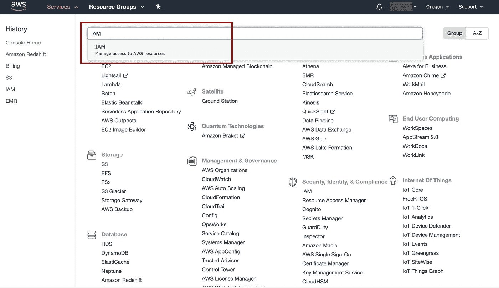

= >选择`User`=>=`Add user`=>输入用户名如‘EMR _ user’，选择`Access type`为**程序化访问**，然后选择`Next: Permissions`。

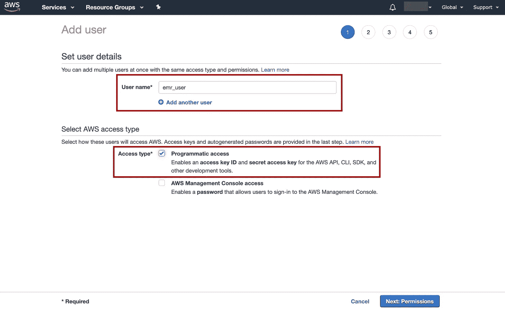

点击`Attach existence policies directly`页面，输入并设置权限为`Administrator Access`，然后选择`Next: Tags`。

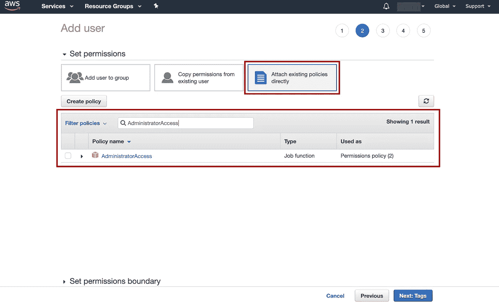

跳过此标签页，选择`Next: Review` = >选择`Create user` = >保存用户名、访问密钥和秘密访问密钥。

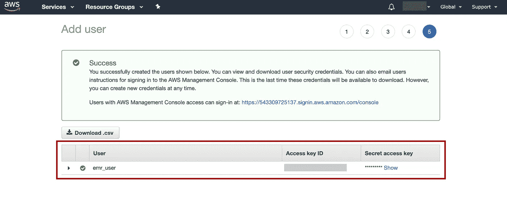

我们将使用这个 IAM 用户和访问密钥，通过 AWS CLI 设置和访问 AWS。

## 步骤 3:在 EC2 中设置凭证

在 AWS 控制台中，单击“服务”,键入“EC2”进入 EC2 控制台

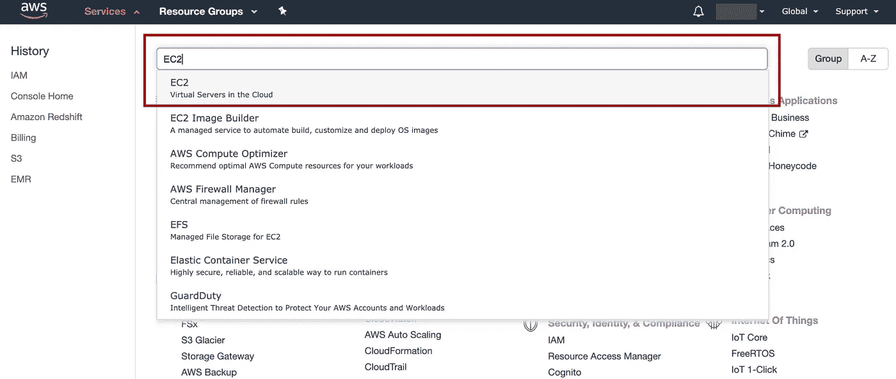

在**网络中选择`Key Pairs`在左侧面板上选择&安全**=>选择`Create key pair`

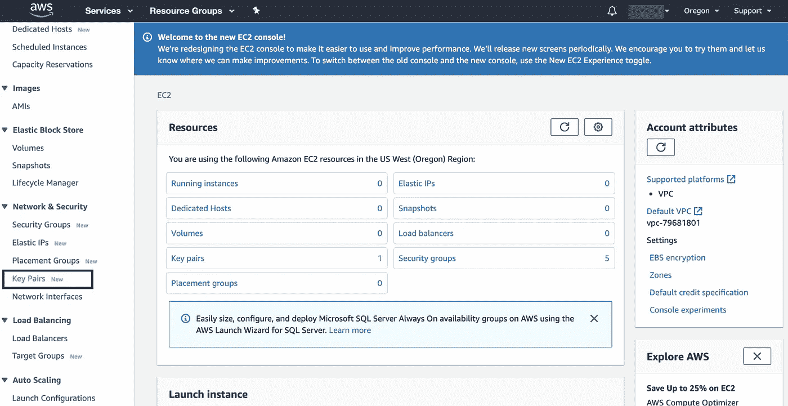

键入密钥对的名称，例如“emr-cluster”，文件格式:pem = >选择`Create key pair`。完成此步骤后，将自动下载一个. pem 文件，在这种情况下，文件名为`emr_cluster.pem`。我们将在步骤 6 中使用这个文件。

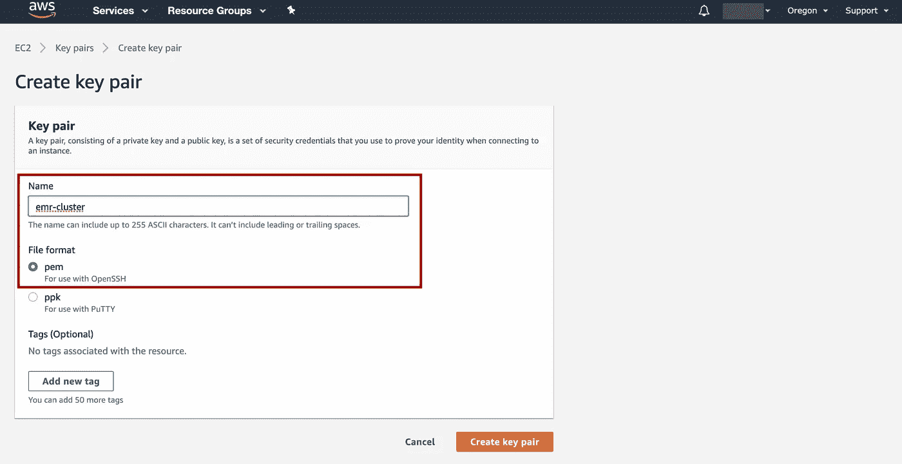

## 步骤 4(可选):创建一个 S3 存储桶来存储集群生成的日志文件

*   这将是 AWS 存储桶，用于存储我们将创建和设置的集群所生成的日志文件。如果我们没有指定 S3 存储桶，那么在创建和运行 EMR 集群时，会自动为我们创建一个 S3 存储桶。
*   从 AWS 控制台，点击`Service`，键入“S3”并转到 S3 控制台= >选择`Create bucket` = >输入存储桶的名称，如“s3-for-emr-cluster”，选择您的首选地区，如“美国西部(俄勒冈州)”。保持其他选项的默认设置，以创建一个存储桶。

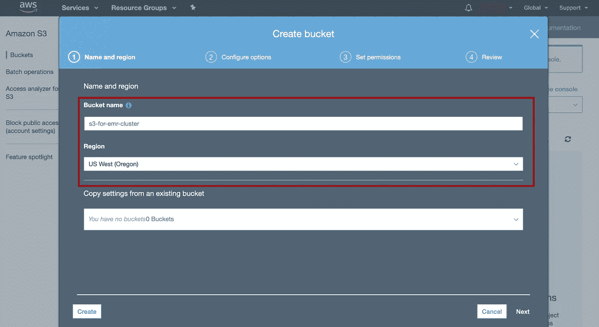

*   请注意，为了获得最佳性能并避免任何错误，请记住对您的所有工作(S3、EC2、EMR 等)使用相同的 AWS 区域/子区域。)

## **第五步:安装 awscli 包**

*   在终端上，使用命令`pip install awscli`安装`awscli`
*   键入`aws help`检查安装是否正确。如果输出如下所示，安装应该会成功:

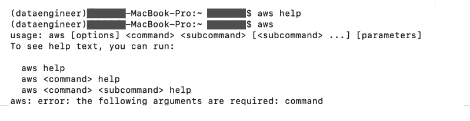

## 步骤 6:设置 AWS CLI 环境(创建凭证和配置文件)

这一步将帮助我们使用在上面第 2 步中获得的用户凭证自动访问 awscli 环境中的 AWS。

这种设置有两种方法:手动创建凭证和配置文件(方法 1)或使用`aws`命令创建这些文件(方法 2)。你可以使用任何一个。

**方法 1:**

***在终端上创建*** `***credentials***` ***文件如下(您可以使用*** `***nano***` ***或您选择的任何其他文本编辑器):***

*   在终端上，导航到所需的文件夹，通常是根目录，并创建一个隐藏目录，如`aws`:

`$mkdir .aws`(句点表示隐藏目录)

*   转到目录`$cd .aws`
*   使用 nano 创建一个`credentials`文件:`$nano credentials`按如下方式键入`credentials`文件的内容(用步骤 2 中为用户‘EMR-user’生成的密钥替换密钥‘EXAMPLE _ ID’和密钥‘EXAMPLE _ Key’):

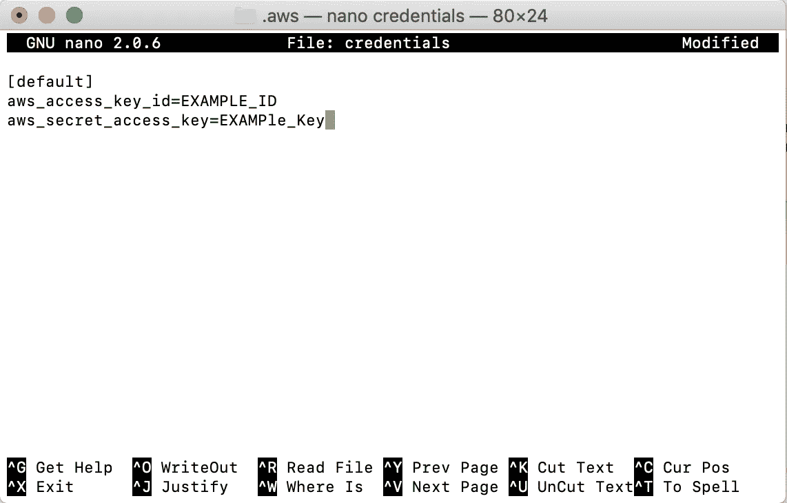

*   使用`Ctrl + X`，然后使用`Y`保存文件并退出 nano。

**创建配置文件:**

*   `$nano config` 按如下方式键入`config`文件的内容(我们使用的区域与我们在步骤 4 中创建 S3 存储桶时使用的区域相同):

```
[default]
region=us-west-2
```

*   使用`Ctrl + X`，然后使用`Y`保存文件并退出 nano。

## 方法 2:

在终端上，键入`$aws configure`，并按如下方式输入所需信息:

```
AWS Access Key ID [None]: (Enter your access key from the user 'emr-user' created in Step 2)
AWS Secret Access Key [None]: (Enter your secret key from the user 'emr-user' created in Step 2)
Default region name [None]: us-west-2 (The same region used in Step 4)
Default output format [None]:
```

这两个文件将在隐藏文件夹中自动创建。aws 通常位于根目录下，如下所示:

*   `$cd ~/.aws`
*   键入`$ls` 以验证这两个文件是否存在。信息应该与方法 1 中的相同，我们可以通过键入以下命令来检查内容:
*   `$cat credentials`
*   `$cat config`

## 准备好。步骤 3 中生成的 pem 文件

为了连接到集群，我们需要。在步骤 3 中创建的 pem 文件。移动。我们在步骤 3 中下载的 pem 文件保存到项目所需的位置。对我来说，我把它放在与隐藏文件夹中的凭证和配置文件相同的位置。位于根目录`~/.aws/emr-cluster.pem`的 aws)

```
$ mv ~/Downloads/emr-cluster.pem .
```

*   用这个的时候。pem 文件来设置 ssh，如果。pem 文件太开放。警告的一个例子是:“*对“~/”的权限 0644。“aws/emr-cluster.pem”太开放。要求您的私钥文件不能被其他人访问。该私钥将被忽略。*
*   在这种情况下，我们需要为此更改权限。pem 文件使用命令:`sudo chmod 600 ~/.aws/emr-cluster.pem`

## 验证我们是否成功安装了 awscli 包并设置了凭据

要验证我们是否成功安装了 awscli 并设置了凭据，请键入一些 aws 命令，如

*   列出所有 IAM 用户:`$aws iam list-users`
*   列出 s3 中的所有存储桶:`$aws s3 ls`该命令将列出 AWS 中的所有 s3 存储桶:

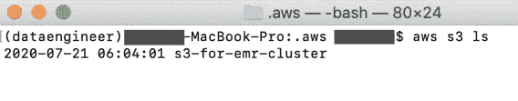

## 步骤 7:创建一个 EMR 集群

现在我们准备在终端上创建 EMR 集群。在终端上，键入命令:

```
aws emr create-cluster --name test-emr-cluster --use-default-roles --release-label emr-5.28.0 --instance-count 3 --instance-type m5.xlarge --applications Name=JupyterHub Name=Spark Name=Hadoop --ec2-attributes KeyName=emr-cluster  --log-uri s3://s3-for-emr-cluster/
```

**电子病历脚本组件说明:**

*   `--name`:在这种情况下，集群的名称为‘test-EMR-cluster’
*   `--use-default-roles`:使用默认服务角色(EMR_DefaultRole)和实例配置文件(EMR_EC2_DefaultRole)获得访问其他 AWS 服务的权限
*   `--release-label emr-5.28.0`:使用 EMR 版本 5.28.0 构建集群
*   `--instance-count 3`和`--instance-type m5.xlarge`:构建 1 个主节点和 2 个 m5.xlarge 类型的核心节点
*   `--applications Name=JupyterHub Name=Spark Name=Hadoop`:在这个集群上安装 JupyterHub、Spark 和 Hadoop
*   `--ec2-attributes KeyName=emr-cluster`:配置 Amazon EC2 实例配置，KeyName 是我们在步骤 3 中设置的 EC2 实例名称(`Set up credentials in EC2`)并获取。pem 文件)。在这种情况下，名称为`emr-cluster`。
*   `--log-uri s3://s3-for-emr-cluster/`:指定要存储日志文件的 S3 桶。在这种情况下，S3 存储桶是“s3-for-emr-cluster”。该字段是可选的(如步骤 4 中所述)。
*   由于 EMR 集群的成本很高，我们可以设置选项`--auto-terminate`在集群上的所有操作完成后自动终止集群。为此，我们还需要使用`--bootstrap-actions Path="s3://bootstrap.sh"`在命令中指定引导动作。当您使用自动终止时，群集将启动，运行您指定的任何引导操作，然后执行通常输入数据、处理数据，然后生成并保存输出的步骤。当这些步骤完成时，Amazon EMR 自动终止集群 Amazon EC2 实例。 ***如果我们不放任何自举动作，我们应该去掉这个字段。*** 可在 [AWS 网站](https://docs.aws.amazon.com/emr/latest/ManagementGuide/emr-plan-bootstrap.html)上找到关于引导的详细参考。

**我们创建 EMR 集群后的期望输出将是:**

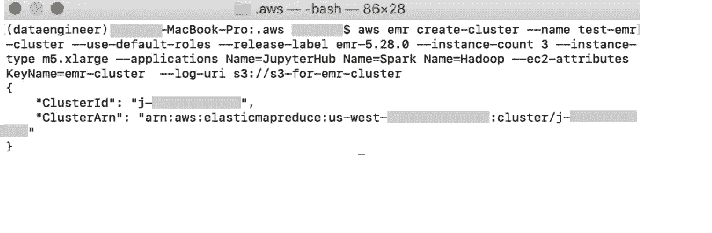

使用以下命令，使用 ClusterId 检查集群的状态和信息(`j- EXAMPLECLUSTERID`):

```
aws emr describe-cluster --cluster-id j-EXAMPLECLUSTERID
```

我们应该等待几分钟，让群集可用(状态变为“可用”)，然后再继续下一步。

*** * *更新 1:** 如果您在创建 Amazon EMR 集群时遇到了`"EMR_DefaultRole is invalid" or "EMR_EC2_DefaultRole is invalid" error`的问题，您可能需要删除角色和实例概要文件；然后按照本指令重新创建角色[。感谢 Trevor S .讨论这个问题。](https://aws.amazon.com/premiumsupport/knowledge-center/emr-default-role-invalid/)

*** **更新 2:** 为了使群集可用于 EMR 上的笔记本，我们可能需要在—ec2—属性中包含子网 id:

```
aws emr create-cluster --name test-emr-cluster --use-default-roles --release-label emr-5.28.0 --instance-count 3 --instance-type m5.xlarge --applications Name=JupyterHub Name=Spark Name=Hadoop --ec2-attributes ***SubnetIds=subnet-YOURSUBNET,***KeyName=emr-cluster  --log-uri s3://s3-for-emr-cluster/
```

(感谢 Saverio G .和我讨论这个问题。)

**如何查找子网 id？**

点击 EMR 控制台上的 **VPCSubnets** 选项卡，从列表中进行选择。

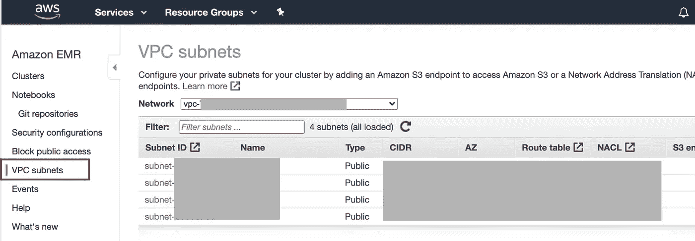

对于初学者来说，另一个安全的方法是:使用 AWS 控制台创建一个类似的 EMR 集群。然后查看该群集的**摘要**页面上的“**网络和硬件**”会话，以查看子网 ID:

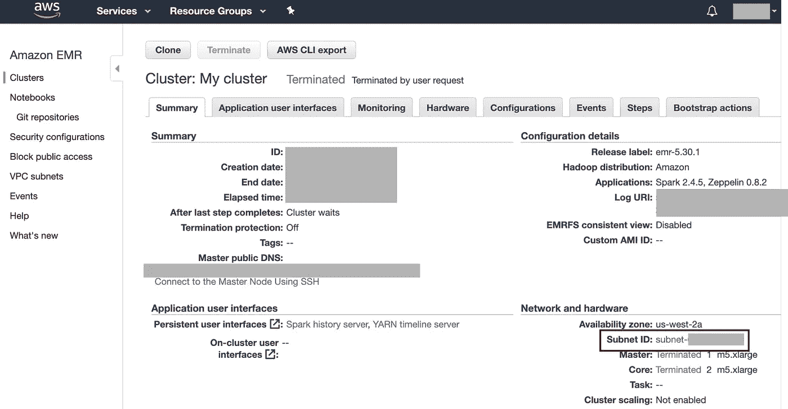

您可以通过 AWS 上的 [VPC 仪表板访问子网。关于子网和 VPC 的更多信息可以在 AWS 网站上找到。](https://console.aws.amazon.com/vpc/)

## 步骤 8:允许 SSH 访问

从 AWS 控制台，点击`Service`，输入 EMR，并转到 EMR 控制台。

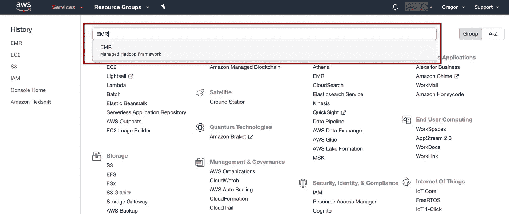

= >选择`Clusters` = >选择列表中集群的名称，在本例中，是`test-emr-cluster`

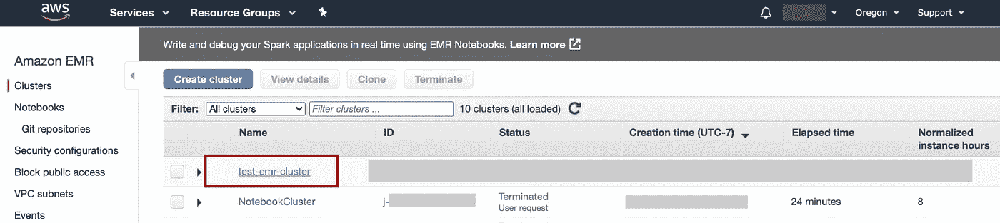

在`Summary`选项卡上，向下滚动查看零件`Security and access`，选择`Security groups for Master`链接

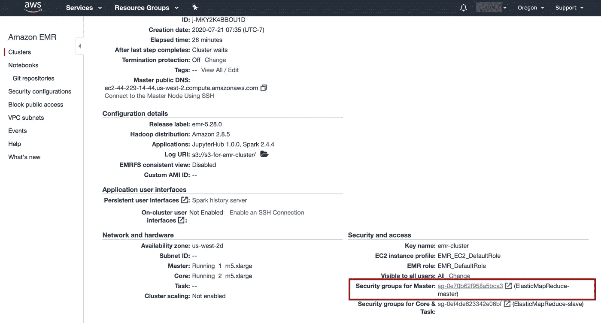

选择`Security group ID`为`ElasticMapReduce-master`

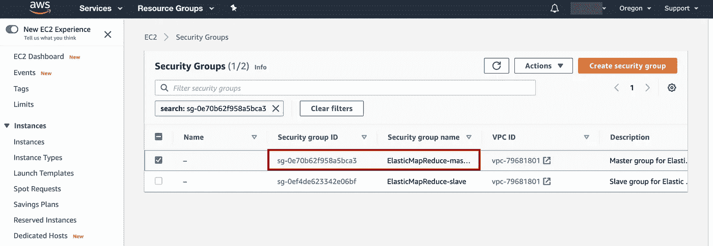

向下滚动`Inbound rules`，`Edit inbound rules` = >为了安全起见，删除任何 SSH 规则(如果有)，然后选择`Add Rule` = >选择类型:SSH，TCP 用于协议，22 用于端口范围= >用于源，选择我的 IP = >选择`Save`。

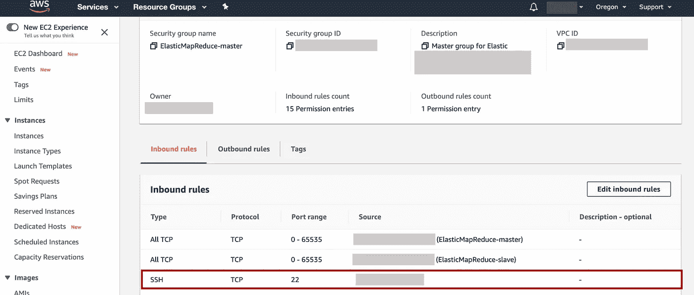

## **步骤 9:创建与集群主节点的 SSH 连接**

**方法 1:**

*   在终端上，使用命令检查集群的 id

`aws emr list-clusters`

*   使用此命令连接到集群。记住要指定。pem 文件:

`aws emr ssh --cluster-id j-EXAMPLECLUSTERID --key-pair-file ~/.aws/emr-cluster.pem`

如果我们看到如下带有 EMR 字母的屏幕，恭喜您，您使用 AWS CLI 成功创建、设置并连接到 EMR 集群！！！！

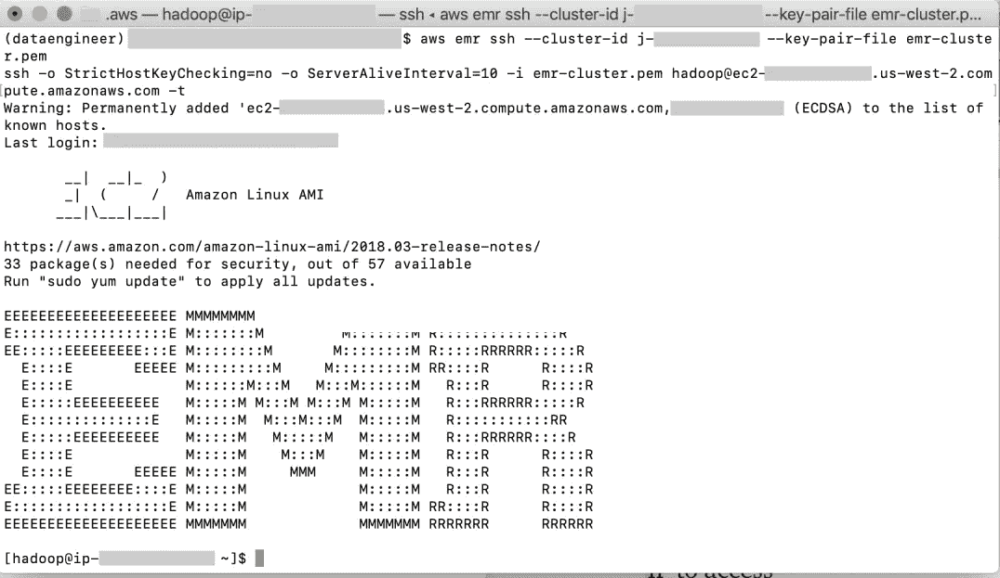

使用命令`$logout`关闭与集群的连接。

**方法 2:**

*   从 AWS 控制台，点击`Service`，输入 EMR，并转到 EMR 控制台。
*   选择`Clusters` = >单击列表中的集群名称，在本例中，在 Summary 选项卡上，单击链接**使用 SSH 连接到主节点。**

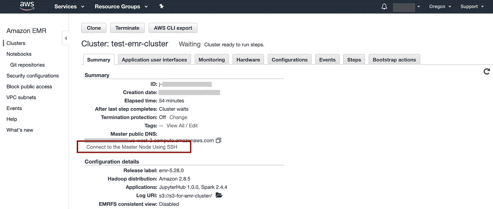

*   复制弹出窗口中显示的命令，并粘贴到终端上。

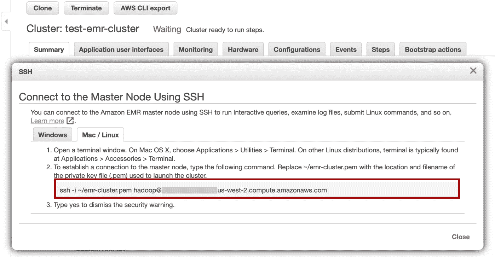

*   记得用私钥文件的位置和文件名替换~/emr-cluster.pem。pem)我们已经建立了。例如

`ssh -i ~/.aws/emr-cluster.pem hadoop@ec2-xx-xxx-xx-xx.us-west-2.compute.amazonaws.com`

如果我们看到带有 EMR 字母的屏幕，恭喜您，您使用 AWS CLI 成功创建、设置并连接到 EMR 集群！！！！

# **现在您可以开始使用 EMR 集群了**

***创建一个简单的 Spark 任务，例如，创建一个 Spark 数据帧，其中包含字符串类型的时间，然后将该列转换为不同的格式。***

在集群终端上，创建文件`test_emr.py`

```
$nano test_emr.py
```

将该脚本复制并粘贴到 test_emr.py

```
### Content of the file 'test_emr.py'from pyspark.sql import SparkSession, functions as Fif __name__ == "__main__":
    """
        example of script submited to spark cluster
    """
    spark = SparkSession.builder.getOrCreate()

    df = spark.createDataFrame([('01/Jul/1995:00:00:01 -0400', ),('01/Jul/1995:00:00:11 -0400',),('26/Jul/1995:17$
                            ('19/Jul/1995:01:56:43 -0400',), ('11/Jul/1995:12:50:18 -0400',)], ['TIME'])
    df = df.withColumn("date", F.unix_timestamp(F.col('TIME'), 'dd/MMM/yyyy:HH:mm:ss Z').cast('timestamp'))
    # show the dataframe
    df.show()

    #### stop the spark, otherwise the program will be hanged 
    spark.stop()
```

文件的内容如`nano`文本编辑器所示:

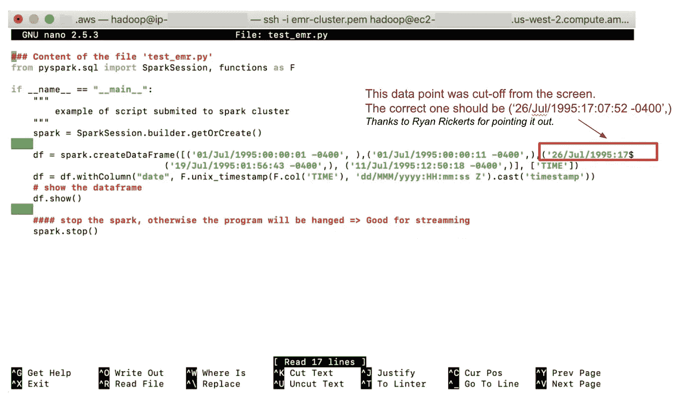

使用以下命令在集群终端上提交脚本:

```
$spark-submit --master yarn ./test_emr.py
```

当任务运行时，它可能会被终端上的任何信息淹没，这在 Spark 中是正常的。可以在信息日志中找到输出:

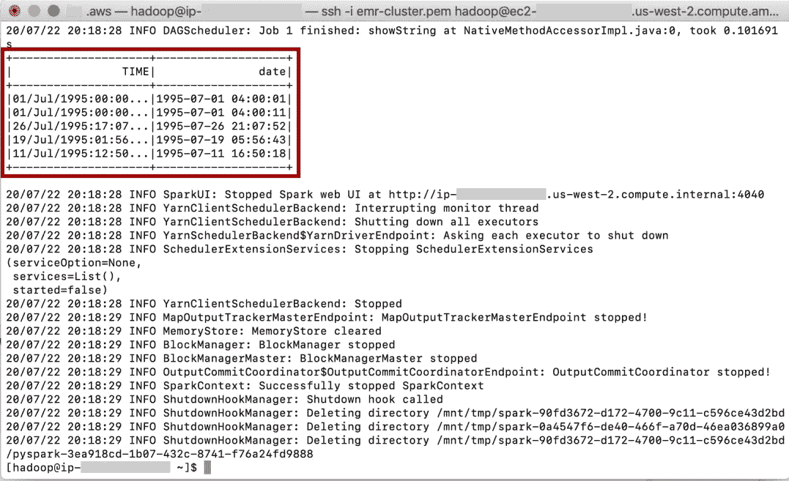

# 恭喜你！你做到了！

**当不再使用集群时，记得将其终止。**

键入`logout`退出集群。然后使用以下命令终止集群:

```
$aws emr terminate-clusters --cluster-id j-EXAMPLECLUSTERID
```

请注意， ***我们可以使用 AWS CLI 命令轻松地再次创建具有相同配置的集群*** ，当我们在 emr 控制台上选择终止的集群“test-emr-cluster”时，单击`AWS CLI export`选项卡可以找到该命令:

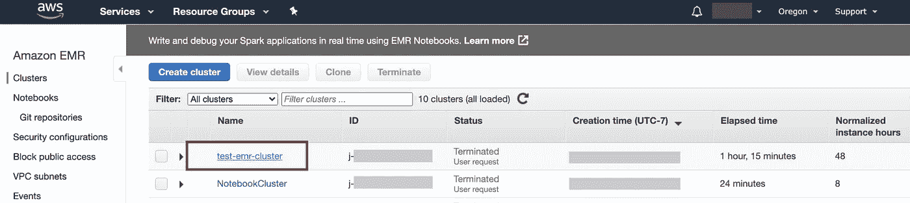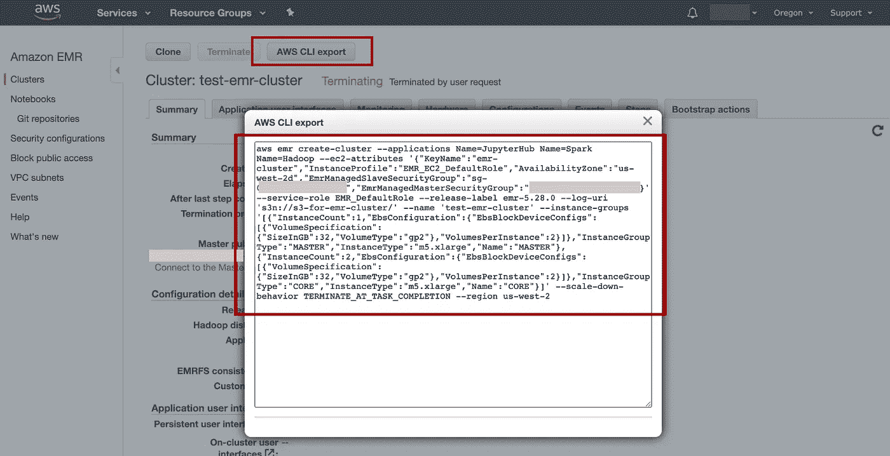

我希望没有人再需要使用 AWS CLI 在 EMR 上创建、设置和运行 Spark 集群。如果您对本教程有任何问题或发现任何错误，请告诉我。

***本教程的 Jupyter 笔记本版本，以及 Spark 上的其他教程和更多数据科学教程可以在***[***my Github***](https://github.com/nhntran/aws_spark_cluster_tutorial)***上找到。*** 请欣赏！