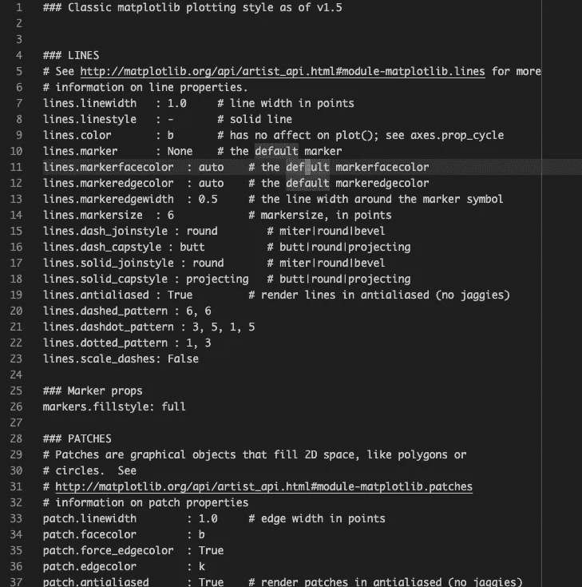
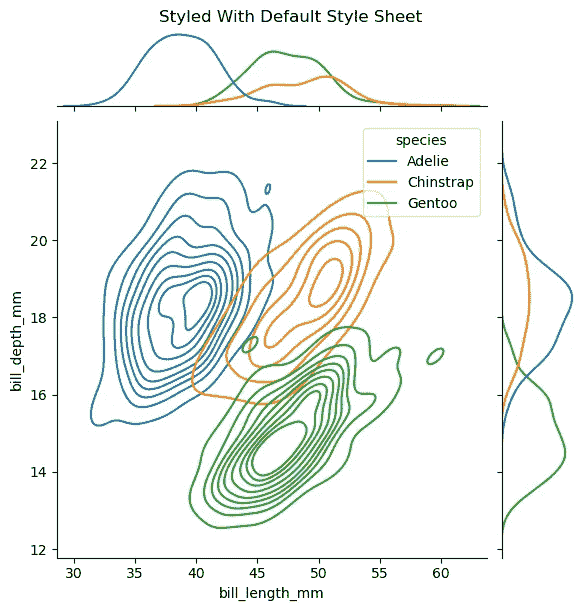
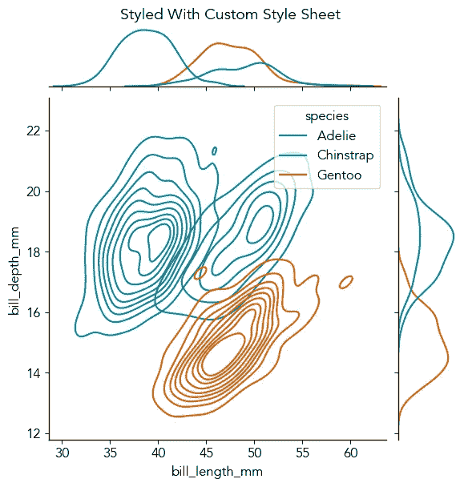

# 如何创建和使用自定义 Matplotlib 样式表

> 原文：<https://towardsdatascience.com/how-to-create-and-use-custom-matplotlib-style-sheet-9393f498063?source=collection_archive---------10----------------------->

# **为什么要使用样式表？**

数据可视化的美感非常重要。我经常认为这是“漂亮的数据应该得到漂亮的展示”——过分讲究图表样式是不被鼓励的，但是适当的润色会大有帮助。

然而，对于我们通常用 matplotlib 或 seaborn 制作的静态图，默认的美学通常需要调整。这就是定制样式表派上用场的地方，至少有两个原因:

*   使我们的工作流程符合不重复(DRY)原则:我们不需要每次都重复输入相同的样式代码。相反，我们用一行代码来应用样式表
*   风格一致性很容易实现，这可能是个人、团队和组织的隐含特征

# 如何设置和使用自定义样式表

## 从内置示例开始

我们大多数人可能已经在日常工作中使用了一些内置的风格。例如，快速运行

```
# This code snippet mimics command usages in ipython consoleIn [1]: import matplotlib.pyplot as pltOut [1]: plt.style.available
```

将返回样式表的完整列表，我们可以在 matplotlib 的文档中找到它们效果的图库视图。

在引擎盖下，我们可以找到这些内置的样式表并看一看:

```
# This code snippet mimics command usages in ipython consoleIn [2]: import matplotlib# Locate path to matplotlib by checking where config file is
# To learn more about the function below,
# type ?matplotlib.matplotlib_fnameIn [3]: matplotlib.matplotlib_fname()
Out [3]: '/Users/sdou/opt/miniconda3/lib/python3.8/site-packages/matplotlib/mpl-data/matplotlibrc'
```

路径`/Users/.../mpl-data`是我们想要去的地方，并且定位样式表:

```
In [4]: !ls /Users/sdou/opt/miniconda3/lib/python3.8/site-packages/matplotlib/mpl-data/
fonts           images          matplotlibrc    stylelib
```

感兴趣的文件夹是`stylelib`。现在让我们来看看这个文件夹:

```
In [5]: !ls -1 /Users/sdou/opt/miniconda3/lib/python3.8/site-packages/matplotlib/mpl-data/stylelib/
Solarize_Light2.mplstyle
_classic_test_patch.mplstyle
bmh.mplstyle
classic.mplstyle
dark_background.mplstyle
fast.mplstyle
fivethirtyeight.mplstyle
ggplot.mplstyle
grayscale.mplstyle
seaborn-bright.mplstyle
seaborn-colorblind.mplstyle
seaborn-dark-palette.mplstyle
seaborn-dark.mplstyle
seaborn-darkgrid.mplstyle
seaborn-deep.mplstyle
seaborn-muted.mplstyle
seaborn-notebook.mplstyle
seaborn-paper.mplstyle
seaborn-pastel.mplstyle
seaborn-poster.mplstyle
seaborn-talk.mplstyle
seaborn-ticks.mplstyle
seaborn-white.mplstyle
seaborn-whitegrid.mplstyle
seaborn.mplstyle
tableau-colorblind10.mplstyle
```

让我们检查一份`.mplstyle`文件。这里我们以`classic.mplstyle`为例，显示文件的前 37 行:



图 classic.mplstyle”文件的前 37 行(37 行是任意选择)

我们可以看到 matplotlib 参数设置及其默认值的综合列表，参数被组织成`lines`、`markers`、`patch`、`text`等组。

## 打造定制。mplstyle 文件

## 极简主义的例子

下面是一个建立在内置样式表`seaborn-colorblind.mplstyle`之上的极简示例(名为`signature.mplstyle`

## 如何调用自定义样式表

*   如果我们对上述路径`stylelib`有写权限，我们可以将自定义样式表放入同一个文件夹，并使用

```
# Scenario 1: Apply globally to a jupyter notebook
plt.style.use(“signature”)# Scenario 2: Apply locally with context manager
with plt.style.context("signature"):
    plt.plot([1, 2, 3, 4])
```

*   如果我们没有写权限，我们需要做的唯一额外的事情就是包含自定义样式表的完整路径。这里我们使用一个简单的例子，将样式表直接存储在主目录下:

```
# Scenario 1: Apply globally to a jupyter notebook
plt.style.use(“/home/signature.mplstyle”)# Scenario 2: Apply locally with context manager
with plt.style.context("/home/signature.mplstyle"):
    plt.plot([1, 2, 3, 4])
```

## 如何恢复默认

有些情况下，我们希望恢复默认样式。有两种方法可以恢复默认设置:

1.  通过`rcParams.update`复位

```
import matplotlib as mpl
mpl.rcParams.update(mpl.rcParamsDefault)
```

2.用默认样式表重置

```
plt.style.use('default')
```

# 数据即例子:样式表在行动

这里我们以[企鹅数据集](https://www.kaggle.com/parulpandey/penguin-dataset-the-new-iris)为例来演示自定义样式表`signaure.mplstyle`的效果。

```
import matplotlib.pyplot as plt
import seaborn as sns# Load the penguins dataset
penguins = sns.load_dataset("penguins")
```

1.  使用默认样式

```
plt.style.use("default")
# Show the joint distribution using kernel density estimation
g = sns.jointplot(
    data=penguins,
    x="bill_length_mm",
    y="bill_depth_mm",
    hue="species",
    kind="kde",
)
g.fig.suptitle("Styled With Default Style Sheet", y=1.01)
plt.show()
```



图 matplotlib 默认样式的效果

2.使用`signature.mplstyle`中的自定义样式集

```
plt.style.use("signature")
# Show the joint distribution using kernel density estimation
g = sns.jointplot(
    data=penguins,
    x="bill_length_mm",
    y="bill_depth_mm",
    hue="species",
    kind="kde",
)
g.fig.suptitle("Styled With Custom Style Sheet", y=1.01)
plt.show()
```



图 3:定制样式表“signature.mpl”的效果

# 关键要点

*   漂亮的数据值得漂亮的展示。但是，与其重复输入大量的样式代码，不如花一点前期时间建立我们自己的定制样式表(文件扩展名`.mplstyle`)既能节省时间，又能确保样式的一致性
*   要构建定制样式表，我们可以从内置样式表开始，并根据我们的喜好进一步定制它们。关键的一步是在`matplotlib.matplotlib_fname()`的帮助下找到这些样式表

# 参考

[4.11 定制 Matplotlib:配置和样式表](https://jakevdp.github.io/PythonDataScienceHandbook/04.11-settings-and-stylesheets.html):Jake Vander plas 的《数据科学手册》