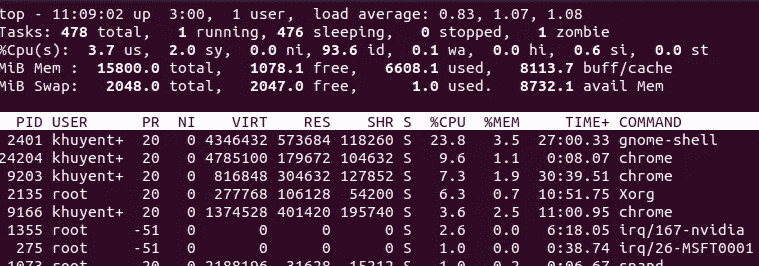
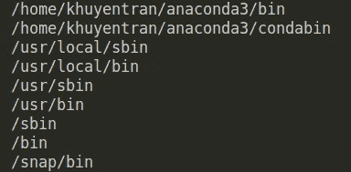

# 如何在命令行上创建和查看交互式备忘单

> 原文：<https://towardsdatascience.com/how-to-create-and-view-interactive-cheatsheets-on-the-command-line-6578641039ff?source=collection_archive---------33----------------------->

## 停止搜索命令行。用作弊来节省时间


与 Raj 在 [Unsplash](https://unsplash.com?utm_source=medium&utm_medium=referral) 的[公路旅行照片](https://unsplash.com/@roadtripwithraj?utm_source=medium&utm_medium=referral)

# 为什么是命令行？

如果您还没有使用过命令行，那么您应该开始学习一些基本的命令行工具。以下是原因:

*   命令行对数据科学家很有用。有了命令行，你通常做的许多事情，比如移动文件、复制文件、解压文件、创建新文件，都可以更快地完成。
*   您甚至可以使用命令行来浏览您的数据！这里有一个很好的资源。Jupyter notebook 通常用于此任务，但有时，当您为项目编写脚本时，使用命令行会更有好处。
*   您可以创建一个 bash 脚本来[自动化您已经重复完成的任务](/how-to-create-reusable-command-line-f9a2bb356bc9)。例如，我创建了一个 bash 脚本来重构我的 Django 项目文件。我不需要到处移动文件、创建虚拟环境、安装所需的包，我只需要调用`createapp.sh`，一切都在一秒钟内为我设置好了！

*   您希望确定为什么代码需要很长时间才能执行。这时，拥有一个正在运行的系统的动态实时视图来确定您使用了多少 CPU 和内存是很有帮助的。`top`是完成这项任务的最强大的命令行工具之一



基于以上原因，不可否认命令行是有用的。然而，记住所有的命令是不可能的。这就是为什么在记忆命令方面，谷歌是我的朋友。

但是谷歌搜索需要时间，因为你需要:打开浏览器，在所有的网站中搜索，比如 StackOverflow 来找到命令。有比这更快的方法吗？

# 欺骗

是的，有一个比谷歌搜索更快的方法，它涉及作弊(不是欺骗)。 [Cheat](https://github.com/cheat/cheat) 允许你在命令行上创建和查看交互式备忘单。这是什么意思？意思是当你在终端上输入这个的时候

```
cheat mv
```

这是你将会看到的

```
# To move a file from one place to another:
mv <src> <dest># To move a file from one place to another and automatically overwrite if the destination file exists:
# (This will override any previous -i or -n args)
mv -f <src> <dest># To move a file from one place to another but ask before overwriting an existing file:
# (This will override any previous -f or -n args)
mv -i <src> <dest># To move a file from one place to another but never overwrite anything:
# (This will override any previous -f or -i args)
mv -n <src> <dest># To move listed file(s) to a directory
mv -t <dest> <file>...
```

相当酷！`mv`命令的很多选项都有描述！

尽管这个存储库很有用，但是在存储库中并不清楚如何设置它。感谢 StackOverFlow 上的[这个回答](https://stackoverflow.com/questions/63192159/how-do-i-install-cheat-and-configure-program-in-kali-linux-from-repo-https-git)，我终于想出办法了。在这篇文章中，我将向你展示如何设置和使用作弊更详细的说明。

# 设置

*   从[发布](https://github.com/cheat/cheat/releases)页面下载可执行文件
*   提取 zip 文件
*   使其可执行。没有这个命令，您将无法执行下载的文件

```
chmod +x <downloaded_file> # No gzip extension this time
```

*   在您的路径中查找目录

```
echo $PATH | tr ":" "\n"
```

这是我屏幕上显示的内容



*   将下载的文件复制到上述目录之一。任何一个都可以。在我的例子中，我复制了`/usr/local/bin`中的文件

```
cp <downloaded_file> /usr/local/bin/cheat
```

目录末尾的`cheat`表示您将用来调用文件的名称

*   将配置文件放入`./config`文件

```
cheat --init > ~/.config/cheat/conf.yml
```

*   通过编辑`.bash_profile`将`/.config/cheat/conf.yml`永久放置在路径中

```
nano ~/.bash_profile
```

在`.bash_profile`中，在文件底部添加下面两行

```
export CHEAT_CONFIG_PATH="~/config/cheat/conf.yml"export EDITOR="/usr/bin/nano"
```

保存您的更改

```
source ~/.bash_profile
```

厉害！现在你可以使用作弊了！

# 使用

只需在终端上键入`cheat`，您将看到使用作弊的不同选项

使用`cheat.`非常容易，如果你想查看像`tar`这样的备忘单，你可以使用

```
cheat tar
```

命令`tar`的所有选项和描述都会显示在终端上。使用 cheat -l 查看所有可用的备忘单。

如果你想编辑或创建一个新的备忘单，你可以使用`cheat -e <cheatsheet_name>`。例如，我想为`fuser,`保存备忘单，这是一个用于定位进程的强大命令行实用程序，我将像这样将`fuser`添加到我的备忘单中

```
cheat -e fuser
```

将打开`fuser`的编辑器。你所需要做的就是写下描述和命令

```
#View port
fuser <portnumber>/tcp#Kill port
fuser -k <portnumber>/tcp
```

然后键入' ESC '和':wq '来编写并退出编辑器。

现在当你输入`cheat fuser`的时候，你会看到你刚刚写的描述和命令！从现在开始，你再也不需要在谷歌上搜索这个命令了。多方便啊！

# 问题解答

如果下次使用`cheat`时出现如下错误

```
failed to load config: failed to resolve symlink: /home/khuyentran/.config/cheat/cheatsheets/community: lstat /home/khuyentran/.config/cheat/cheatsheets: no such file or directory
```

只需输入`source ~/.bash_profile`来设置`.bash_profile`中指定的环境变量。

# 结论

恭喜你！您刚刚学习了如何在命令行上创建和查看交互式备忘单。这个工具将为你节省大量的谷歌搜索时间，所以如果你还没有这样做的话，试试吧。

如果你想查看我写的所有文章的代码，请点击这里。

我喜欢写一些基本的数据科学概念，并尝试不同的算法和数据科学工具。你可以通过 [LinkedIn](https://www.linkedin.com/in/khuyen-tran-1ab926151/) 和 [Twitter](https://twitter.com/KhuyenTran16) 与我联系。在 Medium 上关注我或注册[我的简讯](https://upscri.be/zzgdhw)以了解我的最新数据科学文章，例如:

[](/top-4-code-viewers-for-data-scientist-in-vscode-e275e492350d) [## VSCode 中数据科学家的 4 大代码查看器

### 让 YAML、JSON、CSV 和 Jupyter Notebook 为你工作，而不是与你作对

towardsdatascience.com](/top-4-code-viewers-for-data-scientist-in-vscode-e275e492350d) [](/how-to-organize-your-data-science-articles-with-github-b5b9427dad37) [## 如何用 Github 组织你的数据科学文章

### 被新信息淹没？现在，您可以轻松地跟踪文章并为其创建自定义注释

towardsdatascience.com](/how-to-organize-your-data-science-articles-with-github-b5b9427dad37) [](/how-to-leverage-visual-studio-code-for-your-data-science-projects-7078b70a72f0) [## 如何在数据科学项目中利用 Visual Studio 代码

### 直到发现一种新的有效方法，我们才意识到我们是多么低效

towardsdatascience.com](/how-to-leverage-visual-studio-code-for-your-data-science-projects-7078b70a72f0) [](/timing-the-performance-to-choose-the-right-python-object-for-your-data-science-project-670db6f11b8e) [## 高效 Python 代码的计时

### 如何比较列表、集合和其他方法的性能

towardsdatascience.com](/timing-the-performance-to-choose-the-right-python-object-for-your-data-science-project-670db6f11b8e) [](/maximize-your-productivity-with-python-6110004b45f7) [## 使用 Python 最大化您的生产力

### 你创建了一个待办事项清单来提高效率，但最终却把时间浪费在了不重要的任务上。如果你能创造…

towardsdatascience.com](/maximize-your-productivity-with-python-6110004b45f7)