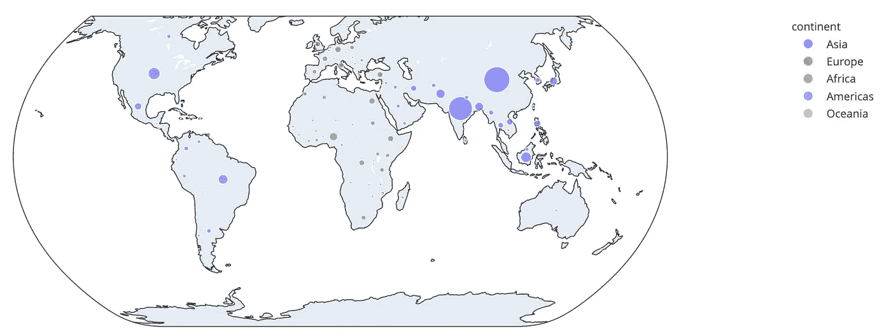
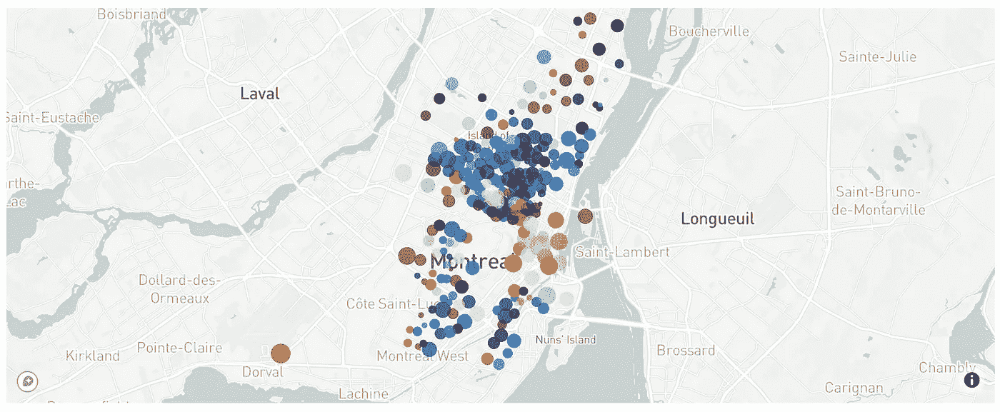
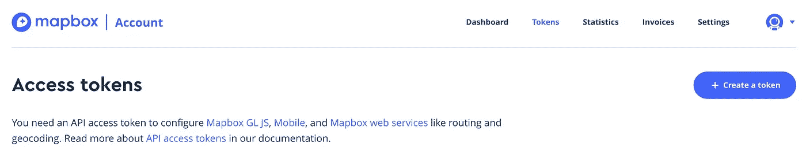
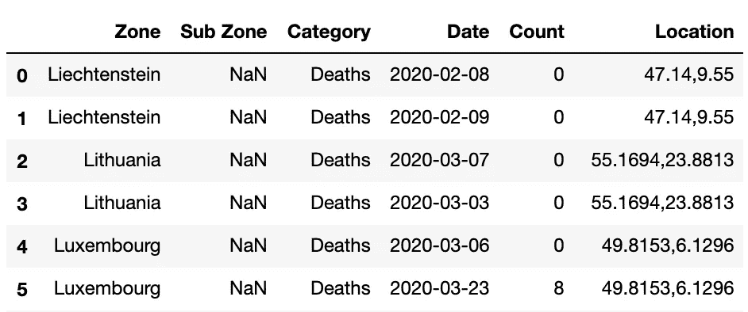
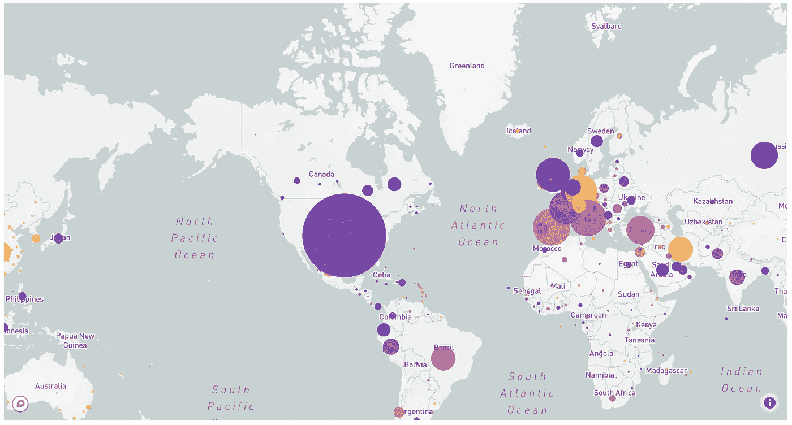
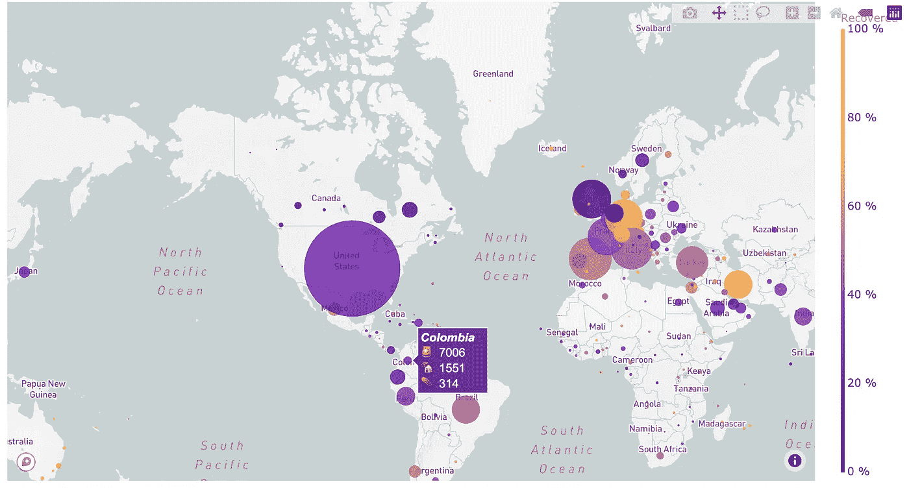

# 如何使用 Plotly 和 Dash 创建出色的动画散点图

> 原文：<https://towardsdatascience.com/how-to-create-animated-scatter-maps-with-plotly-and-dash-f10bb82d357a?source=collection_archive---------15----------------------->

## Plotly 中的动画地图可能很难配置。在本教程中，您将学习如何一步一步地实现一个散点图，日复一日地跟随 Covid 疫情走遍世界。

# 仪表板中的地图

Dash 是构建在 Flask 和 Plotly 之上的 Python 框架，旨在制作数据驱动的 web 应用。由于 Plotly，它提供了一些基本的图表，如直方图和饼状图，它还带有大量高度可定制的控件，如下拉菜单，复选框，日期滑块，等等。

要构建应用程序，您可以在一个或多个选项卡中组合所有这些控件和图表。但是当涉及到地图绘制时，就变得棘手了。Plotly 有一些基本的内置地图绘图:足以显示数据，但不如 2020 年 web 地图应该的那样好。为了解决这一弱点，Plotly 与 Mapbox 建立了合作关系。他们一起提供了很好的服务。



带有默认 plotly 贴图的散点图示例(相当难看)

今天，我们将了解如何在 dash 应用程序中使用 Mapbox 和 Plotly，以及如何创建动画散点图。



带有地图框地图的散点图示例(非常好)

由于这篇文章写于 2020 年 4 月冠状病毒疫情期间，我建议与新冠肺炎开放数据合作，以发现散点图。

# 注册到地图框

一些地图框表示需要一个令牌，散点图就是其中的一部分。别担心，这个简单又自由。

前往[www.mapbox.com](http://www.mapbox.com)创建一个账户。对于这一步，你只需要一个电子邮件帐户验证。完成后，您可以在“令牌”页面上获得令牌，然后单击“创建令牌”按钮。

有了这个令牌，你可以免费绘制 50000 张地图/月。在本文的结尾，我们将看到如何存储地图并最小化所需的请求数量。



地图盒子网站截图

通常将这些信息存储在与脚本不同的文件中。通常的做法是使用 **。ini* 文件进行存储，然后 python 内置的`configparser`模块对其进行访问。

> config.ini

```
[mapbox]
secret_token=your-token
```

> any_file_needing_token.py

```
import configparser
config = configparser.read('config.ini')
mapbox_token = config['mapbox']['secret_token']
```

# 创建散点图

## 加载数据

如前所述，我们将使用 Covid 疫情数据。我们将使用霍普金斯大学的数据集，该数据集在危机期间每天更新。在 [**opendatasoft**](https://public.opendatasoft.com/explore/dataset/covid-19-pandemic-worldwide-data/information/?disjunctive.zone&disjunctive.category) 上可用。



原始数据集的头部

数据非常容易理解:它包含许多国家关于 covid 的日常信息，关于*死亡*、*确诊、*或*康复*人员，以及 GPS 信息。

## 处理数据

必须转换该数据集以适应地图框输入。让我们明确所需的输入。

散点图的目的是在地图上绘制气泡，气泡的大小和颜色都是可变的。在今天的例子中，我们希望:

*   每个国家一个泡沫
*   气泡纬度:指定国家的纬度
*   气泡经度:指定国家的经度
*   气泡大小:确诊病例数
*   气泡颜色:获救人员比例
*   泡沫徘徊:国家形势概述

让我们在不同的栏目中获取这些信息。

*   **第一步**:将`Location` 列提取为经纬度
*   **第二步**:将单个`category`列每键 3 行(`date` & `zone`)拆分为三列:`confirmed`、`deaths` & `recovered.`，得到一个整洁的数据集
*   **第三步**:旋转表格时，我们丢失了位置信息。我们现在将它们合并回来，这多亏了`country_position`数据集。
*   **第四步**:定义每个气泡的大小
*   **第五步:**定义每个气泡的颜色


转换数据集的头

这里有一个多索引的全数据框:`date` & `zone`，过滤非常方便。

例如，要提取某一天的信息，我们需要:

```
day = '2020-05-01'
df_day = df.xs(day)
```

这对于我们的散点图和之后的地图动画来说非常方便！

## 地图

这里我们用所有必要的参数定义一个图形，然后用 Mapbox 信息更新它的 layout 属性:令牌、地图的中心位置以及我们想要放大多少。我们使用 1 的缩放比例，因为我们想看到整个地球。要放大，你只需要增加这个值。



2020 年 5 月 1 日的 Covid 案例

## 微小的改进

我们的散点图很好，但缺乏信息。在深入动画部分之前，我们先做一些基本的修改，提升贴图的质量。

1.  添加色彩映射表。

在上图中，我们看到橙色、紫色和黄色的盒子，但不知道它们的意思。让我们添加一个色彩映射表来说明这一点。要添加色彩映射表，将`showscale = True`添加到标记参数中。然后使用`colorbar` 属性，您可以添加更多的规范，比如标题、颜色条的大小或者任何其他关于记号的信息。

现在可以清楚地看到，黄色气泡与康复率最高的国家有关。气泡越暗，回收率越小。

2.添加自定义悬停信息

除了颜色理解之外，当用户用鼠标悬停在气泡上时显示数字也会很有趣。为此，我们可以向`go.Scattermapbox()`添加一个`text`参数，指定显示哪一列信息。但是这里我们想要显示多个信息，所以我们将使用`hovertemplate`和`customdata.`，后者允许我们将数据存储到控件中，并显示原始数据集中任何列的值。因此，我们将必要的列存储到`np.stack()`中的`customdata`中，并从`hovertemplate`中定义的 Html 模板中访问它。

> 注意:`<extra></extra>`用于覆盖悬停框中写有跟踪名(trace0)的原始部分。跟踪是我们存储图形数据的对象。



2020 年 5 月 1 日的 Covid 案例，带有颜色图和悬停信息

这是我们之前修改的结果。看起来很棒，不是吗？

# 制作动画

现在，我们能够在地图上绘制特定日期的数据。让我们把它做成动画，日复一日地观察世界局势。

作为参考，有两种方法可以用 Plotly 和 Dash 制作地图动画:

*   创建一个多帧的动画地图(解释如下)
*   创建具有可更新轨迹的单个 Plotly 地图，通过 dash 回调进行更新，由时间滑块进行监控。这在技术上是可行的，但是由于在每一步都需要修改地图数据，因此要复杂得多并且计算量很大。(而绘制的动画地图只计算一次，然后优化帧间导航。)

## 框架

为了创建一个情节性的动画，我们将为该图形提供多个帧，而不是像之前在`go.Figure()`语句中那样只提供一条轨迹。帧基本上是一个`go.Scattermapbox()`的内容，但是存储在一个列表中。

> 注:`*days*`为可用天数列表:`df.index.levels[0].tolist()`

## 滑块

然后，为了浏览这个框架，我们将创建一个`slider`。每个`slider`被定义为一个字典，并存储在`sliders`列表中。我们这里只有一个。

一个`slider`由它的特性定义(如`x`、`y`、`len`等)。)，其初始状态(`currentvalue`)及其`steps`。为了将一个步骤链接到一个特定的帧，我们需要在帧`name`和`steps[i]['args'][0][0]`中有相同的值。`steps[i]`作为步骤之一，`i in [0 ; nb_frame]`。不是最容易的猜测，但工作。

## 工作按钮

一旦我们有了一个漂亮的滑块，添加一个“播放按钮”会是一个好主意，它会一个接一个地运行所有的迭代。以下是我们的做法。

## 放在一起

现在我们有了所有的部分，我们可以组装拼图，并最终创建我们的交互式地图。


就是这样！下面是结果！一个漂亮的交互式散点图！让我们希望气泡不会变大，我们很快就会在这个图中看到很多黄色的气泡。

# 结论

你已经学习了如何用 Plotly 绘制散点图以及如何制作动画。现在你可以用你自己的数据，颜色图，滑块绘制你自己的交互式地图，并通过一个播放按钮让他们活起来。我希望你喜欢它！

**在我的下一篇文章**中，我将把这个地图嵌入到 Dash 应用程序中，您将会发现如何在 Heroku 上部署 Python web 应用程序。**你将设法进入这个散点图现场版**！敬请期待！

*(更新——你可以在那里查看)*

[](/deploying-dash-or-flask-web-application-on-heroku-easy-ci-cd-4111da3170b8) [## 在 Heroku 上部署 Dash 或 Flask web 应用程序。简易 CI/CD。

### 在笔记本电脑上开发 python web 应用非常棒。让每个人都能接触到它更令人满意。让我们…

towardsdatascience.com](/deploying-dash-or-flask-web-application-on-heroku-easy-ci-cd-4111da3170b8) 

如果你喜欢散点图版本，你可能也会喜欢 Choropleth 地图的故事😉

[](/how-to-create-outstanding-custom-choropleth-maps-with-plotly-and-dash-49ac918a5f05) [## 如何使用 Plotly 和 Dash 创建出色的自定义 choropleth 地图🌎

### 使用 GeoJSON 文件迈出第一步&了解如何在地球上的任何地方构建 choropleth 地图。用…举例说明

towardsdatascience.com](/how-to-create-outstanding-custom-choropleth-maps-with-plotly-and-dash-49ac918a5f05) 

为了发现更多关于 Plotly 以及如何展示你的 ML 项目和成果，我推荐你这篇来自 Neptune.ai 的好文章

[](https://neptune.ai/blog/plotly-python-tutorial-for-machine-learning-specialists) [## 面向机器学习专家的 Plotly Python 教程- neptune.ai

### Plotly 是一个开源的 Python 图形库，非常适合构建漂亮的交互式可视化…

海王星. ai](https://neptune.ai/blog/plotly-python-tutorial-for-machine-learning-specialists) 

> 再见🤠