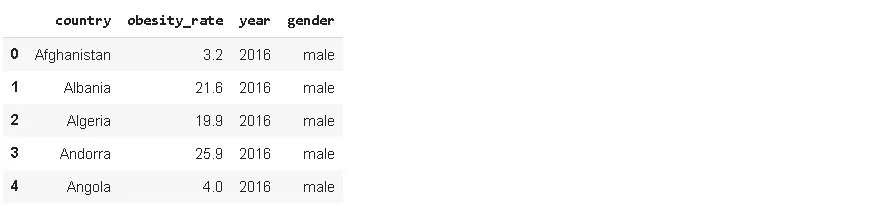
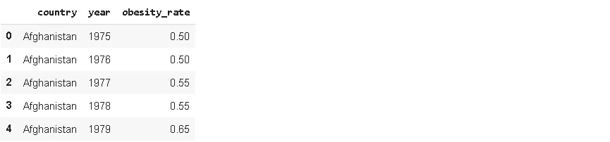
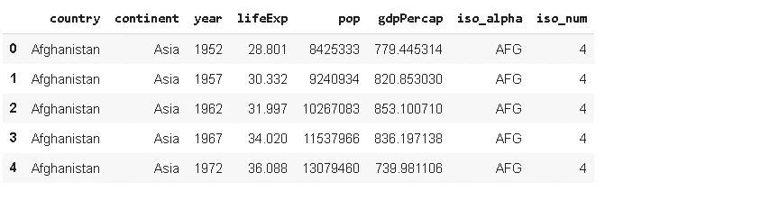
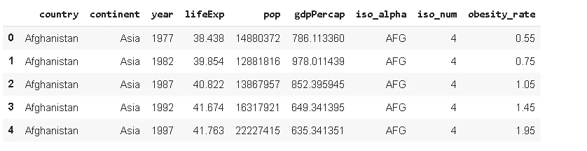
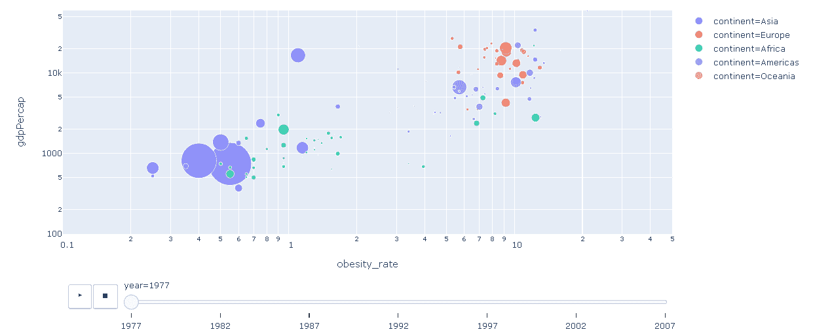
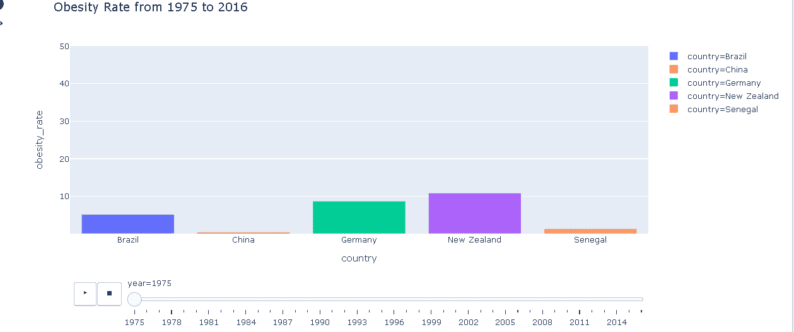

# 如何用 Plotly 创建动画可视化

> 原文：<https://towardsdatascience.com/how-to-create-animated-visualizations-with-plotly-c54b9c97b133?source=collection_archive---------52----------------------->

## 让你的数据技能更上一层楼。


[张家瑜](https://unsplash.com/@danielkcheung?utm_source=unsplash&utm_medium=referral&utm_content=creditCopyText)在 [Unsplash](https://unsplash.com/s/photos/small?utm_source=unsplash&utm_medium=referral&utm_content=creditCopyText) 上拍照

我们生活在大数据时代。我们可以收集大量数据，从而推断出有意义的结果，做出明智的商业决策。然而，随着数据量的增加，分析和探索数据变得更加困难。当有效和恰当地使用时，可视化是探索性数据分析的伟大工具。可视化也有助于向你的观众传递信息，或者告诉他们你的发现。没有一种通用的可视化方法，因此某些任务需要不同类型的可视化。近年来，动画可视化越来越受欢迎，因为它们使“告诉”比统计可视化更多的东西成为可能。动画可视化非常擅长展示事物如何随着时间的推移而变化。

我们将介绍如何使用 **Plotly Python** (plotly.py)创建动画可视化，这是一个基于 plotly javascript (plotly.js)构建的开源绘图库。我喜欢 plotly.py 的一点是，它提供了一个高级 API ( **plotly express** )和一个低级 API ( **graph objects** )来创建可视化。使用 plotly express，我们可以用很少的代码行创建一个很好的情节。另一方面，我们需要用图形对象编写更多的代码，但是对我们创建的内容有更多的控制。

在本帖中，我们将使用 plotly express API。我将写另一篇文章来介绍图形对象的动画可视化。

我们将合并两个不同的数据集。一个是肥胖率数据集，可在 kaggle 上的[这里](https://www.kaggle.com/amanarora/obesity-among-adults-by-country-19752016)获得。原始数据集需要清理和重新格式化。如果你想经历数据清理的步骤，请随意访问我的帖子:

[](/a-practical-guide-for-data-cleaning-obesity-rate-dataset-aff9d12390c8) [## 数据清理实用指南:肥胖率数据集

### 如何清理和重新格式化原始数据集。

towardsdatascience.com](/a-practical-guide-for-data-cleaning-obesity-rate-dataset-aff9d12390c8) 

以下是清理后的数据帧的前五行:



我们将使用的另一个数据集不区分性别。因此，我们需要通过按“国家”和“年份”分组并取“肥胖率”的平均值来消除该数据集中的性别:

```
import numpy as np
import pandas as pd# fixing data tytpes
obesity_cleaned = df2.astype({'obesity_rate': 'float32', 'year': 'int32'})# eliminating gender
obesity_cleaned = obesity_cleaned.groupby(['country','year']).mean().reset_index()obesity_cleaned.head()
```



另一个数据集可用作 plotly express 的内置数据集。它被称为 gapminder，包括 142 个国家从 1952 年到 2007 年的预期寿命、人均 gdp 和人口(以 5 年为增量)。我们首先导入 plotly express 和数据集:

```
import plotly.express as pxdf_gdp = px.data.gapminder()df_gdp.head()
```



我们可以使用 pandas 的 **merge** 功能来合并这两个数据帧。共享列是国家和年份，因此我们将它们传递给参数上的**:**

```
df_merge = pd.merge(df_gdp, obesity_cleaned, 
                    on=['country','year'])df_merge.head()
```



我们现在可以创建我们的第一个动画可视化。下面是生成动画散点图的代码。我会解释每一个参数，然后显示图。

```
px.scatter(df_merge, x="obesity_rate", y="gdpPercap",
animation_frame="year",
size="pop", color="continent", hover_name="country",
size_max = 50,
range_x=[0.1, 50], range_y=[100,60000],
log_x=True, log_y=True)fig.show()
```

我们首先在数据帧的名称上加右键，并指定 x 轴和 y 轴。因此，我们的动画散点图将显示人均 gdp 和肥胖率如何随时间变化。为了使情节动画，我们使用**动画 _ 帧**参数。我们使用“年”作为动画帧，因此值将根据年份而变化。我们将人口分配给**大小**参数，因此散点图中点的大小与国家人口成比例。对于 **color** 参数，我们使用大陆列，这样我们可以大致了解每个大陆。 **Size_max** 参数允许调整散点图中点的大小。如果不指定，点可能看起来太小，人眼看不出来。 **Range_x** 和 **range_y** 参数用于指定范围，使所有点在动画期间保持可见。最后，log_x 和 log_y 参数调整对数标度上的轴范围。如果数值相差很大，最好使用对数标度，使绘图看起来更好。

可视化是传递信息的好工具。动画情节甚至更强大，因为它们也考虑了时间。通过我们刚刚创建的图，我们获得了以下信息:

*   国家人口
*   各国人均国内生产总值
*   各国肥胖率
*   这些值如何随时间变化
*   根据这些标准，各大洲是如何不同的
*   如果这些度量之间存在相关性

让我们看看我们创建的动画散点图:



*   欧洲国家的人均 gdp 和总体肥胖率都很高。
*   总的来说，非洲和亚洲国家在人均 gpd 和肥胖率方面都远远落后。
*   这些年来，亚洲国家的人均国内生产总值已经超过了非洲国家。
*   肥胖率和人均 gdp 之间似乎存在正相关关系(当然，我们需要更多的数据来证实)
*   尽管由于人口规模非常小，这一点很难引起注意，但科威特一直是肥胖率最高的国家，人均国内生产总值排名前三。

我们还可以创建一个动画条形图。例如，肥胖率如何随时间变化可以用柱状图来表示。让我们选择 5 个国家(每个洲一个)在图上显示。

```
countries = ['China', 'Germany', 'Senegal', 'Brazil', 'New Zealand']df5 = obesity_cleaned[obesity_cleaned.country.isin(countries)].reset_index(drop=True)
```

我们这次也加个标题。以下是使用 plotly express 创建动画条形图的代码:

```
fig = px.bar(df5, x="country", y="obesity_rate",
color="country",
animation_frame="year", animation_group="country",
range_y=[0.1, 50],
title='Obesity Rate from 1975 to 2016')fig.show()
```



不幸的是，全世界的肥胖率一直在上升。

我们已经介绍了如何使用 plotly express 创建一些基本的动画情节。当然，这只是这个神奇图书馆的一小部分功能。我们可以使用 plotly 动态创建许多其他绘图类型。我还将讲述如何使用 plotly.py 的图形对象创建动画图。语法稍微复杂一点，但它提供了更多的灵活性。最好熟悉这两种 API，选择最适合自己需求的一种。

就像任何其他主题一样，熟悉 plotly 的最好方法就是实践。因此，我建议创造大量的情节来提高你的技能。

感谢您的阅读。如果您有任何反馈，请告诉我。