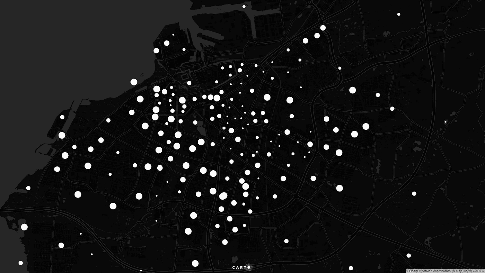
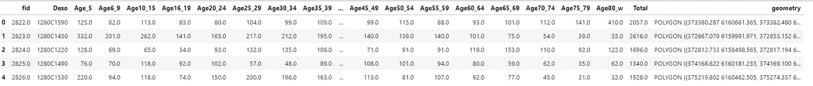
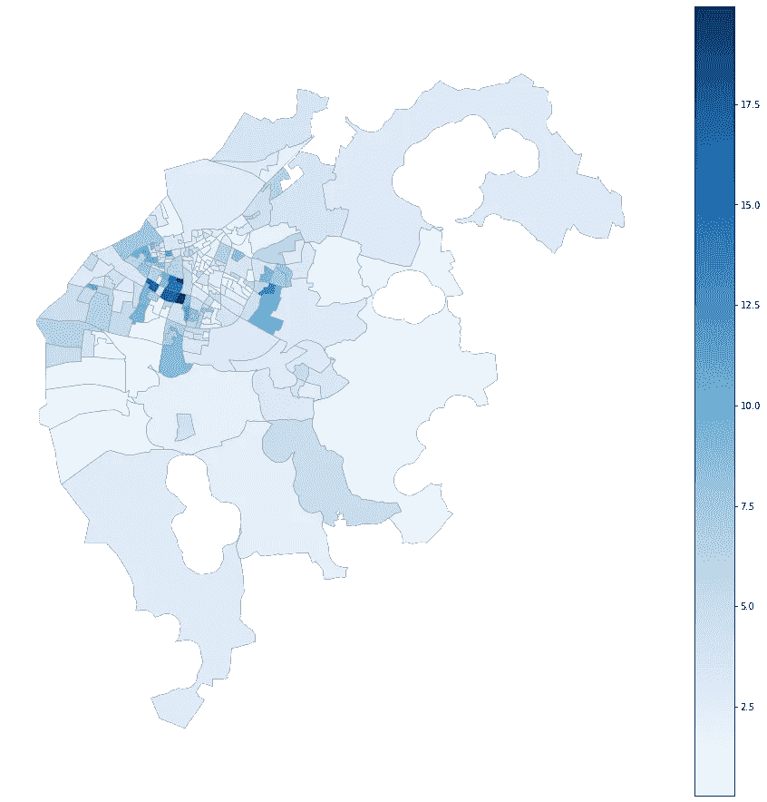
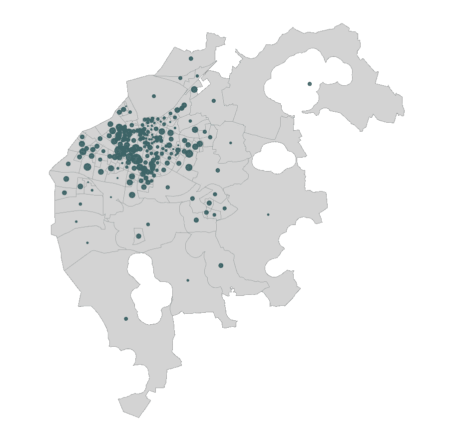
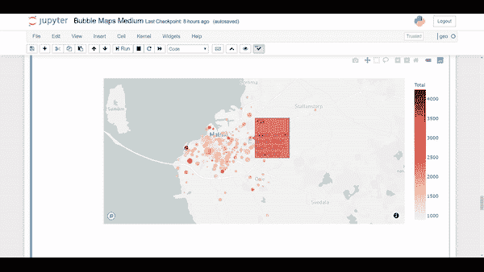

# 如何使用地理空间数据在 Python 中创建气泡图

> 原文：<https://towardsdatascience.com/how-to-create-bubble-maps-in-python-with-geospatial-data-e51118c3d767?source=collection_archive---------19----------------------->

## 初学者指南和教程。


Marc Sendra Martorell 在 [Unsplash](https://unsplash.com?utm_source=medium&utm_medium=referral) 拍摄的照片

想过如何用 Python 和地理空间数据创建气泡图吗？我将向您展示如何轻松地以静态格式和交互式格式制作气泡图。

> A `bubble map`使用 size 作为编码变量。圆圈的大小代表一个地理区域的数值。



气泡图

我们经常使用 Choropleth 地图来显示区域，在这种情况下，我们使用颜色编码。Choropleth 地图有一个固有的大面积偏差问题。相比之下，气泡图使用圆形来表示区域或区域的数值。

用 Python 创建泡泡图看起来很复杂，也有点高级，但事实并非如此。这就像创建带有纬度和经度列的气泡图。让我们首先导入我们需要的库。

```
import pandas as pd
import numpy as npimport geopandas as gpdimport matplotlib.pyplot as plt
import plotly_express as px
```

我们可以用 Geopandas 读取数据。使用 Geopandas，您可以读取大多数地理数据格式，如 Shapefile、Geojson、Geo package 等..在本例中，我们使用的是瑞典莫尔蒙市的人口数据。

```
gdf = gpd.read_file(“data/malmo-pop.shp”)
gdf.head()
```

这是数据集的第一行。对于每个行政单位(Deso ),我们有许多人口细分栏(5 岁至 80 岁及以上)。



我们通常使用 choropleth 地图和颜色编码。正如我们将要看到的，我们可以用 Geopandas 非常容易地创建一个 choropleth 地图。请注意，我们首先通过细分总人口来标准化数据(年龄 80_w)。

```
gdf["Age_80_norm"] = (gdf["Age80_w"] / gdf["Total"]) * 100fig, ax = plt.subplots(figsize=(16,16))
gdf.plot(ax=ax, column="Age_80_norm", cmap="Blues",edgecolor="grey", linewidth=0.4, legend=True)
ax.axis("off")
plt.axis('equal')
plt.show()
```



## 气泡图

或者，我们可以使用气泡图，避免 choropleth 图的一些缺陷。例如，我们不需要对数据进行归一化，我们可以使用总体细分。但是，我们需要对数据进行一些转换，以便能够创建气泡图。

正如你所看到的，我们使用的数据是多边形，如果我们想创建气泡图，我们需要点。然而，这是使用 Geopandas 的一个简单过程。我们只需要改变几何列，在这种情况下，多边形为点几何。

```
gdf_points = gdf.copy()
gdf_points[‘geometry’] = gdf_points[‘geometry’].centroid
```

我们首先将具有面几何的地理数据框架复制到新的地理数据框架中。因为我们希望气泡位于区域的中心，我们可以使用 Geopandas 中的质心函数来实现这一点。

现在，我们有了具有不同几何列的相同地理数据框架，即点几何。让我们绘制一个气泡图，因为我们现在有了点数据集。

```
fig, ax = plt.subplots(figsize=(16,16))
gdf.plot(ax=ax, color=”lightgray”, edgecolor=”grey”, linewidth=0.4)
gdf_points.plot(ax=ax,color=”#07424A”, markersize=”Age80_w”,alpha=0.7, categorical=False, legend=True )ax.axis(“off”)
plt.axis(‘equal’)
plt.show()
```

下面的地图显示了瑞典莫尔蒙一个较小行政区域内 80 岁及以上人口的气泡图。每个圆圈代表基于 80 岁及以上人口小计的不同大小。要构建气泡图，您需要为您想要映射的列提供 *markersize* ，在本例中是 Age80_w。



正如你所看到的，这是一个静态贴图，气泡贴图的一个常见问题是点圆的重叠。我们可以避免这种情况的一种方法是创建交互式地图，允许用户与感兴趣的区域进行交互和放大。在下一节中，我们将看到如何创建一个交互式气泡图。

## 交互式气泡地图

有不同的 Python 库用于绘制交互式气泡图。为了构建一个交互式气泡图，我们使用 Plotly Express。我们只需要转换到另一个投影，用 Plotly Express 显示地图。Plotly Express 具有 scatter_mapbox()函数，该函数可以获取地理数据框和要用于气泡图的列。

```
gdf_points_4326 = gdf_points.to_crs(“EPSG:4326”)fig = px.scatter_mapbox(
                        gdf_points_4326, 
                        lat=gdf_points_4326.geometry.y, 
                        lon=gdf_points_4326.geometry.x, 
                        size=”Age80_w”, 
                        color=”Total”, 
                        hover_name = “Age80_w”,
                  color_continuous_scale=px.colors.colorbrewer.Reds,  
                        size_max=15, 
                        zoom=10
                    )
fig.show()
```

使用 Plotly Express，我们可以通过创建交互式气泡图来避免气泡图的重叠问题。见下图 GIF。



气泡图可以是显示具有不同气泡大小的数值变量的替代图，而不是最常用的 choropleth 图。如果您有一个带有值(即年龄细分)的区域(即行政区)列表，气泡图可以代替 Choropleth 图。气泡图没有 choropleth 图固有的大面积偏差。

## 结论

在本教程中，我们已经看到了如何使用 Python 创建静态和交互式气泡图。静态气泡图存在重叠问题。为了避免这种情况，您可以创建允许放大/缩小的交互式地图，或者增加静态地图圆圈的透明度。

本教程的代码可以在这个 Github 存储库中找到。

[](https://github.com/shakasom/esda/blob/master/Bubble%20Maps%20Medium.ipynb) [## shakasom/esda

### permalink dissolve GitHub 是 4000 多万开发人员的家园，他们一起工作来托管和审查代码，管理…

github.com](https://github.com/shakasom/esda/blob/master/Bubble%20Maps%20Medium.ipynb)