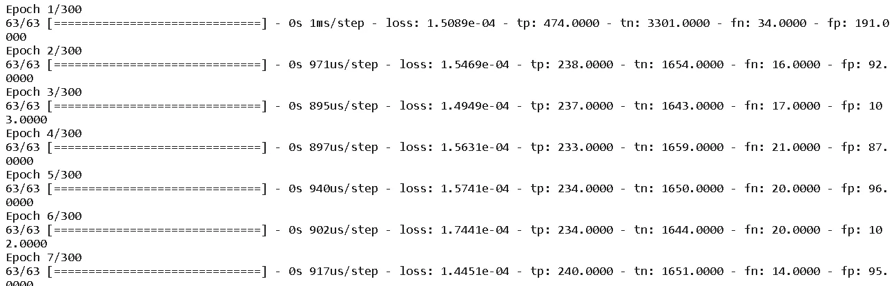
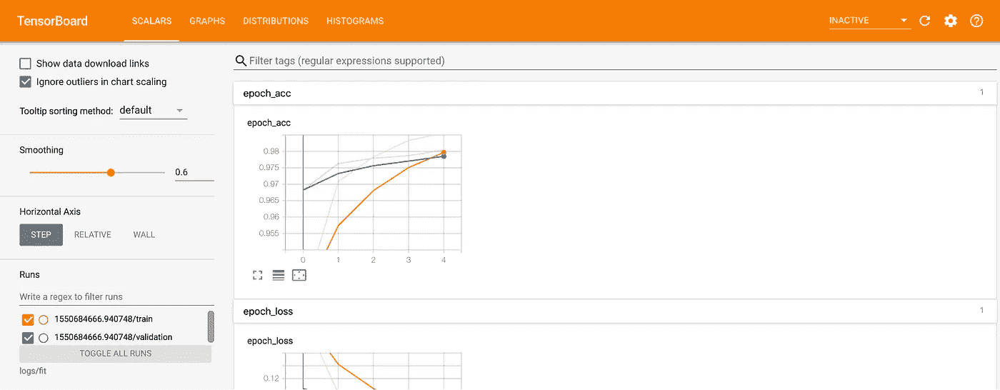
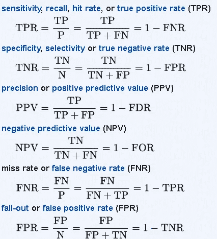
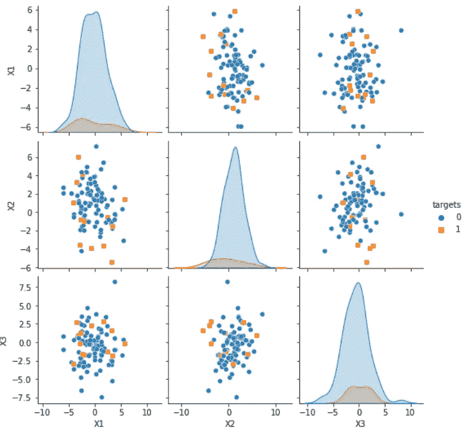
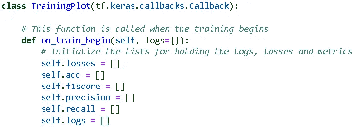
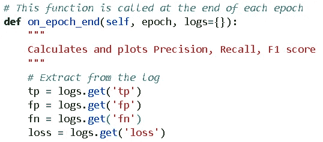
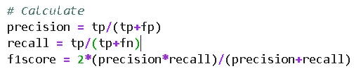
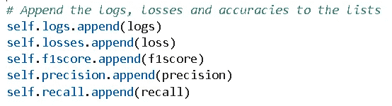
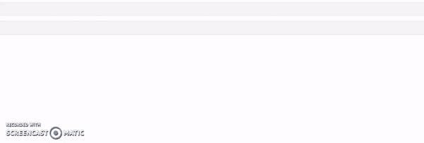

# 如何在深度学习中创建定制的实时图

> 原文：<https://towardsdatascience.com/how-to-create-custom-real-time-plots-in-deep-learning-ecbdb3e7922f?source=collection_archive---------20----------------------->

## 如何在使用 Keras 回调训练深度学习模型的同时，生成自定义指标的实时可视化。


图片来源:[**pix abay**](https://pixabay.com/photos/garage-floors-parking-construction-1149542/)

# 我们所说的实时图是什么意思？

用大型数据集训练复杂的深度学习模型可能非常耗时。随着时代的流逝，大量的数字在你的屏幕上闪现。你的眼睛(和大脑)会疲劳。

那个令人兴奋的不断更新你进度的精确度图在哪里？如何知道模型是否在学习有用的东西？还有，到底有多快？

一个 ***实时视觉更新*** 会很棒吧？

人类毕竟是视觉生物。

[](https://www.seyens.com/humans-are-visual-creatures/) [## 人类是视觉动物

### 在这里，我们收集了一些有趣的事实来强调为什么在科学交流中使用视觉辅助工具是如此重要…

www.seyens.com](https://www.seyens.com/humans-are-visual-creatures/) 

我说的*视觉*，并不是指当你打开模型的冗长时，所有的数字分数都倾泻在你的屏幕上。

**不是这个。**



我们希望如此。


让我们看看怎样才能到达那里。

> 那个令人兴奋的不断更新你进度的精确度图在哪里？如何知道模型是否在学习有用的东西？还有，到底有多快？

# 我们所说的自定义地块是什么意思？

常规工作有既定的工具。但是很多时候，我们需要定制的输出。

## Tensorboard 很酷，但可能无法满足所有需求

如果你正在使用 TensorFlow/Keras 进行深度学习任务，那么你很有可能听说过或使用过 Tensorboard。这是一个神奇的仪表板实用程序，你可以传递训练日志，并可以获得精彩的视觉更新。

[](https://www.tensorflow.org/tensorboard/get_started) [## TensorBoard | TensorFlow 入门

### 在机器学习中，为了改进某些东西，你通常需要能够测量它。TensorBoard 是一款提供…

www.tensorflow.org](https://www.tensorflow.org/tensorboard/get_started) 

图片来源: [**张量板**](https://www.tensorflow.org/tensorboard)

用 Tensorboard 可以很容易地得到标准损耗、精度图。如果您只想监控这些，而不是 DL 模型中的其他内容，您可以停止阅读本文，直接使用 Tensorboard。

但是，当您有一个高度不平衡的数据集要处理，并且您想要绘制**精度、召回和 F1 分数**时，该怎么办呢？或者，另一个不那么标榜分类的度量标准像 [**马太系数**](https://en.wikipedia.org/wiki/Matthews_correlation_coefficient) ？如果您只关心真阴性和假阴性的比率，并想创建自己的度量标准，那该怎么办？

随着您培训的进展，您如何看待这些非标准指标的实时更新？

## Keras 内置了计算混淆矩阵的功能

幸运的是，Keras 提供了对应于混淆矩阵的四个基本量的基本对数——真阳性(TP)、假阳性(FP)、真阴性(TN)和假阴性(FN)。它们来自 Keras 指标模块。

 [## 模块:TF . keras . metrics | tensor flow Core v 2 . 3 . 0

### 内置指标。

www.tensorflow.org](https://www.tensorflow.org/api_docs/python/tf/keras/metrics) 

我们可以简单地在您的模型的训练日志中定义一个我们想要的度量列表，并在编译模型时传递该列表。

```
**metrics** = [
    tf.keras.metrics.TruePositives(name="tp"),
    tf.keras.metrics.TrueNegatives(name="tn"),
    tf.keras.metrics.FalseNegatives(name="fn"),
    tf.keras.metrics.FalsePositives(name="fp"),
]
```

然后，

```
model.compile(
        optimizer=tf.keras.optimizers.Adam(lr=learning_rate),
        loss=tf.keras.losses.BinaryCrossentropy(),
       ** metrics=metrics**,
    )
```

因此，我们可以将这些度量(尽管它们是在训练数据集上计算的)作为训练日志的一部分。一旦我们得到了它们，我们就可以根据第一性原理的定义，为分类任务计算出我们想要的任何自定义指标。例如，这里我们展示了一些非标准指标的公式，



图片来源:[维基百科](https://en.wikipedia.org/wiki/Precision_and_recall)

但是，我们如何从这些计算值中创建定制的实时图呢？

**我们当然使用回调！**

> 随着您培训的进展，您如何看待这些非标准指标的实时更新？

# 实时可视化的自定义回调

回调是一类非常有用的工具，可以在你训练的某些时候(或者你喜欢的话，在每个时期)调用。简而言之，它们可用于在培训过程中实时处理数据(与模型性能或算法相关)。

这是 Keras 回调的 TensorFlow 官方页面。但是为了我们的目的，**我们必须编写一个自定义的绘图类**从基本回调类派生而来。

 [## 模块:TF . keras . callbacks | tensor flow Core v 2 . 3 . 0

### 回调:在模型训练期间的某些点调用的实用程序。

www.tensorflow.org](https://www.tensorflow.org/api_docs/python/tf/keras/callbacks) 

## 演示 Jupyter 笔记本

演示版 Jupyter 笔记本是 [**位于我的 Github repo 上的**](https://github.com/tirthajyoti/Deep-learning-with-Python/blob/master/Notebooks/Custom-real-time-plots-with-callbacks.ipynb) 这里。 [**这个资源库**](https://github.com/tirthajyoti/Deep-learning-with-Python) 包含了很多其他有用的深度学习教程式的笔记本。所以，请随意星或叉。

## 不平衡的数据集


图片来源: [**Pixabay**](https://pixabay.com/illustrations/balance-swing-equality-measurement-2108024/)

我们为演示中的二进制分类任务创建了一个具有不平衡类别频率(负数比正数多得多)的合成数据集。这种情况在实际的数据分析项目中很常见，它强调需要有一个可视化的仪表板来定制分类指标，而准确性不是一个好的指标。

下面的代码创建了一个数据集，其中包含 90%的阴性样本和 10%的阳性样本。

```
from sklearn.datasets import make_classificationn_features = 15
n_informative = n_featuresd = make_classification(n_samples=10000,
                        n_features=n_features,
                        n_informative=n_informative,
                        n_redundant=0,
                        n_classes=2,
                        **weights=[0.9,0.1]**,
                        flip_y=0.05,
                        class_sep=0.7)
```

下面的配对图显示了两个类的样本数据分布。请注意内核密度图中的不平衡。



**合成数据集的分类数据分布**

> 回调是一类非常有用的工具，可以在你训练的某些时候(或者你喜欢的话，在每个时期)调用。

## 自定义回调类

自定义回调类主要完成以下工作，

*   启动一组列表来存储值
*   在每个时期结束时从模型中提取指标
*   从这些提取中计算分类度量
*   并将它们存储在这些列表中
*   创建多个地块

下面是**初始化**，



这里是**提取**，



这里是**计算**，



这里是**仓库**，



而且，我不会用标准的 Matplotlib 代码来让你厌烦，除了下面的位，它在每次迭代时刷新你的 Jupyter 笔记本绘图。

```
from IPython.display import clear_output# Clear the previous plot
 clear_output(wait=True)
```

此外，**您不必绘制每个时期的图**,因为这可能会加重显示器或机器的负担并降低其速度。你可以选择绘制，比如说，每 5 个纪元。只要把整个绘图代码放在一个条件下(这里`epoch`是你从训练日志中得到的纪元编号)

```
# Plots every 5th epoch
 if epoch > 0 and epoch%5==0:
```

不要担心所有这些如何协同工作，因为 [**演示笔记本仍然为您准备**](https://github.com/tirthajyoti/Deep-learning-with-Python/blob/master/Notebooks/Custom-real-time-plots-with-callbacks.ipynb) 。

## 结果

这是一个典型的结果，以简单的仪表板样式显示损失和精确度/召回/F1 分数。请注意，对于这个不平衡的数据集，召回是如何从一个高值开始的，但是精度和 F1 值却很低。这些是您可以通过这种回调实时计算和监控的指标！


## 更多结果—概率分布！

在每个时期结束时，您可以对模型(在该点训练)进行任何想要的计算，并可视化结果。例如，我们可以预测输出概率，并绘制它们的分布。

```
def on_epoch_end(self, epoch, logs={}):
    # Other stuff
    m = self.model
    preds = m.predict(X_train)
    plt.hist(preds, bins=50,edgecolor='k')
```

请注意，在开始时很少给出高概率，慢慢地模型开始学习数据的真实分布。



# 摘要

我们展示了如何使用简单的代码片段创建深度学习模型性能的生动可视化仪表板。按照这里概述的方法，你不必依赖 Tensorboard 或任何第三方软件。您可以创建自己的计算和绘图，根据您的需要进行最大程度的定制。

请注意，上述方法仅适用于 Jupyter 笔记本。您必须针对独立的 Python 脚本对其进行不同的调整。

关于这一点，有另一篇关于这个主题的精彩文章，你可以在这里查看。

[](https://medium.com/@kapilvarshney/how-to-plot-the-model-training-in-keras-using-custom-callback-function-and-using-tensorboard-41e4ce3cb401) [## 如何在 Keras 中绘制模型训练——使用自定义回调函数和 TensorBoard

### 我开始探索不同的方法来形象化训练过程，同时致力于狗的品种识别…

medium.com](https://medium.com/@kapilvarshney/how-to-plot-the-model-training-in-keras-using-custom-callback-function-and-using-tensorboard-41e4ce3cb401) 

# 你可能也喜欢…

如果你喜欢这篇文章，你可能也会喜欢我下面的深度学习文章，

[](/are-you-using-the-scikit-learn-wrapper-in-your-keras-deep-learning-model-a3005696ff38) [## 你在你的 Keras 深度学习模型中使用了“Scikit-learn wrapper”吗？

### 如何使用 Keras 的特殊包装类进行超参数调优？

towardsdatascience.com](/are-you-using-the-scikit-learn-wrapper-in-your-keras-deep-learning-model-a3005696ff38) [](/activation-maps-for-deep-learning-models-in-a-few-lines-of-code-ed9ced1e8d21) [## 用几行代码实现深度学习模型的激活图

### 我们演示了如何用几行代码显示深度 CNN 模型中各层的激活图

towardsdatascience.com](/activation-maps-for-deep-learning-models-in-a-few-lines-of-code-ed9ced1e8d21) [](/a-single-function-to-streamline-image-classification-with-keras-bd04f5cfe6df) [## 使用 Keras 简化影像分类的单一功能

### 我们展示了如何构建一个单一的、通用的、实用的函数来从一个目录中自动提取图像…

towardsdatascience.com](/a-single-function-to-streamline-image-classification-with-keras-bd04f5cfe6df) 

Y 你可以查看作者的 [**GitHub**](https://github.com/tirthajyoti?tab=repositories) **知识库**获取机器学习和数据科学方面的代码、思想和资源。如果你和我一样，对人工智能/机器学习/数据科学充满热情，请随时[在 LinkedIn 上添加我](https://www.linkedin.com/in/tirthajyoti-sarkar-2127aa7/)或[在 Twitter 上关注我](https://twitter.com/tirthajyotiS)。

[](https://www.linkedin.com/in/tirthajyoti-sarkar-2127aa7/) [## Tirthajyoti Sarkar - Sr .首席工程师-半导体、人工智能、机器学习- ON…

### 通过写作使数据科学/ML 概念易于理解:https://medium.com/@tirthajyoti 开源和…

www.linkedin.com](https://www.linkedin.com/in/tirthajyoti-sarkar-2127aa7/)