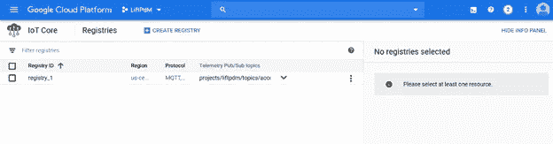
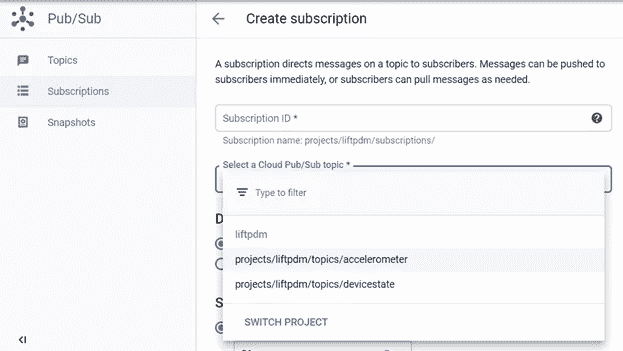

# 如何打造数据流物联网管道——谷歌云平台

> 原文：<https://towardsdatascience.com/how-to-create-dataflow-iot-pipeline-in-google-cloud-platform-c08caeca13bb?source=collection_archive---------11----------------------->

来自谷歌云平台参考架构的数据管道架构

# 介绍

在本文中，我们将了解如何在谷歌云平台上配置完整的端到端物联网管道。你会知道-

如何在云物联网核心中创建设备注册表

如何创建主题和订阅

如何使用 GCP Python 物联网客户端向设备发送消息

如何设置发布订阅

如何建立从 PubSub 到 BigQuery 的云数据流管道

# 如何使用设备注册表和发布订阅设置云物联网核心

前往[https://console.cloud.google.com/](https://console.cloud.google.com/)，使用您的凭证登录并搜索物联网核心。

选择物联网核心后，其主界面页面会打开如下图。

我们首先需要创建注册表来注册设备。

**点击创建注册表**。创建注册表的新页面打开如下

根据需要为您的注册表命名。您可以看到显示的命名规则。

选择要存储数据的区域。最好让注册表区域靠近设备源

然后您会注意到，它要求命名主题名为 pub-sub，以路由来自注册中心中注册的设备的消息。

所以我们取一个小的散度。转到发布订阅并创建主题和订阅。

在新标签页转到 https://console.cloud.google.com/的[并搜索发布订阅](https://console.cloud.google.com/)

它将打开发布-订阅登录页面，如下所示

由于我已经创建了一个主题，它显示在列表中。

**点击创建主题**。将打开一个新的创建主题配置页面，如下所示

给一个你想要的话题 ID。它将自动创建一个主题名称，并添加到您的项目路径中。

**点击**创建主题。完成后，您将看到在主题登录页面中创建的主题。

主题将消息从发布者设备转发到订阅者。任何订阅的消费者都可以使用这些消息。

因此，让我们创建一个订阅，并将其与我们创建的主题相关联。

为此，请在发布订阅的登录页面上单击订阅。它将打开订阅窗格。

**点击**创建订阅。这将打开订阅配置窗格。

给出你选择的 ID。它将自动创建一个带有项目名称的订阅名称。

将您的订阅与刚刚创建的主题名称链接起来。

保留其余的默认设置，然后单击 Create。

这将创建如图所示的订阅

现在，让我们回到“物联网核心”选项卡，将注册表与我们在“创建注册表配置”窗格中创建的主题相关联。

单击“创建”来创建注册表。

创建注册中心后，物联网核心登录页面将如下所示

点击注册表创建。它将打开如下注册表页面。

我们现在需要创建一个设备实例，并将其与我们创建的注册表相关联。这将完成设备创建、注册表创建、主题订阅创建的路径。然后，我们可以从 GCP 客户端向这些设备发送消息。消息将通过订阅路由到主题。然后，可以用 API 提取消息。

点击设备，然后创建设备选项卡

这将打开设备配置页面。给出一个设备 ID，保留其余的设置，然后点击 create。这将创建一个与注册表相关联的设备实例。

# 创建 GCP 客户端，通过 MQTT 协议发送消息

下载用于谷歌云平台实施的 Python 脚本@

[**【https://github.com/GoogleCloudPlatform/python-docs-samples】**](https://github.com/GoogleCloudPlatform/python-docs-samples)

转到***tree/master/IOT/API-client/end _ to _ end _ example/cloud IOT _ pubsub _ example _ mqtt _ device . py***

此客户端依赖于以下 python 库。

***argparse，datetime，json，os，ssl，time，jwt，paho MQTT 客户端*** 。如果需要，可以使用 pip install 将相关的库安装到 python 包中。

客户端文件生成虚拟温度数据消息，并将遥测数据发送到我们在物联网核心上创建的设备。该消息被进一步路由到发布-订阅主题。我们可以在发布订阅中看到消息，也可以订阅和提取消息。

请注意，这是一个基线脚本。您可以根据您的消息要求进行更改。

# 执行代码

**python cloud IOT _ pubsub _ example _ mqtt _ device _ lift PDM . py**—*project _ id = your project name—registry _ id = your registry id—device _ id = your device id—private _ key _ file = RSApemfile—algorithm = RS 256*

您可以使用 openSSL 通过以下命令生成 RSA pem 文件，如下所示-

**OpenSSL gen pkey**-算法 RSA-out RSA _ private . PEM-pkeyopt RSA _ keygen _ bits:2048

**OpenSSL RSA**-in RSA _ private . PEM-pub out-out RSA _ public . PEM

当我发布不同的数据时，你会看到不同的信息。但是消息将被确认。

现在让我们去 PubSub 看看消息。

点击您创建的主题 ID

点击查看消息。您将选择订阅。从我们刚刚创建的下拉列表中单击 subscription。

# 数据流管道

现在让我们来看看如何创建从 PubSub 到 BigQuery 的数据流管道

去 console.cloud.google.com/dataflow。登录页面如下所示

点击从模板创建工作。

给出所需的作业名称、区域端点。从数据流模板中选择 Pub-Sub 到 Bigquery 管道，如下所示。以 project:dataset:tablename 格式命名我们创建的订阅和表名。您还需要在 Google 云存储中指定临时存储位置，如下所示。

你可以在 big query @*中寻找更多关于表创建的细节*

*【https://cloud.google.com/bigquery/docs/schemas】T5[T6](https://cloud.google.com/bigquery/docs/schemas)*

*您可以在云存储@*中了解更多关于桶存储创建的详细信息**

********

**单击运行作业选项卡，作业面板将如下所示**

****

**现在让我们转到大查询，检查数据是否流入我们的表。**

****注意** — GCP 不允许启动/停止数据流作业。每次想要停止时，您都必须重新创建一个作业。一定要停止这项工作，因为它会消耗大量资源并给你带来巨额账单。**

****

**数据流入数据集 liftpdm_2 的表 acc8。**

**一旦数据存储在 BigQuery 中，您就可以用于进一步的下游应用程序，如可视化、机器学习等，并将计算出的数据存储回 BigQuery。**

# **结论**

**我们研究了 step 来创建物联网核心设备和注册表，并将它们与主题相关联。**

**如何创建发布-订阅主题和订阅？**

**如何通过物联网 Python 客户端向 PubSub 发送消息？**

**如何创建从发布订阅到大查询的数据流管道？**

# **下一步怎么样**

**我们将研究如何利用一些可操作的参数创建与设备的闭环通信。**

# ****参考文献****

**[https://cloud.google.com/iot/docs/samples/end-to-end-sample](https://cloud.google.com/iot/docs/samples/end-to-end-sample)**

**[https://cloud . Google . com/data flow/docs/guides/templates/provided-streaming](https://cloud.google.com/dataflow/docs/guides/templates/provided-streaming)。**

** [## 谷歌云平台/专业服务

### 这个报告包含了数据流 python API 的几个例子。这些示例是我们看到的常见用例的解决方案…

github.com](https://github.com/GoogleCloudPlatform/professional-services/tree/master/examples/dataflow-python-examples)**