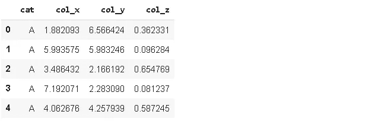
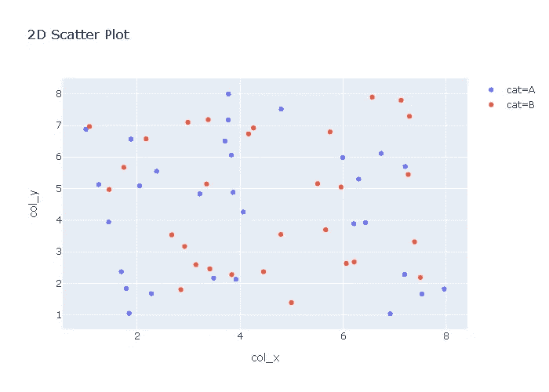
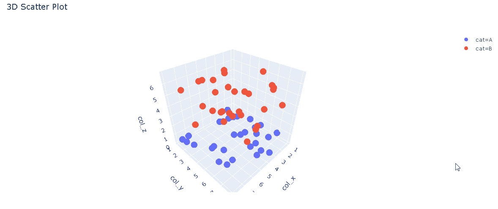
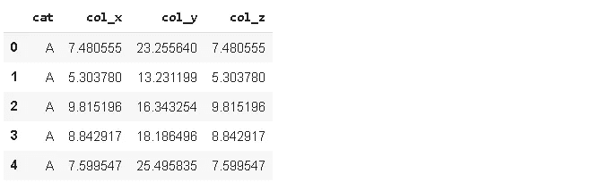
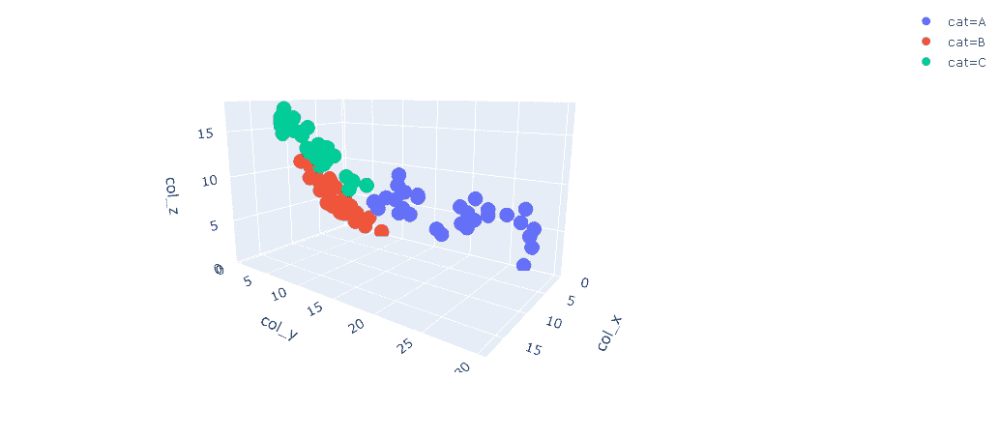
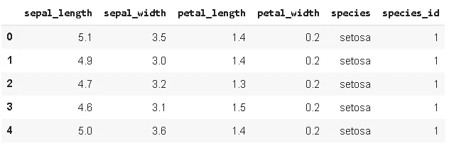
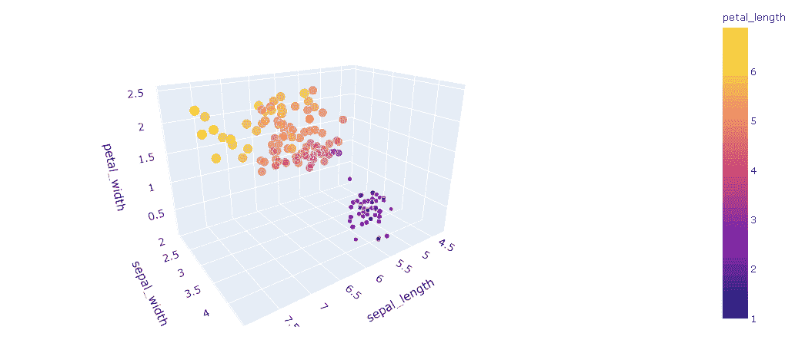

# 如何使用 Plotly 创建动态 3D 散点图

> 原文：<https://towardsdatascience.com/how-to-create-dynamic-3d-scatter-plots-with-plotly-6371adafd14?source=collection_archive---------28----------------------->

## 让你的数据技能更上一层楼。


[杰森 CS 陈](https://unsplash.com/@jcs_chen?utm_source=unsplash&utm_medium=referral&utm_content=creditCopyText)在 [Unsplash](https://unsplash.com/s/photos/view?utm_source=unsplash&utm_medium=referral&utm_content=creditCopyText) 上的照片

可视化比纯文本或数字更容易让人记住。可视化的信息力量是纯文本难以达到的。因此，可视化被广泛应用于数据科学领域。可视化的信息能力取决于它的结构。例如，3D 动态图比 2D 图更能说明问题。随着结构变得越来越复杂，我们可以用可视化来表示更多的信息。在将模型应用于数据之前，探索和理解原始数据中的结构是非常重要的。可视化是加速探索数据和帮助建立一个健壮的数据分析过程的很好的工具。

在本帖中，我们将创建动态 3D 散点图，并将它们与 2D 散点图进行比较。我们将使用 **Plotly Python** (plotly.py)，这是一个基于 plotly javascript (plotly.js)构建的开源绘图库。我喜欢 plotly.py 的一点是，它提供了一个高级 API ( **plotly express** )和一个低级 API ( **graph objects** )来创建可视化。使用 plotly express，我们可以用很少的代码行创建一个很好的情节。另一方面，我们需要用图形对象编写更多的代码，但是对我们创建的内容有更多的控制权。

让我们首先使用 numpy 和 pandas 创建一个合成数据集。我们从导入库开始。

```
import numpy as np
import pandas as pdimport plotly.express as px
```

我们创建了一个数据框架，其中包含属于两个不同类别的一些观察值的 3 个不同的数字特征。我们使用 numpy 数组来表示数字特征，使用 python 列表来创建类别列。

数字特征:

```
x = np.random.random(size=60)*7 + 1
y = np.random.random(size=60)*7 + 1
z = np.random.random(size=60)
z[-30:] = z[-30:]*5 + 2
```

分类特征:

```
categories = "A "*30 + "B "*30
categories = categories.split(" ")
categories.pop(60)
```

首先创建一个包含 30 个 a 和 30 个 b(中间有空格)的字符串，然后用空格分割该字符串以创建一个包含 30 个条目的列表。由于字符串末尾有一个空格，所以列表的最后一个元素是一个空格(“”)。我们使用`pop`方法移除它。

使用这 4 个数组，我们可以创建一个熊猫数据帧。

```
df = pd.DataFrame({
'cat':categories, 'col_x':x, 'col_y':y, 'col_z':z
})df.head()
```



让我们创建一个基于 x 列和 y 列的 2D 散点图

```
fig = px.scatter(df, x='col_x', y='col_y', color='cat',
                 width=700, height=500,
                 title="2D Scatter Plot")fig.show()
```

我们传递 dataframe 的名称、用作 x 轴和 y 轴的列。可选的**颜色**参数代表数据点的类别。



正如我们所看到的，类别 A 和 b 中的数据点之间没有明显的区别。在某些情况下，在可视化中增加一个特性就能说明很多问题。我们以这样一种方式创建数据帧，即“col_z”具有信息能力。

现在，让我们使用所有功能创建一个 3D 散点图。

```
fig = px.scatter_3d(df, x='col_x', y='col_y', z='col_z',
                    color='cat',
                    title="3D Scatter Plot")fig.show()
```



col_z 中的值清楚地区分了类别 A 和类别 b。当然，我们可以在 x 轴或 y 轴上使用 col_z，并通过 2D 散点图获得类似的结果。但是，在某些情况下，所有列都包含我们需要的有价值的信息。

让我们构建一个更复杂的数据框架，每个特征对分类都很重要。

特点:

```
x = np.random.random(size=100)*5
x[-30:] = x[-30:] + 6
x = x + np.random.random(size=100)*8y = np.random.random(size=100)*5
y[:30] = y[:30]*4 + 8
y = y + np.random.random(size=100)*3
y[-30:] = y[-30:] + 4z = np.random.random(size=100)*5
z[30:70] = z[30:70] - np.arange(1,41) / 40
z = z + np.random.random(size=100)*5categories = "A "*30 + "B "*40 + "C "*30
categories = categories.split(" ")
categories.pop(100)
```

数据帧:

```
df = pd.DataFrame({
'cat':categories, 'col_x':x, 'col_y':y, 'col_z':x
})df.head()
```



基于新功能的散点图:



`px.scatter_3d`的另一个重要参数是`size.` 到目前为止，我们创建的图中的点具有相同的大小。然而，我们也可以给`size` 参数分配一个特性。然后，数据点的大小根据该特征中的值而改变。

我们给`color` 参数分配了一个分类变量，因此数据点用不同的颜色表示。Plotly 还提供了对`color` 参数使用数字特征的选项。在这种情况下，点的颜色会根据比例发生变化。

让我们使用`size` 参数再创建一个 3D 散点图。我们将使用著名的“iris”数据集，它是 plotly 库中的内置数据集。

```
df_iris = px.data.iris()
df_iris.head()
```



```
fig = px.scatter_3d(
df_iris, x='sepal_length', y='sepal_width', z='petal_width',  color='petal_length',
size='petal_length', size_max=20
)fig.show()
```



还有一个参数增加了动态 3D 散点图的信息量，这就是`symbol`。它只接受一个分类变量，代表数据点的符号根据类别而变化。例如，类别 A 可以用正方形表示，而类别 B 可以用圆形表示。

一个动态的 3D 图承载了大量的信息。如果“一张图胜过千言万语”，这些 3D 动态图有可能达到 100 万字:)

感谢阅读。如果您有任何反馈，请告诉我。