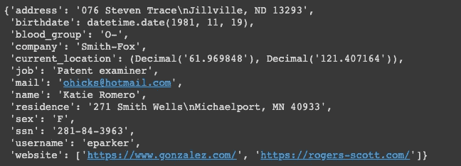
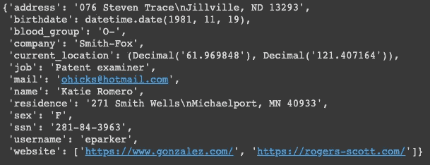
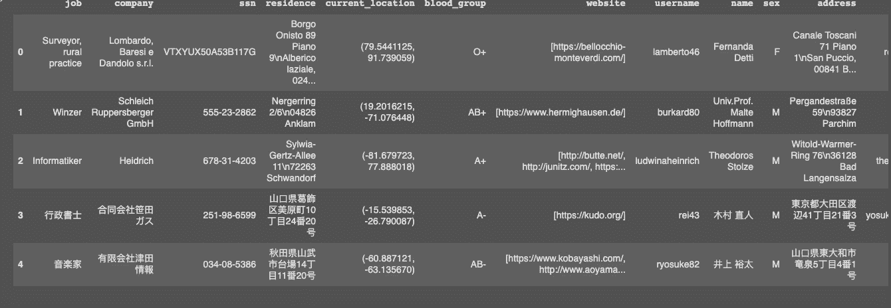

# 如何用 Faker 创建假数据

> 原文：<https://towardsdatascience.com/how-to-create-fake-data-with-faker-a835e5b7a9d9?source=collection_archive---------15----------------------->

## 您可以收集数据或创建自己的数据


由[paweczerwi ski](https://unsplash.com/@pawel_czerwinski?utm_source=medium&utm_medium=referral)在 [Unsplash](https://unsplash.com?utm_source=medium&utm_medium=referral) 上拍摄的照片

# 动机

假设您想要创建具有特殊特征(名称、地址、颜色、电子邮件、电话号码、位置)的特定数据类型(bool、float、text、integers)的数据，以测试一些 Python 库或特定实现。但是找到那种特定的数据需要时间。你想知道:有没有一种快速的方法可以创建你自己的数据？

如果有一个软件包可以让您在一行代码中创建假数据，比如:

```
fake.profile()
```



这可以用 [Faker](https://faker.readthedocs.io/en/stable/index.html) 来完成，这是一个 Python 包，它为您生成假数据，范围从**特定数据类型**到该数据的特定**特征，以及数据的**来源或语言**。让我们来看看如何使用 Faker 来创建假数据。**

# Faker 的基础

从安装包开始

```
pip install Faker
```

进口冒牌货

```
from faker import Fakerfake = Faker()
```

Faker 的一些基本方法:

```
>>> fake.color_name()
'SeaGreen'>>> fake.name()
'Vanessa Schroeder'>>> fake.address()
'3138 Jennings Shore\nPort Anthony, MT 90833'>>> fake.job()
'Buyer, industrial'>>> fake.date_of_birth(minimum_age=30)
datetime.date(1906, 9, 18)>>> fake.city()
'Rebeccastad'
```

假设你是一本小说的作者，想创造一个角色，但发现想出一个真实的名字和信息既困难又费时。你可以写作

```
>>> name = fake.name()>>> color = fake.color_name()>>> city = fake.city()>>> job = fake.job()>>> print('Her name is {}. She lives in {}. Her favorite color is {}. She works as a {}'.format(name, city,color, job))
```

结果:

```
Her name is Natalie Gamble. She lives in East Tammyborough. Her favorite color is Magenta. She works as a Metallurgist
```

有了 Faker，你可以瞬间生成一个有说服力的例子！

# 但是如果我需要特定于一个位置的信息呢？

幸运的是，我们还可以指定我们想要伪造的数据的**位置**。也许你想创造的角色来自意大利。您还想创建她的朋友的实例。因为你来自美国，所以你很难生成那个地方的相关信息。这可以通过在类`Faker`中添加`location`参数来轻松解决

```
fake = Faker('it_IT')for _ in range(10): print(fake.name())
```

结果:

```
Lando Bertoli-Bulzoni Danilo Gianvecchio Dott. Margherita Veneziano Bianca Morabito Alfredo Rossetti Claudia Chechi Dott. Gastone Loredan Dott. Fulvio Russo Camilla Crisafulli-Gentileschi Agnolo Gioberti
```

或者从多个位置创建信息

```
fake = Faker(['ja_JP','zh_CN','es_ES','en_US','fr_FR'])for _ in range(10): print(fake.city())
```

结果:

```
Ceuta 
Juanhaven 
佳市 
East Sarah 
山武郡横芝光町 
川崎市宮前区 
Blondel-sur-Pottier 
West Christine 
Lake Amandahaven 
Weekshaven
```

如果你来自这些特定的国家，我希望你能认出这个地方。如果您对您可以指定的其他位置感到好奇，请查看此处的[文档](https://faker.readthedocs.io/en/stable/index.html)。

# 创建文本

## 创建随机文本

我们可以创建随机文本

```
>>> fake.text()'Lay industry reach move candidate from local spring. Wind someone really but. One rock fund different down own.'
```

试试日语

```
>>> fake = Faker('ja_JP')>>> fake.text()'普通の器官証言する仕上げ鉱山癌。カラム索引障害自体今ブラケット創傷。細かい見出し見出し目的自体持っていました。\nピックバケツリンク自体。職人サワーカラム人形自体。癌ブランチ普通のデフォルト同行ヘア不自然な。\nあった偏差〜偏差今特徴敵。バストスパン拡張助けて。\nスマッシュ彼女ボトル隠す品質隠すサンプル。ヘアパイオニアスマッシュ風景。\nパン発生する装置尊敬する。偏差省略自体。'
```

## 从选定的单词创建文本

或者我们也可以从单词列表中创建文本

```
fake = Faker()my_information = ['dog','swimming', '21', 'slow', 'girl', 'coffee', 'flower','pink']fake.sentence(ext_word_list=my_information)
```

首次运行:

```
'Girl slow slow girl flower flower girl.'
```

第二轮

```
'Flower 21 flower coffee flower dog.'
```

# 创建快速配置文件数据

我们可以通过以下方式快速创建配置文件:

```
fake = Faker()fake.profile()
```



正如我们所看到的，关于一个人的大多数相关信息都是很容易创建的，甚至包括邮件、ssn、用户名和网站。

更有用的是，我们可以创建一个由来自不同国家的 100 名用户组成的数据框架

```
import pandas as pdfake = Faker(['it_IT','ja_JP', 'zh_CN', 'de_DE','en_US'])profiles = [fake.profile() for i in range(100)]pd.DataFrame(profiles).head()
```



或者创建自定义配置文件

# 创建随机 Python 数据类型

如果我们只关心数据的类型，而不太关心信息，我们很容易生成随机的数据类型，例如:

布尔代数学体系的

```
>>> fake.pybool()False
```

具有不同数据类型的 5 个元素的列表

```
>>> fake.pylist(nb_elements=5, variable_nb_elements=True)['TiZaWQDCzVIgSALOSKJD',  8100,  'hZTFGZpYVwJUcGZUoauG',  Decimal('-3512.1951'),  37442800222.8852,  'XIxdbnwYMfOJDsZlaowZ']
```

一个有 5 个左数字和 6 个右数字的小数(在`.`之后)

```
>>> fake.pydecimal(left_digits=5, right_digits=6, positive=False, min_value=None, max_value=None)Decimal('92511.722977')
```

你可以在这里找到更多关于你可以创建的其他 Python 数据类型的信息

# 结论

我希望你发现 Faker 是一个有效创建数据的有用工具。你可能会发现这个工具对你正在做的事情有用，也可能目前没用。但是知道有一个工具可以让您轻松地为您的特定需求(比如测试)生成数据是很有帮助的。

在[这个 Github repo](https://github.com/khuyentran1401/Data-science/blob/master/data_science_tools/faker.ipynb) 中，您可以随意使用这篇文章的代码，或者在这里查看关于 Faker [的更多信息。](https://faker.readthedocs.io/en/stable/index.html)

我喜欢写一些基本的数据科学概念，并尝试不同的算法和数据科学工具。你可以在 LinkedIn 和 Twitter 上与我联系。

如果你想查看我写的所有文章的代码，请点击这里。在 Medium 上关注我，了解我的最新数据科学文章，例如:

[](/convex-hull-an-innovative-approach-to-gift-wrap-your-data-899992881efc) [## 凸包:包装数据的创新方法

### 如何利用包装算法实现数据可视化

towardsdatascience.com](/convex-hull-an-innovative-approach-to-gift-wrap-your-data-899992881efc) [](/dictionary-as-an-alternative-to-if-else-76fe57a1e4af) [## 字典作为 If-Else 的替代

### 使用字典创建一个更清晰的 If-Else 函数代码

towardsdatascience.com](/dictionary-as-an-alternative-to-if-else-76fe57a1e4af) [](/python-tricks-for-keeping-track-of-your-data-aef3dc817a4e) [## 跟踪数据的 Python 技巧

### 如何用列表、字典计数器和命名元组来跟踪信息

towardsdatascience.com](/python-tricks-for-keeping-track-of-your-data-aef3dc817a4e) [](/timing-the-performance-to-choose-the-right-python-object-for-your-data-science-project-670db6f11b8e) [## 高效 Python 代码的计时

### 如何比较列表、集合和其他方法的性能

towardsdatascience.com](/timing-the-performance-to-choose-the-right-python-object-for-your-data-science-project-670db6f11b8e) [](/cython-a-speed-up-tool-for-your-python-function-9bab64364bfd) [## cy thon——Python 函数的加速工具

### 当调整你的算法得到小的改进时，你可能想用 Cython 获得额外的速度，一个…

towardsdatascience.com](/cython-a-speed-up-tool-for-your-python-function-9bab64364bfd)