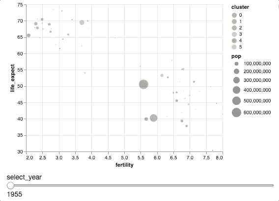
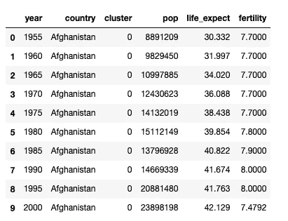
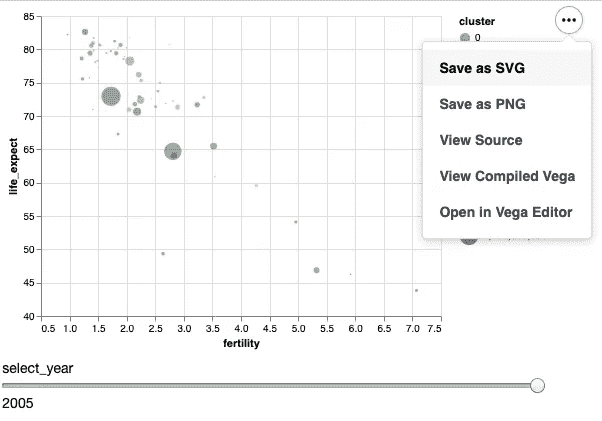

# 如何用 Altair 创建交互式剧情

> 原文：<https://towardsdatascience.com/how-to-create-interactive-and-elegant-plot-with-altair-8dd87a890f2a?source=collection_archive---------14----------------------->

## 在 5 行简单的 Python 代码中利用您的数据分析

# 牛郎星是什么？

您是否曾经想要通过放大来仔细查看您的数据，突出显示感兴趣的点，或者使用滚动条来查看数据如何随时间变化？通过对静态图有更多的控制，你会发现你可以对数据有更多的了解。

但是你可以想象创造一个互动的情节一定很有挑战性。所以你决定不参与互动部分。如果有一个 python 库可以让你用几行 Python 代码就能做到这一点，那会怎么样呢？



上图是用 Altair 创建的。 [Altair](https://altair-viz.github.io/) 是 Python 的统计可视化库，基于 Vega 和 Vega-Lite。Altair 提供了强大而简洁的可视化语法，用于快速构建各种各样的统计图形。您只需要声明数据字段、颜色、大小等之间的链接，而让其余的绘图细节自动处理。有了 Altair，你可以**花更多的时间** **理解你的数据和它的意义，而不是找出代码。**

# 开始

安装 Altair

```
$ pip install altair
```

Altair 可以和示例数据集一起安装在 [vega_datasets](https://github.com/altair-viz/vega_datasets) 中:

```
$ pip install altair vega_datasets
```

在 Jupyter 笔记本上导入 Altair

```
import altair as alt
import pandas as pd
```

Altair 中的一些数据集是围绕熊猫数据框架建立的。这是什么意思？这意味着你可以在 Altair 中操作数据，就像你处理熊猫数据帧一样。

我们将使用 vega_data 中的 gapminder 数据来显示一些国家 1995 年至 2005 年期间的全球健康和人口数据。

```
from vega_datasets import data as vega_data
gap = pd.read_json(vega_data.gapminder.url)gap.head(10)
```



找出此数据中有多少独特的年份:

```
>>> gap.year.unique()array([1955, 1960, 1965, 1970, 1975, 1980, 1985, 1990, 1995, 2000, 2005])
```

既然我们最感兴趣的是最新的数据，那就让我们看看 2005 年的数据吧。

```
gap2005 = gap.loc[gap['year'] == 2005]
```

# 形象化

## 指定 X 轴和 Y 轴

我们对生育率和预期寿命之间的相关性很好奇。所以我们指定了我们想要用`mark_point()`绘制的图的类型，以点的形式显示数据。我们还可以使用`mark_*`以其他几何形状呈现数据

```
alt.Chart(gap2005).mark_point().encode(
    alt.X('fertility'),
    alt.Y('life_expect')
)
```

看起来数据不在图表的中心。通常我们需要用`matplotlib`来指定比例，但是用牛郎星，你只需要用`scale`的方法

## 调整比例

不错！但是如果我们想知道人口数量与生育率和预期寿命的关系呢？我们可以利用另一个维度:**大小**

太棒了。左侧的图例给出了每个圆圈大小的含义。我们能增加另一个维度吗？绝对的！x 轴，y 轴，尺寸，我们遗漏了什么？**颜色**！

## 添加颜色维度并指定数据类型

正如您在上面看到的，我们还可以指定数据的**类型:**N-名义(类别名称)、Q-数量(数字数据)、O-序数(有序数据)或 T-时间(时间点或时间间隔)。在上面的代码中，因为我想将聚类解释为类别数据，所以我使用了`:N`

为了让我们的圆圈看起来更好，我们用`filled=True.`填充颜色，用`alt.OpacityValue(0.5)`添加一些不透明度来看大点后面的小点

## 显示每个点的信息

但是图中有很多点。有没有一种方法，当我们**点击每一个点**来显示关于国家、生育率和预期寿命的信息？是的，当然。这可以通过添加`Tooltip`来完成

能够看到每个点上的信息是很好的。但是如果我们想一次看到多个点的信息呢？不用再等了，让我们直接跳到如何用 Altair 创造一个互动的剧情！

# 互动情节

## 选择单点

`Selection_single()`使我们能够**点击一个点来突出显示它**。当我们单击该点时，我们希望其他点变得与灰色无关。这可以通过`alt.condition()`完成

现在，我们可以查看感兴趣点的信息，而不会被其他点分散注意力

## 选择多个点

但是我们可能同时对几个点感兴趣。或者更好，到**选择一个区间**的点。两者都可以用`selection_multi()`和`selection_interval()`来完成

因为我们想一次尝试不同的选择工具，所以让我们创建一个函数来完成它。

现在使用`alt.hconcat()`尝试不同的选择，并连接这些选择的图形

## 时间间隔

我们已经看到了 2005 年的数据。如果我们想看到数据随时间的变化呢？通过为`alt.selection_single`添加更多的条件，例如`name=’select’, fields = [‘year’]`、初始年份`init={‘year’: 1955}` 和范围`bind=alt.binding_range(min=1955, max=2005, step=5)`，可以很容易地做到这一点

不错！现在，通过在`select-year`栏上拖动鼠标，我们可以很容易地看到数据随时间的变化

# 保存情节



创建图形后，我们希望从图形中得到的最后一个函数是什么？保存我们的图表以展示我们的网站或社交媒体！这可以通过点击图表左上角的按钮轻松完成。

# 结论

恭喜你！您已经学习了如何利用 Altair 进行高效的数据分析。这篇文章并没有详尽地涵盖你可以用 Altair 做的所有事情，比如创建一个**堆叠条形图、热图、面积图、地图**或其他交互功能。你可以在这里找到更多关于牛郎星图书馆[的信息，或者关注](https://altair-viz.github.io/gallery/index.html) [Github 教程](https://github.com/uwdata/visualization-curriculum)。我最希望你从这篇文章中得到的是:用 Python 创建一个**有趣而漂亮的图形**可以是**难以置信的简单和有趣！**

在[这个 Github repo](https://github.com/khuyentran1401/Data-science/blob/master/visualization/altair/altair.ipynb) 中，您可以随意使用本文的代码。

我喜欢写一些基本的数据科学概念，并尝试不同的算法和数据科学工具。你可以在 LinkedIn 和 Twitter 上与我联系。

如果你想查看我写的所有文章的代码，请点击这里。在 Medium 上关注我，了解我的最新数据科学文章，例如:

[](/how-to-learn-data-science-when-life-does-not-give-you-a-break-a26a6ea328fd) [## 当生活不给你喘息的机会，如何学习数据科学

### 我努力为数据科学贡献时间。但是发现新的策略使我能够提高我的学习速度和…

towardsdatascience.com](/how-to-learn-data-science-when-life-does-not-give-you-a-break-a26a6ea328fd) [](/what-graphical-excellence-is-and-how-to-create-it-db02043e0b37) [## 什么是卓越的图形以及如何创建它

### 作为一名数据科学家，了解如何制作重要的图表至关重要

towardsdatascience.com](/what-graphical-excellence-is-and-how-to-create-it-db02043e0b37) [](/dictionary-as-an-alternative-to-if-else-76fe57a1e4af) [## 字典作为 If-Else 的替代

### 使用字典创建一个更清晰的 If-Else 函数代码

towardsdatascience.com](/dictionary-as-an-alternative-to-if-else-76fe57a1e4af) [](/maximize-your-productivity-with-python-6110004b45f7) [## 使用 Python 最大化您的生产力

### 你创建了一个待办事项清单来提高效率，但最终却把时间浪费在了不重要的任务上。如果你能创造…

towardsdatascience.com](/maximize-your-productivity-with-python-6110004b45f7) [](/python-tricks-for-keeping-track-of-your-data-aef3dc817a4e) [## 跟踪数据的 Python 技巧

### 如何用列表、字典计数器和命名元组来跟踪信息

towardsdatascience.com](/python-tricks-for-keeping-track-of-your-data-aef3dc817a4e) 

# 参考

赫尔，杰佛里。github:[https://github.com/uwdata/visualization-curriculum](https://github.com/uwdata/visualization-curriculum)。2017 年 1 月。