# 如何用 Python 创建交互式可视化

> 原文：<https://towardsdatascience.com/how-to-create-interactive-visualisations-in-python-4af42cf83ba4?source=collection_archive---------23----------------------->

## Plotly express 简介

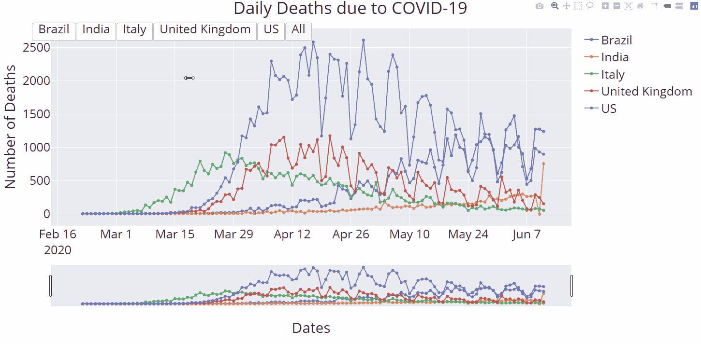

在这个博客中，我们将学习如何用 Python 创建交互式可视化。在探索添加更多的交互式控件之前，我们将从仅仅用不同的格式绘制数据开始。

如果你已经关注我一段时间了，你会注意到这是数据可视化系列的第三篇文章。我们首先介绍了使用默认 python 可视化库 matplotlib 的数据可视化。然后我们学习了如何使用同一个库创建一个时间序列的动画可视化。

[](/learn-how-to-create-animated-graphs-in-python-fce780421afe) [## 了解如何用 Python 创建动画图形

### 动画数据可视化的基础

towardsdatascience.com](/learn-how-to-create-animated-graphs-in-python-fce780421afe) 

今天，我们将学习如何使用 Plotly express。Plotly 允许用户在开箱即用的可视化界面上进行交互，并且更容易与网络内容集成。

# plotly express 简介

Plotly express 是 plotly wrapper，它允许更简单的语法。

> 受 Seaborn 和 ggplot2 的启发，它专门设计了一个简洁、一致和易于学习的 API:只需一个导入，只需一个函数调用就可以制作丰富的交互式绘图，包括分面、地图、动画和趋势线。

如果你想了解更多，可以去 Plotly 的[官方媒体岗位](https://medium.com/plotly/introducing-plotly-express-808df010143d)看看。

只需两行代码，你就可以拥有一个看起来很酷的交互式图形。这很简单，因为:

```
import plotly.express as pxfig = px.line(x='x data set', y= 'y data set')fig.show()
```

# 获取和准备数据

就像我们在 Python 中的数据可视化系列的前几篇文章中所做的一样，我们将使用新冠肺炎数据。虽然在这篇博客中，我们不会涉及熊猫的运作，这些运作引导我们去获取和格式化我们的数据，如果你想进一步了解它，请阅读[这篇文章](/the-basics-of-data-visualisation-with-python-23188aa9fc1a)。

我们将使用以下数据代码来获取和格式化我们的数据:

```
import plotly.express as px
import numpy as np
import pandas as pdurl = '[https://raw.githubusercontent.com/CSSEGISandData/COVID-19/master/csse_covid_19_data/csse_covid_19_time_series/time_series_covid19_deaths_global.csv'](https://raw.githubusercontent.com/CSSEGISandData/COVID-19/master/csse_covid_19_data/csse_covid_19_time_series/time_series_covid19_deaths_global.csv')
df = pd.read_csv(url, delimiter=',', header='infer')
df_interest = df.loc[
    df['Country/Region'].isin(['United Kingdom', 'US', 'Italy', 'Brazil', 'India'])
    & df['Province/State'].isna()]
df_interest.rename(
    index=lambda x: df_interest.at[x, 'Country/Region'], inplace=True)
df1 = df_interest.transpose()
df1 = df1.drop(['Province/State', 'Country/Region', 'Lat', 'Long'])
df1 = df1.loc[(df1 != 0).any(1)]
df1.index = pd.to_datetime(df1.index)df1 = df1.diff() #day on day changes
```

# 创建图表

## 线形图

要在图上添加一行，我们实际上需要两行代码:

```
fig = px.line(x=df1.index, y= df1[df1.columns[0]],title = 'Daily Deaths due to COVID-19', name = df1.columns[0])fig.show()
```

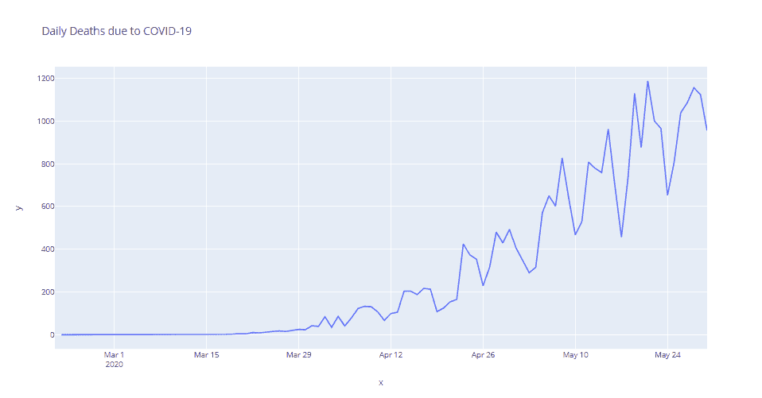

简单线图

要添加更多的行，我们需要。add_scatter()属性。使用一个循环，我们可以添加范围内的所有国家。

```
fig = px.line()for i,n in enumerate(df1.columns):
    fig.add_scatter(x=df1.index, y= df1[df1.columns[i]], name= df1.columns[i])
```

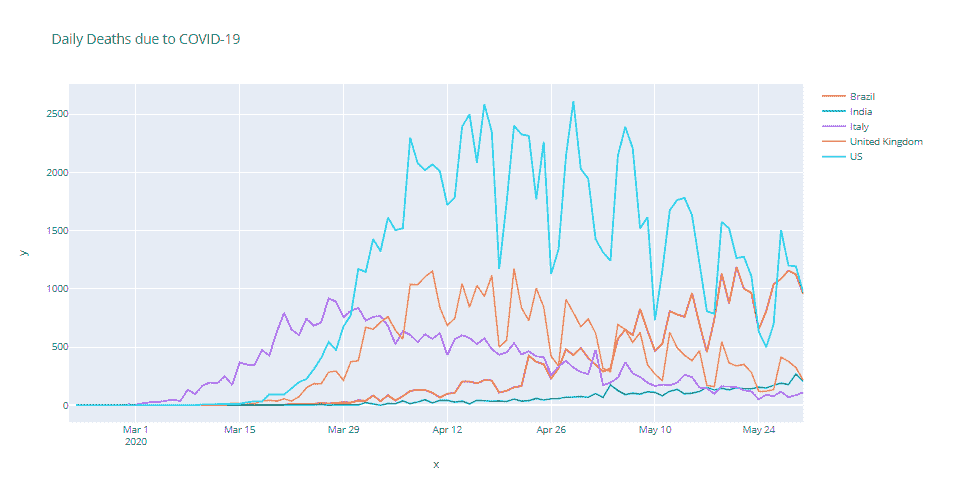

多线绘图

最后，我们可以考虑给我们的图表增加一些细节。我个人喜欢在图中突出显示不同的数据点。

```
fig.update_traces(mode='markers+lines')
```

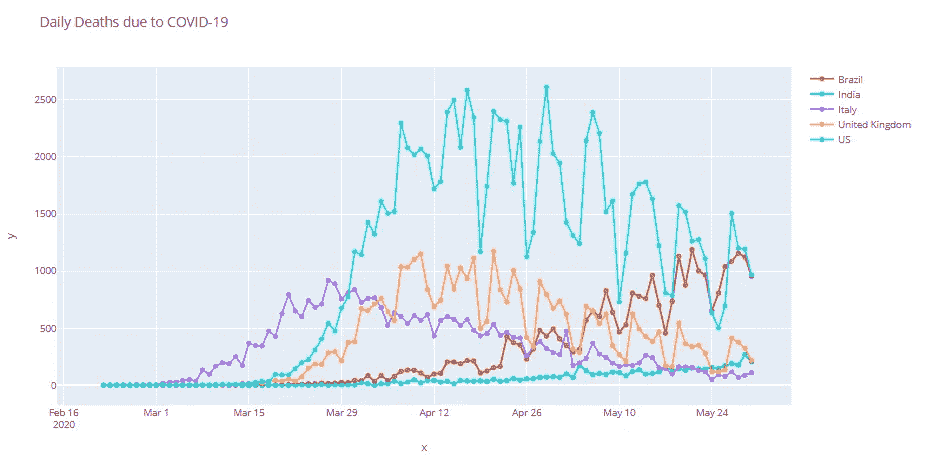

带标记的图表

最后但同样重要的是，添加相关的轴标签，设置字体大小并替换默认模板。

```
fig.update_layout(
    title = 'Daily Deaths due to COVID-19'
    ,xaxis_title = 'Dates'
    ,yaxis_title = 'Number of Deaths'
    ,font = dict(size = 25)
    ,template = 'plotly_dark' #"plotly", "plotly_white", "plotly_dark", "ggplot2", "seaborn", "simple_white", "none"
)
```

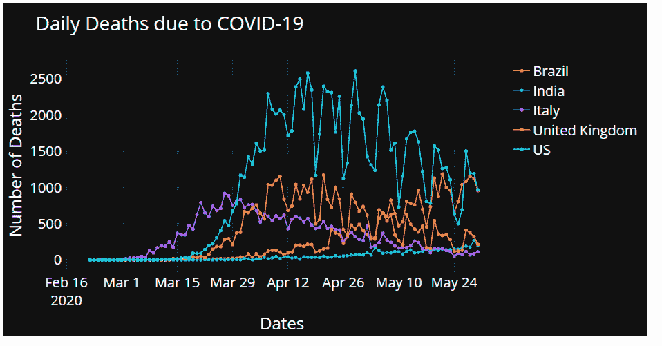

## 条形图

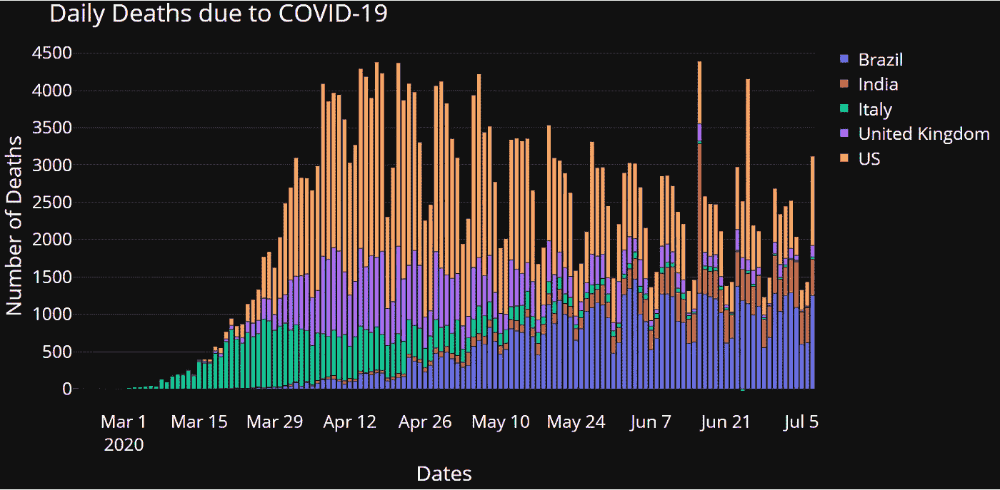

与我们之前看到的方式非常相似，条形图可以很快地组合在一起:

```
fig = px.bar()for i,n in enumerate(df1.columns):
    fig.add_bar(x=df1.index, y= df1[df1.columns[i]], name= df1.columns[i])fig.update_layout(
    title = 'Daily Deaths due to COVID-19'
    ,xaxis_title = 'Dates'
    ,yaxis_title = 'Number of Deaths'
    ,font = dict(size = 25)
    ,template = 'plotly_dark' #"plotly", "plotly_white", "plotly_dark", "ggplot2", "seaborn", "simple_white", "none"
)fig.show()
```

## 饼图

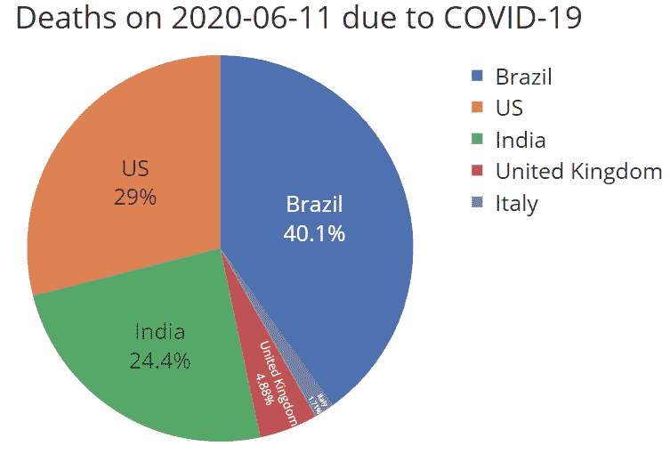

和以前一样，唯一的不同是我们将只显示时间序列中最近的一天。

```
df1 = df1.tail(1).transpose()
fig = px.pie(df1, values = str(df1.columns[0]), names = df1.index)
fig.update_traces(textposition='inside', textinfo = 'percent+label')ddate = str(df1.columns[0])[:10] #chop timestampfig.update_layout(
    title = f'Deaths on {ddate} due to COVID-19'
    ,xaxis_title = 'Dates'
    ,yaxis_title = 'Number of Deaths'
    ,font = dict(size = 25)
    ,template = 'seaborn' #"plotly", "plotly_white", "plotly_dark", "ggplot2", "seaborn", "simple_white", "none"
)fig.show()
```

# 交互式控件

既然我们已经看到了如何快速地将不同类型的观想放在一起，现在是我们用交互控制来增强我们的观想的时候了！

## 范围滑块

首先，用一行代码，我们将添加一个范围滑块——一个漂亮的控件，允许用户关注时间序列的特定部分。

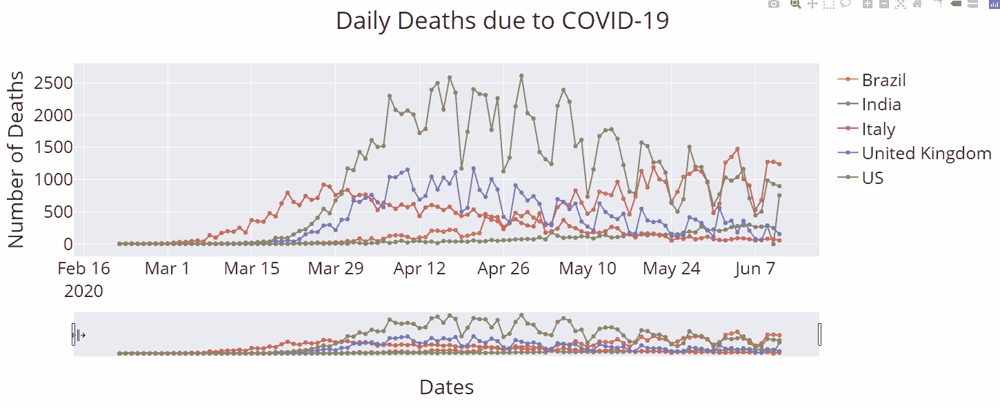

```
fig.update_xaxes(rangeslider_visible=True)
```

## 距离焦点

如果我们的用户总是关注时间序列中的某些片段，那该怎么办？然后我们就可以直接构建那些控件了！

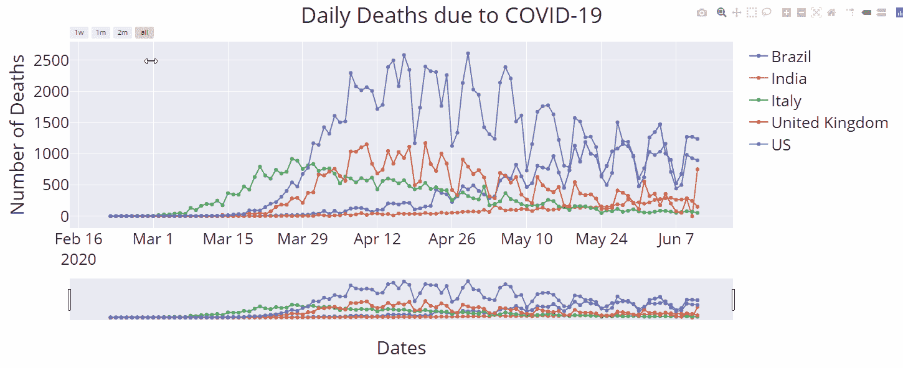

```
fig.update_xaxes(
    rangeslider_visible=True,
    rangeselector=dict(
        buttons=list([
            dict(count=7, label="1w", step="day", stepmode="backward"),
            dict(count=1, label="1m", step="month", stepmode="backward"),
            dict(count=2, label="2m", step="month", stepmode="backward"),
            dict(step="all")
        ]),
        font = dict( color='#008000', size = 11),
    )
)
```

## 自定义按钮

体验过前面一组关于焦点范围的功能后，很容易想象构建自定义按钮。Plotly express 以一种简单的方式迎合了这一点。让我们来看一下自定义按钮，这些按钮允许我们关注各个国家。

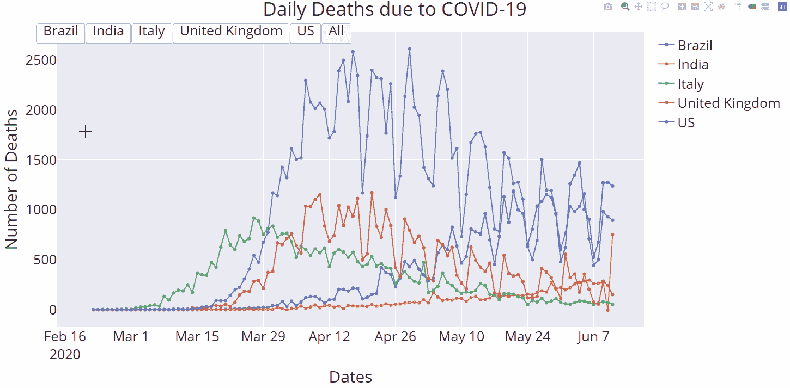

```
fig.update_layout(
    updatemenus=[
        dict(
            type="buttons",
            direction="right",
            active=0,
            x=0.5,
            y=1.03,
            buttons=list([
                dict(label=df1.columns[0],
                     method="update",
                     args=[ {"visible": [True, False, False, False, False]},
                            {'showlegend' : True}
                        ]),
                dict(label=df1.columns[1],
                     method="update",
                     args=[ {"visible": [False, True, False, False, False]},
                            {'showlegend' : True}
                     ]),
                dict(label=df1.columns[2],
                     method="update",
                     args=[ {"visible": [False, False, True, False, False]},
                            {'showlegend' : True}
                        ]),
                dict(label=df1.columns[3],
                     method="update",
                     args=[ {"visible": [False, False, False, True, False]},
                            {'showlegend' : True}
                     ]),
                dict(label=df1.columns[4],
                     method="update",
                     args=[ {"visible": [False, False, False, False, True]},
                            {'showlegend' : True}
                           ]),
                dict(label='All',
                     method="update",
                     args=[ {"visible": [True, True, True, True, True]},
                            {'showlegend' : True}
                           ]),
            ]),
        )
    ]
)
```

## 下拉菜单

获得下拉菜单就像注释掉上一节中的一行一样简单。你所需要做的就是注释掉“type='buttons '”，给你:

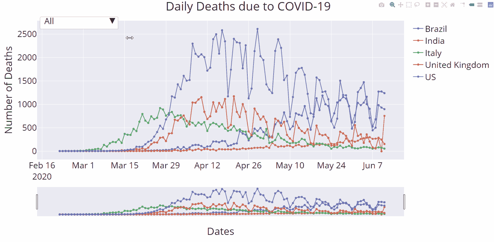

# 结论

Plotly express 绝对是一个非常棒的数据可视化工具，它非常容易上手，使用起来也非常 pythonic 化。在这篇博客中，我们仅仅触及了它所提供的一些皮毛。我非常鼓励你进一步探索这个库，因为可能性真的是无穷无尽的！

如果您觉得这篇文章很有趣，您可能也会喜欢:

[](/the-basics-of-data-visualisation-with-python-23188aa9fc1a?source=your_stories_page---------------------------) [## Python 数据可视化基础

### 在这篇博客中，我们将学习如何获取、转换并最终吸引人地呈现数据。我们要去工作了…

towardsdatascience.com](/the-basics-of-data-visualisation-with-python-23188aa9fc1a?source=your_stories_page---------------------------) [](/building-a-python-ui-for-comparing-data-13c10693d9e4) [## 构建用于比较数据的 Python UI

### 如何快速让您的非技术团队能够比较数据

towardsdatascience.com](/building-a-python-ui-for-comparing-data-13c10693d9e4) [](https://medium.com/better-programming/estimating-a-software-deadline-is-really-hard-lets-talk-about-why-44687a6baf9d) [## 估算一个软件的最后期限真的很难——让我们来谈谈为什么

### 规划时你需要知道的 5 条法则

medium.com](https://medium.com/better-programming/estimating-a-software-deadline-is-really-hard-lets-talk-about-why-44687a6baf9d)