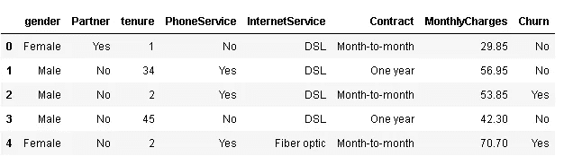
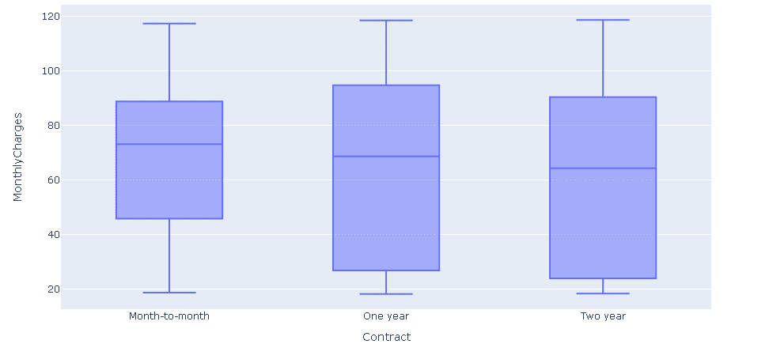
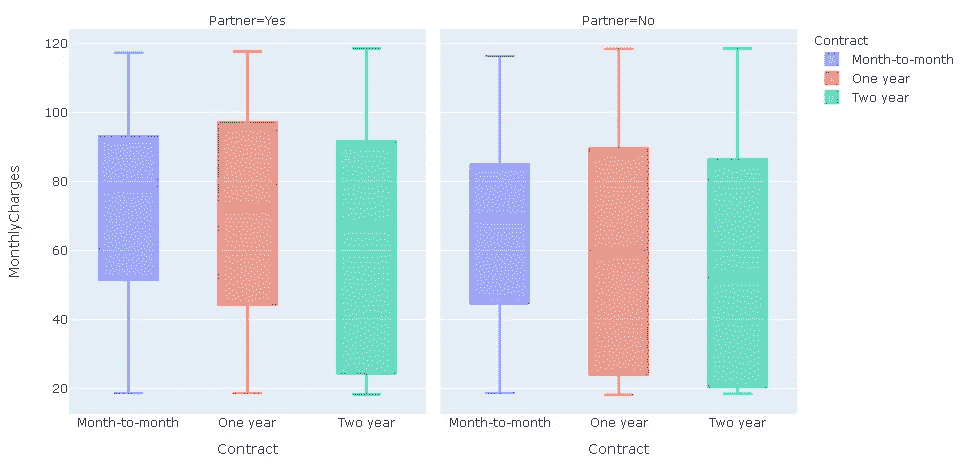
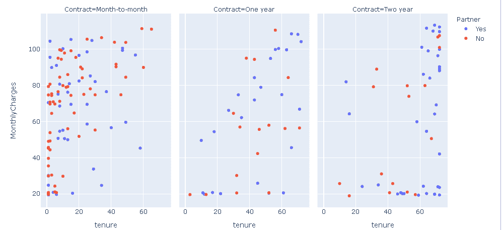
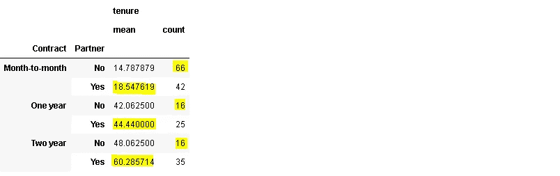
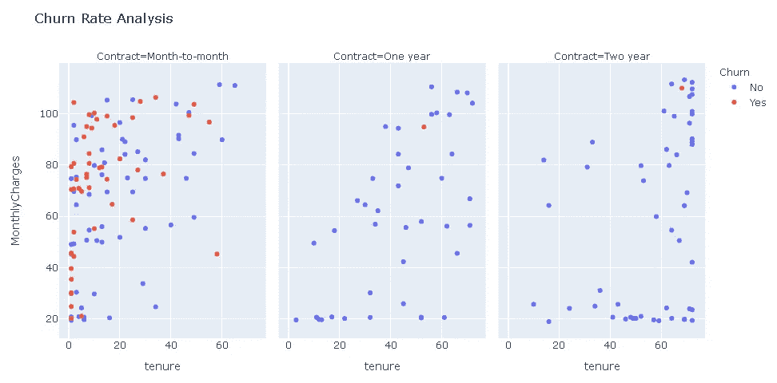
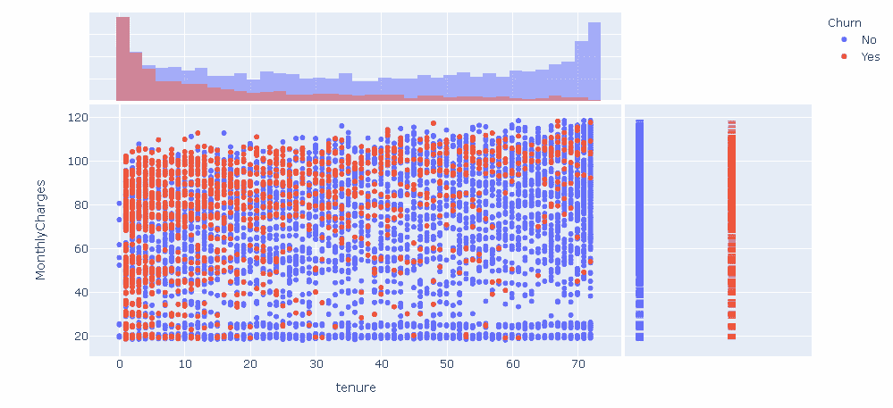
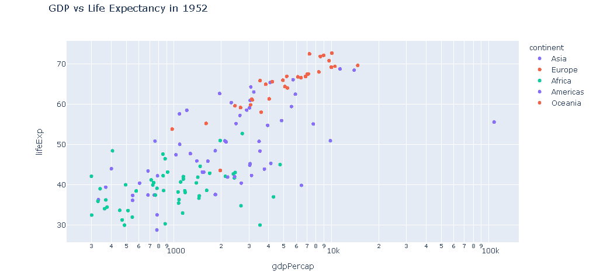
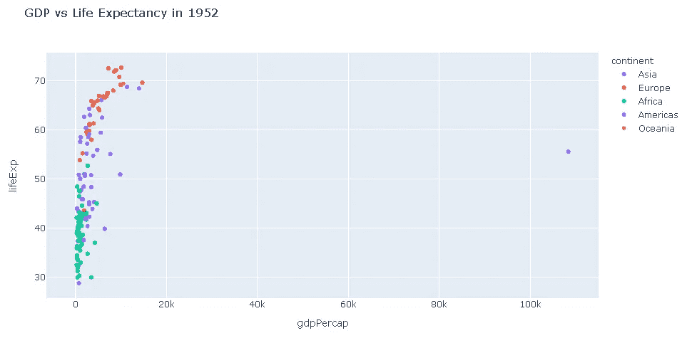
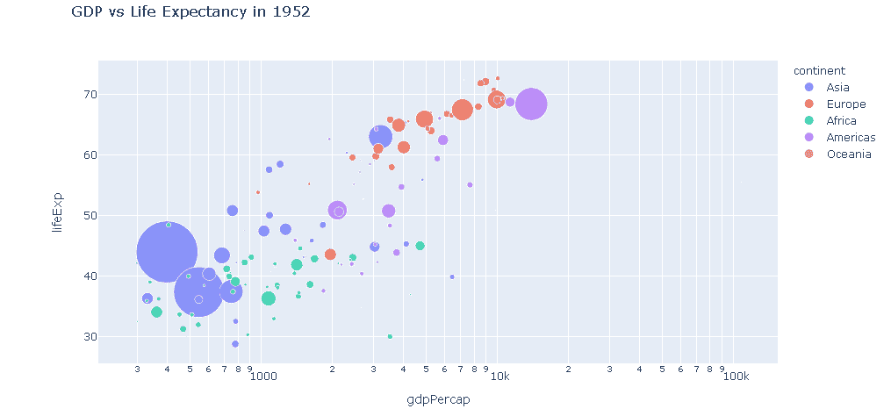

# 如何使用 Plotly Express 创建交互式可视化

> 原文：<https://towardsdatascience.com/how-to-create-interactive-visualizations-with-plotly-express-a43bd4c6231b?source=collection_archive---------59----------------------->

## 有许多例子的实用指南

Plotly Python (plotly.py)是一个基于 plotly javascript (plotly.js)构建的开源绘图库。Plotly express 是 plotly.py 的一个高级接口，它允许我们创建许多交互式和信息可视化。

在这篇文章中，我们将一步一步地增加复杂程度，同时浏览许多例子。我们将探究添加到可视化中的每个特征/结构的效果。

如果您的工作环境中没有安装 plotly.py，您可以使用 pip 或 conda 进行安装:

```
$ pip install plotly==4.8.0$ conda install -c plotly plotly=4.8.0
```

先来导入 plotly express:

```
import plotly.express as px
```

对于示例，我们将使用两个不同的数据集。一个是 kaggle 上的“电信客户流失”数据集。另一个是 gapminder 数据集，可在 plotly 库中找到。plotly 的这些内置数据集对于练习来说很方便。

流失预测是机器学习领域的一个常见用例。如果你不熟悉这个术语，churn 的意思是“离开公司”。对于一个企业来说，了解客户可能流失的原因和时间是非常重要的。拥有一个强大而准确的客户流失预测模型有助于企业采取措施防止客户离开公司。我们将尝试探索数据集，并了解数据集的底层结构。原始数据集包含 7043 个客户的 20 个特征(自变量)和 1 个目标(因变量)。在这篇文章中，我们将只使用 7 个特性和目标变量。

```
churn = pd.read_csv("Telco-Customer-Churn.csv")churn = churn[['gender', 'Partner', 'tenure', 'PhoneService', 'InternetService', 'Contract', 'MonthlyCharges','Churn']]
churn.head()churn.head()
```



我们从一个基本的箱线图开始，根据合同类型检查每月费用的分布:

```
fig = px.box(churn, x="Contract", y="MonthlyCharges")fig.show()
```



箱线图越高，数值越分散。该图告诉我们，长期合同的月费用范围更大。我们可以通过将鼠标悬停在最小值、第一个四分位数、中值、第三个四分位数和最大值的可视化图形上来查看箱形图的临界值。

我们可以通过**颜色**参数对不同的组使用不同的颜色，还可以添加一个额外的变量用于比较 **facet_col** 参数。

```
fig = px.box(churn, x="Contract", y="MonthlyCharges", 
             color="Contract", facet_col='Partner')fig.show()
```



看起来有一个合作伙伴并没有显著改变合同类型。

散点图也常用于理解变量之间的关系。为了演示清楚，我将采用数据集的前 200 行。

```
churn_filtered = churn.iloc[:200,:]
```

我们可以检查任期和月费之间的关系，以及这种关系如何根据合同类型和是否有合作伙伴而变化。保有权变量是客户成为客户的月数。

```
fig = px.scatter(churn_filtered, 
                 x="tenure", y="MonthlyCharges", 
                 color='Partner',
                 facet_col="Contract", facet_col_wrap=3)
fig.show()
```

基于指定的变量创建支线剧情。 **Facet_col_wrap** 参数调整支线剧情的排列。



这个图告诉我们的是，没有合作伙伴的客户倾向于按月签约。此外，有合作伙伴的客户在公司停留的时间更长(任期更长)。这是原始数据集的子集，但是根据这 200 行，公司销售的逐月合同比一年或两年合同多。图中的每个点代表一个客户，我们可以通过悬停在该点上来查看数据。

我们也可以通过使用 groupby 函数检查平均值来确认我们的直觉:

```
churn_filtered[['Contract','Partner','tenure']].groupby(['Contract','Partner']).mean()
```



对于每种合同类型，有合作伙伴的客户的任期更长。此外，没有合作伙伴的客户数量在逐月合同细分市场中更多。

让我们来看看每月费用、合同类型和任期方面的流失率。我们还为情节添加了一个标题:

```
fig = px.scatter(churn_filtered, x="tenure", y="MonthlyCharges", 
                 color='Churn',
                 facet_col="Contract", facet_col_wrap=3,
                 title= "Churn Rate Analysis")fig.show()
```



正如我们在上面的图表中看到的，拥有长期合同的客户不太可能流失(即离开公司)。如果公司想留住客户，首要任务应该是签订长期合同。

我们还可以使用 **marginal_x** 和 **marginal_y** 参数向散点图添加分布指示。这次让我们绘制整个数据集，并检查我们的 200 行样本是否真正很好地代表了整体:

```
fig = px.scatter(churn, 
                 x="tenure", y="MonthlyCharges", 
                 color="Churn", 
                 marginal_y="rug", marginal_x="histogram")fig.show()
```



我们先来评价一下 x 轴。对于少于 10 个月的任期，red points(流失=是)占主导地位。随着任期的不断延长，蓝点(流失=无)正在成为主导类别。我们还可以在散点图上方的直方图中看到这一点。它显示了红点和蓝点的分布如何根据 x 轴上的位置而变化。大多数流失的客户任期不到 10 个月。

y 轴表示每月费用。散点图中红点的密度随着 y 轴的上升而增加(即每月费用增加)。这也可以在散点图右侧的地毯图上看到。水平线的密度在上部更密集。除了底部之外，蓝点的密度比红点更均匀。

Ploty express 提供了许多数据集来练习。我们可以很容易地将这些数据集加载到熊猫数据框架中。例如， **gapminder** 数据集包括 142 个国家 12 年的人均 gdp(不连续)。该数据集还包含这些年各国的预期寿命和人口。

```
gap_df = px.data.gapminder()gap_df.head()
```


我们来绘制一下 1952 年的人均寿命和人均 gdp。Plotly express 允许在使用**查询**方法创建绘图时过滤数据帧:

```
fig = px.scatter(gap_df.query("year==1952"), 
                 x="gdpPercap", y="lifeExp",
                 hover_name="country",
                 color="continent", log_x=True
                 title="GDP vs Life Expectancy in 1952")
fig.show()
```

通过将 **hover_name** 参数设置为“country ”,我们能够在点上看到国家的名称。



总的来说，非洲国家的人均国内生产总值较低，欧洲国家的人均国内生产总值处于最高区域。科威特是个异数，人均 gdp 超过 10 万。你可能已经注意到了 x 轴上的对数刻度。我们通过将 **log_x** 参数设置为 True 来实现它，这使得绘图看起来更好。如果没有 log_x 参数，该图将如下所示:



我们也可以使用**大小**参数来表示图中的另一个变量。例如，如果我们设置 size="pop "，那么点数的大小就与国家的人口数成比例。

```
fig = px.scatter(gap_df.query("year==1952"), 
                 x="gdpPercap", y="lifeExp",
                 hover_name="country",
                 color="continent", log_x=True,
                 size="pop", size_max=50,
                 title="GDP vs Life Expectancy in 1952")
fig.show()
```



我们已经用 plotly express 介绍了一些基本的可视化类型。当然，这只是这个神奇的图书馆的一小部分功能。我们可以使用 plotly 动态创建许多其他绘图类型。它的语法也很容易理解。在接下来的帖子中，我会尝试涵盖更复杂的情节。你也可以查看 plotly 文档，我认为它有很多不同的例子。就像任何其他主题一样，熟悉 plotly 的最好方法就是实践。因此，我建议创造大量的情节来提高你的技能。

感谢您的阅读。如果您有任何反馈，请告诉我。