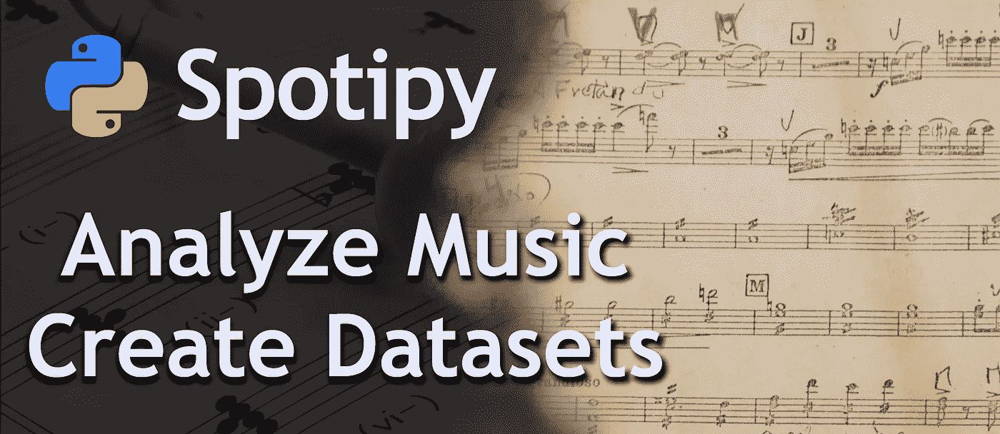
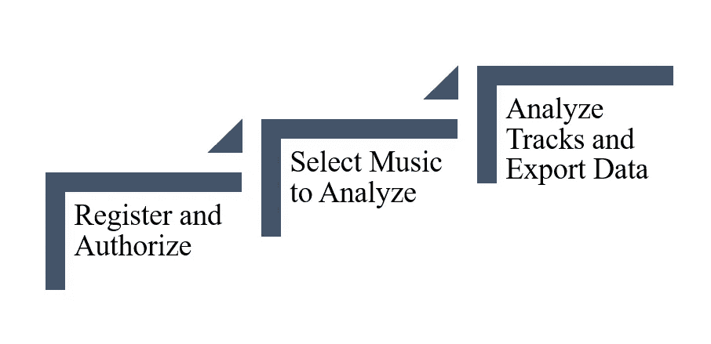
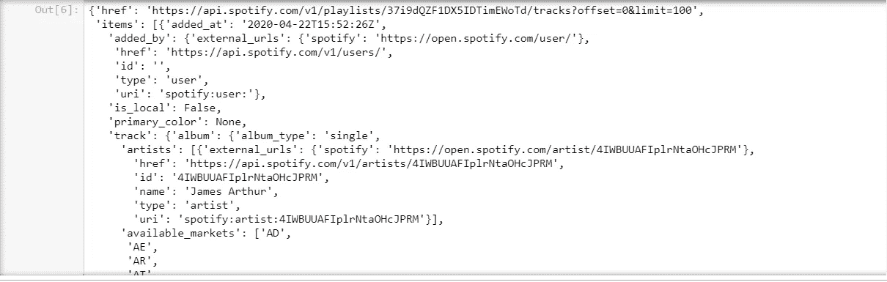
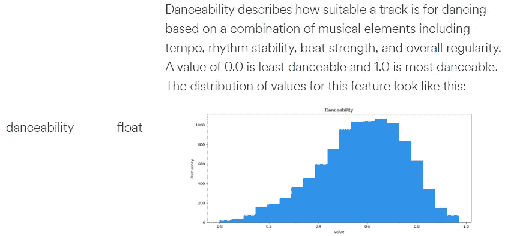
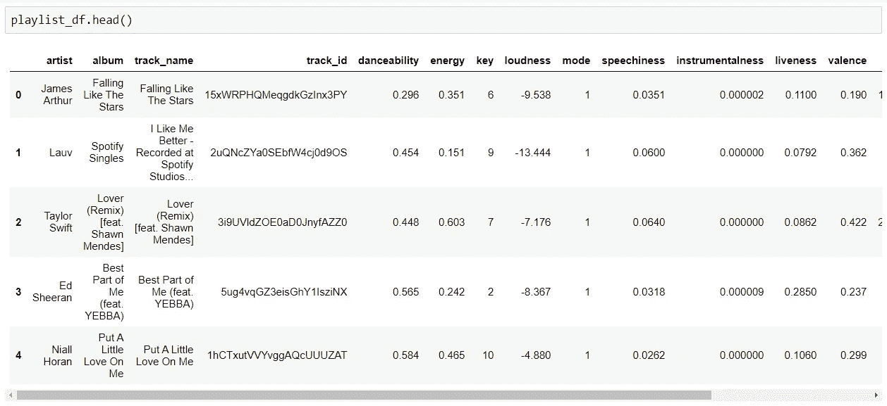

# 如何使用 Spotipy 创建大型音乐数据集

> 原文：<https://towardsdatascience.com/how-to-create-large-music-datasets-using-spotipy-40e7242cc6a6?source=collection_archive---------10----------------------->

## 为机器学习获取音乐相关数据的最快、最干净的方法



由[吉纳罗·塞文](https://www.pexels.com/de-de/@gesel)和[皮克斯拜](https://www.pexels.com/de-de/@pixabay)拍摄的图像

# 什么是 Spotipy，你能用它做什么？

你是音乐爱好者还是程序员？很有可能，你们都是，就像我一样！当我开始使用 Spotipy 时，我几乎没有编程经验，想探索计算音频分析。现在，随着我深入编程和数据科学，我开始欣赏 Spotipy 为我的数据科学项目创建了令人惊叹的数据集。

## 这个图书馆非常适合你，如果

*   你是一名**数据科学家或程序员**，想要为机器学习生成有趣的数据集
*   你是一名**音乐家/音乐学家**想要学习编程或数据分析

Spotipy 是一个 Python 库，用户可以更容易地访问 Spotify Web API，并从中检索各种音乐数据。当我开始使用 Spotipy 时，这是我第一次接触 API。因此，如果您从未使用过 API，请不要担心。你能做到的！

## 你可以用 Spotipy 做这些事情

1.  使用您自己的用户数据(创建或编辑您的播放列表，查找您最喜欢的曲目等。)
2.  获取 Spotify 上每个曲目、专辑和艺术家的数据

在本指南中，我们将探索后一种应用的可能性。我将向您展示如何使用这些数据为统计分析或机器学习项目创建令人惊叹的数据集。

## 以下是您应该使用 Spotipy 创建数据集的两个主要原因:

1.  由于 Spotify 拥有超过 5000 万首歌曲，创建大型数据集的可能性是无限的。最重要的是，一旦您设置好了基础，您将能够非常快速地检索数据。
2.  在音乐领域，机器学习有如此多令人惊叹的应用，你可以探索。预测泰坦尼克号幸存者变得无聊了吗？不如你建立一个流派分类器，一个推荐系统，或者一个热门歌曲预测器？在我听来，那听起来更酷。

引起了你的兴趣？太好了！读完这个故事后，你就可以创建你的第一个大样本音乐数据集了(1k，10k，100k？你决定！).为了让你更容易做到这一点，我将通过你需要采取的三个步骤来指导你。



三步指南。1.注册和授权，请按 2。选择要分析的音乐，3。分析曲目并导出数据。

# 第一步:注册并授权

## 登记

这是最难的部分，但是坚持住。我们很快就要编码了！为了使用 Spotify Web API，你需要在 https://developer.spotify.com/注册一个应用程序。不管你实际上是在构建一个应用程序还是仅仅在探索 API。这是你走向成功的三个步骤:

1.  用你的 Spotify 账户登录 https://developer.spotify.com/dashboard/login[的](https://developer.spotify.com/dashboard/login) [o](https://developer.spotify.com/) r 免费注册一个
2.  转到您的仪表板，然后单击“创建客户端 ID”

在这里，您提出了一个应用程序名称(您如何称呼它并不重要)和对它的描述。当我创建我的应用程序时，我只是诚实地写道，我只是想用我的应用程序探索 API。对我很有效。

3.打开你的应用视图，点击“编辑设置”。在重定向 URL 字段中输入 [http://localhost/](http://localhost/) 。

4.回到你的应用程序视图，点击你的客户端 ID 下的“显示客户端密码”。

5.将客户端 ID 和客户端秘密 ID 存储在文本文件或其他文件中，以便以后快速访问。我们需要他们的授权。

如果我的解释方式对你没有帮助，我建议你查看这部分的不同资源。一个很棒的介绍就是 [Max Tingle](https://medium.com/@maxtingle/getting-started-with-spotifys-api-spotipy-197c3dc6353b) 的这篇文章。

## 批准

万一最后一部分对你来说有点混乱或烦人，确保你只用几行代码就能完成无聊的部分。

1.  首先，您需要进行两次导入。如果您还没有安装 spotipy，请先使用命令“pip install spotipy”来安装它。

```
import spotipy
import spotipy.util as util
```

2.接下来，将您的客户端和秘密 ID 分配给变量。

```
CLIENT_ID = "YourClientID"
CLIENT_SECRET = "YourSecretID"
```

3.下面几行代码我就不细说了。我建议你复制粘贴它们，以后再学习。

```
token = util.oauth2.SpotifyClientCredentials(client_id=CLIENT_ID, client_secret=CLIENT_SECRET)
cache_token = token.get_access_token()
sp = spotipy.Spotify(cache_token)
```

太好了！现在，您将在步骤 2 中开始分析一些实际的音乐。

# 第二步:选择要分析的音乐

现在 Spotify API 就在你的脚下，你打算用它做什么呢？如前所述，分析大量的轨迹会产生大量的数据集。然而，手动选择每一首曲目是很痛苦的。你需要一些曲目的集合或列表。以我的个人经验来看，有两个选项非常有用，那就是按播放列表或艺术家来搜索曲目。两者各有利弊，在我们进入真正的分析之前，我将很快介绍一下。

## 通过播放列表选择音乐


用户 Oscar Lallier 在 [Spotify](https://open.spotify.com/playlist/6yPiKpy7evrwvZodByKvM9) 上的“史上最长播放列表”

播放列表有多大？上面的这个美女有 10，000 首歌曲，这似乎是 Spotify 允许的最大播放列表大小。也许你也想使用包含 5000 首歌曲的[“有史以来最大的播放列表”](https://open.spotify.com/playlist/4rnleEAOdmFAbRcNCgZMpY)播放列表。环顾四周，你会发现许多这样的大型播放列表，可以用来快速建立一个大型数据集。然而，你必须问问自己，你真正的研究兴趣是什么。这 15000 的集合对任何人都有用吗？也许你想用这样的数据集来调查 Spotify 上的一些音频功能是如何分布的？

另一种方法是根据主题选择播放列表。您可以获取标题中带有“睡眠”一词的播放列表的前 20 个搜索结果。也许你想将“睡眠”播放列表中的歌曲与“专注”播放列表中的歌曲进行比较，找出它们的不同之处。我以前用这种方法分析过浪漫和心碎的歌曲在音乐上是否不同(令人惊讶的是，它们并没有不同)。

如果您选择了您感兴趣的播放列表，请确保存储它们的创建者用户名以及播放列表 id。您可以从 url 中检索 ID，如下所示。


## 按艺术家选择音乐

另一种选择音乐的方式是通过他们的艺术家。我以前使用过这种方法来建立一个机器学习模型，该模型将新发布的工具专辑“恐惧接种体”中的音乐分配给 6 个进步金属/摇滚乐队中的正确乐队。然而，在这种情况下，你面对的是小样本。很少有艺术家有几百首歌曲，更不用说几千首了。然而，Spotify 有一个“推荐艺术家”功能。您可能想要使用它来增加样本大小，同时仍然使用类似的音乐。


为德国乐队“拉姆斯坦”推荐艺术家:“林德曼”、“魅力”、“移民”、“玛丽莲·曼森”。

一旦你选择了几个艺术家，就像你之前存储播放列表 id 一样存储他们的艺术家 ID。

对于第三步，我将向你展示如何从播放列表中分析音乐。我们鼓励你自己通过 artist 来尝试如何做到这一点。也可以随时问我任何问题。

# 步骤 3:分析轨迹并导出数据

## 3.1 分析单个播放列表

让我们进入一些实际的编码。检索播放列表中每个曲目信息的基本 Spotipy 函数是:

```
sp.user_playlist_tracks("username", "playlist_id")
```

让我们以 Spotify 的[“Warum Fuzzy Feeling”播放列表为例。](https://open.spotify.com/playlist/37i9dQZF1DX5IDTimEWoTd)


Spotify 的“温暖模糊的感觉”播放列表

从 url 中获取 ID，我们现在可以应用该函数。

```
sp.user_playlist_tracks("spotify", "37i9dQZF1DX5IDTimEWoTd")
```

输出是势不可挡的，乍一看，对于不习惯处理 API 的人来说完全无法理解。这是一些输出。



sp.user_playlist_tracks 函数的输出

虽然我非常鼓励您自己探索输出，但我不会在这里深入讨论，而只是简单地向您展示您想要的特性以及在哪里可以找到它们。如果您确实想自己探索输出，将它视为多个相互嵌套的字典的集合是很有用的。

这些是我们可以从输出中提取的特征。

1.  元信息(艺术家、专辑、曲目名称、曲目 ID)
2.  声学参数(响度、音调、模式、速度)
3.  心理声学参数(可跳舞性、能量、乐器性、活性、效价)

Spotify 有一些很棒的资源，可以让我们找到更多可以提取的特征(见下图)。点击了解更多[。](https://developer.spotify.com/documentation/web-api/reference/tracks/get-audio-features/)



Spotify 解释他们的“可跳舞性”参数。

因为这是一篇介绍性的文章，所以我将向您展示提取函数，并简要解释它是如何工作的。

1.  创建一个包含所有相关列的空数据框架
2.  将 sp . user _ playlist _ tracks(" username "，" playlist_id ")存储到" playlist "变量中
3.  循环播放列表中的每个曲目
4.  创建一个空字典来填充音轨信息
5.  直接提取元数据
6.  通过 sp.audio_features(track_id)提取音频特征
7.  将 track_dict 连接到现有的数据帧上
8.  返回最终数据帧

这是作为纯代码的函数。你可以在这个 [github 库](https://github.com/MaxHilsdorf/introduction_to_spotipy) **中以更吸引人的格式找到本教程的全部代码。**

```
def analyze_playlist(creator, playlist_id):

    # Create empty dataframe
    playlist_features_list = ["artist","album","track_name",  "track_id","danceability","energy","key","loudness","mode", "speechiness","instrumentalness","liveness","valence","tempo", "duration_ms","time_signature"]

    playlist_df = pd.DataFrame(columns = playlist_features_list)

    # Loop through every track in the playlist, extract features and append the features to the playlist df

    playlist = sp.user_playlist_tracks(creator, playlist_id)["items"]
    for track in playlist: # Create empty dict
        playlist_features = {} # Get metadata
        playlist_features["artist"] = track["track"]["album"]["artists"][0]["name"]
        playlist_features["album"] = track["track"]["album"]["name"]
        playlist_features["track_name"] = track["track"]["name"]
        playlist_features["track_id"] = track["track"]["id"]

        # Get audio features
        audio_features = sp.audio_features(playlist_features["track_id"])[0]
        for feature in playlist_features_list[4:]:
            playlist_features[feature] = audio_features[feature]

        # Concat the dfs
        track_df = pd.DataFrame(playlist_features, index = [0])
        playlist_df = pd.concat([playlist_df, track_df], ignore_index = True)

    return playlist_df
```

此时，您可以复制我的函数，编辑它，或者自己探索 API。在任何情况下，上面的函数都返回一个 dataframe，它可以很容易地转换成您想要的任何数据格式。



输出数据帧

```
# csv
df.to_csv("dataframe.csv", index = False)
# excel
df.to_excel("dataframe.xlsx", index = False)
```

## 3.2 分析多个播放列表

最后，我将向您展示如何创建包含多个播放列表的数据帧。

您可以使用以下函数来完成此任务。它分析每一个播放列表，添加一个带有播放列表名称的“播放列表”列。最后，该函数连接新旧数据帧。

```
def analyze_playlist_dict(playlist_dict):

    # Loop through every playlist in the dict and analyze it
    for i, (key, val) in enumerate(playlist_dict.items()):
        playlist_df = analyze_playlist(*val)
        # Add a playlist column so that we can see which playlist a track belongs too
        playlist_df["playlist"] = key
        # Create or concat df
        if i == 0:
            playlist_dict_df = playlist_df
        else:
            playlist_dict_df = pd.concat([playlist_dict_df, playlist_df], ignore_index = True)

    return playlist_dict_df
```

然而，你需要以特定的格式组织你的播放列表，以使该功能正常工作。正如您在下面看到的，您需要将播放列表存储在一个字典中，将播放列表名称作为键，将它们的创建者和播放列表 id 作为元组形式的值。

```
playlist_dict = {
 “warm_fuzzy_feeling” : (“spotify”, “37i9dQZF1DX5IDTimEWoTd”), 
 “love_songs_heart” : (“indiemono”, “5KbTzqKBqxQRD8OBtJTZrS”),
 “romance_songs” : (“Susan Doles”, “7sAUK3XK8NHH1s5vGcTBkF”)
}
```

让我们看看运行这个函数会发生什么。

```
multiple_playlist_df = analyze_playlist_dict(playlist_dict)
multiple_playlist_df["playlist"].value_counts()
```

输出:

```
love_songs_heart      100
romance_songs          77
warm_fuzzy_feeling     70
Name: playlist, dtype: int64
```

如您所见，使用这种方法，您可以轻松地分析 20 个大型播放列表，并获得数千个曲目分析。但是，请记住，您需要进行一些数据清理。特别是，检查重复将是一个重要的步骤。

# 后续步骤

现在你已经有了第一个音乐数据集，但是下一步做什么呢？以下是一些想法:

*   分析不同流派、情绪或活动的播放列表。将每组播放列表(例如“悲伤”与“快乐”)存储在单独的数据帧中。然后，使用逻辑回归、决策树或深度学习方法(如神经网络或随机森林)来构建分类算法。
*   根据不同的艺术家而不是播放列表来分析音乐。您会发现以下两个函数对此很有用:

```
sp.audio_analysis(track_id)
sp.audio_features(track_id)
```

*   构建一个推荐系统，根据流派、情绪或活动输入向用户推荐音乐。

**感谢您阅读这篇文章！如果有什么东西不见了或者对你不起作用，请随时给我发信息。**