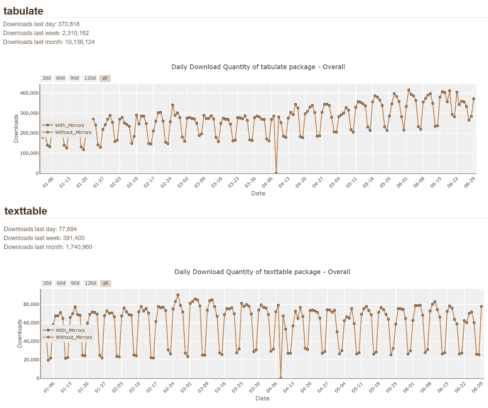
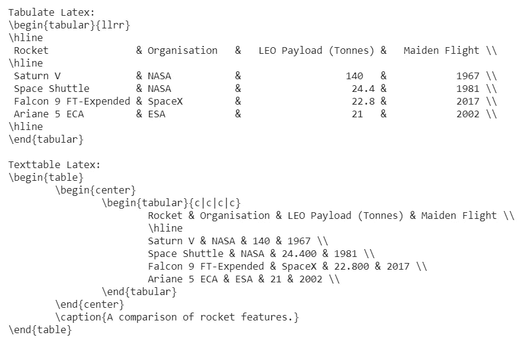
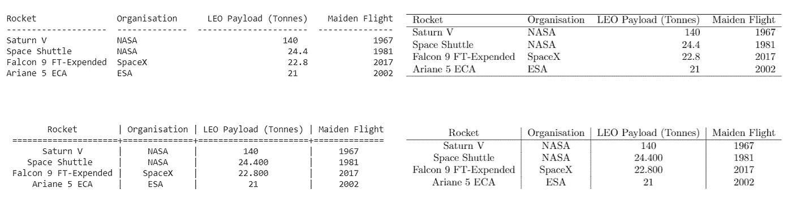

# 如何直接从 Python 代码创建 Latex 表

> 原文：<https://towardsdatascience.com/how-to-create-latex-tables-directly-from-python-code-5228c5cea09a?source=collection_archive---------7----------------------->

## 将控制台中的结果表复制到 Latex 报告中是一件单调乏味且充满错误的事情——那么为什么不实现自动化呢？


制作桌子要简单优雅(图片由[罗曼·博日科](https://unsplash.com/@romanbozhko?utm_source=unsplash&utm_medium=referral&utm_content=creditCopyText)在 [Unsplash](https://unsplash.com/?utm_source=unsplash&utm_medium=referral&utm_content=creditCopyText) 上拍摄)。

创建结果表在交流数据科学的实验结果方面起着重要作用。在 Python 中生成表格并在控制台输出中绘制它们有各种解决方案，但是如何将它们转换成书面报告呢？通常，这需要一些耗时和令人麻木的复制和粘贴，但有一些更好的解决方案。

# 用 Python 制作表格

Python 有几个库允许你绘制表格。在这篇文章中，我将特别关注两个:[制表](https://pypi.org/project/tabulate/)和[文本表格](https://pypi.org/project/texttable/)。它们都实现了相同的目标——以尽可能少的麻烦生成格式良好的表格。制表是更受欢迎的图书馆，上个月下载量超过 1000 万次。相比之下，texttable 的用户量不到 200 万(根据 2020 年 6 月底的 PyPi 统计数据):



table 和 texttable 的下载比较( [PyPi Stats](https://pypistats.org/) 30/06/2020)

这两个库都允许您以特定的样式格式化表格。Texttable 在选择表格设计方面给予用户完全的自主权；可以定制列对齐、标题对齐、表格装饰、列类型，甚至是用于在行列之间画线的字符。制表选择关注预先设计的格式，但是用户仍然可以选择覆盖这些格式。

我个人的偏好是使用 texttable。十有八九，我使用它是因为它是我遇到的第一个创建表的库，但是它还没有让我失望。

# 导出到 Latex

制表格式主要是为了在其他平台上使用或模仿它们的设计，例如 github、html、psql。其中一种格式允许创建 latex 代码，为您提供可以直接复制并粘贴到 Latex 文档中的文本。工作完成了——这很容易。

比制表更轻量级的 Texttable 没有提供这样的解决方案。然而，作为一个个人的业余项目，我把我的第一个 Python 库放在一起，作为 texttable 的包装器来创建 Latex 表。我创造性地将其命名为 [latextable](https://github.com/JAEarly/latextable) ，目前它已经在 PyPi 上可用。它提供了与制表 Latex 格式类似的输出，并提供了额外的功能，如匹配 texttable 控制台输出的格式，并允许用户添加表格标题和标签。

使用任何一个库都非常简单；它们都做了它们的设计用途，并且有非常相似的用法。对于包含表数据的行列表，表是这样创建的:

```
print('Tabulate Table:')
print(tabulate(rows, headers='firstrow'))table = Texttable()
table.set_cols_align(["c"] * 4)
table.set_deco(Texttable.HEADER | Texttable.VLINES)
print('\nTexttable Table:')
print(table.draw())
```

输出 Latex 代码同样简单:

```
print(‘\nTabulate Latex:’)
print(tabulate(rows, headers=’firstrow’, tablefmt=’latex’))
print(‘\nTexttable Latex:’)
print(latextable.draw_latex(table, caption=”A comparison of rocket features.”))
```

它给出了下面的 Latex 代码:



两种 Latex 输出都可以直接复制到 Latex 文档中，latextable 输出具有自动缩进的优点。控制台输出与渲染 Latex 的比较如下所示:



比较控制台输出(左)和渲染 Latex 输出(右)的制表(上)和 texttable/latextable(下)。

我已经在[的 Colab 笔记本](https://colab.research.google.com/drive/1Iq10lHznMngg1-Uoo-QtpTPii1JDYSQA?usp=sharing)中提供了这个例子的完整源代码。很可能您仍然需要对 Latex 代码进行一些修改，以得到您想要的样子，但是通过使用这些工具中的一个，您至少不必浪费时间来复制和粘贴东西。这样做的好处是，你在抄写时不会犯任何错误！