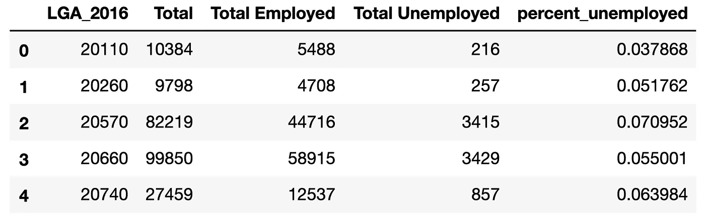
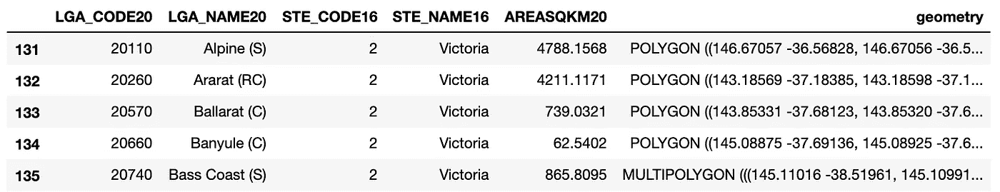
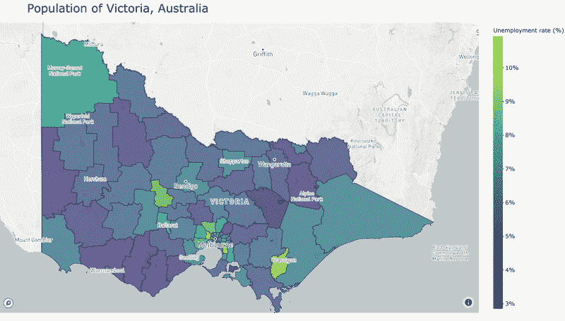

# 如何在 Plotly 中创建非美国位置的地图

> 原文：<https://towardsdatascience.com/how-to-create-maps-in-plotly-with-non-us-locations-ca974c3bc997?source=collection_archive---------17----------------------->

## 美国人永远不会知道我们的痛苦。


安妮·斯普拉特在 [Unsplash](https://unsplash.com?utm_source=medium&utm_medium=referral) 上的照片

Plotly 使在交互式 choropleth 地图中显示地理空间数据变得非常容易，尤其是当您的数据与美国相关时。不幸的是，如果你的数据位置在美国以外，并且比国家一级的数据更细，事情就会变得有点模糊。当您在堆栈溢出和 GitHub 问题中寻找实现映射目标的线索时，您可能会觉得自己像一个可怜的表亲。我在这里说我也经历过，我感受到你的痛苦，也有解决的办法。让我们跳进来吧！

# 步骤 1:获取一些数据进行绘图

在本教程中，我将显示澳大利亚维多利亚州的失业数据。我从澳大利亚统计局[的统计门户网站](http://stat.data.abs.gov.au/)得到了我的数据。该门户允许您选择数据的地理空间粒度。我选择下载“2016 年人口普查，G43 按年龄和性别分列的劳动力状况(LGA)”，其中 LGA 指的是地方政府区域，这是数据的空间粒度。让我们把它放进去，稍微改变一下形状:



“LGA 2016”一栏指的是每个地方政府区域(LGA)的 ID 或代码。通过旋转数据，我们为每个 LGA 创建了一行，从而创建了一个失业率。这一点很重要，因为当我们创建地图时，我们需要为每个显示的地理空间区域指定一个值。

# 步骤 2:获取与数据相对应的几何图形

使用美国以外的数据创建 Plotly choropleth 的关键是拥有一个 GeoJSON，其几何图形与您的数据相对应。虽然有时您可能已经有了一个 GeoJSON，但更有可能的是您必须创建一个，对于我来说就是这种情况。

我再次使用澳大利亚统计局，通过[此链接](https://www.abs.gov.au/AUSSTATS/abs@.nsf/DetailsPage/1270.0.55.003June%202020?OpenDocument)访问 ESRI Shapefile 格式的我的数据的几何图形(我下载了“ESRI Shapefile 格式的 ASGS 地方政府区域 Ed 2020 数字边界”)。可以使用 Geopandas 将这种格式加载到 Python 中，方法是将它指向。“shp”文件:



现在我们可以看到，两个数据框都有一列包含每个 LGA 的代码，这就是我们将要加入的内容。每行还有一个“几何”值，即 LGA 的地理空间轮廓。

**附注:**对于澳大利亚数据的绘图，ABS 将是您获取形状文件的最佳选择。我不太精通其他国家的数据(如果你知道有网站提供你国家的地理数据，请留下评论)，但如果你被困住了，http://www.diva-gis.org/gdata 的包含大多数国家的形状文件，可以免费下载。

# 步骤 3:合并数据和几何图形(可选:使用 Geopandas 显示)

如果您的两个数据框都有像我这样的匹配键，那么在该列上连接它们并删除所需列中没有数据的行就很简单了。

我还喜欢在此时使用 Geopandas 显示我的数据框，作为一种健全性检查，并了解我的 plotly 地图最终应该是什么样子。


澳大利亚维多利亚州的失业率，使用 Geopandas 绘制。

**注意:**合并数据帧对于绘图中的几何图形来说并不是绝对必要的，但它确实可以将几何图形与要绘制的数据对齐。如果不执行此合并步骤，您将需要确保包含数据的数据框和包含几何的 shapefile/geoJSON 具有对应且排序相同的行。

# 步骤 4:将数据框转换为 GeoJSON

现在我们有了一个地理数据框架，其中包含了我们需要使用 Plotly 绘制的所有信息。除了一个小细节:Plotly 想要 GeoJSON 格式的。幸运的是，Geopandas 可以轻松地从数据框转换为 GeoJSON，如下所示。不过首先，你要确保你的几何图形是纬度/经度格式(EPSG:4236)，这正是 Plotly 所期望的。

您的 GeoJSON 应如下所示:

```
{'type': 'FeatureCollection',
 'features': [{'id': '20110',
   'type': 'Feature',
   'properties': {'LGA_2016': '20110',
    'LGA_CODE20': '20110',
    'LGA_NAME20': 'Alpine (S)',
    'percent_unemployed': 0.037868162692847124},
   'geometry': {'type': 'Polygon',
    'coordinates': (((146.67057224400003, -36.56828108499997),
      (146.670555271, -36.568038086999934),
      (146.67051924600003, -36.567766081999935),
      (146.67051924600003, -36.56750909899995),
      (146.6704312810001, -36.56723709299996),
      ...
```

您可以看到该字典包含一个名为“features”的嵌套字典，其中每个数据框行的索引都存储为“id”。如果您没有使用此方法创建 geoJSON，请确保您的 geo JSON 具有类似的格式。

# 第五步:剧情！

在下面的代码中有一些需要注意的地方。
**首先是**，你需要一个 Mapbox 访问令牌。你可以通过在这里创建一个地图箱账户[来得到这个。对于个人使用级别，访问 API 将是免费的。
**其次**，我们为地图分配数据，将 geoJSON 用于几何图形，将合并的数据框用于颜色和文本。
**最后**，我们设置一些参数来定义地图的布局，包括标题、中心经纬度、缩放级别。](https://account.mapbox.com/access-tokens/)

这将生成一个漂亮的交互式地图，显示维多利亚的失业率。不错！



澳大利亚维多利亚州的 Plotly choropleth 显示失业率。

您可以使用自己的数据和 shapefiles 自定义本教程。要在 GitHub [上查看代码，请点击这里](https://github.com/KerryHalupka/plotly_choropleth)。