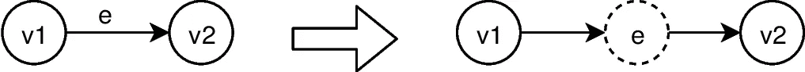
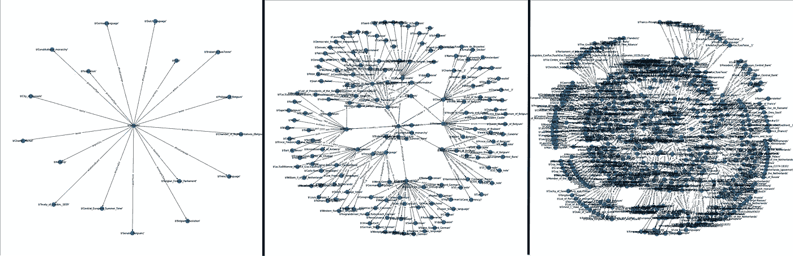
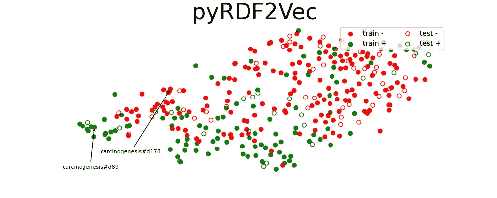
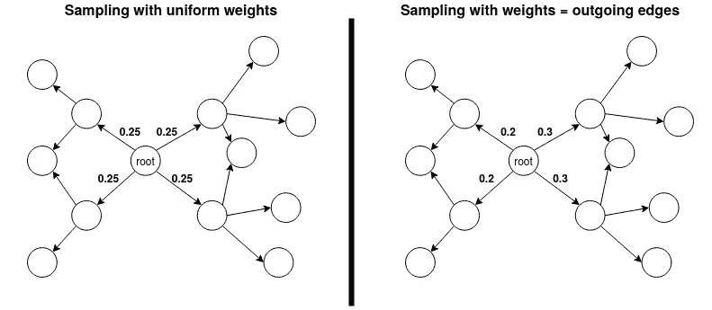
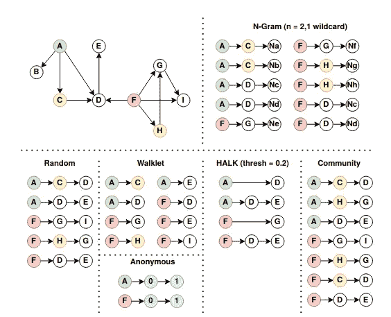
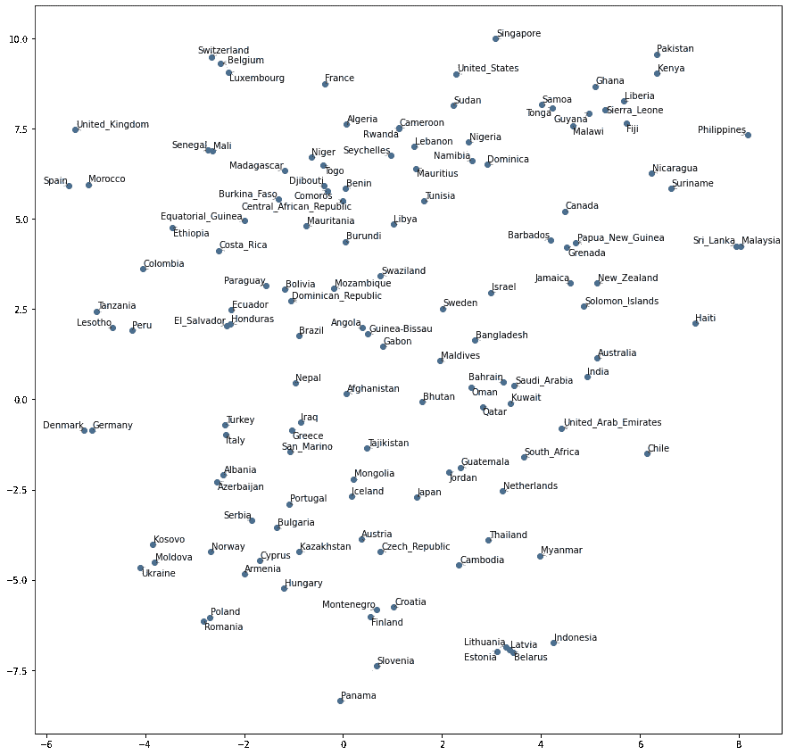

# 如何使用 pyRDF2Vec 创建知识图中实体的表示

> 原文：<https://towardsdatascience.com/how-to-create-representations-of-entities-in-a-knowledge-graph-using-pyrdf2vec-82e44dad1a0?source=collection_archive---------12----------------------->

## [实践教程](https://towardsdatascience.com/tagged/hands-on-tutorials)

## 关于如何处理知识图中表示的数据的下游 ML 任务的教程。

# 目录

*   [用知识图表示数据](#1f07)
*   [运行实例:DBpedia 中的国家](#294a)
*   [用 RDF2Vec 创建实体嵌入](#0861)
*   [pyrdf 2 vec 简介](#08bc)
*   [有偏差的行走或采样策略](#6a7a)
*   [行走修改和变换](#20d7)
*   [用 pyRDF2Vec 装载 kg](#240f)
*   [创建我们的第一个嵌入](#a134)
*   [调节超参数](#4037)
*   尝试不同的行走策略
*   [采样深度行走](#62a0)
*   [rdf 2 vec 的缺点和研究挑战](#1c6e)
*   [代码和数据可用性](#8a76)

# 用知识图表示数据

**图**是用来表示无处不在的现象的数据结构，比如社交网络、化学分子和推荐系统。它们的优势之一在于，它们明确地对各个单元(即**节点**)之间的关系(即**边**)进行建模，这为数据增加了额外的维度。

我们可以使用 [Cora 引用网络](https://relational.fit.cvut.cz/dataset/CORA)来说明这种数据丰富的附加值。该数据集包含数百篇论文的词袋表示以及这些论文之间的引用关系。如果我们应用降维(t-SNE)来创建单词袋表示的 2D 图(图 1，左侧)，我们可以看到集群(根据其研究主题进行着色)出现，但它们重叠。如果我们产生一个嵌入的图形网络(图 1，右)，考虑到引用信息，我们可以看到集群被更好地分离。


**图 1:** 左图:每篇论文的词袋表示的 t-SNE 嵌入。右:图网络产生的嵌入，考虑了论文之间的引用。来源:[“深度图 Infomax”，Velickovic 等人](https://arxiv.org/abs/1809.10341)

**知识图** (KG)是一种特定类型的图。它们是*多关系*(即不同类型的关系有不同的边)和*有向*(即关系有主语和宾语)。这些属性允许以统一的格式表示来自不同来源的信息。我们可以将知识图转换成规则的有向图，这有助于进一步的分析，如图 2 所示。



**图 2:** 转换一个正则有向图中的多关系有向 KG。图片作者。

# 运行示例:DBpedia 中的国家

在这篇文章中，我们将使用一个运行的例子。让我们首先关注为世界各地随机选择的几个国家创建表示。我们将从 [DBpedia](https://wiki.dbpedia.org/about) 中提取每个国家的信息，DBpedia 是从 [Wikipedia](http://www.wikipedia.org) 中创建的大型通用 KG。

让我们来看看 KG 在一个特定的国家附近是什么样子的:🇧🇪比利时🇧🇪.这个过程类似于转到其[对应的 DBpedia 页面](http://dbpedia.org/page/Belgium)，然后递归地点击该页面上的所有链接。我们在下面的图 3 中对此进行了描述。我们注意到，迭代地扩展这个邻域会使事情变得很快复杂，即使我们通过删除一些部分引入了一些简化。尽管如此，我们看到 DBpedia 包含了一些关于比利时的有用信息(例如，它的国歌、最大的城市、货币……)。

我们通过使用 [DBpedia SPARQL 端点](https://dbpedia.org/sparql)创建了一个包含国家信息的定制数据集。我们从曼海姆的[大学的“机器学习语义网”存储库中检索了一个国家列表](https://www.uni-mannheim.de/dws/research/resources/sw4ml-benchmark/)。每个国家都包含有关其通货膨胀和学术产出的信息。这些信息被二进制化为“高”和“低”(因此两个二进制分类任务)。此外，对于每个国家，我们检索了他们的大陆(欧洲、亚洲、美洲、非洲或大洋洲)，这给了我们一个 5 级分类任务。包含这些国家信息的 KG 是 DBpedia 的一个子集:对于每个国家，我们通过将 KG 扩展三次来检索所有信息。这个过程与图 3 中描述的完全一致。由于 SPARQL 端点的速率限制，深度为 3 的节点及其父节点最多只能包含 10000 个。KG(Turtle 语法)可以在[这里](https://www.dropbox.com/s/naysvkn55jqxxeo/countries.ttl)下载，带有国家及其标签列表的 CSV 文件可以在[这里](https://www.dropbox.com/s/ymo3pjfqzscsvey/countries.csv)下载。



**图 3:** 递归扩展知识图让事情变得复杂得很快。图片作者。

# 用 RDF2Vec 创建实体嵌入

**RDF2vec** 代表资源描述框架 To Vector。这是一种无监督的、任务不可知的算法，以数字形式表示 KG 中的节点，允许它们用于进一步的(下游)机器学习任务。RDF2Vec 建立在现有的自然语言处理技术之上:它结合了来自 [DeepWalk](https://dl.acm.org/doi/pdf/10.1145/2623330.2623732) 和 [Word2Vec](https://papers.nips.cc/paper/5021-distributed-representations-of-words-and-phrases-and-their-compositionality.pdf) 的见解。Word2Vec 能够为提供的句子集合(通常称为语料库)中的每个单词生成嵌入。为了生成一个 KG 的语料库，我们提取行走。提取 walks 类似于访问一个实体的 DBpedia 页面并点击链接。你点击的次数相当于一次散步的跳数。这种步行的一个例子，对于比利时来说，将是:[比利时](http://dbpedia.org/resource/Belgium)->-[dbo:首都](http://dbpedia.org/ontology/capital)->-[布鲁塞尔市](http://dbpedia.org/resource/City_of_Brussels)->-[dbo:市长](http://dbpedia.org/ontology/mayor)->-[Yvan Mayeur](http://dbpedia.org/resource/Yvan_Mayeur)。注意，我们在遍历中没有区分谓词/属性(例如，dbo:capital 和 dbo:mayor)和实体(例如，比利时、布鲁塞尔、Yvan Mayeur 等等)，如图 2 所示。现在，每一步都可以被视为一个句子，该步中的每一跳都对应于一个句子的标记(单词)。一旦我们提取了大量植根于我们想要为其创建嵌入的实体的遍历，我们就可以将其作为语料库提供给 Word2Vec。Word2Vec 将学习每个唯一跳的嵌入，然后可以用于 ML 任务。

# pyRDF2Vec 简介

pyRDF2Vec 是一个存储库，包含了 [RDF2Vec](http://rdf2vec.org/) 算法的 Python 实现。在原始算法的基础上，还实现了不同的扩展。

> 在本教程中，我将解释我们如何使用 pyRDF2Vec 在 KG 中生成实体的嵌入。此外，我将简要解释 RDF2Vec 的一些扩展，以及如何在 pyRDF2Vec 中使用这些扩展。



图片取自[我们的知识库](https://github.com/IBCNServices/pyRDF2Vec)。

# 有偏向的行走或采样策略

现在，从图 3 中可以注意到，我们可以提取的可能行走的数量随着深度呈指数增长。当我们使用像 DBpedia 这样的大 kg 时，这就成了问题。在[最初的 RDF2Vec 论文](https://madoc.bib.uni-mannheim.de/41307/1/Ristoski_RDF2Vec.pdf)中，行走只是从图中随机抽样，但是[科切兹等人提出了几个度量来偏向行走](https://dl.acm.org/doi/pdf/10.1145/3102254.3102279)。这些走步当时被称为有偏走步，但是我们将它们称为符合 pyRDF2Vec 术语的采样策略。一个可能的采样策略示例如图 4 所示。



**图 4:** 对行走中的下一跳进行采样的一种可能方式是根据外出边的数量来缩放权重。这只是一个例子，有许多不同的指标(基于频率，PageRank，度，…)。图片作者。

# 行走修改和变换

到目前为止，我们将行走算法解释为从节点的邻居连续采样，直到达到某个深度。但是，我们可以对该算法进行修改(提取算法)，或者我们可以对行走进行后处理以包含额外的信息(转换算法)。[这是我们在 IDLab](https://arxiv.org/pdf/2009.04404.pdf) 一直在研究的内容。这些策略应用于一个简单的例子，如图 5 所示。



**图 5:** 从图中提取行走(深度 2)的不同策略。在这个图中，A 和 F 是我们想要从中提取行走的根。c 和 H 属于同一个社区(社区检测)。来源:[“知识图中 RDF2Vec 节点嵌入的行走提取策略”，Vandewiele 等人](https://arxiv.org/pdf/2009.04404.pdf)(博客作者)。

既然我们已经介绍了这些改进的行走策略，我们现在讨论 RDF2Vec 算法的三个主要构建模块:(I)一个**行走策略** , (ii)一个**采样策略**,( iii)一个**嵌入算法** (NLP)。正如我们将进一步讨论的，这些构建块中的每一个都可以在 pyRDF2Vec 中配置。

# 用 pyRDF2Vec 加载 kg

知识通常以资源描述框架(RDF)格式表示。pyRDF2Vec 可以通过包装 [rdflib](https://rdflib.readthedocs.io/en/stable/) 轻松加载不同 RDF 语法的文件。这将把整个 KG 加载到 RAM 存储器中。然而，当 KG 大于可用的 RAM 内存时，这就成问题了。因此，我们也支持与端点的交互:KG 可以托管在某个服务器上，我们的 KG 对象将在任何需要的时候与那个端点进行交互。这大大减少了所需的 RAM 内存，但代价是延迟更长。

用 pyRDF2Vec 加载元数据和知识图

# 创建我们的第一个嵌入

现在我们已经将 KG 加载到内存中，我们可以开始创建嵌入了！为了做到这一点，我们创建一个`RDF2VecTransformer`，然后用新加载的 KG 和一个实体列表调用`fit()`函数。一旦模型被拟合，我们可以通过`transform()`函数检索它们的嵌入。与常规的 scikit-learn 流程(我们在训练数据上调用`fit()`，在测试数据上调用`predict()`或`transform()`)不同的一点是，训练和测试实体都必须提供给`fit()`函数(类似于 t-SNE 在 scikit-learn 中的工作方式)。由于 RDF2Vec 在无人监督的情况下工作，这不会引入标签泄漏。

用默认的超参数创建我们的初始嵌入。我们为每个提供的实体获得 100 维的嵌入。

上面的代码片段会给我们一个列表列表。对于向转换方法提供的每个实体，将返回 100 维的嵌入。现在，为了用肉眼检查这些嵌入，我们需要进一步降低维数。一个很好的方法是使用 t-SNE。我们可以使用下面的代码片段来做到这一点:

用 t-SNE 进一步降低我们嵌入的维数，从 100D 到 2D，以便可视化它们。

这给了我们如图 6 所示的结果。



**图 6:** 我们初始嵌入的 t-SNE 图。我们可以开始看到国家集群的出现。图片作者。

现在让我们来看看这些嵌入有多好，以便解决我们已经讨论过的三个 ML 任务:两个二元分类任务(高/低通货膨胀和高/低学术产出)和一个多类分类任务(预测大陆)。应该注意的是，由于 RDF2Vec 是无监督的，在创建这些嵌入的过程中，从来没有使用过这个标签信息！RDF2Vec 是任务不可知的，从我们的节点到嵌入的投影不是为特定的任务定制的，嵌入可以用于多个不同的下游任务。让我们创建一个效用函数，它将生成的嵌入作为输入，然后对所有三个任务执行分类:

为三个不同任务的嵌入装配分类器。

现在让我们调用`classify(walk_embeddings)`来看看我们基线嵌入的性能:

```
**Research Rating**
Accuracy = 0.765625
[[26  8]
 [ 7 23]]

**Inflation Rating**
Accuracy = 0.5882352941176471
[[14 16]
 [12 26]]

**Continent**
Accuracy = 0.6716417910447762
[[13  3  1  1  0]
 [ 4 11  0  1  0]
 [ 0  1  7  3  0]
 [ 1  3  1 14  0]
 [ 0  1  0  2  0]]
```

研究评级、通货膨胀和大陆分类的准确率分别为 76.56%、58.82%和 67.16%。虽然这些准确性远非完美，但它确实显示了所有这些任务的一些信息存在于生成的嵌入中。这些较低精确度的一个可能原因是，由于 DBpedia 的公共 API 的速率限制，只使用了 DBpedia 数据的一个子集。此外，我们只使用默认的超参数来生成我们的嵌入。

# 调整超参数

如前所述，RDF2Vec 算法的三个构建模块(行走算法、采样策略和嵌入技术)都是可配置的。现在，让我们尝试提取更深层次的遍历并生成更大的嵌入:

设置不同的行走深度和嵌入大小。

我们指定我们想要使用*随机*行走策略来提取深度为 3 的行走，这对应于从某个 DBpedia 页面跟随 3 个链接，或者在我们转换的 KG 中采取 6 次跳跃(参见图 1)。我们还指定我们想要为每个实体详尽地提取**深度为 3 的所有**可能的遍历，由`None`参数指示。我们没有指定任何采样策略，但是指定了我们想要使用 Word2Vec 嵌入技术来产生大小为 500 的嵌入。这种超参数配置为我们提供了以下精度:

```
**Research Rating**
Accuracy = 0.78125
[[25  9]
 [ 5 25]]

**Inflation Rating**
Accuracy = 0.6470588235294118
[[14 16]
 [ 8 30]]

**Continent**
Accuracy = 0.6865671641791045
[[15  0  0  3  0]
 [ 6  9  0  1  0]
 [ 1  2  6  2  0]
 [ 0  3  0 16  0]
 [ 0  0  0  3  0]]
```

如我们所见，三项任务中有两项的准确性有所提高，而第三项任务(通货膨胀分类)的准确性保持不变。

# 尝试不同的行走策略

pyRDF2Vec 允许我们使用不同的行走策略，不同策略的概述如图 5 所示。此外，我们可以组合不同的策略:pyRDF2Vec 将提取每个策略的遍历，并在提供给嵌入技术之前将提取的遍历连接在一起。让我们试着结合几种行走策略:

我们现在得到的精度是:

```
**Research Rating**
Accuracy = 0.71875
[[24 10]
 [ 8 22]]
 **Inflation Rating**
Accuracy = 0.6764705882352942
[[14 16]
 [ 6 32]]

**Continent**
Accuracy = 0.7910447761194029
[[15  0  0  3  0]
 [ 5 11  0  0  0]
 [ 2  0  9  0  0]
 [ 0  1  0 18  0]
 [ 0  1  0  2  0]]
```

因此，通胀评级和大陆任务有所改善，但研究评级的表现有所下降。

# 采样更深的行走

现在，如果我们想要提取更深的行走，我们很快就会遇到内存问题，因为行走的次数会随着行走的深度呈指数增长。这就是抽样策略发挥作用的地方。作为最后一个实验，让我们使用上一节中的行走策略对深度为 6 的 5000 次行走进行采样:

总共提取了 854901 次行走。这为我们提供了以下精度:

```
**Research Rating**
Accuracy = 0.671875
[[30  4]
 [17 13]]

**Inflation Rating**
Accuracy = 0.5
[[14 16]
 [18 20]]

**Continent**
Accuracy = 0.8059701492537313
[[17  0  0  1  0]
 [ 4 10  0  2  0]
 [ 0  2  9  0  0]
 [ 0  1  0 18  0]
 [ 0  3  0  0  0]]
```

因此，只有一个大陆分类的改进和其他两个任务的显著恶化。当然，人们可以调整 RDF2VecTransformer 的许多超参数(行走和采样策略及其相应的超参数)和随机森林(或任何其他分类技术)来获得最佳精度，但我们将此作为练习留给读者！

# RDF2Vec 的缺点和研究挑战

当前版本的 RDF2Vec 存在一些缺点，需要进一步研究来解决这些缺点:
–**最初的 RDF2Vec 实现没有结合 NLP 领域的最新见解:**自 2017 年 RDF2Vec 问世以来，NLP 领域已经取得了许多进展。我们目前正在致力于将不同的 NLP 嵌入技术(比如 BERT)实现到 pyRDF2Vec 中。
**–随机游走产生的嵌入的表达能力是有限的:**游走只是单链，它们捕捉的信息有些有限。行走策略试图缓解这一缺点，但需要在这一方向进行进一步的研究。此外，我们或许可以将不同策略生成的行走组合在一起。
**–RDF2Vec 无法扩展到大型 kg:**由于可以提取的可能行走的数量随深度呈指数增长，rdf 2 vec 无法很好地扩展到具有大量节点的 kg，尤其是当它包含许多高度连接的节点时。采样策略提高了可伸缩性，但是还可以做更多的研究。
**–rdf 2 vec 不能很好地处理 KG 中的数值:**目前，遍历中的所有跳，对应于 KG 中的节点，都被作为分类数据处理。这对于有序数据(例如，居民人数和国家大小)来说是次优的。
–**rdf 2 vec 不能处理易变数据:**如前所述，训练和测试数据都需要提供给我们的`fit()`方法。但是如果我们的一些测试数据还不可用呢？这里有一些技术可以提供帮助，比如在线和渐进式学习。

我们希望，通过发布 pyRDF2Vec，提供一个工具包，可以促进解决这些挑战的研究。

# 代码和数据可用性

pyRDF2Vec 库可以在 Github 上找到。如果你喜欢这个知识库，请给我们一颗星，我们将不胜感激！此外，我们欢迎各种贡献。

这篇博文中使用的自定义数据集可以下载: [KG](https://www.dropbox.com/s/naysvkn55jqxxeo/countries.ttl) 和 [CSV](https://www.dropbox.com/s/ymo3pjfqzscsvey/countries.csv) 。我们还在一个 [Google Colab 笔记本](https://colab.research.google.com/drive/1kTj7_tEgI2cUWzaUkXfGtwJ-QMjW3c2-?usp=sharing)中提供了所有的代码，这样你就可以从你的浏览器中交互地运行它了！