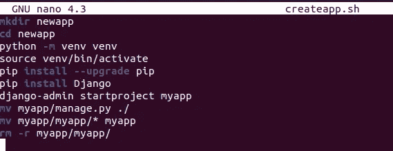

# 如何创建可重用的命令行

> 原文：<https://towardsdatascience.com/how-to-create-reusable-command-line-f9a2bb356bc9?source=collection_archive---------41----------------------->

## 你能把你的多个有用的命令行打包成一个文件以便快速执行吗？


照片由 [Joshua Lam](https://unsplash.com/@jl1232006?utm_source=medium&utm_medium=referral) 在 [Unsplash](https://unsplash.com?utm_source=medium&utm_medium=referral) 上拍摄

# 动机

作为一个数据科学家，知道一些基本的有用的命令行是很方便的。您可能有一些喜欢的命令行命令，您会一遍又一遍地使用它们。

例如，您想要创建一个 [Django](https://www.djangoproject.com/) 应用程序，这个库使得用 Python 创建 web 应用程序变得容易。要为 Django 应用程序设置文件夹和环境，您需要执行以下操作:

```
# Create the folder for the app
mkdir newapp# Go to the directory
cd newapp# Create the virtual environment
python -m venv venv# Activate the environment
source venv/bin/activate# Upgrade pip and install Django
pip install --upgrade pip
pip install Django# Create Django project
django-admin startproject myapp# Make the structure cleaner
mv myapp/manage.py ./
mv myapp/myapp/* myapp
rm -r myapp/myapp/
```

既然我们想在将来使用相同的命令行命令来创建一个新的应用程序，如果我们能够**将这些命令保存在某个地方，然后在我们想创建一个新的应用程序**时使用它，是不是很好？

像这样简单的事情

```
./createapp.sh
```

而设置一个 app 的每一个基本步骤都要照顾到？本文将向您展示如何使您的命令更加可重用和更快地执行。

# 可重用的命令行

首先，我们用`touch`创建一个文件，并使用。sh 表示 shell 脚本。

```
touch createapp.sh
```

使用`nano`编辑文件

```
nano createapp.sh
```

我们应该能够在这里插入所有的命令



用 Control + X 关闭文件(或用 Mac 用 Command + X)。键入 y 保存更改。使用回车键退出文件。

现在用 Bash 运行这个文件

```
bash createapp.sh
```

app 应该设置好了，随时可以使用！但是为什么要 bash 呢？Bash 是 shell，即命令语言解释器。有没有办法不用 bash 直接运行文件？试着跑

```
./createapp.sh
```

我们会得到这个错误:

```
bash: ./createapp.sh: Permission denied
```

这里发生了什么事？使用以下命令查看该文件的权限

```
ls -l createapp.sh
```

我们会看到类似这样的东西

```
-rw-r--r-- 1 khuyentran khuyentran 229 May 14 22:58 createapp.sh
```

如果我们看一下第一个`— ,`后面的字符`rw`，我们可以看到拥有该文件的用户可以读`r`和写`w`，但是不能执行`x.`，所以我们只需要使用

```
chmod u+x createapp.sh
```

`u`代表用户，`+`代表添加权限，`x`代表执行。现在我们应该可以不用 bash 来运行我们的文件了！

# 轻轻一点，让你的命令变得可携带

我们发现这个文件非常方便，所以我们决定与我们的朋友分享或在另一台计算机上运行它。我们可能需要意识到环境中可能发生的变化。

默认情况下，我们使用的 Bash shell 在这个目录 */bin/sh* 中执行。其他 shells 可能有不同的缺省值。所以为了确保这个文件总是正常工作(当在另一台计算机上使用时)，我们应该添加这个添加到我们的`createapp.sh`文件的开头

```
#!/usr/bin/env bash
```

# 但是如果我们想要另一个变量呢？

我们已经成功地用 bash 文件创建了一个应用程序。但是如果我们想为我们的下一个应用程序取另一个名字呢？我们可以编辑文件或者使用更快的方法，在我们的脚本中将**名称作为变量**！

```
#!/usr/bin/env bash
APPNAME="$1"
mkdir $APPNAME
cd $APPNAME
python -m venv venv
source venv/bin/activate
pip install --upgrade pip
pip install Django
django-admin startproject $APPNAME
mv $APPNAME/manage.py ./
mv $APPNAME/$APPNAME/* $APPNAME
rm -r $APPNAME/$APPNAME/
```

用一个变量替换`newapp`，在本例中是 APPNAME。使用`$1`指示在运行脚本时获取第一个参数。将每个`appname`替换为`$APPNAME.`

现在快跑

```
./createapp.sh someapp
```

另一个新名字的应用程序被创建了！

# 最后一步:从任何地方运行你的脚本

我们已经成功地从当前目录执行了我们的应用程序。如果我们可以从计算机上的任何目录执行这个脚本，不是更方便吗？

为了使我们的文件能够从任何地方运行，我们将把这个文件添加到 PATH 中，PATH 是一个环境变量，它告诉 shell 在哪个目录中搜索可执行文件。

在 PATH 下找到一个目录列表。

```
echo $PATH | tr ":" "\n"
```

选择一个目录，并将文件移动到该目录中。假设我选择/usr/local/bin 作为保存所有工具的目录

```
sudo mv createapp.sh /usr/local/bin/
```

就是这样！将来，您可以在计算机的任何目录中使用

```
createapp.sh someapp
```

而不需要记住每一步。

# 结论

恭喜你！您已经学习了如何使您的命令行可重用。如果您尚未使用此工具，您应该考虑将此工具添加到您的工作流程中。你工作流程中的一个小小的改变可能会在未来增加大量的时间。

我喜欢写一些基本的数据科学概念，并尝试不同的算法和数据科学工具。你可以在 [LinkedIn](https://www.linkedin.com/in/khuyen-tran-1401/) 和 [Twitter](https://twitter.com/KhuyenTran16) 上联系我。

如果你想查看我写的所有文章的代码，请点击这里。在 Medium 上关注我，了解我的最新数据科学文章，例如:

[](/achieve-reproducibility-in-machine-learning-with-these-two-tools-7bb20609cbb8) [## 使用这两个工具在您的机器学习项目中实现可重复性

### 你能打包你的机器学习模型，并根据你的需要挑选一个最好的吗？

towardsdatascience.com](/achieve-reproducibility-in-machine-learning-with-these-two-tools-7bb20609cbb8) [](/how-to-fine-tune-your-machine-learning-models-with-ease-8ca62d1217b1) [## 如何有效地微调你的机器学习模型

### 发现为您的 ML 模型寻找最佳参数非常耗时？用这三招

towardsdatascience.com](/how-to-fine-tune-your-machine-learning-models-with-ease-8ca62d1217b1) [](/how-to-organize-your-data-science-articles-with-github-b5b9427dad37) [## 如何用 Github 组织你的数据科学文章

### 被新信息淹没？现在，您可以轻松地跟踪文章并为其创建自定义注释

towardsdatascience.com](/how-to-organize-your-data-science-articles-with-github-b5b9427dad37) [](/how-to-share-your-jupyter-notebook-in-3-lines-of-code-with-ngrok-bfe1495a9c0c) [## 如何用 Ngrok 用 3 行代码分享你的 Jupyter 笔记本

### 想象一下，让你的朋友在远程机器上使用你的本地 Jupyter 笔记本

towardsdatascience.com](/how-to-share-your-jupyter-notebook-in-3-lines-of-code-with-ngrok-bfe1495a9c0c) [](/how-to-monitor-and-log-your-machine-learning-experiment-remotely-with-hyperdash-aa7106b15509) [## 如何使用 HyperDash 远程监控和记录您的机器学习实验

### 培训需要很长时间才能完成，但你需要去洗手间休息一下…

towardsdatascience.com](/how-to-monitor-and-log-your-machine-learning-experiment-remotely-with-hyperdash-aa7106b15509)