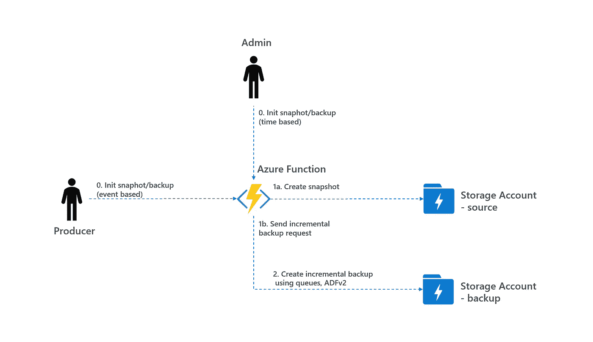
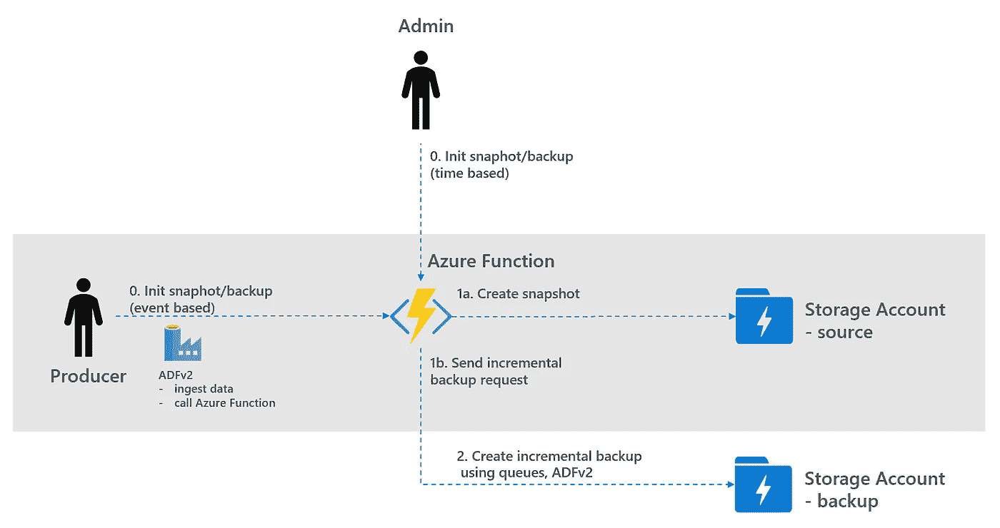
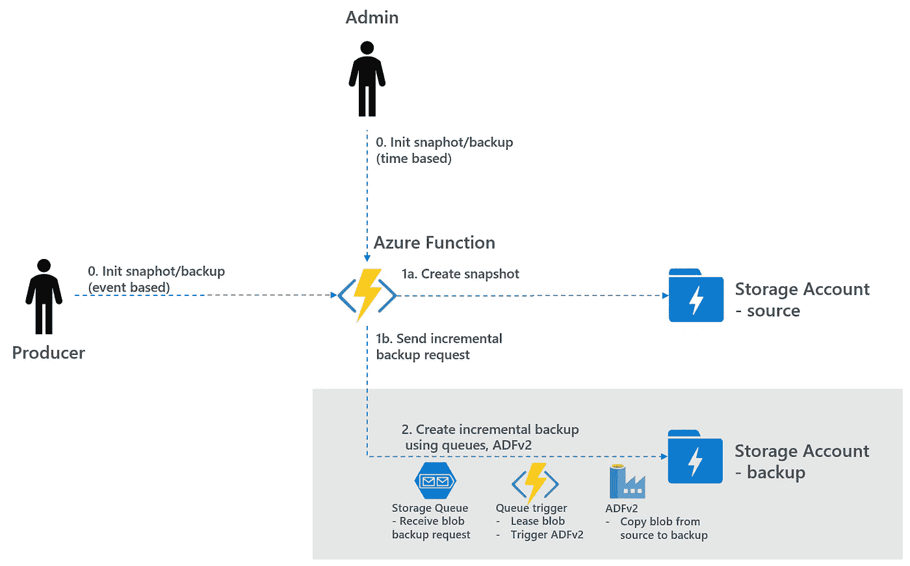
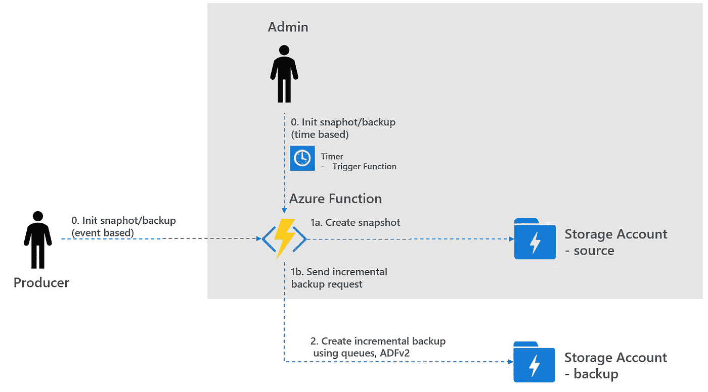
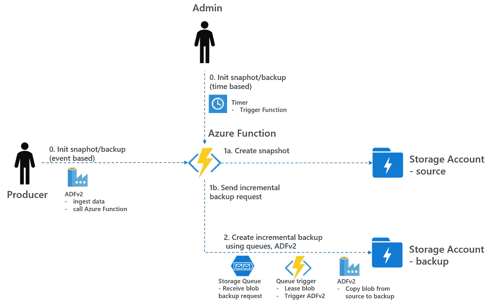

# 使用快照和数据工厂备份您的 Azure 存储

> 原文：<https://towardsdatascience.com/how-to-create-snapshots-and-backups-of-your-azure-storage-e72bef58e0aa?source=collection_archive---------21----------------------->

## 了解如何使用 blob 快照和数据工厂增量备份来自动备份您的数据湖

## 完整的数据湖恢复解决方案请看我的后续博客:[https://towards data science . com/how-to-recover-your-azure-data-lake-5b 5e 53 f 3736 f](/how-to-recover-your-azure-data-lake-5b5e53f3736f)

# 1.Azure 存储备份-简介

Azure 存储总是存储您数据的多个副本。当使用地理冗余存储(GRS)时，它也被复制到[配对区域](https://docs.microsoft.com/en-us/azure/best-practices-availability-paired-regions)。这样，GRS 可以防止数据在灾难发生时丢失。但是，当应用程序错误损坏数据时，GRS 无法防止数据丢失。然后，损坏的数据会被复制到其他区域/地区。在这种情况下，[需要一个备份](https://azure.microsoft.com/nl-nl/blog/microsoft-azure-block-blob-storage-backup/)来恢复你的数据。两种备份策略如下:

*   快照创建:在添加或修改 blob 的情况下，从当前情况创建快照。由于 blob 的[性质，这是一个高效的 O(1)运算。快照可以快速恢复，但是，恢复并不总是能够完成(例如，已删除的 blobs)，请参见下一个策略。](https://docs.microsoft.com/en-us/rest/api/storageservices/understanding-block-blobs--append-blobs--and-page-blobs)
*   增量备份:在添加或修改 blob 的情况下，会在另一个存储帐户中创建增量备份。复制 blobs 是一个开销很大的 O(N)操作，但是可以使用 Azure Data Factory 异步完成。恢复可以通过复制 blobs 来完成。

在这篇博客中，讨论了如何从存储帐户创建快照和增量备份，另请参见下面的概述。



1.数据湖备份—高级概述

为了支持您的存储帐户的自动快照和增量备份的创建，在本博客的剩余部分将使用和讨论三种类型的脚本:

*   生产者触发的基于事件的脚本，用于在接收/修改数据后创建快照和增量备份请求
*   使用 ADFv2 创建增量备份的队列触发器脚本
*   管理员触发的基于时间的脚本，用于协调丢失的快照/增量备份

请注意， [blob 快照](https://docs.microsoft.com/en-us/rest/api/storageservices/creating-a-snapshot-of-a-blob)仅在常规存储帐户中受支持，在 ADLSgen2 中尚不受支持(但预计在 ADLSgen2 中也会可用)。因此，脚本基于常规存储帐户，下面提供了脚本的详细说明。另请注意，脚本处理快照/备份的创建，而不是恢复。

# 2.基于事件触发的快照/增量备份请求

在数据湖中，数据通常由生产者使用 Azure Data Factory 获取。要创建基于事件的触发快照/增量备份，应部署以下内容:

*   将下面的[脚本](https://github.com/rebremer/blog-snapshotbackup-azuredatalake/tree/master/blog-snapshots-func/HttpSnapshotIncBackupContainerProducer)部署为 Python 中的 Azure 函数。见此[链接](https://docs.microsoft.com/nl-nl/azure/azure-functions/functions-reference-python)如何用 Python 创建 Azure 函数。参见我的另一篇[博客](/how-to-secure-your-azure-function-data-processing-c9947bf724fb)如何保护 Azure 函数。
*   将 Azure 函数作为链接服务添加到 Azure 数据工厂实例中，并将 Azure 函数作为最后一步添加到[摄取管道](https://github.com/rebremer/blog-snapshotbackup-azuredatalake/blob/master/blog-snapshots-adfv2/pipeline/blogtriggersnapshots.json)中。
*   创建两个存储帐户作为源存储和备份存储。还要创建一个存储队列来处理备份请求消息。

现在，每次使用 ADFv2 接收新数据时，都会调用一个 Azure 函数来创建快照，并为新的/已更改的 blobs 发送增量备份请求，另请参见下文。



2.基于事件触发的快照/增量备份请求

[脚本 HttpSnapshotIncBackupContainerProducer](https://github.com/rebremer/blog-snapshotbackup-azuredatalake/blob/master/blog-snapshots-func/HttpSnapshotIncBackupContainerProducer/__init__.py)的内部工作原理可以解释如下:

*   0.初始化快照/备份脚本通过将 blob 的 [ETag](https://docs.microsoft.com/en-us/azure/storage/common/storage-concurrency#optimistic-concurrency-for-blobs-and-containers) 与之前的快照(如果有)进行比较，来检查存储帐户的容器中的已修改/新 blob。在它检测到修改的/新的斑点的情况下，完成以下 2 个步骤:
*   1a。从修改的/新的 blob 创建快照
*   1b。向存储队列发送增量备份请求消息。备份请求消息仅包含已修改 blob 的元数据。

脚本的核心如下:

```
**# Get all blobs in container** prev_blob_name = ""
prev_blob_etag = ""
blob_list = container.list_blobs(include=['snapshots'])                           for blob in blob_list:                                                       if blob.snapshot == None:
    **# Blob that is not snapshot
 **   if prev_blob_name != blob.name: 
        **# New blob without snapshot, create snapshot/backup**                                        
        create_snapshot_backup(blob.name, blob.etag)
    elif prev_blob_etag != blob.etag:
        **# Existing blob that has changed, create snapshot/backup** create_snapshot_backup(blob.name, blob.etag) prev_blob_name = blob.name
    prev_blob_etag = blob.etag
```

请注意，只有生产者 ADFv2 托管身份和此 Azure 函数托管身份对此容器具有写访问权限。Blob 触发器在这种情况下不起作用，因为修改 blob 时不会触发任何事件。

异步增量备份创建将在下一章讨论。

# 3.增量备份创建

一旦新的增量备份请求被添加到存储队列，该消息将被处理，从而创建增量备份。在这种情况下，应部署以下内容:

*   将下面的[脚本](https://github.com/rebremer/blog-snapshotbackup-azuredatalake/tree/master/blog-snapshots-func/QueueCreateBlobBackupADFv2)部署为 Python 中队列触发的 Azure 函数。可以使用与步骤 2 中相同的应用服务计划
*   确保正确填写所有必需的应用程序设置，参见[此处](https://github.com/rebremer/blog-snapshotbackup-azuredatalake/blob/master/blog-snapshots-func/appsettings.txt)
*   部署 ADFv2 [管道](https://github.com/rebremer/blog-snapshotbackup-azuredatalake/blob/master/blog-snapshots-adfv2/pipeline/blogtriggerbackup.json)，通过将 blobs 从源存储帐户复制到备份存储帐户来创建增量备份
*   确保您为 Azure 函数分配了一个[托管身份，并且 Azure 函数拥有](https://docs.microsoft.com/nl-nl/azure/app-service/overview-managed-identity?tabs=dotnet#add-a-system-assigned-identity) [RBAC 角色](https://docs.microsoft.com/en-us/azure/data-factory/concepts-roles-permissions)“contributor”来运行它

现在，每次在存储队列上接收到新的增量备份请求消息时，都会触发一个 Azure 函数，该函数调用创建增量备份的 ADFv2 管道，另请参见下文。



3.增量备份创建

[脚本 queuecreateblobbackupadfv 2](https://github.com/rebremer/blog-snapshotbackup-azuredatalake/blob/master/blog-snapshots-func/QueueCreateBlobBackupADFv2/__init__.py)**的工作原理可以解释如下:**

*   **2a。存储队列收到 blob 的新备份请求消息。请注意，消息可以并行处理**
*   **2b。Azure 函数从存储队列中提取消息，并检查备份请求是否过期。然后，它使用 REST API 和 Azure Function 托管身份触发 ADFv2 管道**
*   **2c。ADFv2 通过将 blob 从源存储帐户复制到备份存储帐户来启动复制活动**

**在步骤 2b 中，还可以决定运行 blob_lease 模式，该模式排他地锁定文件并保证文件的正确版本被添加到备份存储帐户。是否使用 blob 租约取决于许多因素(例如，允许的最大租约时间、文件大小、作业数量、不变性)。**

**脚本的核心如下:**

```
USING_BLOB_LEASE = True **# check if source blob has not changed in the meantime** if source_blob_changed(blob_name, blob_etag) == True:
    return**# Start copying using ADFv2** try:                               
    if not USING_BLOB_LEASE:
        **# Copy without locking the file
**        copy_adf_blob_source_backup(blob_name, blob_etag)
    else:      
        **# Copy with blob lease locks the file
**        copy_with_lease(blob_name, blob_etag)                           except:                               
    logging.info("copy failed")
```

**在前两章中，我们讨论了当生产者使用 ADFv2 向数据湖添加新数据时，如何创建快照和增量备份。但是，也可能需要触发基于时间的快照/增量备份。这将在下一章讨论。**

# **4.基于时间的触发快照/增量备份请求**

**在第 2 章中，讨论了生产者如何创建基于事件的快照/增量备份请求。然而，还需要能够创建丢失快照和/或丢失备份的协调脚本。当生产者忘记将 Azure 功能添加到其摄取管道和/或脚本无法运行时，会发生这种情况。为了创建基于时间的功能，应部署以下内容:**

*   **将下面的[脚本](https://github.com/rebremer/blog-snapshotbackup-azuredatalake/tree/master/blog-snapshots-func/HttpSnapshotIncBackupStorageReconciliation)部署为 Python 中的 Azure 函数。可以使用与步骤 2 中相同的应用服务计划。**
*   **确保正确填写所有必需的应用程序设置，参见[此处](https://github.com/rebremer/blog-snapshotbackup-azuredatalake/blob/master/blog-snapshots-func/appsettings.txt)**

**现在，管理员可以将协调脚本配置为定期运行，以便创建快照并发送增量备份请求，另请参见下文。**

****

**4.基于时间的触发快照/增量备份请求**

**[脚本 httpsnapshotincbackupstoragereconcing](https://github.com/rebremer/blog-snapshotbackup-azuredatalake/blob/master/blog-snapshots-func/HttpSnapshotIncBackupStorageReconciliation/__init__.py)的内部工作原理可以解释如下:**

*   **0.基于初始化快照/备份时间的脚本通过将 blob 的 [ETag](https://docs.microsoft.com/en-us/azure/storage/common/storage-concurrency#optimistic-concurrency-for-blobs-and-containers) 与以前的快照(如果有)进行比较，来检查存储帐户中修改的/新的 blob。在它检测到修改的/新的斑点的情况下，完成以下 2 个步骤:**
*   **1a。如果它检测到还没有快照的修改的/新的 blob，则创建新的快照:**
*   **1b。如果它检测到还没有增量备份的修改的/新的 blob，则发送新的备份请求消息**

**脚本的核心如下:**

```
**# Get all containers in storage account**
container_list = client_source.list_containers()
for container in container_list:
    **# Get all blobs in container
**    prev_blob_name = ""
    prev_blob_etag = ""
    blob_list = container.list_blobs(include=['snapshots'])
    for blob in blob_list:
        if blob.snapshot == None:
            **# Blob that is not snapshot
            # 1\. Check if snapshot needs to be created
 **           if prev_blob_name != blob.name: 
                **# New blob without snapshot, create snapshot**
                create_snapshot(blob.name, blob.etag)
            elif prev_blob_etag != blob.etag:
                **# Existing blob that has changed, create snapshot** create_snapshot(blob.name, blob.etag) **# 2\. Check if incremental backup needs to be created**
 **# Check if blob exists in backup** blob_exists = check_blob_exists(blob.name, blob.etag)
            if blob_exists == False:         
 **# Not in backup, put backup request message on queue**
                queue_json = "{" + "\"container\":\"{}\",
                \"blob_name\":\"{}\", \"etag\":\"{}\""
                .format(container.name, blob.name, blob.etag) + "}"
                queue_service.put_message(queue, queue_json)                

        prev_blob_name = blob.name
        prev_blob_etag = blob.etag
```

# **5.结论**

**Azure 存储始终存储您的数据的多个副本，地理冗余存储(GRS)在成对的区域中额外存储副本。但是，GRS 存储不能保护因应用程序错误而损坏的数据。然后，损坏的数据会被复制到其他分区和区域。可以防止数据损坏的两种方法如下:**

*   **快照创建:一旦添加或修改了 blob，就会为当前情况创建一个快照。**
*   **增量备份:一旦添加或修改了一个 blob，就会创建该 blob 到另一个存储帐户的增量备份。**

**在这篇博客中，我们讨论了如何使用 github 中的脚本创建同步快照和异步增量备份。另请参见下文描述的扩展高级概述。**

****

**1.数据湖备份—高级概述扩展**