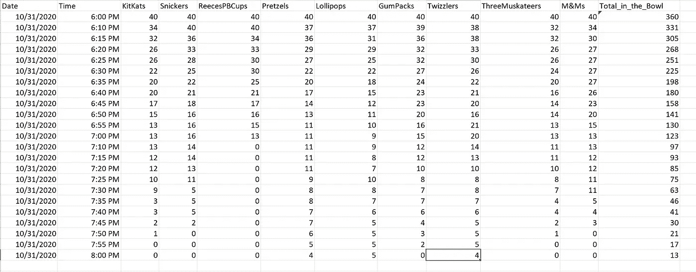

# 如何创建 Tableau 数据警报

> 原文：<https://towardsdatascience.com/how-to-create-tableau-data-alerts-3e7f508555ec?source=collection_archive---------43----------------------->

## 在你的老板接到你客户的电话之前得到关于数据异常的通知

图片由[苏·曼斯菲尔德](https://pixabay.com/users/sueinpng-5487588/?utm_source=link-attribution&utm_medium=referral&utm_campaign=image&utm_content=2355859)从[皮克斯拜](https://pixabay.com/?utm_source=link-attribution&utm_medium=referral&utm_campaign=image&utm_content=2355859)拍摄

当你有一套自动化的报告提供给你的商业伙伴时，你最终会收到可怕的电话或电子邮件。“我本打算在与客户会面时使用这些数据，但它看起来不太对。”要么是数据出了问题，要么是管道坏了，要么就是出现了可以解释的异常现象。当问题是由于你的一个中断的过程引起时，接到电话是令人尴尬的。最好在你的用户看到它之前得到通知。我将回顾如何在 Tableau 中设置通知。第一个知道。

有时候你需要设置一个主动预警。没什么问题，但是…但是你需要提前通知，这样你就可以密切关注整个过程。

如果你关注我的文章，你就会知道我尽量不去烦无聊的业务 KPI(当呼叫等待时间超过 2 分钟时提醒我，诸如此类)。让我们为一些有趣的事情设置一个提醒。假设你有一个连续测量你的万圣节糖果碗。不给糖就捣蛋的人来了，你购买了各种糖果，另一个家庭成员正在分发。私底下，你真的很想在士力架吃完之前吃一块。你还需要知道你什么时候会没有糖果，因为你可能需要在食品室里找一些应急储备(有人要吃吗？).

## **设置**

我试图在 Tableau Public 上做这个演示，但是我现在找不到任何可以在 Tableau Public 上设置警报的地方。我不得不切换到 Tableau 服务器。如果您的公司使用 Tableau，您很可能可以在已发布的工作表上设置预警。

来自 [Pixabay](https://pixabay.com/?utm_source=link-attribution&utm_medium=referral&utm_campaign=image&utm_content=1014629) 的 [pixel1](https://pixabay.com/users/pixel1-336525/?utm_source=link-attribution&utm_medium=referral&utm_campaign=image&utm_content=1014629) 的图像

## 数据

实时数据会有当前的日期和时间，如下表所示。我开始时每个人有 40 块糖果，数字逐渐减少，代表所有的小公主和忍者都来拿他们的糖果。因为我今晚要运行这个，所以我必须相应地调整日期/时间。

糖果碗算数——作者截图

## 工作簿

要在数据达到警报阈值时得到通知，您需要在过滤器架上将日期和/或时间设置为相对日期或时间。

Tableau Public 上的工作簿设置—作者截图

## 警报

工作簿发布后，任何具有访问权限的人都可以设置通知。首先，突出显示您想要监控的数据元素。在这种情况下，我希望在士力架用完时得到提醒。我还可以在 Bowl 泳道中设置总数警报。

在已发布的工作簿上设置警告—作者截屏

当满足警报条件时，您会收到一封电子邮件。

有人提醒我跑去拿最后一块士力架！—作者截图

***多甜啊？***

## 结论

不要让数据的变化让你吃惊。设置警报只需一分钟。第一个知道！如果有问题，您可以在任何人注意到之前解决它。

## 参考:

 [## 从 Tableau Online 或 Tableau Server 发送数据驱动的警报

### 当数据达到您业务的重要阈值时，数据驱动的警报会自动向以下人员发送电子邮件通知…

help.tableau.com。](https://help.tableau.com/current/pro/desktop/en-us/data_alerts.htm)