# 如何使用 Atom 为数据科学创建最棒的开发环境？

> 原文：<https://towardsdatascience.com/how-to-create-the-most-awesome-development-setup-for-data-science-using-atom-261113b46be8?source=collection_archive---------8----------------------->

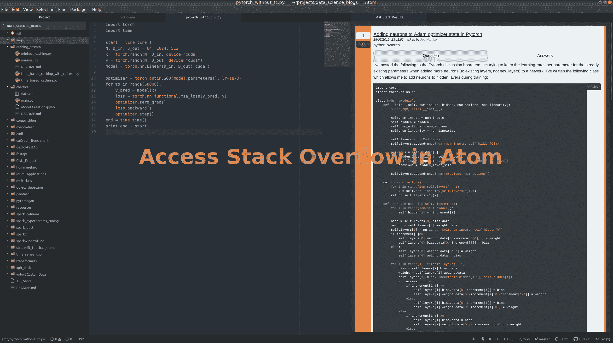

令人敬畏的 Atom 功能使其成为 Python 的优秀编辑器

## Github + Markdown +堆栈溢出+自动完成+ Jupyter

在我开始这篇文章之前，我只想说我喜欢 iPython 笔记本，Atom 在任何方面都不是 Jupyter 的替代品。笔记本为我提供了一个界面，在这里我不得不一次思考****编码一个代码块****，我喜欢这样称呼它，它帮助我更清晰地思考，同时帮助我使我的代码更加模块化。**

**然而，Jupyter 目前的形式并不适合某些任务。最突出的是当我不得不处理`.py`文件的时候。一个需要合作的人。py 文件，每当他们想把你的代码推向生产或改变别人的代码。所以，直到现在，我用 sublime text 编辑 Python 文件，我发现它非常优秀。但是最近，当我查看 Atom 编辑器时，当我看到它提供的多个开箱即用选项时，我的忠诚度似乎发生了转变。**

**现在，Atom 的真正力量来自您可以安装的各种包。在这篇文章中，我将讨论帮助 Atom 成为有史以来最易被黑客攻击和最健康的开发环境的包。**

# **安装 Atom 和一些开始的调整**

**在我们开始之前，我们需要安装 Atom。你可以在主网站[这里](https://atom.io/.)做。无论您的平台是什么，安装过程都非常简单。对于 Linux，我只是下载了`.deb`文件，双击它。一旦你安装了 Atom，你可以看看做一些调整:**

*   **使用`Ctrl+Shift+P`打开 Atom 中的核心设置，并在其中键入设置。这个`Ctrl+Shift+P`命令将成为 Atom 中最重要的命令之一，因为它允许您导航和运行许多命令。**

**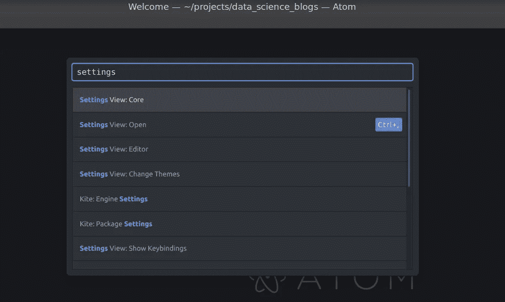**

**使用 Ctrl+Shift+P 访问设置窗口**

*   **现在进入`Editor`菜单，取消勾选`Soft Tabs`。这样做是为了使`TAB`键注册为`TAB`而不是两个空格。如果需要，您也可以激活“`Soft Wrap`”，如果文本超出窗口宽度，它会自动换行。**

**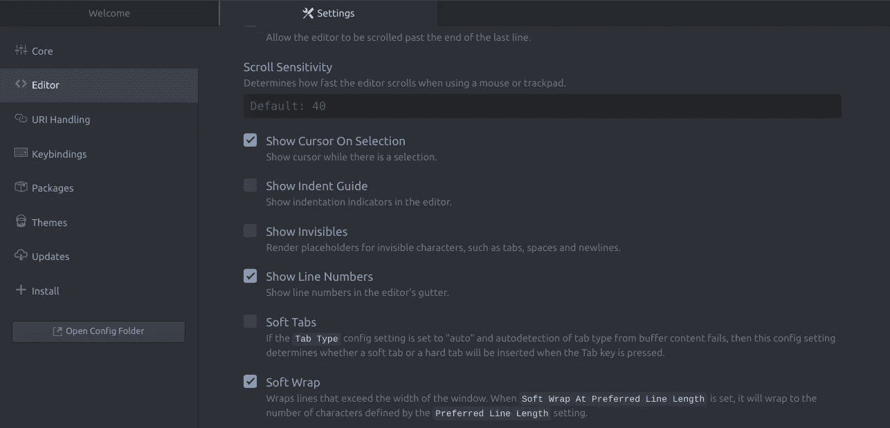**

**我首选的软包装和软标签设置。**

**现在，我们已经安装了 Atom，我们可以看看它提供的一些最棒的包。而其中最重要的是 GitHub。**

## **1.不离开编辑器提交到 Github**

**您是否厌倦了每次向 Github 提交时都离开文本编辑器使用终端？如果您的答案是肯定的，Atom 通过让您无需离开文本编辑器窗口就可以提交来解决这个问题。**

**这是将我从崇高文本推向 Atom 的主要特征之一。我喜欢 Atom 预装的这一功能，并且设置它不需要太多时间。**

**要开始使用它，请点击 Atom 屏幕右下方的 Github 链接，Atom 屏幕会提示您登录您的 GitHub 以提供访问。这是一次性的设置，一旦您登录并将生成的令牌交给 Atom，您将能够从 Atom 屏幕本身推送您的提交，而无需导航到终端窗口。**

********

**点击 GitHub，然后登录**

**推送提交的过程是:**

*   **更改任何文件或多个文件。**
*   **点击右下角的 Git。**
*   **上演变革**
*   **编写提交消息。**
*   **点击右下角的推送。**
*   **我们完成了:)**

**下面，我将一个非常简单的提交推送到 Github，在这里我将一个标题添加到我的 Markdown 文件中。这是一个 GIF 文件，所以可能需要一些时间来加载。**

**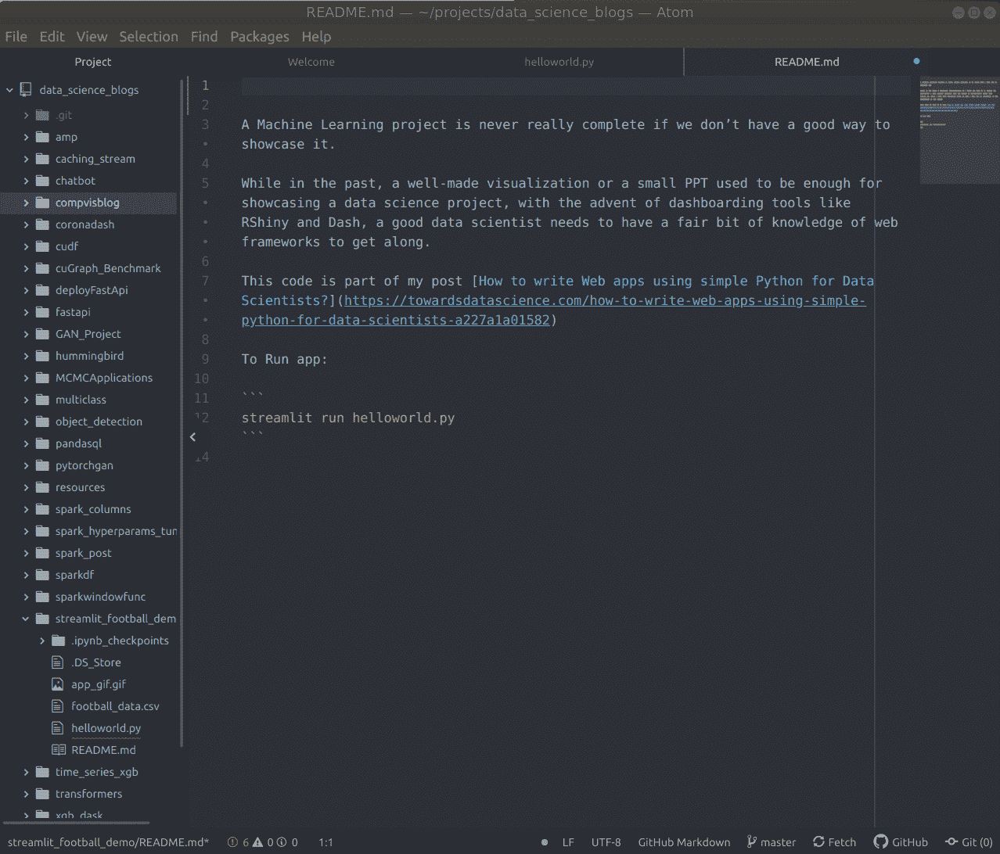**

**在 Atom 中提交**

## **2.用实时预览写减价**

**每当我为自己的网站写博客时，我总是在媒体编辑和 Markdown 之间左右为难。首先，当我不得不在帖子中使用数学符号或使用自定义 HTML 时，我更喜欢使用 Markdown。但是，我也喜欢媒体编辑器，因为它是所见即所得(所见即所得)。有了 Atom，我终于找到了完美的 markdown 编辑器，它为我提供了 Markdown 和 WYSIWYG。现在它已经成为我为 GitHub 创建任何 README.md 文件的默认选项。**

**在 Atom 中使用 Markdown 也是小菜一碟，默认情况下是激活的。要在 Atom 中查看 Markdown 的实时预览:**

*   **使用`Ctrl+Shift+M`打开降价预览窗格。**
*   **您在文档中所做的任何更改都将近乎实时地反映在预览窗口中。**

**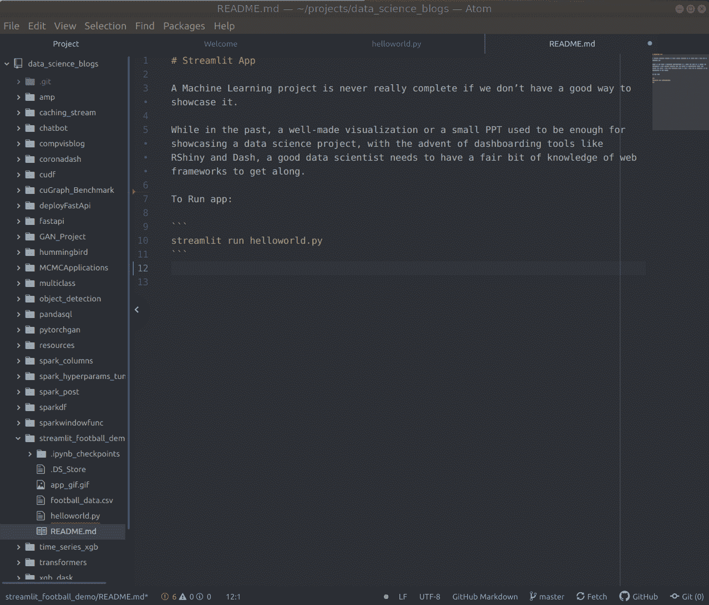**

**降价分屏编辑器**

## **3.小地图——大型代码文件的导航地图**

**到目前为止，我们还没有给 Atom 安装任何新的包，所以让我们安装一个基础包作为我们的第一个包。这个包被称为[小地图](https://atom.io/packages/minimap)，它是我在崇高的文字时代喜欢拥有的东西。它让你有一个侧面板，你可以点击并到达代码的任何部分。对于大文件非常有用。**

**要安装软件包，你可以去设置，然后点击安装软件包。`Ctrl_Shift+P > Settings > + Install > Minimap> Install`**

**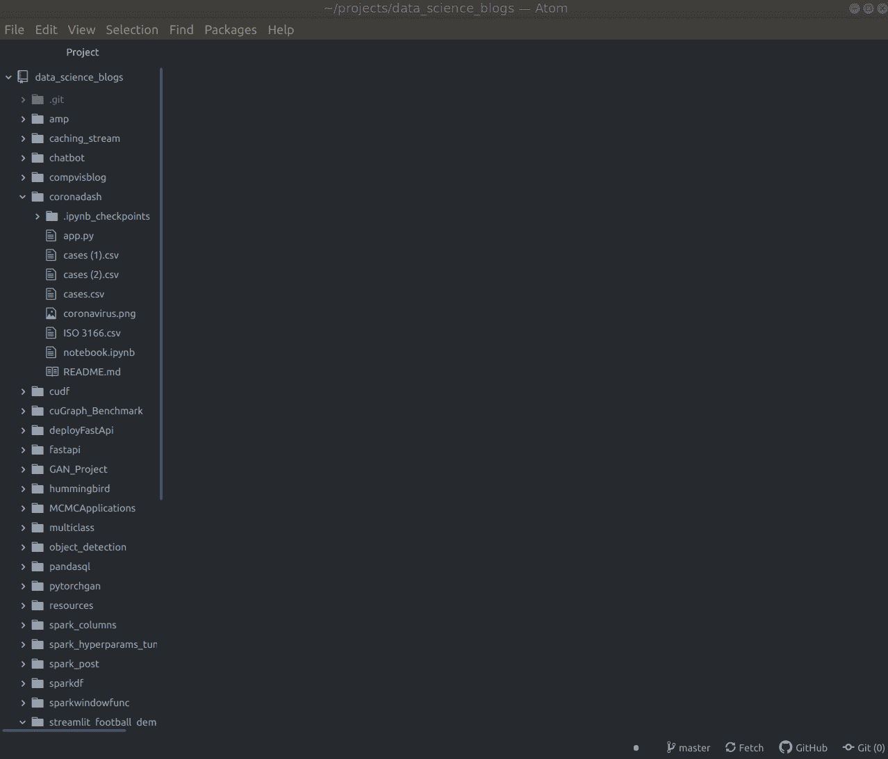**

**安装小地图或任何软件包**

**一旦你安装了这个包，你就可以在你的屏幕上看到这个小地图。**

**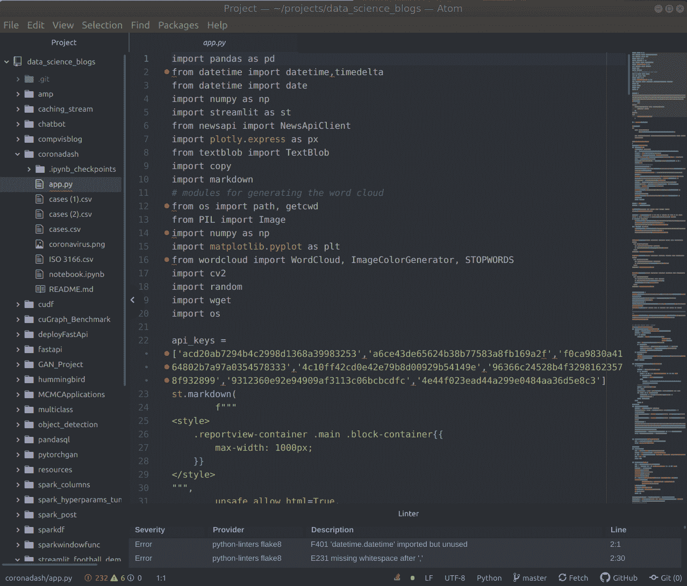**

**侧边栏轻松导航大文件**

## **4.在文本编辑器中使用函数定义的 Python 自动完成**

**一个编辑器永远不会真正完整，除非它为你提供一些你喜欢的语言的自动完成选项。Atom 与 Kite 集成得很好，Kite 尝试集成 AI 和 autocomplete。**

**因此，要启用 Kite 的自动完成功能，我们可以在 Atom 中使用名为`[autocomplete-python](https://atom.io/packages/autocomplete-python)`的包。安装步骤与之前相同。即`Ctrl+Shift+P > Settings > + Install > autocomplete-python> Install`。你也会看到使用风筝的选项。我通常最终使用 Kite 而不是 Jedi(另一个自动完成选项)。这是使用 Kite 自动完成功能处理 Python 文档时的样子。**

**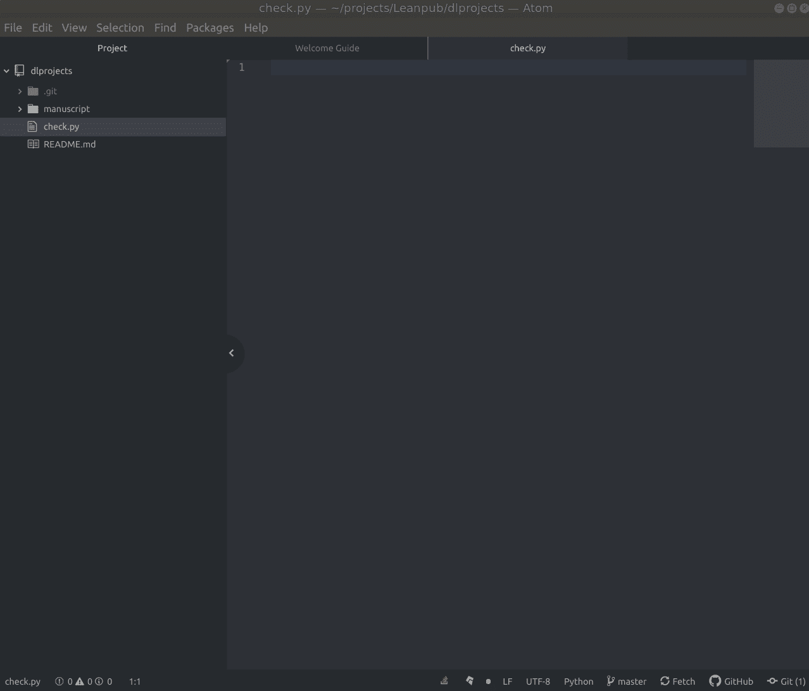**

**使用 Kite 的自动完成功能也可以让你看到函数定义。**

## **5.Hydrogen —在 Jupyter 环境中运行 Python 代码**

**想在带有 Jupyter 内核的 Atom 编辑器中运行 Python 吗？这也有办法。我们只需要用和以前一样的方法安装[氢气](https://atom.io/packages/hydrogen)。安装氢气后，您可以通过以下方式使用它:**

*   **使用`Ctrl+Enter`运行光标所在的命令。**
*   **从内核选择屏幕中选择任意内核。我从列表中选择`pyt`内核。**
*   **现在我可以继续在`pyt`内核中工作了。**

**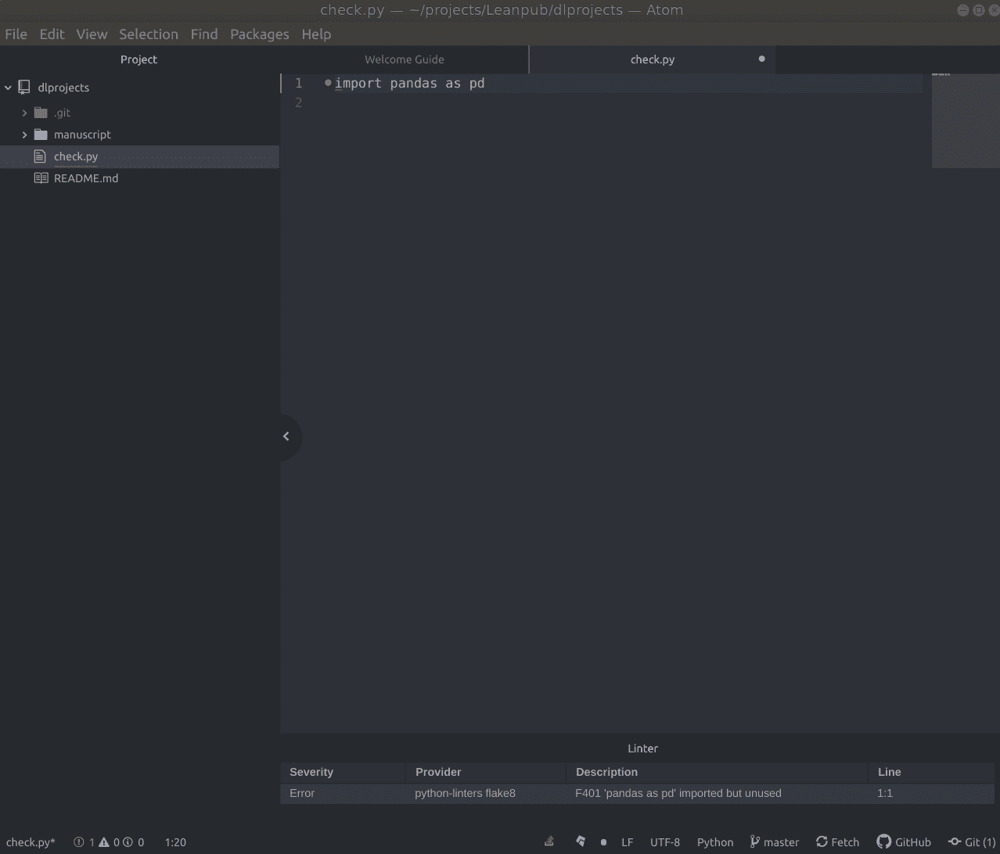**

**使用 Ctrl+Enter 运行命令会询问您使用哪个环境。**

**有时，您可能在 Atom 中看不到环境/内核。在这种情况下，您可以安装 ipykernel，使该内核对 Jupyter 和 Atom 可见。**

**下面是如何在 Jupyter/Atom 中创建一个新内核并使其可见的方法:**

```
**conda create -n exampleenv python=3.7
conda activate exampleenv
conda install -c anaconda ipykernel
python -m ipykernel install --user --name=exampleenv**
```

**一旦您运行这些命令，您的内核将被安装。现在，您可以使用以下命令更新 Atom 的内核列表:**

**`Ctrl+Shift+P >Hydrogen: Update Kernels`**

**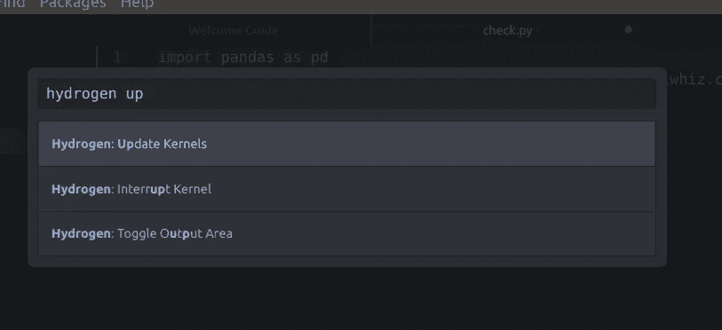**

**您的内核现在应该可以在 Atom 编辑器中使用了。**

## **6.文本编辑器中的搜索堆栈溢出**

**堆栈溢出是任何开发人员生活中不可或缺的一部分。但你知道麻烦是什么吗？离开编码环境，去 Chrome 搜索你需要做的每一件简单的事情。结果我们一整天都在这样做。那么，如果我们可以从 Atom 访问堆栈溢出呢？你可以通过**"**[**ask-stack**](https://atom.io/packages/ask-stack)**"**包准确地做到这一点，它让你在 SO 上搜索问题。我们可以使用`Ctrl+Alt+A`来访问它**

**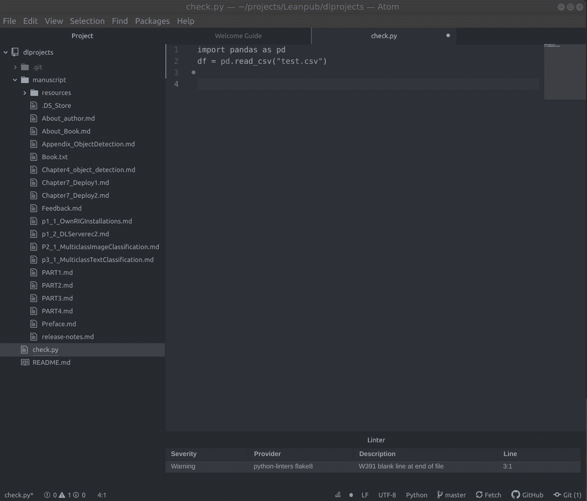**

**使用 Ctrl+Alt+A 访问 Atom 中的堆栈溢出。**

**您可以使用的其他一些值得尊敬的软件包有:**

*   **[**电传**](https://atom.io/packages/teletype) **:** 做配对编码。**
*   ****Linter:** 检查代码的风格和编程错误。要在 Python 中启用林挺，可以使用“ [**linter**](https://atom.io/packages/linter) ”和“[**Python-linters**](https://atom.io/packages/python-linters)”。**
*   **[**高亮显示选中的**](https://atom.io/packages/highlight-selected) **:** 通过双击或用光标选择文本来高亮显示文本的所有出现。**
*   **[**原子-文件-图标**](https://atom.io/packages/atom-file-icons) :在左侧树形视图中提供文件图标。看起来比以前好多了，对吧？**

**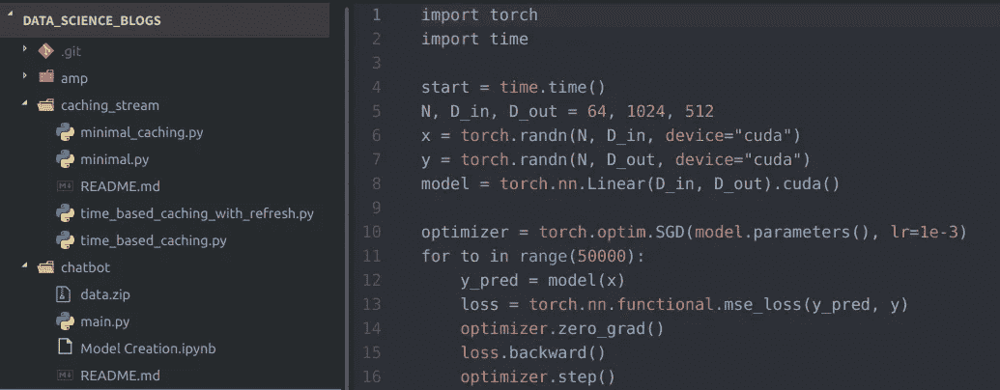**

**文件图标**

# **结论**

**在这篇文章中，我谈到了如何在 Python 开发流程中使用 Atom。**

**Atom 中还有很多您可能喜欢的其他[包](https://atom.io/packages)，您可以看看它们，让您的环境更加可定制。或者一个甚至可以像 Atom 一样编写自己的包的人被称为 ***【最可黑客攻击的编辑器】*** 。**

**如果你想学习 Python，但又不完全是 Python 编辑器，我想向你推荐密歇根大学的一门优秀的中级 Python 课程。一定要去看看。还有，这里是我的[课程推荐](/top-10-resources-to-become-a-data-scientist-in-2020-99a315194701?source=---------2------------------)2020 年成为数据科学家。**

**将来我也会写更多初学者友好的帖子。在 [**媒体**](https://medium.com/@rahul_agarwal) 关注我，或者订阅我的 [**博客**](http://eepurl.com/dbQnuX) 了解他们。一如既往，我欢迎反馈和建设性的批评，可以通过 Twitter [@mlwhiz](https://twitter.com/MLWhiz) 联系到我。**

**此外，一个小小的免责声明——这篇文章中可能会有一些相关资源的附属链接，因为分享知识从来都不是一个坏主意。**