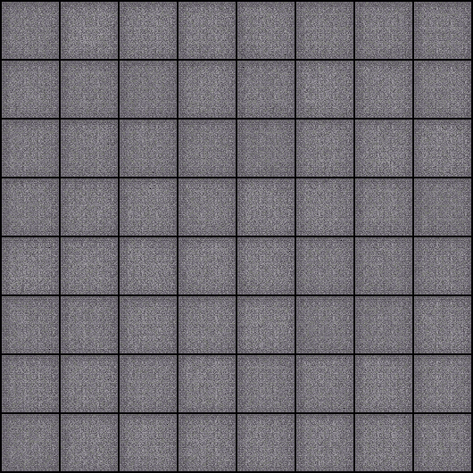
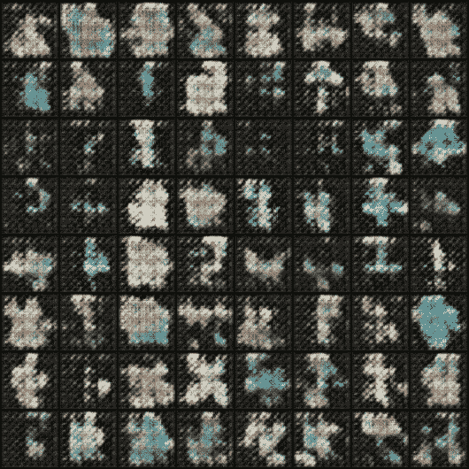

# 如何使用 GANs 创建独特的神奇宝贝

> 原文：<https://towardsdatascience.com/how-to-create-unique-pok%C3%A9mon-using-gans-ea1cb6b6a5c2?source=collection_archive---------18----------------------->

## 以及如何让它变得更好的想法


我儿子真的很喜欢口袋妖怪。我不明白，但我想这是题外话。不过，我确实开始想知道，我是否可以利用深度学习自动为他创建新的口袋妖怪卡片。

我最终成功地使用生成对抗网络(GANs)生成了类似口袋妖怪的图像，我想其他人可能会喜欢看到这个过程。

## 生成对抗网络


[来源](/generative-adversarial-networks-explained-34472718707a)

我不想花太多时间讨论什么是 gan，但上面的图像是对过程的一个非常简单的解释。

你训练两个网络——一个鉴别器和一个生成器。生成器学习如何接受随机噪声并生成看起来像来自训练数据的图像的图像。它通过将其生成的图像馈送到鉴别器网络来做到这一点，该鉴别器网络被训练来辨别真实图像和生成的图像。

生成器被优化以越来越好地欺骗鉴别器，而鉴别器被优化以越来越好地检测生成的图像。因此，两者共同提高。

如果你想了解更多，你可以通过谷歌找到许多令人惊叹的文章、书籍和 YouTube 视频。

所以——我的假设是，我可以用真实的口袋妖怪图像作为我的训练集来训练 GAN。结果将是一个发电机，然后将能够创造新的口袋妖怪！太棒了。

## **数据**

我的第一个挑战是寻找口袋妖怪的图像。幸运的是，Kaggle 数据集拯救了我们！

有人已经想到了一个类似的想法，虽然听起来他在生成新的口袋妖怪图像方面没有太大的成功，但是因为他花了时间收集 800 多张图像，他决定将它们上传到 Kaggle [数据集](https://www.kaggle.com/kvpratama/pokemon-images-dataset#101.png)。

这节省了我大量的时间。

我还了解到，实际上只有大约 800 个口袋妖怪，所以不可能用额外的口袋妖怪来扩展这个数据集。

以下是其中一幅图像的示例(256 x 256):


## 该算法

现在我有了数据，我必须选择我想要使用的 GAN 类型。可能存在数百种不同的 GAN，但我在过去使用 **DCGAN** 时看到了很好的结果。

DCGAN 从神经网络中消除任何完全连接的层，使用转置卷积进行上采样，并用卷积步长(以及其他)替换最大池。

我喜欢 DCGANs，因为与我尝试过的其他 gan 相比，它们似乎更健壮，因此更容易训练，而无需对超参数进行重大调整。

事实上，DCGAN 是如此受欢迎，以至于 PyTorch 有一个非常好的实现作为它的[例子之一](https://github.com/pytorch/examples/tree/master/dcgan)。最棒的是，他们的例子可以直接从文件夹中读取输入。因此，通过下面的命令，我可以开始训练我的 GAN:

```
python main.py --dataset folder --dataroot ~/Downloads/pokemon/  --cuda --niter 10000 --workers 8
```

这个命令从~/Downloads/pokemon 文件夹中读取图像，在我的 GPU 上运行，有 8 个工人加载数据，并运行 10，000 次迭代。

事实证明 10，000 次迭代对这个问题来说太多了，但是我想看看我能把它推进多远。我们来看看吧！

## 结果呢

第一步从一无所知的网络开始，所以产生的都是噪音:



每个盒子是一个 64 x 64 像素的图像，并试图从我们的生成器生成一个口袋妖怪。由于我们的网格是 8 x 8，我们有 64 个不同的口袋妖怪试图生成。我将图像缩小到 64 x 64，因为当试图生成更大的图像时，这种算法变得不稳定(或者至少对我来说是这样)。

50 个纪元后，我们开始看到一些生命:



150 年后，事情变得更清楚了:


3700 后，你有一些中途体面的 64 x 64 尝试口袋妖怪。在这之后，它开始转向更坏的结果:


现在——我知道你在想什么，那些看起来一点也不像口袋妖怪！

我想请你把浏览器缩小到 25%左右，再看一遍。**从远处看，它们和真正的口袋妖怪惊人地相似。**

问题是，由于我们是在 64 x 64 的图像上进行训练，鉴别器很容易被形状和颜色都像口袋妖怪的图像所欺骗，因此生成器不需要改进。

## 后续步骤

在我看来，显而易见的下一步是训练更高分辨率的 GAN。事实上，我已经在这方面做了一些尝试。

我的第一次尝试是重写 PyTorch 代码，以缩放到 256 x 256 的图像。代码起作用了，但是 DCGAN 坏了，我无法稳定训练。我相信这主要是因为我只有大约 800 张图片。虽然我做了一些数据扩充，但这不足以训练更高分辨率的 DCGAN。

然后，我尝试使用一个[相对论 GAN](https://arxiv.org/abs/1807.00734) ，它已经成功地用小数据集对高分辨率数据进行了训练，但也无法正常工作。

我将继续尝试一些其他的想法来生成更高分辨率的口袋妖怪，如果我得到一些工作，我会张贴我使用的技术。

别的不说，也许我们可以把这些生成的口袋妖怪**叫做烟雾型口袋妖怪？**

你也可以在这里找到这个故事。

有兴趣了解有关 Python 数据分析和可视化的更多信息吗？查看我的[课程](https://www.educative.io/courses/python-data-analysis-and-visualization)。