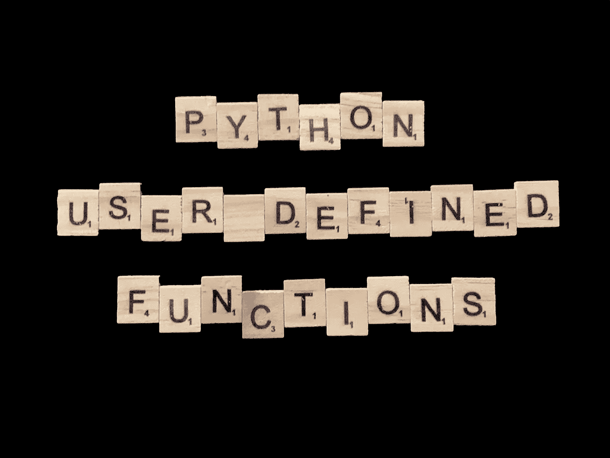

# 如何在 Python 中创建用户定义的函数

> 原文：<https://towardsdatascience.com/how-to-create-user-defined-functions-in-python-e5a529386534?source=collection_archive---------2----------------------->

## 通过定义您自己的函数来提升您的 Python 游戏

[拉杆脚轮](https://medium.com/u/4d32c78bd7f8?source=post_page-----e5a529386534--------------------------------)

你有没有想过，“我希望 Python 有一个做 ________ 的函数。”填空。如果是这样，我有个好消息！Python 让您能够创建自己的自定义函数。有几件事你需要明白，但这并不难做到。所以让我们开始吧。

自定义函数是很好地打包可重用代码块的好方法。在最基本的层面上，自定义函数只需要五个组件:

1.  使用 *def* 关键字开始函数定义。
2.  说出你的函数。
3.  提供一个或多个参数。*实际上参数是可选的，但是括号不是。*后跟冒号。
4.  输入代码行，让你的函数做任何事情。输入代码，此处的 *#逻辑*如下面的示例代码所示。
5.  在函数末尾使用 return 关键字返回输出。这也是可选的。如果省略，该函数将返回 None。

如您所见，函数的基本框架很简单。让我们停止玩理论思维，创建一个实际的功能。

# 函数名

每个函数都需要一个名字。否则，当您需要使用它时，就无法在代码中引用它。给你的函数起一个直观的名字。如果您的函数的目的是对您通过参数列表发送给它的所有数字求和，请将其命名为 *add_nums()* 或 *sum_the_numbers()* 。不要将其命名为 *s()* 或 *function1()。最后两个是糟糕的选择。记住，代码是由人类阅读的。*

此外，函数名后面必须跟一组括号。如果你不需要任何参数，括号将是空的，但它们必须存在。然后用冒号结束定义行。冒号表示该行下面的任何缩进行都是函数的一部分。

# 因素

一旦命名了函数，就要决定所需的参数。参数或自变量用于将相关数据传递给函数。这个函数能把多少个数字加在一起？如果没有提供参数，将使用默认值吗？论点的顺序是什么？

参数被插入到函数名后面的括号中。它们由逗号分隔。同样，使用直观的名称，这样您可以很容易地回忆起每个参数的用途。

如果我们的函数只将两个数相加，我们可以创建两个参数， *num1* 和 *num2* 。如果我们改变函数来添加三个数字，我们可以添加第三个参数， *num3* 。

如果您选择为参数分配默认值，只需将当前参数名称替换为 *num1=0* 和 *num2=0* 。0 应该替换为您想要分配的任何默认值。

通常，当你执行一个函数时，你会使用一行类似于 *sum_the_numbers (5，3)* 的代码来调用它。通过提供默认值，您可以从代码的执行行中省略一个或多个参数，函数仍然会运行，只使用默认值。

# 逻辑

现在让我们给函数添加一些逻辑。这就是函数将数字相加的原因。如果您正在执行一个简单的任务，例如将两个数字相加，这一部分可能会很短。或者，对于更复杂的任务，这一部分可能有数百行代码。记住，作为函数一部分的所有代码行都必须像下面的 *total = num1 + num2* 行一样缩进。

# 返回值

既然您的代码已经完成了规定的工作，您可能需要也可能不需要向调用您的函数的进程返回值。如果不需要返回值，可以省略 *return* 语句。然而，在这个示例函数中，我们需要返回总和。该行是*返回总计*。

return 语句将存储在 total 中的值发送回执行该函数的代码段。通常会有一个变量来存储返回值。例如，*求和= sum_the_numbers (5，3)* 。该函数返回的值将存储在*求和*变量中。现在我们已经拥有了成功实现函数的所有必要组件，让我们看看如何在代码段中执行它。

# 执行功能

每当我们执行一个用户定义的函数时，我们使用带有任何必需参数的函数名。如果函数返回值，我们通常会对它的输出做一些事情。我们可以把它打印出来，存储在一个变量中，或者发送到另一个函数中。假设我们要将输出存储在一个变量中，我们的函数执行可能类似于下面的代码。

如果我们选择将返回值直接打印到屏幕上，我们可以使用下面的代码。

请记住，当您调用您的函数时，参数必须按照您在函数定义中列出的顺序提供， *num1* 后跟 *num2* 。但是，如果您忘记了顺序，只要在执行函数时指定参数关键字，就可以更改顺序。当使用参数关键字时，该命令将类似于 *sum_the_numbers (num2=5，num1=10)* 。

# 不确定数量的参数

我相信你已经看出我们设计的问题了。每次我们希望添加更多的数字时，我们都需要添加另一个参数。但是有一种方法可以处理函数中无限多的参数。使用*args 技术，而不是在函数定义的括号中列出每个参数名。

当一个*跟在一个参数名后面时，它表示可以向该函数传递任意数量的参数。这将创建一个参数值列表。您只需在函数中解包 args 列表。我们功能上的这一小小变化使它变得更加灵活。

# 把所有的放在一起

通常，用户定义的函数和执行它的代码在同一个 Python 脚本中。在我们的例子中，整个脚本看起来像这样。

标准的用户定义函数使用起来很简单，但是对于开发人员来说是一个非常强大的工具。当然，用户定义的函数不会因为这种标准方法而停止。如果你在网上或者从深夜的电视购物节目中买东西，你会期望花 19.95 美元得到更多。用户定义的函数也是如此。

# 匿名函数

如果你喜欢标准的用户定义函数，你会喜欢匿名的用户定义函数。这些函数是在您需要的地方内联编写的，没有名称，也没有适当的定义语法。这些函数也被称为理解函数或λ函数。

对于这个例子，假设我们的场景和上面一样。我们需要一个能将两个数相加的函数。我们可以使用 lambda 函数来代替 sum_the_numbers 函数。

Lambda 是用来定义这些函数的 Python 关键字，而不是 *def* 。因此，它们通常被称为*λ*函数。

在这个 lambda 函数的例子中，我们将变量 answers 定义为函数本身。然后，当我们引用变量名时，我们只需传入所需的参数。结果是一个伪装成动态变量的匿名函数。

简而言之，匿名函数的语法是*lambda argument _ list:expression*。

让我们的例子更进一步，假设这个场景从一个数字列表开始。我们需要通过平方第一个列表中的每个数字来创建一个新的数字列表。我们可以像上面那样创建一个标准的用户定义函数来完成这个任务。但是，我们决定使用匿名函数。

为了遍历列表，我们使用 Python 的 map 函数。map 函数有两个参数。第一个是函数。在这种情况下，它将是一个匿名函数。第二个参数是一些可迭代的数据，比如我们要平方的数字列表。map 函数将获取 iterable 中的每一项，通过指定的函数运行它，并将输出附加到一个新的 iterable 数据结构中。

这段代码中的 *list()* 函数将 map 函数的默认可迭代输出(map 对象)转换为 Python 列表。列表在我们代码的其余部分更容易使用。

同样，你可以看到，与下面使用的标准方法相比，我们的 lambda 代码相对较短。

# 结论

投入必要的时间来学习如何用 Python 实现用户定义的函数。他们很强大。他们创建可重用的代码块。他们帮助组织你的代码。如果您开始使用面向对象编程技术，它们是绝对必要的。用户自定义函数是现代开发人员必备的工具。