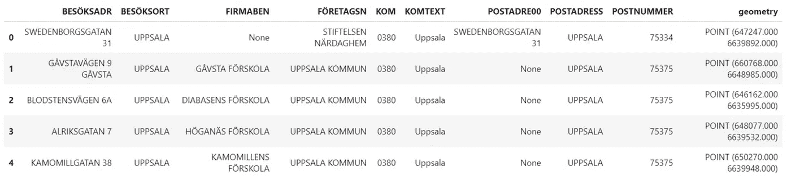
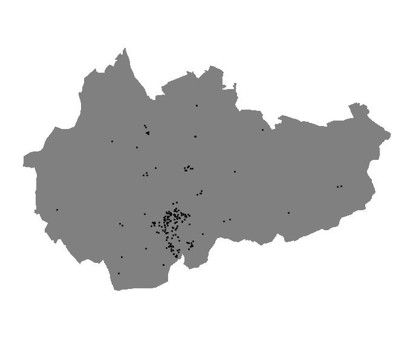
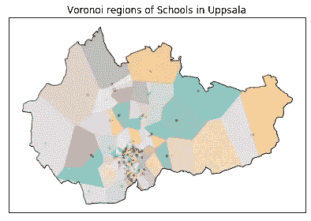
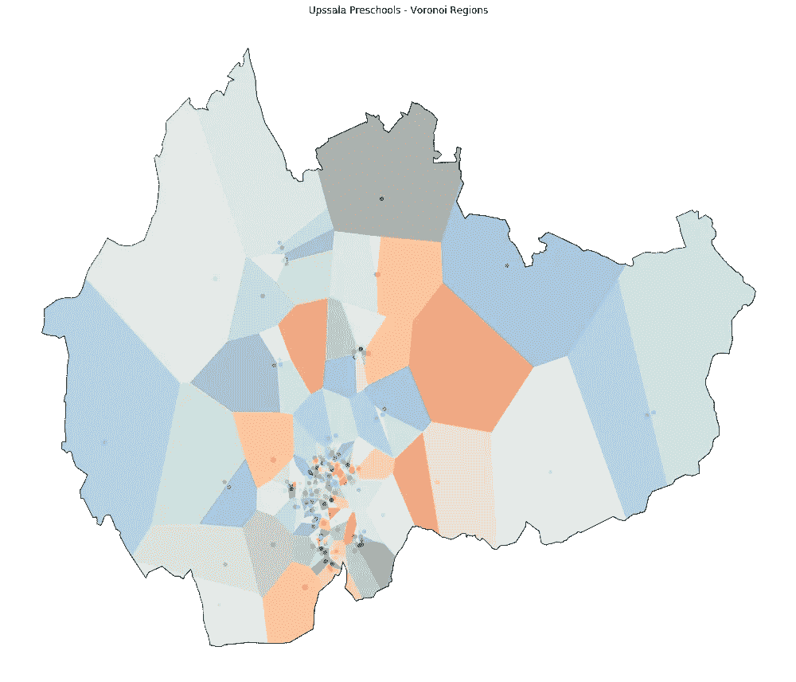

# 如何在 Python 中使用地理空间数据创建 Voronoi 区域

> 原文：<https://towardsdatascience.com/how-to-create-voronoi-regions-with-geospatial-data-in-python-adbb6c5f2134?source=collection_archive---------7----------------------->

## 地理数据科学

## 在 Python 中创建和绘制 Voronoi 图的逐步指南


安迪·福尔摩斯在 [Unsplash](https://unsplash.com?utm_source=medium&utm_medium=referral) 上的照片

假设你打算步行去车站取一辆小型摩托车。附近有很多车站。你应该去哪家取滑板车骑？

最近的车站，对！

但是，你怎么知道离你家最近的车站呢？

输入 Voronoi 图。

> Voronoi 图是多边形的集合，所有点都在最接近单个对象的平面上。

换句话说，每个多边形分区都与一个对象相关联，并且包含与该对象最近的所有点。

## 应用程序

Voronoi 图的应用很多，通常包括确定哪个特征最接近任何给定点。例如，确定在邻近区域的给定点上哪所学校最近。或者哪个手机发射塔离我手机最近才能打电话。

据说，1854 年约翰·斯诺绘制的霍乱爆发图在五天内导致 500 人死亡，该图在一张图表上绘制了水泵数据，并有效地构建了伦敦内部街区的 Voronoi 图。

我们不能在这里列出 Voronoi 图所有可能的用例。尽管如此，它的应用是深远的，包括人类学和考古学，统计学和数据分析，市场营销和气象学。[这里有一长串它的应用](https://www.ics.uci.edu/~eppstein/gina/scot.drysdale.html)。

## 用 Python 创建 Voronoi 区域

在本教程中，我们使用幼儿园数据集创建一个 Voronoi 图。该数据集包含瑞典乌普萨拉县的所有幼儿园。为了创建 Voronoi 图，我们将使用几个库，包括 [Geopandas](https://geopandas.org/) 和 [Geovoronoi](https://github.com/WZBSocialScienceCenter/geovoronoi) 。

让我们先导入库并读取数据。

```
import numpy as np
import geopandas as gpd
import contextily as ctx
import matplotlib.pyplot as pltfrom shapely.ops import cascaded_unionfrom geovoronoi.plotting import subplot_for_map, plot_voronoi_polys_with_points_in_area
from geovoronoi import voronoi_regions_from_coords, points_to_coordsgdf = gpd.read_file("data/preschools.shp")
gdf.head()
```

如数据的前几行所示，我们有一个几何列，其中包含点和一些其他属性，如县、邮政地址等..



学前教育数据

我们可以绘制点数据。为了给出一些背景，我们还读取了县的边界，并在其上绘制了点。

```
boundary = gpd.read_file(“data/uppsala.shp”)fig, ax = plt.subplots(figsize=(12, 10))
boundary.plot(ax=ax, color=”gray”)
gdf.plot(ax=ax, markersize=3.5, color=”black”)
ax.axis(“off”)
plt.axis(‘equal’)
plt.show()
```

输出是显示瑞典乌普萨拉县所有幼儿园(黑点)的地图。



乌普萨拉的幼儿园

在我们计算 Voronoi 区域之前，我们需要确定两件事。首先，我们需要检查数据的投影，然后将其转换为 Web 墨卡托投影(epsg=339599。

```
boundary = boundary.to_crs(epsg=3395)
gdf_proj = gdf.to_crs(boundary.crs)
```

其次，我们需要将数据准备成 Geovoronoi 库可以使用的格式。这里，我们将边界几何转换为多边形的并集。我们还将 Geopandas 点对象的地理序列转换为 NumPy 坐标数组。

```
boundary_shape = cascaded_union(boundary.geometry)coords = points_to_coords(gdf_proj.geometry)
```

**计算 Voronoi 区域**

现在，我们已经准备好了数据，我们可以简单地使用 Geovoronoi 的方法 **voronoi_regions_from_coords()来计算 Voronoi 区域。**

```
# Calculate Voronoi Regions
poly_shapes, pts, poly_to_pt_assignments = voronoi_regions_from_coords(coords, boundary_shape)
```

输出包含形状、点以及两者之间的标识链接。

**绘制 Voronoi 图**

为了绘制 Voronoi 图，我们还使用了 geo Voronoi—**plot _ Voronoi _ polys _ with _ points _ in _ area()的功能。**这里，我们提供了上述 Voronoi 计算的所有输出和边界形状。

```
fig, ax = subplot_for_map()plot_voronoi_polys_with_points_in_area(ax, boundary_shape, poly_shapes, pts, poly_to_pt_assignments)ax.set_title('Voronoi regions of Schools in Uppsala')plt.tight_layout()
plt.show()
```

输出是一个 Voronoi 图，它将学校点划分为离每个位置最近的区域。



Voronoi 图

上面的地图很小，但好处是我们可以使用熟悉的 Matplotlib 接口来调整它。让我们先看看 plot _ Voronoi _ polys _ with _ points _ in _ area()函数的参数和文档。

```
plot_voronoi_polys_with_points_in_area**(
**    ax**,
**    area_shape**,
**    poly_shapes**,
**    points**,
**    poly_to_pt_assignments**=None,
**    area_color**='white',
**    area_edgecolor**='black',
**    voronoi_and_points_cmap**='tab20',
**    voronoi_color**=None,
**    voronoi_edgecolor**=None,
**    points_color**=None,
**    points_markersize**=5,
**    points_marker**='o',
**    voronoi_labels**=None,
**    voronoi_label_fontsize**=10,
**    voronoi_label_color**=None,
**    point_labels**=None,
**    point_label_fontsize**=7,
**    point_label_color**=None,
**    plot_area_opts**=None,
**    plot_voronoi_opts**=None,
**    plot_points_opts**=None,
)**
**Docstring:**
All-in-one function to plot Voronoi region polygons `poly_shapes` and the respective points `points` inside a
geographic area `area_shape` on a matplotlib Axes object `ax`. By default, the regions will be blue and the points
black. Optionally pass `poly_to_pt_assignments` to show Voronoi regions and their respective points with the same
color (which is randomly drawn from color map `voronoi_and_points_cmap`). Labels for Voronoi regions can be passed
as `voronoi_labels`. Labels for points can be passed as `point_labels`. Use style options to customize the plot.
Pass additional (matplotlib) parameters to the individual plotting steps as `plot_area_opts`, `plot_voronoi_opts` or
`plot_points_opts` respectively.
```

如您所见，我们可以使用许多参数来格式化可视化。文档也非常清晰和有用。

我们可以增加点的图形大小和标记大小。我们也可以使用 Matplotlib Colormap 改变颜色。这只是一种方式，还有其他方式可以调整，我留给你。

```
fig, ax = plt.subplots(figsize=(14,12))plot_voronoi_polys_with_points_in_area(ax, boundary_shape, poly_shapes, pts, poly_to_pt_assignments,
 voronoi_and_points_cmap=’tab20c’,
 points_markersize=20)ax.set_title(‘Upssalla Preschools — Voronoi Regions’)
ax.axis(“off”)
plt.tight_layout()
plt.show()
```

现在的输出贴图与之前的默认贴图相比要好得多。



沃罗诺伊——乌普萨拉幼儿园

## 结论

Voronoi 图是有用的，并且在许多地理应用中广泛使用。在本教程中，我们已经介绍了如何使用 Python 创建 Voronoi 图。

本文的代码和数据可以在这个 Github 存储库中找到。

[](https://github.com/shakasom/voronoi) [## shakasom/voronoi

### 用 Python 制作 Voronoi 图。在 GitHub 上创建一个帐户，为 shakasom/voronoi 的发展做出贡献。

github.com](https://github.com/shakasom/voronoi)