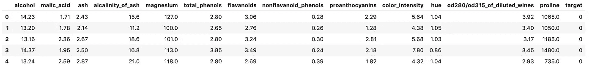
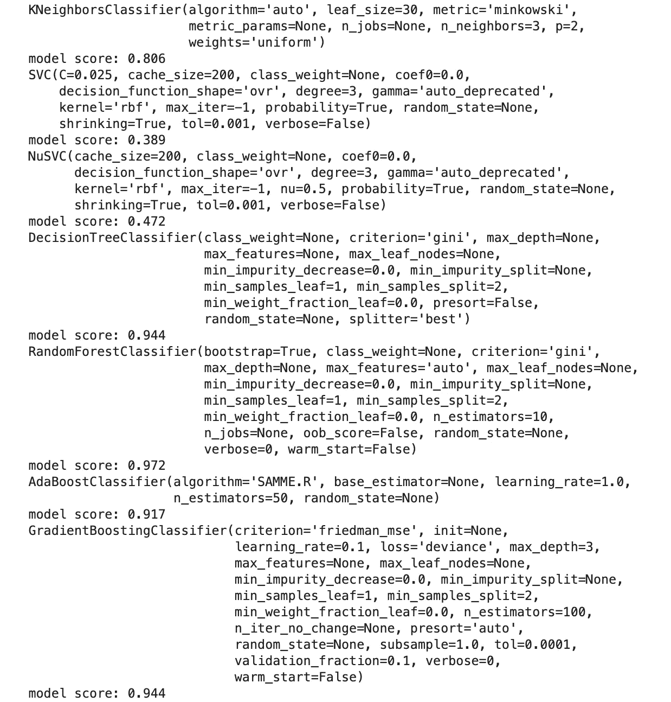
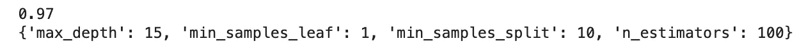
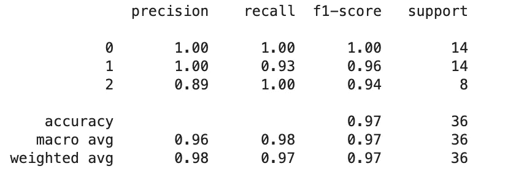

# 如何创建你的第一个机器学习模型

> 原文：<https://towardsdatascience.com/how-to-create-your-first-machine-learning-model-4c8f745e4b8c?source=collection_archive---------4----------------------->


凯尔西·奈特在 [Unsplash](https://unsplash.com/s/photos/wine?utm_source=unsplash&utm_medium=referral&utm_content=creditCopyText) 上的照片

## 用 Python 创建简单机器学习模型的指南

许多机器学习教程专注于机器学习工作流的特定元素，如数据清理、模型训练或算法优化。然而，如果你是机器学习的新手，没有完整简单的解释或演练，很难完全掌握基本的端到端工作流。

在下面的帖子中，我将提供一个非常简单的教程，用 python 开发一个有监督的机器学习模型。在这篇文章中，我将假设你只有非常基本的 python 编程知识，并且已经安装了一些常用的数据科学库。如果你首先需要一个关于数据科学的 python 介绍， [Codeacademy](https://www.codecademy.com/learn/learn-python) 是一个不错的起点。我还将提供教程中包含的所有库的文档链接。

## 什么是机器学习？

机器学习是计算机能够学习一些输入(数据特征)和一些已知输出(数据标签)之间的映射而无需显式编程的能力。目标是，给定未知输出的新输入，机器可以正确预测标签。

> "机器学习本质上是一种事物标签."， [**卡西科兹尔科夫**](https://hackernoon.com/@kozyrkov)

这种输入到输出的映射由数学函数执行，主要来自线性代数和微积分领域，其执行速度和规模在没有大量计算能力的情况下是无法实现的。有许多不同的算法可以完成这项任务，从简单的基于回归的方法到更复杂的深度学习技术。

幸运的是，python 编程语言有一个非常活跃的开源开发者社区，他们构建了许多库，这些库抽象出了直接编写这些算法的需求。其中一个核心的机器学习库是 [scikit-learn](https://scikit-learn.org/stable/index.html) ，对于初学者来说非常容易访问。在本教程中，我将关注这个库。

## 数据

为了简单起见，我将使用机器学习来解决一个分类问题。我将使用 scikit-learn API 中的一个玩具数据集，该数据集包含三种类型的葡萄酒(标签或目标)的许多葡萄酒属性(特征)，如酒精度和颜色。

要加载数据并将其转换为 [pandas](https://pandas.pydata.org/) 数据框，请使用如下所示的代码。

```
from sklearn.datasets import load_wine
import pandas as pdwine = load_wine()
data = pd.DataFrame(data=wine['data'], columns = wine['feature_names'])
data['target'] = wine['target']
data.head()
```



因为机器学习算法是基于数学的，所以用于机器学习的数据本质上必须是数字。这个数据集完全是数字的，但是，如果我们有分类特征，我们将需要执行一些预处理来首先将它们转换成数字。我选择了这个数据集，这样我就可以展示开发模型的最简单的工作流，而不用引入更多关于数据预处理的高级概念。

## 测试列车分离

在开发机器学习模型时，重要的是能够评估它能够将输入映射到输出并做出准确预测的能力。但是，如果您使用模型已经看到的数据(例如，在训练期间)来评估性能，那么您将无法检测诸如过度拟合之类的问题。

过度拟合是指模型在训练数据中学习了过多的细节或噪音，而这些不一定存在于看不见的数据中。在这种情况下，模型在训练数据上表现良好，但在看不见的数据上表现不佳。这通常被称为模型不能很好地概括。

机器学习中的一个标准是，首先把你的训练数据分成一组用于训练，一组用于测试。对于要进行的精确大小划分没有规则，但是为训练保留更大的样本是明智的——典型的划分是 80%训练数据和 20%测试数据。

重要的是，数据也是随机分割的，这样您就可以很好地表示两组数据中存在的模式。Scikit-learn 有一个工具可以在一行代码中完成这个过程，这个工具叫做 [test_train_split](https://scikit-learn.org/stable/modules/generated/sklearn.model_selection.train_test_split.html) 。下面的代码将特性和目标数据传递给函数，并指定 20%的测试大小。

```
from sklearn.model_selection import train_test_splitX_train, X_test, y_train, y_test = train_test_split(data.drop('target', axis=1), data['target'], test_size=0.20, random_state=0)
```

## 基线模型

接下来训练一个虚拟分类器以获得基线分数来为模型开发的进一步迭代设定基准是一个好主意。Scikit-learn 有一个[功能](https://scikit-learn.org/stable/modules/generated/sklearn.dummy.DummyClassifier.html)，允许你训练一个模型，并根据简单的规则进行预测，比如随机预测。这有助于评估您的模型开发在您迭代后续步骤时是否有所改进。

在下面的代码中，我训练了一个虚拟分类器，它总是预测最频繁出现的类。然而，虚拟分类器对此有许多不同的方法。准确度分数是 0.44。完美的准确度分数应该是 1.0。现在进入下一阶段，我们将知道我们是否在这个基线上有所改进。

```
from sklearn.dummy import DummyClassifier
from sklearn.metrics import accuracy_scorebaseline = DummyClassifier(strategy='most_frequent', random_state=0).fit(X_train, y_train)
y_pred = baseline.predict(X_test)
print(round(accuracy_score(y_test, y_pred),4))
```

## 型号选择

现在我们有了一个训练好的基线模型，我们需要评估是否有另一种算法可以更好地处理我们的数据。Scikit-learn 有这个有用的[备忘单](https://scikit-learn.org/stable/tutorial/machine_learning_map/index.html)，它将让你了解解决分类问题的不同算法。

下面的代码循环遍历一系列分类算法，并打印出结果分数。输出显示在代码下方。

```
from sklearn.metrics import accuracy_score, log_loss
from sklearn.neighbors import KNeighborsClassifier
from sklearn.svm import SVC, LinearSVC, NuSVC
from sklearn.tree import DecisionTreeClassifier
from sklearn.ensemble import RandomForestClassifier, AdaBoostClassifier, GradientBoostingClassifier
from sklearn.discriminant_analysis import LinearDiscriminantAnalysis
from sklearn.discriminant_analysis import QuadraticDiscriminantAnalysisclassifiers = [
    KNeighborsClassifier(3),
    SVC(kernel="rbf", C=0.025, probability=True),
    NuSVC(probability=True),
    DecisionTreeClassifier(),
    RandomForestClassifier(),
    AdaBoostClassifier(),
    GradientBoostingClassifier()
    ]for classifier in classifiers:
    model = classifier.fit(X_train, y_train)
    print(classifier)
    print("model score: %.3f" % model.score(X_test, y_test))
```



我们可以看到，RandomForestClassifier 对于该模型表现最佳，因此我们将选择该算法来训练我们的最终模型。

## 超参数优化

每个机器学习算法都有大量的参数用于控制学习过程。这些参数可以更改，并且根据数据集可以提高模型的性能。为算法和数据集寻找最佳参数集的过程被称为[超参数优化](https://en.wikipedia.org/wiki/Hyperparameter_optimization)。

从上一节运行的代码中我们知道，随机森林分类器在我们使用的数据集上表现最好。如果你看一下这个模型的[文档](https://scikit-learn.org/stable/modules/generated/sklearn.ensemble.RandomForestClassifier.html)，你会发现这个算法有很多参数可以调整。

超参数优化的一种常用方法是网格搜索。Scikit-learn 提供了一个名为 [GridSearchCV](https://scikit-learn.org/stable/modules/generated/sklearn.model_selection.GridSearchCV.html) 的函数来执行这个任务。我们需要向这个函数传递一个 python 字典形式的网格，其中包含参数名和相应的参数列表。这就变成了函数将要搜索的参数空间。

然后，该函数将为给定分类器的每个参数组合建立一个模型。一旦完成，您将能够以最佳模型和最佳参数组合的形式获得结果。

为了简单起见，在下面的例子中，我选择只调整四个参数。它们如下:

**n_estimators:** 模型中树的数量。

**max_depth:** 树的最大深度。

**min_samples_split:** 节点被拆分前，节点中数据点的最小个数。

**min_samples_leaf:** 每片叶子中数据点的最小数量。

下面的代码执行超参数调整，并打印最佳模型得分和参数组合。

```
from sklearn.model_selection import GridSearchCVn_estimators = [100, 300, 500, 800, 1200]
max_depth = [5, 8, 15, 25, 30]
min_samples_split = [2, 5, 10, 15, 100]
min_samples_leaf = [1, 2, 5, 10]param_grid = dict(n_estimators = n_estimators, max_depth = max_depth,  
              min_samples_split = min_samples_split, 
             min_samples_leaf = min_samples_leaf)rf = RandomForestClassifier()grid_search = GridSearchCV(estimator=rf, param_grid=param_grid)
best_model = grid_search.fit(X_train, y_train)print(round(best_model.score(X_test, y_test),2))
print(best_model.best_params_)
```



## 最终评估

最后，我们使用最佳模型来预测测试集上的标签，并打印分类报告来详细评估其性能。我们可以看到，与基线模型相比，整体性能有了很大的提高。

```
from sklearn.metrics import classification_reporty_pred_best = best_model.predict(X_test)
print(classification_report(y_test, y_pred_best))
```



在本文中，我展示了开发机器学习模型所需的最简单的工作流程。开发一个模型通常需要更多的步骤，尤其是当您使用真实世界的数据集时。其中包括数据清理、特征工程和交叉验证等许多可能的步骤。一旦你掌握了这篇文章中的基本步骤，你就可以继续学习机器学习中涉及的其他元素。

*在本文中，我只讨论了分类，但对于其他类型的机器学习的简要概述，请参见—* [*三种机器学习类型的初学者指南*](/beginners-guide-to-the-three-types-of-machine-learning-3141730ef45d) *。*

*如果你对学习数据科学感兴趣，可以在这里看到我的学习数据科学的完全免费资源列表—* [*如何免费学习数据科学*](/how-to-learn-data-science-for-free-eda10f04d083) *。*

感谢阅读！