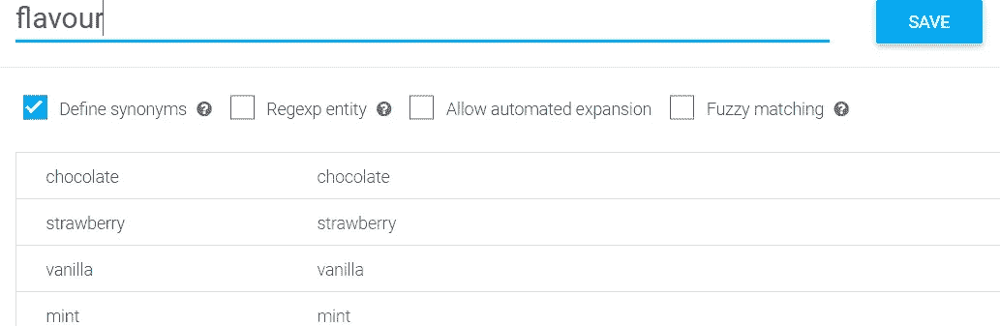
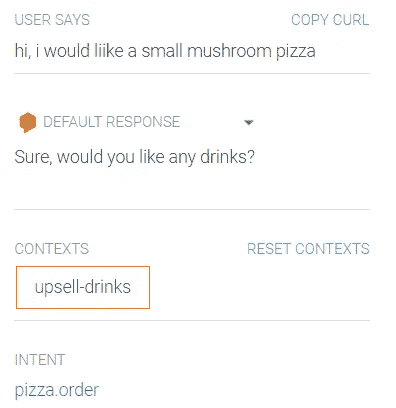

# 如何创建自己的聊天机器人

> 原文：<https://towardsdatascience.com/how-to-create-your-own-chatbot-a70120b34b42?source=collection_archive---------48----------------------->

## 使用 Dialogflow 构建对话体验

沃洛季米尔·赫里先科在 [Unsplash](https://unsplash.com?utm_source=medium&utm_medium=referral) 上的照片

# 介绍

在新冠肺炎一级防范禁闭的情况下，你有没有发现自己时不时地自言自语？别担心，我会向你展示如何创建一个聊天机器人，这样你就可以和机器人版本的你说话了。

玩笑归玩笑，聊天机器人有相当多的用例:

1.  改善客户服务体验——使用聊天机器人，用户可以根据需要获得客户服务，而不必排队。
2.  简化购买订单流程—使用聊天机器人，用户可以轻松购买他们想要的东西(例如购买比萨饼)，而不必拨打热线电话。
3.  自动回复——对于重复的问题，如退款问题、运输问题或支付问题，聊天机器人可以根据知识库提供回复。
4.  减少客户服务工作量——我们可以将普通任务外包给聊天机器人，只要求客户服务人员完成更复杂的任务。
5.  或者甚至提高自己的工作效率——你甚至可以创建一个聊天机器人来帮助你点播物品，播放你最喜欢的视频或者在你的日历上写一个任务。

有很多聊天机器人服务，但这篇文章将集中在谷歌的[对话流](https://dialogflow.com/)。这篇文章将带你为我的虚构业务——pizza eiou 创建一个聊天机器人。正如你可能猜到的，我们卖比萨饼。由于我们有现金流问题，我必须确保我的聊天机器人服务是免费的。当我们不再有现金流问题时，我就可以查看他们的[定价方案](https://cloud.google.com/dialogflow/pricing)来升级我的聊天机器人。

# 代理人

聊天机器人从代理开始。我将把我的代理人命名为*代理人 1* ，因为我没有足够的创造力来想出一个名字。代理负责存储意图、实体、内容和履行。简而言之，代理就是你的聊天机器人。

在转到 Dialogflow 并使用我的个人 Gmail 帐户登录控制台后，我看到了以下页面:

让我们继续创建一个代理:

# 意图

一旦我创建了我的代理，我将会看到两个默认的意图:

意图就像主题。每当我的客户向代理 1 询问某个问题时，代理 1 会尝试将问题归类到一个意图/主题下。

如果问题对 agent_1 来说太复杂，该问题将属于**回退意图**，其中代理将为她不理解的所有问题提供标准化回答。

第二个默认意图是**欢迎意图**。是的，你是对的。欢迎意向为问候 agent_1 的客户提供默认回复。

## 快速注释:

在这篇文章中，我将定期测试我的聊天机器人。每当我们配置代理时，我们首先要保存代理。这将允许 Dialogflow 培训我们的代理。其次，我们可以在右边的聊天中键入任何我们想要的命令。然后，我们可以观察 agent_1 的输出。

## 披萨订单

让我们为比萨饼订单创建一个意向。在任何意图中，都有训练短语。这些是客户会键入的短语。记得使用各种各样的短语，以便我们的代理可以更聪明。

当然，对于问题，必须有回答(暂时忽略$符号，我们稍后会谈到):

在测试了 agent_1 之后，我们发现它是有效的！

# 实体

agent_1 能回复披萨订单真是太好了。但是，什么是*披萨*？什么是*培根*？什么是*草莓奶昔*？对于 agent_1 来说，这是一个非常陌生的术语。因此，让我们定义**实体**。实体有助于识别句子中的何人、何事、何地、何时。

让我们定义一个实体来帮助 agent_1 理解比萨饼配料:

在我的 pizza_topping 实体中，我指定了 Pizzaeiou 提供的所有浇头。通过勾选“定义同义词”框，我允许不同的单词到达同一个词根，如第三行 bacon 示例所示。

通过勾选第三个框“允许自动扩展”，我们可以允许 agent_1 学习新单词。例如，如果所有客户都要求将“apple”作为比萨饼配料，agent_1 会自动将 apple 包含到该实体中。当然，没有人会喜欢苹果作为披萨的配料..因此，我不会勾选这个框。

## 注释训练短语

定义了我们的实体后，让我们将它投入使用。让我们在披萨上标注我们的训练短语。订购意图:

1.  双击单词“鸡”

2.搜索我们预定义的 pizza_topping 实体:

3.Agent_1 现在将鸡肉视为披萨的配料:

## 让你的实体更有创造力

几个实体可以定义或随时可用:

1.  系统实体—时间、日期、数字都是预定义实体的例子。您不必为它们创建实体。Dialogflow 会自动将“现在”、“下午 4 点”、“十月”标记为日期或时间实体。
2.  复合实体——假设披萨店也卖饮料。我们当然可以把“奶昔”定义为我们的饮料。然而，我们如何定义“大杯草莓奶昔”是我们的饮料呢？当然，我们不希望 agent_1 将“大草莓奶昔”理解为“大草莓”和“奶昔”，那将是灾难性的。因此，我们可以定义一个名为 *drinks_composite* 的实体，并指定不同类型的订单。切记不要勾选“定义同义词”

当然，我们必须具体说明我们提供的口味类型:

# 缝隙填充

“我的顾客总是点披萨。我怎么知道他们想要巧克力披萨还是鸡肉披萨？！他们什么时候想要？！他们想要个人披萨还是大披萨？!"—代理 _1

Agent_1 现在已经受够了。她很难完成订单。让我们帮助她，确保我们的顾客总是提供尺寸、时间和配料:

1.  用实体注释我们的训练短语

2.创建动作和参数。勾选所需参数，并定义用户未能提供参数时的提示

3.修改我们的回答。包括带有“$”符号的参数。

## 让我们来测试一下！(记得先保存您的代理)

如您所见，通过一个模糊的请求，agent_1 开始询问我们的客户以获取更多信息。

# 上下文

由于 Pizzaeiou 正面临现金流问题，我们应该开始向那些想要披萨的人追加销售饮料。目前，对话将会这样进行:

> 顾客:我现在想要一个小蘑菇比萨饼
> 
> 代理 1:当然，你想喝点什么吗？
> 
> 顾客:好的
> 
> 抱歉，那是什么？

在这种情况下，没有*上下文。* Agent_1 无法理解对话的*流程*。因此，让我们创建一个*追加销售 _ 饮料 _ 是*意向和一个*追加销售 _ 饮料 _ 否*意向。在此之前，我们必须修改我们的 *pizza.order* 意图，以产生一个*追加销售饮料*上下文:

数字 5 表示该上下文将持续的交互次数。然后，我们可以将我们的 *upsell_drinks_yes* 和 *upsell_drinks_no* 意图的输入上下文设置为我们的 *pizza.order* 意图的输出，并指定一些示例训练短语:

## 让我们来测试一下！

# 实现

现在我们已经收到了一个订单，我们需要将其推送到一个数据存储，以便 Pizzaeiou 的厨房可以获得订单！这可以通过满足来实现。有两种履行方式:

1.  [内联编辑器](https://cloud.google.com/dialogflow/docs/fulfillment-inline-editor):你可以通过你创建的云函数将你的订单推送到你的数据库中。这通常用于测试目的。您应该切换到 Webhook 进行部署。
2.  Webhook : Webhook 允许不同的应用程序通过 JSON 请求相互交流。订单完成后，厨房会立即收到订单详情通知。

# 导出代理 _1

让我们导出 agent_1，这样她就可以永远生活在云中:

# 结论

瞧啊。我们已经成功地为 Pizzaeiou 创建了一个聊天机器人。我们现在可以让我们的客户支持人员处理更复杂的问题，而不是接受订单。

为了使它完全发挥作用，考虑创造更多的意图、实体和环境，这样你的聊天机器人听起来会尽可能的人性化。也试着创建一个聊天机器人，用于介绍中提到的不同目的。

# 参考资料:

[https://www . coursera . org/learn/conversation-experiences-dialog flow/](https://www.coursera.org/learn/conversational-experiences-dialogflow/)