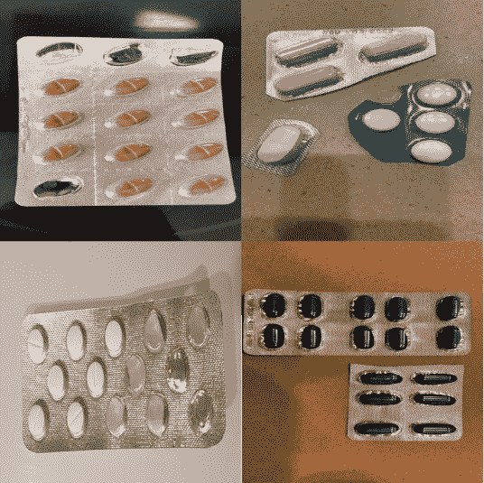
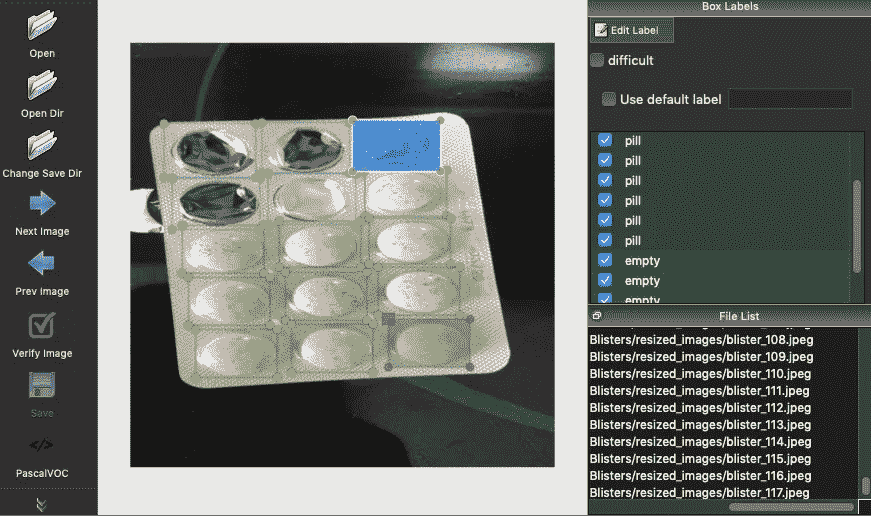
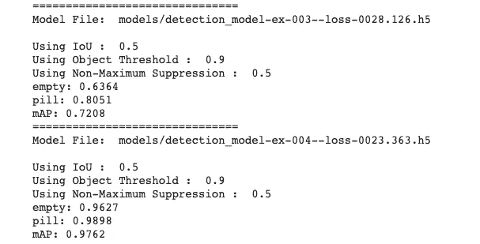
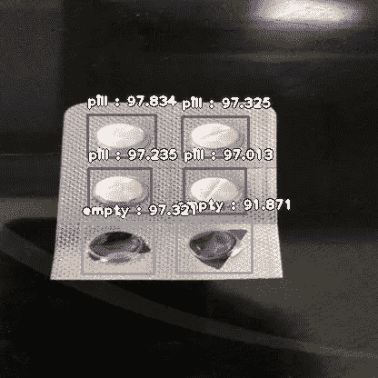

# 如何创建自己的自定义对象检测器

> 原文：<https://towardsdatascience.com/how-to-create-your-own-custom-object-detector-766cb11ccd1c?source=collection_archive---------11----------------------->

## 目标检测

## 使用 YOLOv3 和 ImageAI 创建您的自定义对象检测器


伊利亚·巴甫洛夫在 [Unsplash](https://unsplash.com?utm_source=medium&utm_medium=referral) 上的照片

这篇文章旨在帮助那些想第一次开发自己的自定义对象检测器的初学者，指导他们通过所有的关键点来训练一个成功的模型。

所示的例子将用 [ImageAI](https://github.com/OlafenwaMoses/ImageAI/blob/master/imageai/Detection/Custom/CUSTOMDETECTIONTRAINING.md) 进行训练，这是一个开源的 Python 库，它允许你用几行代码训练一个模型。

# 介绍

在本文中，我们将详细介绍创建自定义对象检测器的所有必要步骤，从收集数据到最终测试我们的模型。

整个过程的步骤是:

1.  收集数据
2.  标注数据集
3.  数据扩充
4.  培训模式
5.  评估模型

# 数据采集

在我们训练我们的模型之前，我们需要收集大量的数据，在这种情况下，是图像。根据检测机的复杂程度，最少 200 张图像应该没问题。

如果我们希望我们的模型尽可能健壮，我们的图像应该在光照和背景方面彼此不同，这样模型才能更好地概括。

这些图像可以从你的手机上获取，也可以从互联网上获取。

在这里，您可以看到我的药丸探测器模型的一个子集:



收集数据后，我们需要调整图像的大小，因为有些图像可能会很大。更小的图像意味着我们的模型将训练得更快。

为此，我编写了以下脚本:

# 标签数据

这是最繁琐的一步，因为你需要在每张图像中标注出你希望模型检测到的每一个物体。

你可以用 [LabelImg](https://github.com/tzutalin/labelImg) 库给你的数据加标签。运行以下命令从终端安装它。

```
pip3 install labelImg
```

安装完成后，我们可以通过运行以下命令开始标记数据集。

```
labelImg path_to_images/
```



然后，您必须为图像中的每个对象创建一个带有相应标签的矩形框。

一旦标记了图像中的所有对象，就必须将其保存为 PascalVOC 格式，生成一个. xml 文件。

# 数据扩充

拥有大型数据集对于我们深度学习模型的性能至关重要，因此我们可以使用 [imgaug](https://github.com/aleju/imgaug) 库来扩充我们已经拥有的数据。

这个 github repo 解释并提供了关于如何在图像边界框旁边增加图像的代码。这个过程可以分为三个步骤:

1.  转换。xml 文件合并成一个。csv 文件
2.  应用数据增强管道
3.  转换结果。csv 文件分成多个。xml 文件

首先，我们定义一个函数来转换我们的。xml 文件合并成一个。csv 文件:

然后我们定义另一个函数来做相反的过程:

然后，我们用 [imgaug](https://github.com/aleju/imgaug) 定义一个数据增强管道，比如下面这个。

最后，我们将这个管道应用到我们的数据集，并保存增强图像及其增强标签。你还要定义 *image_aug()* 和 *bbs_obj_to_df()* 函数，在这个 github repo 里可以找到[。](https://github.com/asetkn/Tutorial-Image-and-Multiple-Bounding-Boxes-Augmentation-for-Deep-Learning-in-4-Steps/blob/master/Tutorial-Image-and-Multiple-Bounding-Boxes-Augmentation-for-Deep-Learning-in-4-Steps.ipynb)

# 训练模型

在所有这些预处理之后，我们最终可以用 [ImageAI](https://github.com/OlafenwaMoses/ImageAI#customdetectiontraining) 训练我们的模型。

首先，我们需要安装库。

```
pip3 install imageai
```

要使用迁移学习，可以在这里下载模型[。](https://github.com/OlafenwaMoses/ImageAI/releases/tag/essential-v4)

然后，我们需要将数据集分成训练和验证文件夹。

```
dataset
├─ train
│   └── images
│   └── annotations
└─ validation
    ├── images
    ├── annotations
```

我们可以通过下面几行代码做到这一点:

然后我们可以用下面的脚本进行训练。

# 评估模型

一旦我们训练了我们的检测器，我们就可以通过它的映射来评估每个模型检查点的执行情况。

输出应该类似于以下内容:



# 使用我们的模型进行检测

最后，我们可以在生产中使用我们的模型来检测单个图像中的对象。

您可以调整*minimum _ percentage _ probability*参数，以或多或少的置信度显示检测到的对象，获得如下结果。



现在我想听听你的意见，让我知道它是如何工作的！

感谢阅读！

**参见**

[](https://neptune.ai/blog/object-detection-algorithms-and-libraries) [## 对象检测算法和库- neptune.ai

### 对象检测在图像中找到并识别事物，这是深度学习的最大成就之一…

海王星. ai](https://neptune.ai/blog/object-detection-algorithms-and-libraries)