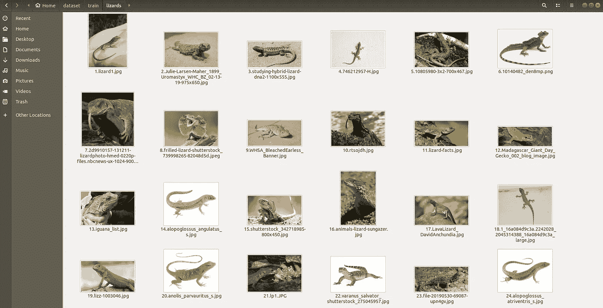

# 如何为深度学习创建自己的图像数据集

> 原文：<https://towardsdatascience.com/how-to-create-your-own-image-dataset-for-deep-learning-b53f1c22c443?source=collection_archive---------6----------------------->

## 弥合入门学习和现实世界应用之间的差距


照片由[比塔·拉图兹尼亚克](https://unsplash.com/@beataratuszniak?utm_source=medium&utm_medium=referral)在 [Unsplash](https://unsplash.com?utm_source=medium&utm_medium=referral) 拍摄

# 动机

有太多的 MOOCs 声称通过带你解决经典的 MNIST 问题，让你成为深度学习/计算机视觉专家。这基本上是说，我会成为一个懂得如何打字的专业程序员。真正的专业知识是用深度学习解决自己的问题来展示的。然而，构建您自己的影像数据集本身就是一项重要的任务，而且在大多数在线课程中对它的介绍还远远不够全面。

本文的目标是帮助您收集自己的原始图像数据集，然后您可以将其用于自己的图像分类/计算机视觉项目。

# 要求:

*   Python :你需要在你的机器上安装一个 Python 的工作版本。(我用的是 3.7.4)
*   **Linux/Unix 终端**:我们将从命令行运行映像下载程序。如果你使用的是 Mac 或 Linux，那么标准终端应该没问题。(我运行的是 Ubuntu 18.04)。对于 Windows，您可能需要为 Linux 设置 [Windows 子系统](https://www.windowscentral.com/install-windows-subsystem-linux-windows-10)或找到另一个第三方终端应用程序。

# 步伐

信不信由你，下载一堆图片只需几个简单的步骤。

**一个**:使用 pip 安装谷歌图片下载器:

```
pip install googleimagedownloader
```

**两个**:下载[谷歌 Chrome](https://www.google.com/chrome/?brand=CHBD&gclid=CjwKCAiAjMHwBRAVEiwAzdLWGHzQK9jv5rUVxoyrxodqtlJ4C5MLslxNi2nyKEjJH5GPSwXPD_0J5hoCYysQAvD_BwE&gclsrc=aw.ds) 和 [Chromedriver](https://chromedriver.chromium.org/downloads)

*   你需要确保你得到的 Chromedriver 版本与你运行的 Google Chrome 版本一致。
*   要检查你机器上的 Chrome 版本:打开一个 Chrome 浏览器窗口，点击右上角的菜单按钮(三个堆叠的点)，然后点击“帮助”>“关于谷歌 Chrome”。

一旦你下载了 Chromedriver，一定要记下“chromedriver”可执行文件的存储位置。下一步我们需要知道它的位置。

**三**:使用命令行批量下载图像

举个例子，假设我想建立一个可以区分蜥蜴和蛇的模型。这意味着我需要一个包含蜥蜴和蛇图像的数据集。我首先使用以下命令下载蜥蜴的图像:

```
$ googleimagesdownload -k "lizard" -s medium -l 500 -o dataset/train -i lizards -cd ~/chromedriver
```

该命令将使用关键字“蜥蜴”从谷歌图片中抓取 500 张图片。它会将这些图像输出到:`dataset/train/lizards/`。`-cd`参数指向我们之前下载的“chromedriver”可执行文件的位置。

*(注意:运行 500 张图像需要几分钟时间，所以我建议先用 10-15 张图像进行测试，以确保它能按预期工作)*

如果打开输出文件夹，您应该会看到类似这样的内容:



关于如何使用`google_image_downloader`的更多细节，我强烈推荐查看[文档](https://pypi.org/project/google_images_download/2.3.0/)。

现在，要获得一些蛇的图像，我可以简单地运行上面的命令，将关键字/图像目录参数中的“蜥蜴”替换为“蛇”。

```
$ googleimagesdownload -k "snake" -s medium -l 500 -o dataset/train -i snakes -cd ~/chromedriver
```

**嘣！**只需两个简单的命令，我们现在就有 1000 张图像来训练一个模型。多酷啊。！

然而，要制作一个好的数据集，我们真的需要挖掘得更深。也许我们可以尝试用关键词来描述特定种类的蜥蜴/蛇。我们只需要认识到我们试图解决的问题，并发挥创造力。

# 结论

在这一点上，我们几乎没有触及开始深度学习项目的表面。我们所做的只是收集一些原始图像。如果我们想要构建一个有用的模型，仍然需要做大量的数据清理/格式化工作。构建一个好的数据集需要时间，这一点我再怎么强调也不为过。我只是希望这篇文章能够为您提供工具，帮助您克服收集图像来构建自己的数据集的最初障碍。

我希望你喜欢这篇文章。如有任何意见、问题或反馈，请联系我。我会尽力及时回复。