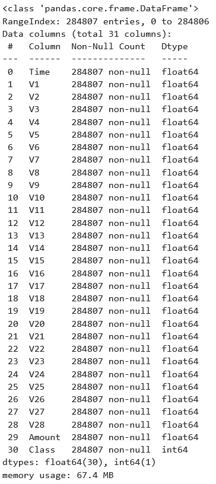
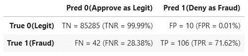
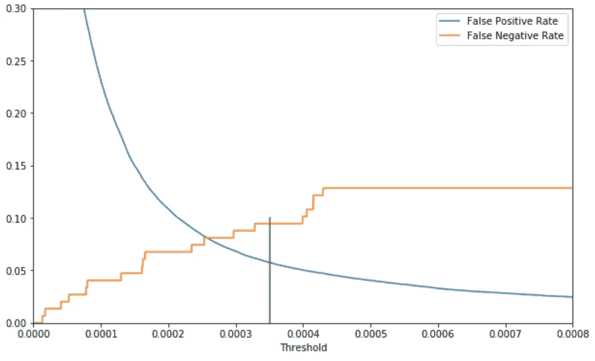
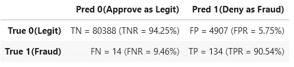

# 如何处理不平衡的分类，而不重新平衡数据

> 原文：<https://towardsdatascience.com/how-to-deal-with-imbalanced-classification-without-re-balancing-the-data-8a3c02353fe3?source=collection_archive---------9----------------------->

## 在考虑对倾斜数据进行过采样之前，请尝试在 Python 中调整分类决策阈值


Elena Mozhvilo 在 [Unsplash](https://unsplash.com?utm_source=medium&utm_medium=referral) 上的照片

在机器学习中，当用一个类的实例比另一个类的实例多得多的数据建立分类模型时，初始的默认分类器通常不令人满意，因为它将几乎每个案例都分类为多数类。许多文章向您展示了如何使用过采样(例如 *SMOTE* )或有时使用欠采样或简单的基于类的样本加权来重新训练“重新平衡”数据的模型，但这并不总是必要的。在这里，我们的目的是展示在不使用平衡数据或重新训练模型的情况下**可以做多少事情。**

我们通过简单地调整阈值来做到这一点，当模型预测的类别 1 的概率在两类分类中高于它时，我们称之为“类别 1”，而不是天真地使用默认分类规则来选择哪个类别被预测为最有可能(概率阈值为 0.5)。我们将看到这是如何为您提供灵活性，在假阳性和假阴性分类之间进行任何所需的权衡，同时避免重新平衡数据所带来的问题。

我们将用 Kaggle 的[信用卡欺诈识别数据集](https://www.kaggle.com/mlg-ulb/creditcardfraud)来说明。数据集的每一行代表一笔信用卡交易，目标变量 Class==0 表示一笔*合法*交易，Class==1 表示该交易结果是一笔*欺诈*。有 284，807 笔交易，其中只有 492 笔(0.173%)是欺诈——确实非常不平衡。

我们将使用一个*梯度增强*分类器，因为这些通常会给出好的结果。特别是 Scikit-Learn 的新 histgradientsboostingclassifier，因为当数据集像这样相对较大时，它比他们原来的 GradientBoostingClassifier 快得多。

首先让我们导入一些库并读入数据集。

```
import numpy as np
import pandas as pd
from sklearn import model_selection, metrics
from sklearn.experimental import enable_hist_gradient_boosting
from sklearn.ensemble import HistGradientBoostingClassifier
df=pd.read_csv('creditcard.csv')
df.info()
```



V1 到 V28(来自主成分分析)和交易金额是特征，它们都是数字并且没有缺失数据。因为我们只使用基于树的分类器，所以不需要标准化或规范化特征。

在将数据分成训练集和测试集之后，我们现在将训练模型。这在我的笔记本电脑上花了大约半分钟。如果验证子集的性能由于过度拟合而开始恶化，我们使用 n_iter_no_change 来提前停止训练。我单独做了一点超参数调整来选择 learning_rate 和 max_leaf_nodes，但这不是本文的重点。

```
Xtrain, Xtest, ytrain, ytest = model_selection.train_test_split(
        df.loc[:,'V1':'Amount'], df.Class,  stratify=df.Class, 
        test_size=0.3, random_state=42)
gbc=HistGradientBoostingClassifier(learning_rate=0.01, 
        max_iter=2000, max_leaf_nodes=6, validation_fraction=0.2, 
        n_iter_no_change=15, random_state=42).fit(Xtrain,ytrain)
```

现在，我们将这个模型作为默认的*硬分类器*应用于测试数据，预测每个事务为 0 或 1。我们将决策阈值 0.5 隐式应用于模型的连续*概率预测*，作为*软分类器*。当概率预测超过 0.5 时，我们称之为“1”，当低于 0.5 时，我们称之为“0”。

我们还为结果打印了*混淆矩阵*，按照惯例，认为类别 1(欺诈)是*“正”*类别，因为它是更罕见的类别。混淆矩阵显示了真阴性、假阳性、假阴性和真阳性的数量。*标准化混淆矩阵*比率(如 FNR =假阴性率)以百分比形式包含在括号中。

```
hardpredtst=gbc.predict(Xtest)
def conf_matrix(y,pred):
    ((tn, fp), (fn, tp)) = metrics.confusion_matrix(y, pred)
    ((tnr,fpr),(fnr,tpr))= metrics.confusion_matrix(y, pred, 
            normalize='true')
    return pd.DataFrame([[f'TN = {tn} (TNR = {tnr:1.2%})', 
                                f'FP = {fp} (FPR = {fpr:1.2%})'], 
                         [f'FN = {fn} (FNR = {fnr:1.2%})', 
                                f'TP = {tp} (TPR = {tpr:1.2%})']],
            index=['True 0(Legit)', 'True 1(Fraud)'], 
            columns=['Pred 0(Approve as Legit)', 
                            'Pred 1(Deny as Fraud)'])
conf_matrix(ytest,hardpredtst)
```



我们看到第 1 类的召回率(也称为敏感度或真阳性率，如上面的 TPR 所示)仅为 71.62%，这意味着 71.62%的真实欺诈被正确识别为欺诈并因此被拒绝。因此，28.38%的真实欺诈不幸被批准为合法。

特别是对于不平衡的数据(或者通常任何时候假阳性和假阴性可能具有不同的后果)，重要的是不要限制我们自己使用默认的隐式分类决策阈值 0.5，就像我们在上面通过使用。预测()”。我们希望提高 1 类产品(TPR)的召回率，以减少我们的欺诈损失(减少假阴性)。为了做到这一点，当我们预测一个高于阈值的概率时，我们可以降低我们所说的“类 1”的阈值。通过这种方式，我们称“1 类”为更大范围的预测概率。这种策略被称为*阈值移动*。

最终，我们希望在多大程度上减少这些假阴性是一个商业决策，因为作为一种权衡，假阳性(作为欺诈被拒绝的真实合法交易)的数量将不可避免地增加，因为我们调整了应用于模型概率预测的阈值(从“获得”)。predict_proba()"而不是"。预测()”)。

为了阐明这种权衡并帮助我们选择阈值，我们绘制了假阳性率和假阴性率与阈值的关系图。这是*接收器工作特性* (ROC)曲线的变体，但强调了阈值。

```
predtst=gbc.predict_proba(Xtest)[:,1]
fpr, tpr, thresholds = metrics.roc_curve(ytest, predtst)
dfplot=pd.DataFrame({'Threshold':thresholds, 
        'False Positive Rate':fpr, 
        'False Negative Rate': 1.-tpr})
ax=dfplot.plot(x='Threshold', y=['False Positive Rate',
        'False Negative Rate'], figsize=(10,6))
ax.plot([0.00035,0.00035],[0,0.1]) #mark example thresh.
ax.set_xbound(0,0.0008); ax.set_ybound(0,0.3) #zoom in
```



虽然存在一些选择最佳阈值的经验法则或建议的度量标准，但最终它只取决于假阴性与假阳性的业务成本。例如，看上面的图，我们可以选择应用阈值 0.00035(垂直绿线已添加)，如下所示。

```
hardpredtst_tuned_thresh = np.where(predtst >= 0.00035, 1, 0)
conf_matrix(ytest, hardpredtst_tuned_thresh)
```



我们已将假阴性率从 28.38%降至 9.46%(即识别并拒绝 90.54%的真实欺诈，作为我们新的召回或敏感度或真阳性率或 TPR)，而我们的假阳性率(FPR)从 0.01%增至 5.75%(即仍批准 94.25%的合法交易)。为了只批准不到 10%的欺诈交易，拒绝大约 6%的合法交易对我们来说可能是值得的，当我们使用默认硬分类器(隐式分类决策阈值为 0.5)时，欺诈交易的比例为 28%，这是非常昂贵的。

# 不平衡不平衡数据的原因

避免“平衡”不平衡的训练数据的一个原因是，这种方法通过系统地增加模型对原始少数类的预测概率，偏向/扭曲了最终训练模型的概率预测，从而使这些预测成为*误校准*，并因此简化为仅仅是相对的*序数判别分数*或*决策函数*或*置信度分数*，而不是原始(“不平衡”)训练和测试集以及分类器可以对其进行预测的未来数据中潜在准确的预测类概率。如果训练*的这种重新平衡是*真正需要的，但是仍然需要数值精确的概率预测，那么人们将不得不*重新校准*具有原始/不平衡类别比例的数据集的预测概率，或者对来自平衡模型的预测概率应用适当的校正——参见此处的、此处的或此处的。

通过过采样来平衡数据的另一个问题(与没有这个问题的依赖于类的实例加权相反)是，它偏向于天真的交叉验证，潜在地导致在交叉验证中没有检测到的过度拟合。如果对整个训练集执行过采样，则在交叉验证中，每次数据被拆分到“折叠”子集时，一个折叠中可能会有与另一个折叠中的实例重复的实例，或者由另一个折叠中的实例生成的实例。因此，折叠并不像交叉验证假设的那样是真正独立的——存在数据“流失”或“泄漏”。例如，参见[不平衡数据集的交叉验证](https://medium.com/lumiata/cross-validation-for-imbalanced-datasets-9d203ba47e8)，它描述了如何通过仅在每组训练折叠上执行过采样，在交叉验证循环内*正确地重新实施交叉验证，如[中所示，本例](https://imbalanced-learn.org/dev/auto_examples/applications/plot_over_sampling_benchmark_lfw.html)。或者，您可以在由 imb learn . pipeline . make _ pipeline()创建的管道中执行过采样，该管道通过将交叉验证循环中的过采样仅应用于训练折叠，而不应用于测试折叠来解决这一问题。在 scikit-learn 中，至少对于通过简单实例复制/重采样(不一定是 SMOTE 或 ADASYN)进行过采样的情况，该问题可以通过使用 *model_selection 来解决。GroupKFold* 用于交叉验证，它根据选定的组标识符对实例进行分组，该标识符对于给定实例的所有副本都具有相同的值——参见[我对前述文章的回复](https://dabruro.medium.com/to-panos-v-s-question-how-to-implement-this-with-a-gridsearchcv-though-2ab2437784c3)。*

# 结论

我们可以尝试使用原始模型(在原始“不平衡”数据集上训练),并简单地绘制假阳性和假阴性之间的权衡，以选择可能产生理想业务结果的阈值，而不是天真地或隐含地应用默认阈值 0.5，或使用重新平衡的训练数据立即重新训练。

# 编辑:即使唯一真正的“问题”是默认的 0.5 阈值不合适，为什么重新平衡你的训练数据“有效”？

由您的模型产生的平均概率预测将近似为类 1 的定型实例的比例，因为这是目标类变量的平均实际值(其值为 0 和 1)。回归也是如此:目标变量的平均预测值有望逼近目标变量的平均实际值。当数据高度不平衡并且类别 1 是少数类别时，该平均概率预测将远小于 0.5，并且类别 1 的概率的绝大多数预测将小于 0.5，因此被分类为类别 0(多数类别)。如果您重新平衡训练数据，平均预测概率会增加到 0.5，因此许多实例会高于默认阈值 0.5 的*以及低于默认阈值 0.5 的*，预测的类会更加平衡。因此，重新平衡不是降低阈值以使概率预测更经常地高于阈值并给出类 1(少数类),而是增加预测的概率以使概率预测更经常地高于默认阈值 0.5 并给出类 1。

如果您想要获得与重新平衡类似(不完全相同)的结果，而不实际重新平衡或重新加权数据，您可以尝试简单地将阈值设置为等于模型预测的类 1 概率的平均值或中值。当然，这并不一定是针对您的特定业务问题在误报和漏报之间提供最佳平衡的阈值，重新平衡您的数据并使用 0.5 的阈值也不一定。

在某些情况和模型中，重新平衡数据可能会大大改进模型，而不仅仅是将平均预测概率移动到等于默认阈值 0.5。但是，当使用默认阈值 0.5 时，模型在绝大多数情况下选择多数类这一事实本身并不支持这样一种说法，即重新平衡数据除了使平均概率预测等于阈值之外，还能完成任何事情。如果您希望平均概率预测等于阈值，您可以简单地将阈值设置为等于平均概率预测，而无需为了扭曲概率预测而修改或重新加权训练数据。

# 编辑:关于置信度得分与概率预测的注释

如果您的分类器没有 predict_proba 方法，例如支持向量分类器，您也可以使用它的 decision_function 方法来代替它，产生一个*序数判别得分*或*置信度得分*模型输出，即使它是*而不是*可解释为 0 和 1 之间的*概率预测*，也可以用相同的方式设定阈值。根据特定分类器模型如何计算两个类别的置信度得分，有时可能需要*而不是将阈值直接应用于类别 1 的置信度得分(我们在上面将其作为类别 1 的预测概率，因为类别 0 的预测概率只是 1 减去 1)，或者将阈值应用于类别 0 和类别 1 的置信度得分之间的*差*， 对于假设假阳性的成本与假阴性的成本相同的情况，默认阈值为 0。 本文假设了一个两类分类问题。*