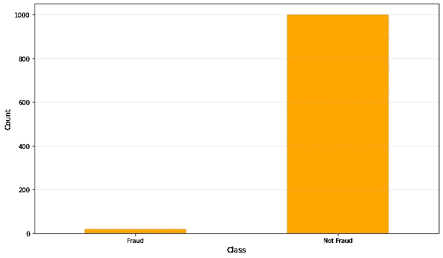
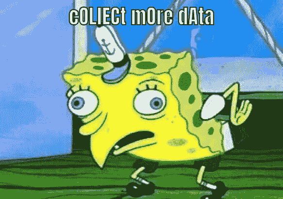
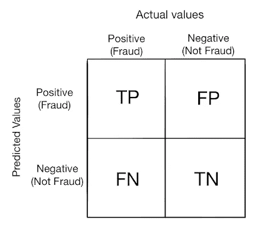
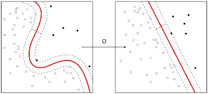
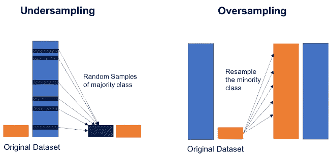

# 如何处理不平衡数据

> 原文：<https://towardsdatascience.com/how-to-deal-with-imbalanced-data-34ab7db9b100?source=collection_archive---------8----------------------->

## Python 中处理不平衡数据集的分步指南



作者照片

具有不平衡类的数据集是常见的数据科学问题，也是常见的面试问题。在本文中，我提供了一个分步指南来改进您的模型并很好地处理不平衡的数据。您最常看到不平衡数据的领域是分类问题，如垃圾邮件过滤、欺诈检测和医疗诊断。

## **是什么让不平衡的数据成为问题？**

几乎每个数据集都有不同的类表示。只要差异很小，这就不是问题。然而，当一个或多个类非常罕见时，许多模型在识别少数类时不太好用。在本文中，为了简单起见，我将假设一个两类问题(一个多数类和一个少数类)，但是这些技术中的大多数也适用于多个数据集。

通常，我们会查看验证分割的准确性，以确定我们的模型是否表现良好。然而，当数据不平衡时，准确性可能会产生误导。例如，假设您有一个数据集，其中 92%的数据被标记为“非欺诈”，剩下的 8%是“欺诈”案例。数据明显不平衡。现在假设我们的模型最终将它看到的一切都归类为“非欺诈”。然而，如果我们着眼于准确性，这是一个惊人的 92%。但银行仍然关心那些“欺诈”案件。这就是它赔钱的地方。那么我们如何改进我们的模型呢？

为了克服不平衡数据集的问题，您可以执行以下一系列步骤和决策。

# **1。能收集更多数据吗**

你可能会说，“好吧，网上的随便一个人，如果我能收集更多的数据，我就不会读这些了，不是吗？收集更多数据”。



通过 https://stopthatrightnow.github.io/[生成的图像](https://stopthatrightnow.github.io/)

但是听我说完。后退一步，考虑以下问题:

*   你收到的数据是否经过了筛选，以排除可能导致辅修课观察被忽略的情况。
*   你有多少年的历史，如果你回到一两年前，你会得到更多的数据仍然合理的次要类的实例。
*   如果是客户数据，我们能否使用不再订阅我们服务的客户，而不影响我们试图解决的参数。也许使用这些以前的客户记录，以及“当前客户”?(Y/N)"布尔变量会有所帮助。
*   你能把你的少数民族班合并成一个班吗？例如，如果您正在对一个人的心跳中的不同类型的异常进行分类，而不是试图对每种类型的异常进行分类，那么如果我们将它们都合并到一个单一的“异常心跳”类别中，该模型还会有用吗？

只是一些想法和一个提醒，总是考虑不同的可能性。

# **2。** **更改绩效指标**

如上所述，由于在处理不平衡数据集时，精确度不是一个好的衡量标准，所以让我们考虑更合适的衡量标准。



作者的混淆矩阵照片

基于混淆矩阵，我们可以测量以下内容:

*   **精度:**真阳性/所有预测阳性= TP / (TP+FP)。精度是对分类器准确性的度量。低精度表示大量的误报。
*   **回忆:**真阳性/所有实际阳性= TP / (TP + FN)。召回是对分类器完整性的一种度量。它也与敏感度或真实阳性率相同。低召回率表示大量的假阴性。
*   **F1 得分:** 2TP/(2TP + FP + FN)精度和召回率的加权平均值。如果我们想在精确度和召回率之间取得平衡，那么我们应该看看 F1 的分数。

## 注意:这里我假设少数类在混淆矩阵中被标记为正类。

查看此[维基百科](https://en.wikipedia.org/wiki/Confusion_matrix)页面，获取绩效指标公式列表。

我们还可以看一看:

*   **灵敏度/特异性**ROC 曲线:灵敏度与回忆基本一致，告诉我们真实的阳性率。
*   **Kappa(或** [**科恩的 kappa**](https://en.wikipedia.org/wiki/Cohen%27s_kappa) **)** :分类精度由数据中类别的不平衡性归一化。

在这种情况下，我们希望寻找高回忆/灵敏度和 f1 分数，而不是准确性，以查看我们的模型在预测辅修课程方面的表现。

Jason Brownlee 在这里了解更多关于选择不同绩效指标的信息[。](https://machinelearningmastery.com/classification-accuracy-is-not-enough-more-performance-measures-you-can-use/)

# **3。** **尝试不同的算法**

与大多数数据科学问题一样，对数据尝试几种不同的合适算法始终是一种好的做法。

有两种主要类型的算法似乎对不平衡数据集问题有效。

## **决策树**

决策树似乎在不平衡数据集上表现得很好。因为他们在拆分的每个阶段都提出了条件/规则，所以他们最终把两个类都考虑进去了。

我们可以尝试一些不同的决策树算法，如随机森林、CART、C4.5。

## **处罚车型:**

惩罚学习模型(代价敏感训练)对模型强加了额外的代价，用于在训练期间对少数类进行分类错误。这迫使模型更多地关注少数类观察。

## 异常检测模型:

如果只是 2 个类，多数类和少数类，那么您可以考虑使用异常检测模型而不是分类模型。这些异常模型试图做的是为多数类创建一个配置文件。任何不符合这一特征的观察都被认为是异常或异常值，在我们的例子中是来自少数群体的观察。这类模型用于欺诈检测等情况。



异常检测图片来自[维基百科](https://commons.wikimedia.org/wiki/File:Kernel_Machine.svg) ( [CC BY-SA 4.0](https://creativecommons.org/licenses/by-sa/4.0) )

# **4。** **对数据集进行重新采样**

这一步可以在尝试上述不同的模型方法时完成。不同类型的重采样如下:

1.  对多数类欠采样
2.  对少数民族阶层进行过度采样



按作者对数据照片进行重采样

## 欠采样(下采样)多数类

欠采样随机移除多数类的观测值。这减少了在训练集中使用的多数类观察的数量，并且因此更好地平衡了两个类的观察的数量。当您的数据集中有大量观测值(> 10K 观测值)时，这非常适合。风险是你正在丢失信息，因此可能导致不适合。

Scikit-learn 提供了一种“重采样”方法，我们可以用它来进行欠采样。不平衡学习包还提供了更高级的功能。Python 代码示例如下所示:

由于多数类的许多观测值已被丢弃，因此产生的数据集现在要小得多。这两个班级的比例现在是 1:1。

**注:**我们不一定要使用 1:1 的比率，我们可以使用这种方法将多数类观察的数量减少到任何合理的比率。

## **过采样(上采样)少数类**

过采样随机复制少数类的观测值，以使其信号更强。最简单的过采样形式是置换采样。当数据集中没有大量观测值(< 10K 观测值)时，过采样非常合适。风险在于，如果你重复了太多的观察，那么你就是过度拟合了。

我们可以使用相同的 scikit-learn“重采样”方法，但使用不同的参数。下面显示了一个代码示例:

这一次，我们使用替换进行采样，以便在最终的训练集中有更多的代表性。但正如我提到的，这可能会导致过度拟合。那么，怎样才能把事情做得更好，避免过度拟合呢？

# **5。** **生成合成样本**

为了减少上采样期间的过拟合，我们可以尝试创建合成样本。

## 重击

一个流行的算法是 [SMOTE](https://imbalanced-learn.org/stable/generated/imblearn.over_sampling.SMOTE.html?highlight=smote) (合成少数过采样技术)。SMOTE 不是使用观测值的副本进行过采样，而是改变观测值的属性来创建新的合成样本。

你可以在这里找到 SMOTE [的例子。](https://imbalanced-learn.org/stable/auto_examples/combine/plot_comparison_combine.html#sphx-glr-auto-examples-combine-plot-comparison-combine-py)

## 增大

与 SMOTE 类似，如果您的数据是音频或图像之类的东西，那么您也可以对原始文件执行转换来创建新的样本。

# 6.**结论**

正如数据科学和机器学习算法中的大多数事情一样，没有每次都有效的确定的正确方法。根据数据集的性质、类的分布、预测器和模型，上述一些方法会比其他方法更好。这取决于你来找出最佳的组合。

需要记住的几点是:

*   在创建合成/增强样本之前，始终进行训练/测试分割。您希望根据原始数据观察来验证和测试您的模型
*   使用相同的衡量标准进行比较——每次你尝试新的东西时，记得正确地进行比较。不要只看一个型号的精度，另一个型号的灵敏度。

除了这些步骤之外，不要忘记您还必须做一些事情，例如数据清理、功能选择和超参数调整。

*希望这有所帮助！*

```
if_you_like(this_article):
    please(CLAPS) # Do this :)
else:
     initiate_sad_author()  # Don't do this :(# Thanks :)
```

# 参考资料和进一步阅读

博伊尔塔拉。"处理不平衡数据的方法."中等。2019 年 2 月 04 日。2020 年 6 月 21 日访问。[https://towards data science . com/methods-for-processing-unbalanced-data-5b 761 be 45 a 18。](/methods-for-dealing-with-imbalanced-data-5b761be45a18.)

布朗利，杰森。"在你的机器学习数据集中对抗不平衡类的 8 个策略."机器学习精通。2020 年 1 月 14 日。2020 年 6 月 21 日访问。https://machine learning mastery . com/tactics-to-combat-unbalanced-classes-in-your-machine-learning-dataset/。

"如何处理机器学习中不平衡的类."2020 年 5 月 23 日。[https://elitedatascience.com/imbalanced-classes.](https://elitedatascience.com/imbalanced-classes.)