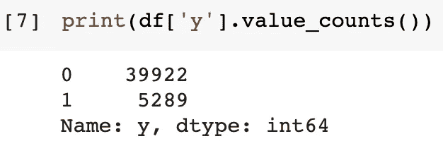
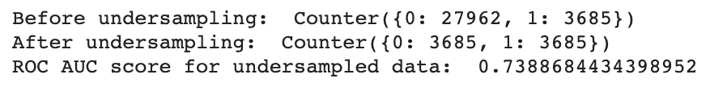
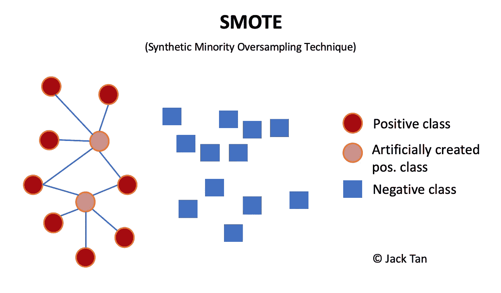
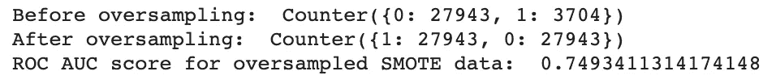
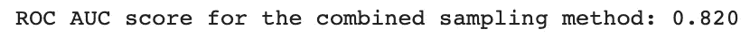
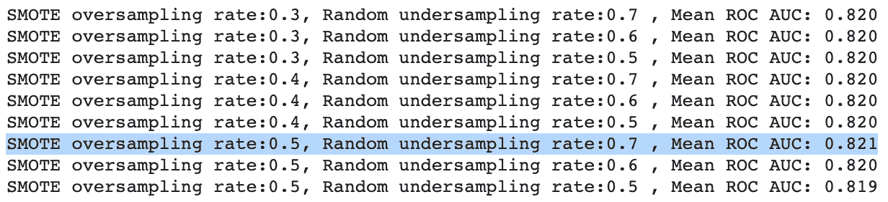

# Python 中如何处理不平衡数据

> 原文：<https://towardsdatascience.com/how-to-deal-with-imbalanced-data-in-python-f9b71aba53eb?source=collection_archive---------1----------------------->

## 平衡不平衡的 pythonic 解决方案

Photo by [青 晨](https://unsplash.com/@jiangxulei1990?utm_source=medium&utm_medium=referral) on [Unsplash](https://unsplash.com?utm_source=medium&utm_medium=referral)

不平衡数据在现实世界中是非常常见的，尤其是当决策系统的目标是一个罕见但重要的案例时。当未来的决策是基于对历史数据的洞察而做出时，这可能是一个问题。来自少数案例的不充分数据会妨碍正在做出的新决策的稳健性。

不平衡数据的情况几乎存在于任何实际应用中。例如，美国无线运营商的[平均客户流失率](https://www.statista.com/statistics/283511/average-monthly-churn-rate-top-wireless-carriers-us/)在 1-6%之间。同样在市场营销中，[的平均转化率](https://www.quora.com/What-is-average-lead-to-conversion-rate)也徘徊在个位数范围内。

那么，在机器学习(ML)中使用不平衡数据会出现什么问题呢？你如何处理不平衡的数据？本文将带您了解所有这些问题，并展示一些 Python 中的实际例子。

令人惊讶的是，我将在本文末尾提供“另一件事”,说明如何结合使用过采样和欠采样方法来选择最佳采样比。

# **什么是精确的不平衡数据？**

> **不平衡数据集**是**分类问题**的特例，其中**类在类间的分布不均匀**。通常，它们由两类组成:多数(消极)类**和少数(积极)类**【1】。****

**通常少数类是我们希望 ML 模型能够正确预测的，因此被称为正类。例如，如果一个模型试图以 3%的转换率对一组 10，000 个客户数据进行训练，它可能没有足够的样本进行足够好的训练来预测未来正转换率的概率。**

**那么，我们如何准确定义不平衡数据的阈值呢？**

**根据[谷歌开发者](https://developers.google.com/machine-learning/data-prep/construct/sampling-splitting/imbalanced-data)的说法，答案可以分为 3 个不平衡度——轻度(20–40%)、中度(1–20%)和极端(< 1%)。**

# ****为什么重要？****

**不平衡数据的影响是隐含的，即当您构建和运行模型时，它不会立即引发错误，但结果可能会令人迷惑。如果多数类的类不平衡程度是极端的，那么机器训练的分类器可以产生高的总体预测精度，因为该模型最有可能预测属于多数类的大多数样本。例如，在一个类分布为 90:10 的两类问题中，分类器在多数类示例上的性能是少数类示例的九倍。**

# ****如何处理不平衡的数据？****

**文献中已经提出了几种解决这个问题的方案，其中有:**

*   ****数据级技术—** 在数据级，解决方案通过应用重采样技术来平衡数据集。这可以通过对少数类进行过采样来实现，即从现有的实例中综合创建新的实例；或者对多数类进行欠采样，这消除了多数类中的一些实例。然而，这两种技术都有缺点。过采样新数据会导致分类器过拟合；而欠采样会丢弃重要信息。在专业文献中可以找到这两种技术与启发式方法的结合，结果非常好。**
*   ****算法级技术—** 算法级解决方案可以通过相应地调整加权成本来实现，以适应每一类中训练实例的数量。在像[支持向量机](https://link.springer.com/chapter/10.1007/978-3-540-30115-8_7)这样的参数分类器中，可以应用网格搜索和交叉验证来优化 C 和 gamma 值。对于像[决策树](https://www.researchgate.net/publication/228578039_C4_5_and_imbalanced_data_sets_investigating_the_effect_of_sampling_method_probabilistic_estimate_and_decision_tree_structure)这样的非参数分类器，调整树叶处的概率估计可以提高性能。**
*   ****两者的结合——**各种文献中也在不断探索一种混合方法，包括彭和姚提出的 [AdaOUBoost](https://dl.acm.org/doi/10.1145/1743384.1743408) (自适应过采样和欠采样增强)和利用 Japkowicz 提出的基于自动联想的分类方法概念的[通过识别学习](https://www.aaai.org/Papers/Workshops/2000/WS-00-05/WS00-05-003.pdf)。**

# ****用 Python 处理不平衡数据****

**Python 中最流行的采样方法库之一就是[不平衡学习](https://imbalanced-learn.readthedocs.io/en/stable/index.html)包。它提供了多种过采样和欠采样方法，以及一些组合方法。在本教程中，我们将为这三种方法分别探索一个示例:**

*   **使用[随机欠采样器](https://imbalanced-learn.readthedocs.io/en/stable/generated/imblearn.under_sampling.RandomUnderSampler.html#)进行随机欠采样**
*   **使用 [SMOTE](https://imbalanced-learn.readthedocs.io/en/stable/generated/imblearn.over_sampling.SMOTE.html) 进行过采样(合成少数过采样技术)**
*   **使用流水线的随机欠采样和过采样的组合**

**本教程中使用的数据集基于来自 [UCI 回购](https://archive.ics.uci.edu/ml/datasets/bank+marketing)的银行营销数据。这是一个分类问题，目标是预测客户是否会订阅定期存款。所有分类(文本)特征列都被[编码](https://scikit-learn.org/stable/modules/generated/sklearn.preprocessing.LabelEncoder.html)成机器友好的数字形式。编码数据集托管在 [Github](https://github.com/jackty9/Handling_Imbalanced_Data_in_Python/blob/master/bank-full-encoded.csv) 上。为了测试数据在重采样后的表现，我们在重采样数据上训练*支持向量机*模型，以检查模型的表现。完整的 Python 代码也可以在同一个 [Github](https://github.com/jackty9/Handling_Imbalanced_Data_in_Python) 库中找到。**

**之所以选择这个数据集，是因为它反映了日常应用中常见的不平衡数据集。正如预期的那样，数据非常不平衡，只有大约 13% [5，289/(5，289+39，922)]的联系客户实际上订阅了定期存款。在 Python 中，可以使用方法`value_counts()`打印每个预测类的编号。**

****

**目标类的分布。0 表示未转换的多数负类 aka 客户，而 1 表示认购定期存款的少数正类 aka 客户。**

1.  ****随机欠采样****

****

**照片由[帕特里克·福尔](https://unsplash.com/@patrickian4?utm_source=medium&utm_medium=referral)在 [Unsplash](https://unsplash.com?utm_source=medium&utm_medium=referral) 拍摄**

**顾名思义，随机欠采样将多数类的数量随机减少到相对于少数类的期望比率。这可能是最简单的欠采样方法，如果有许多彼此接近的多数类实例，这种方法实际上可以产生良好的结果。关于减少多数类的更统计的方法，你可以参考[浓缩最近邻](http://citeseerx.ist.psu.edu/viewdoc/download?doi=10.1.1.294.6968&rep=rep1&type=pdf)(又名。CNN，基于 Hart 算法)， [Tomek Links](https://ieeexplore.ieee.org/stamp/stamp.jsp?arnumber=4309452) (对原始 CNN 技术的改进)， [NearMiss](https://www.site.uottawa.ca/~nat/Workshop2003/jzhang.pdf) 等等，这里仅列举一个新的。幸运的是，所有提到的技术都可以在同一个[不平衡学习](https://imbalanced-learn.readthedocs.io/en/stable/index.html)包中获得，你可以很容易地导入并尝试它们。**

**代码片段分为两部分:第 1 部分向您展示随机欠采样多数类的代码；第 2 部分使用*支持向量机训练重采样数据，并输出 ROC AUC 得分。***

****

**代码片段的输出:第 1 行显示原始数据分布；第二行显示欠采样分布；第三行显示了使用欠采样数据的模型性能**

****2。使用 SMOTE 进行过采样****

****

**SMOTE 使用 5 作为 k 个最近邻进行过采样的示例。作者自我图解。**

**对于过采样技术， [SMOTE](https://www.jair.org/index.php/jair/article/view/11192) (合成少数过采样技术)被认为是 ML 和数据挖掘中最流行和最有影响力的数据采样算法之一。使用 SMOTE，少数类通过创建“合成”示例进行过采样，而不是通过替换进行过采样[2]。这些引入的合成示例基于沿着连接定义数量的 k 个少数类最近邻居的线段，其在`imblearn`包中默认设置为[五个](https://imbalanced-learn.readthedocs.io/en/stable/generated/imblearn.over_sampling.SMOTE.html#imblearn.over_sampling.SMOTE)。**

**代码片段分为两部分:第 1 部分展示了用 SMOTE 对 minority 类进行过采样的代码；第 2 部分使用*支持向量机*训练重采样数据，并输出 ROC AUC 得分。**

****

**代码片段的输出:第 1 行显示原始数据分布；第二行显示了过采样分布；第三行显示了使用过采样数据的模型性能**

****3。使用流水线的欠采样和过采样方法的组合****

****

**由[在](https://unsplash.com/@thecreative_exchange?utm_source=medium&utm_medium=referral) [Unsplash](https://unsplash.com?utm_source=medium&utm_medium=referral) 上创意交流拍摄的照片**

**代码片段分为两部分:第 1 部分展示了创建管道的代码，使用欠采样和过采样方法对数据进行重采样；第 2 部分使用*支持向量机训练重采样数据，并在交叉验证后输出平均 ROC AUC 分数。***

****

**使用组合抽样方法显示 ROC AUC 得分的代码片段的输出。**

# ****奖励—我如何知道哪个采样比是最好的？****

****

**乔恩·泰森在 [Unsplash](https://unsplash.com?utm_source=medium&utm_medium=referral) 拍摄的照片**

**在上面的教程中，我们对数据进行了欠采样或/和过采样，以使两个类的分布达到 50:50 的平衡。但是如果我们想根据模型性能找出最佳的采样率呢？我们可以通过在 Python 中实现一个`for`循环来迭代一个可能的采样比率列表，并在交叉验证后根据平均 ROC AUC 得分(或选择的其他性能指标)来查看哪个组合具有最佳性能。**

**代码片段向您展示了使用欠采样和过采样方法创建管道以对数据进行重采样的代码。过采样的可能比率列表为`[0.3,0.4,0.5]`，欠采样的可能比率列表为`[0.7,0.6,0.5]`。这些比率是出于演示目的而随机选择的，并且可以在一些试验和错误之后用其他值替换。然后，在交叉验证后输出平均 ROC AUC 分数之前，用每个可能的比率组合对的重采样数据训练*支持向量机。***

****

**每个可能的比率组合对的平均 ROC AUC 评分的代码片段输出。**

**如输出快照所示，本例中的最佳采样率为 0.5 的过采样率，其次是 0.7 的欠采样率，以获得 82.1%的最佳可能平均 ROC AUC 得分。**

# ****结论****

**对于欠采样还是过采样方法更适合不平衡数据的问题，没有简单的答案，尤其是在使用哪种精确采样技术(随机或 SMOTE)时。然而，大多数[研究](http://citeseerx.ist.psu.edu/viewdoc/download?doi=10.1.1.68.6858&rep=rep1&type=pdf)指出，欠采样在大多数情况下确实比过采样产生更好的结果。在行业实践中，据报道，像脸书和微软这样的科技巨头在对他们的广告表现进行分类时也倾向于使用欠采样方法。常见的论点是欠采样通常比过采样“更便宜”,并且由于感兴趣的类是少数正类，因此减少多数负类的一些信息是可以接受的。但是不能保证在你的情况下同样的事情总是能重复发生。**

**我的建议是，在处理不平衡数据时，根据你拥有的时间和资源来决定。如果您有有限的时间和资源来研究哪种方法最适合您，那么您可以从一开始就选择随机欠采样。然而，如果你有一点奢侈去尝试不同的采样方法和技术，我会强烈推荐后者。一旦你有了一个平衡的数据，你的模型就有可能学会更好地对不同的类进行分类，从而得到更可靠的预测。**

**处理不平衡数据后的下一步可能是为您的模型选择最佳特性，为此，欢迎您查看我在[特性选择](/feature-selection-for-machine-learning-in-python-wrapper-methods-2b5e27d2db31)中的文章。**

****免责声明:由于训练测试分割和交叉验证的随机性，您可能不会得到如图所示的准确输出。***

**参考:**

**[1] [不平衡数据集，龙骨 2018](https://sci2s.ugr.es/keel/imbalanced.php)**

**[2] [SMOTE:合成少数过采样技术](https://www.jair.org/index.php/jair/article/view/10302)**

**感谢阅读这篇文章。如果你喜欢我的工作，请考虑加入 Medium 来支持我。谢谢大家！😊**

** [## 通过我的推荐链接-谭施敏加入媒体

### 作为一个媒体会员，你的会员费的一部分会给你阅读的作家，你可以完全接触到每一个故事…

jackyeetan.medium.com](https://jackyeetan.medium.com/membership)**