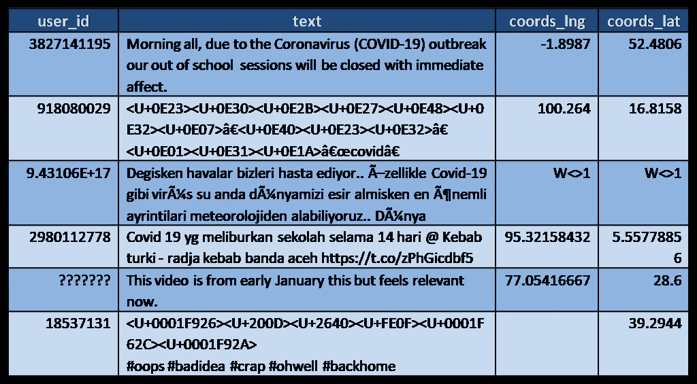
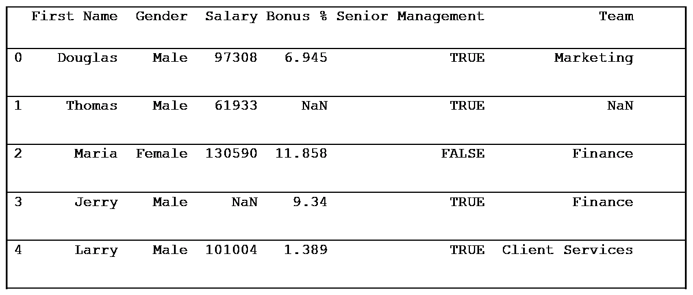
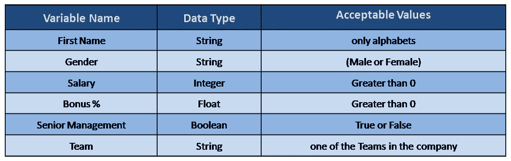
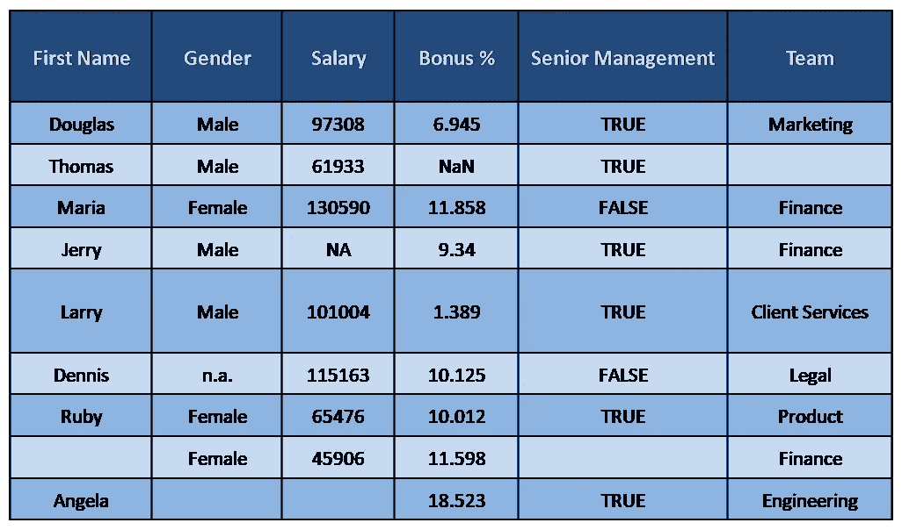
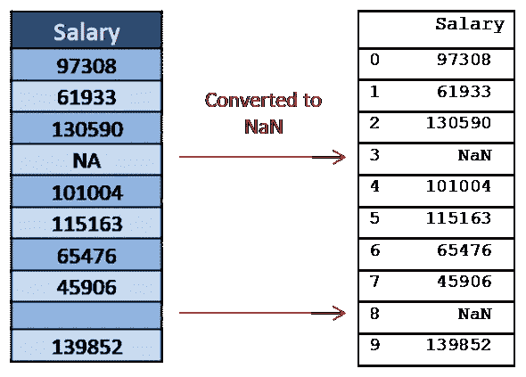
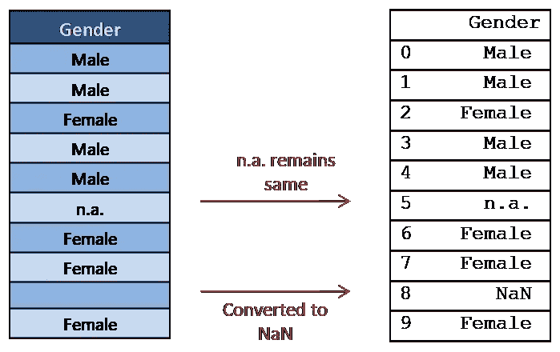
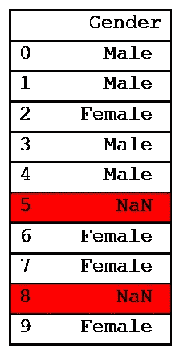
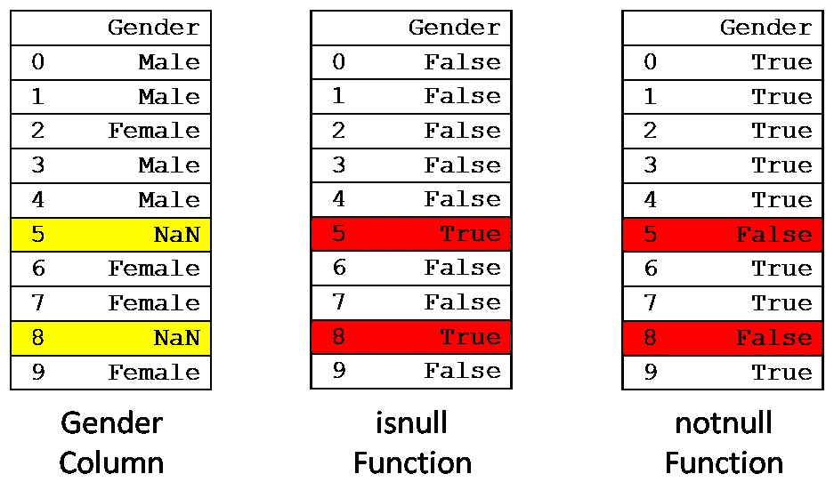
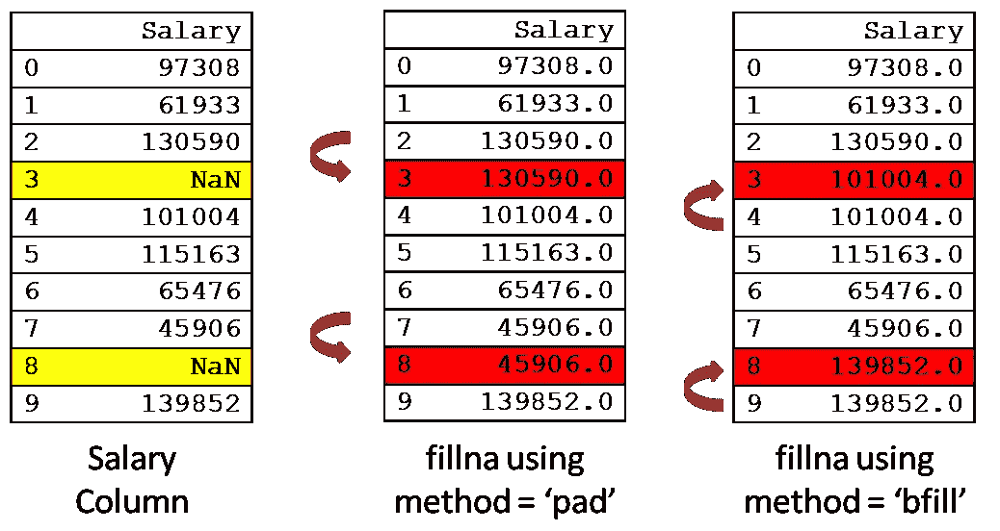
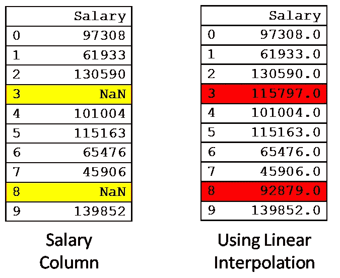

# 如何在 Python 中处理缺失数据

> 原文：<https://towardsdatascience.com/how-to-deal-with-missing-data-in-python-1f74a9112d93?source=collection_archive---------1----------------------->

## 使用 Pandas 和 NumPy 处理数据集中的缺失值


弗兰基·查马基在 [Unsplash](https://unsplash.com?utm_source=medium&utm_medium=referral) 上拍摄的照片

L 去年，我在做一个处理 [**Twitter 数据**](https://python-twitter.readthedocs.io/en/latest/getting_started.html) 的项目。我们的数据库中有大约 10 亿条推文。我需要**清理我们的数据**，这样我们就可以在上面运行一些机器学习模型。

以下是数据集的快照:



来源:作者

> 奇怪的 Unicode 字符(表情符号)，标识符变化的随机缺失值等。我仍然会做那个项目的噩梦。

但是，现实世界的数据集就是这样。您会得到缺失值、随机字符、错误的数据类型等。根据一些统计， [**数据科学家最终要花费 80%的时间来组织和清理数据**](https://www.ibm.com/cloud/blog) 。

数据集中常见的情况是 [**缺失值**](https://www.kaggle.com/alexisbcook/missing-values) 。这可能是由多种原因造成的，如未记录的观察结果或数据损坏。

> 在本教程中，我们将通过使用 [**熊猫库**](https://pandas.pydata.org/) 来了解**在 Python 中处理缺失值的许多不同方式。**

熊猫库为**标记这些腐败的价值观**提供了多种功能。我们将研究如何去除或估算这些值。

来源: [Giphy](https://giphy.com/gifs/sainsburys-fooddancing-food-dancing-l0Ex94k4G50W8XYK4)

# 设置

本教程中的所有例子都在运行 Python 3.7 的 [Jupyter 笔记本](https://jupyter.org/)上测试过。我们将在本教程中使用 [**NumPy**](https://numpy.org/) 和 [**熊猫**](https://pandas.pydata.org/) 。

> 这里有一个附带的 Jupyter 笔记本。

我强烈推荐建立一个[虚拟环境](https://realpython.com/python-virtual-environments-a-primer/),里面有测试所需的所有库。这是你可以做到的。

```
$ virtualenv missing_data
$ source ./missing_data/bin/activate
$ pip3 install pandas numpy
```

# **员工数据集**

在本教程中，我们将使用**小型员工数据集**。

> 从我的 [Github repo](https://github.com/ChaitanyaBaweja/Programming-Tutorials/tree/master/Missing-Data-Pandas) 中下载 CSV 格式的数据集，并存储在您当前的工作目录:[**employees . CSV**](https://github.com/ChaitanyaBaweja/Programming-Tutorials/tree/master/Missing-Data-Pandas)

让我们将这个数据集导入 Python 并查看一下。

输出:



来源:作者

我们将 CSV 文件读入一个 [**熊猫数据帧**](https://pandas.pydata.org/pandas-docs/stable/reference/api/pandas.DataFrame.html) 。`[.head()](https://pandas.pydata.org/pandas-docs/stable/reference/api/pandas.DataFrame.head.html)`方法返回数据帧的前五行。

该数据集有 1000 个观察值，其中六个变量如下所示:



数据集中的所有变量。来源:作者

# **如何将无效/损坏的值标记为缺失**

每个数据集中有两种类型的缺失值:

1.  **可见错误**:空白单元格、特殊符号如 **NA** (不可用)、 **NaN** (不是数字)等。
2.  **模糊错误**:未损坏但**无效值**。例如，负薪金或姓名的数字。

> 注意:对于[埃隆的儿子 X？A-12](https://www.bbc.com/news/world-us-canada-52557291)，命名规则可能需要一些修改。

雇员数据集有多个缺失值。让我们仔细看看:



数据集的前 10 行。来源:作者

你会注意到像 **NA** ， **NaN** ，**这样的值？**和**空白单元格**。这些代表我们数据集中缺失的值。

让我们打印'**薪金'**列的前 10 行。

```
print(df['Salary'].head(10))
```

我们在下面的图片中描绘了数据集的快照和上述语句的输出。



左:数据集中的薪金列。右图:熊猫进口时的工资栏。来源:作者

> Pandas 会自动将空白值或带 NA 的值标记为 NaN(缺失值)。

Pandas 还为每一行分配一个索引值。包含 NaN 的值在 mean、sum 等运算中被忽略。

虽然这适用于 na 和空白行，但熊猫无法识别其他符号，如 NA？，不适用，不适用。这可以在'**性别'**栏中看到:



左:数据集中的性别列。右图:熊猫进口时的性别栏。来源:作者

如前所述，Pandas 处理空白值并将其转换为 NaN。**但对于第 6 行中的不适用，它无法这样做。**

当多个用户手动将数据输入数据库时，这是一个常见的问题。**我们可以将** `**.read_csv()**` **方法** **中的所有这些符号作为一个列表**来传递，以允许熊猫识别它们为腐败值。看一看:



现在，n.a .也转为 NaN。来源:作者

# 处理无效数据类型

到目前为止，我们丢失的值都有唯一的标识符，这使得它们很容易被发现。但是当我们得到一个无效的数据类型时会发生什么呢？

> 例如，如果我们期望一个数值，但是，用户输入一个字符串，如' **No'** 表示薪水。从技术上讲，这也是一个缺失值。

我设计了一个函数，允许我检查列中的无效数据类型。假设我希望确保' **Salary'** 列中的所有值都是类型`int`。我将使用以下内容:

此后，在出现无效条目的地方，薪金列中的值将是带有 NaN 的类型 `int`。

# 使用 isnull 和 notnull 标记缺失值

在 Pandas 中，我们有两个用于标记缺失值的函数:

*   `[isnull()](https://www.geeksforgeeks.org/python-pandas-series-isnull/)`:将数据集中的所有 NaN 值标记为真
*   `[notnull()](https://pandas.pydata.org/pandas-docs/version/0.23.4/generated/pandas.notnull.html)`:将数据集中的所有 NaN 值标记为 False。

看看下面的代码:

```
# NaN values are marked True
print(df[‘Gender’].isnull().head(10))# NaN values are marked False 
print(df[‘Gender’].notnull().head(10))
```



左:原始性别栏，中:`isnull()`函数输出，右:`notnull()`函数输出

> 我们可以使用`isnull` 和`notnull`功能的输出进行过滤。

让我们打印所有没有性别遗漏的行。

```
# notnull will return False for all NaN values
null_filter = df['Gender'].notnull()# prints only those rows where null_filter is True
print(df[null_filter])
```

# 缺失值统计

`isnull`和`notnull`也可以用来汇总缺失值。

## **检查我们的数据帧**中是否有任何缺失值:

```
print(df.isnull().values.any())# Output
True
```

## **每列缺失值的总数**:

```
print(df.isnull().sum())# Output
First Name            70
Gender               149
Salary                 5
Bonus %                4
Senior Management     71
Team                  48
```

# **如何删除缺少值的行**

既然我们已经将数据集中所有缺失的值标记为 NaN，我们需要决定如何处理它们。

最基本的策略是**删除所有包含缺失值的行**，或者在极端情况下，删除包含缺失值的整列。

> Pandas 库提供了`[dropna()](https://pandas.pydata.org/pandas-docs/version/0.21.1/generated/pandas.DataFrame.dropna.html)`函数，可以用来删除丢失数据的列或行。

在下面的例子中，我们使用`dropna()`删除所有丢失数据的行:

```
# drop all rows with NaN values
df.dropna(axis=0,inplace=True)
```

`[inplace=True](https://pandas.pydata.org/pandas-docs/version/0.21.1/generated/pandas.DataFrame.dropna.html)`使所有更改发生在同一个数据框中，而不是返回一个新的数据框。

> 要删除列，我们需要设置 axis = 1。

我们也可以使用`[how](https://pandas.pydata.org/pandas-docs/version/0.21.1/generated/pandas.DataFrame.dropna.html)`参数。

*   `**how = 'any’**`:至少有一个值必须为空。
*   `how = 'all’`:所有值必须为空。

使用`how`参数的一些代码示例:

# 输入数据集中缺失的值

当缺少值的情况很少时，删除行是一个很好的选择。但是这并不总是可行的。我们需要用聪明的猜测来代替这些 NaNs。

替换缺失值时，有许多选项可供选择:

*   单个预先确定的常数值，如 0。
*   从另一个随机选择的样本中取值。
*   列的平均值、中值或众数。
*   使用预测模型插值。

> 为了填补数据集中缺失的值，Pandas 库为我们提供了`[fillna()](https://pandas.pydata.org/pandas-docs/stable/reference/api/pandas.DataFrame.fillna.html)`、`[replace()](https://pandas.pydata.org/pandas-docs/stable/reference/api/pandas.DataFrame.replace.html)`和`[interpolate()](https://pandas.pydata.org/pandas-docs/stable/reference/api/pandas.DataFrame.interpolate.html)`、[、](https://pandas.pydata.org/pandas-docs/stable/reference/api/pandas.DataFrame.interpolate.html)函数。

让我们用例子一个一个地看这些函数。

## **用单个常数值替换 NaNs**

我们将使用`fillna()`将**“薪金”**列中缺失的值替换为 0。

```
df['Salary'].fillna(0, inplace=True)# To check changes call
# print(df['Salary'].head(10))
```

我们也可以对像'**性别'**这样的分类变量做同样的事情。

```
df['Gender'].fillna('No Gender', inplace=True)
```

## **用前一行或下一行的值替换 NaNs**

这是填充图像数据中缺失值的常用方法。我们使用`method = 'pad’`从**前一行**中取值。

```
df['Salary'].fillna(method='pad', inplace=True)
```

我们使用`method = 'bfill’`从下一行的**中取值。**

```
df['Salary'].fillna(method='bfill', inplace=True)
```



来源:作者

## **使用列的中间值/平均值替换 NaNs**

常见的合理方法。

```
# using median
df['Salary'].fillna(df['Salary'].median(), inplace=True)#using mean
df['Salary'].fillna(int(df['Salary'].mean()), inplace=True)
```

> 注意:关于`fillna`的其他选项的信息可在处[获得。](https://pandas.pydata.org/pandas-docs/stable/reference/api/pandas.DataFrame.fillna.html)

## **使用替换方法**

`[replace](https://pandas.pydata.org/pandas-docs/stable/reference/api/pandas.DataFrame.replace.html)`方法是`fillna`方法的一种更通用的形式。这里，我们指定了要替换的值和替换值。

```
# will replace NaN value in Salary with value 0  
df['Salary'].replace(to_replace = np.nan, value = 0,inplace=True)
```

## **使用内插法**

`interpolate()`函数用于使用各种插值技术填充 NaN 值。点击阅读更多关于插值方法[的信息。](https://pandas.pydata.org/pandas-docs/stable/reference/api/pandas.DataFrame.interpolate.html)

让我们使用 [**线性插值法**](https://en.wikipedia.org/wiki/Interpolation) 对缺失值进行插值。

```
df['Salary'].interpolate(method='linear', direction = 'forward', inplace=True) 
print(df['Salary'].head(10))
```



使用线性插值后的输出。来源:作者

# 结束语

不管我们喜欢与否，现实世界的数据都是杂乱无章的。 [**数据清洗**](/data-cleaning-in-python-the-ultimate-guide-2020-c63b88bf0a0d) 是每个数据科学项目的主要部分。

在本教程中，我们回顾了检测、标记和替换缺失值的技术。

数据经常由于随机原因丢失，如**数据损坏、信号错误等**。但有些时候，这种数据缺失还有更深层次的原因。

虽然我们讨论了使用平均值、中值、插值等进行替换，但缺失值通常与我们的数据有一种更复杂的统计关系。我建议浏览本指南的[](https://github.com/matthewbrems/ODSC-missing-data-may-18/blob/master/Analysis%20with%20Missing%20Data.pdf)**了解更多详情。**

**希望看完这篇教程，你少花点时间清理数据，多花点时间探索建模。很高兴在下面的评论中回答你的所有问题。**

# **相关材料**

*   **[Python 熊猫—缺失数据](https://www.tutorialspoint.com/python_pandas/python_pandas_missing_data.htm)**
*   **[DataCamp 课程:用 Python 处理丢失的数据](https://www.datacamp.com/courses/dealing-with-missing-data-in-python)**
*   **[机器学习掌握——如何用 Python 处理缺失数据](https://machinelearningmastery.com/handle-missing-data-python/)**

**Chaitanya Baweja 渴望用工程解决方案解决现实世界的问题。在 [Twitter](https://twitter.com/openvayu) 和 [Linkedin](https://www.linkedin.com/in/chaitanya-baweja/) 上关注他的旅程。**