# 如何调试机器学习模型以尽早发现问题

> 原文：<https://towardsdatascience.com/how-to-debug-machine-learning-models-to-catch-issues-early-and-often-5663f2b4383b?source=collection_archive---------12----------------------->

## 通过更好的数据捕获、实时监控和及时干预，节省机器学习培训的时间和成本

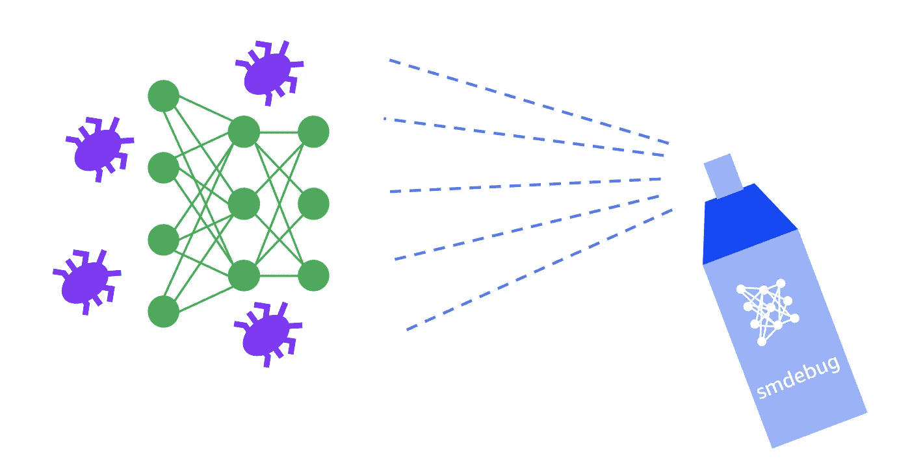

Eek！我的神经网络有个 bug！

如果你从事软件开发，你会知道程序错误是生活中的事实。当你开始你的项目时，他们会在那里，当你把你的产品交付给客户时，他们也会在那里。在过去的几十年里，软件开发社区已经开发了大量的工具、ide、库和技术来帮助尽早地、经常地捕捉 bug，因此很少会出现在产品代码中。

不幸的是，机器学习开发人员和数据科学家并不享受传统软件可用的同样健壮的调试工具集。这就是为什么我们很多人在培训脚本中使用打印语句。在集群上运行分布式训练或大规模实验时，问题会变得更糟。您可以保存来自多个工作人员的日志，但是发现问题就像大海捞针一样困难。

在这篇博文中，我将讨论是什么让调试机器学习代码不同于传统软件，以及为什么它要困难得多。然后，我将展示如何使用更好的机制来捕获调试信息、实时监控培训期间的常见问题以及及时干预以防止不良工作浪费资源，从而应对这些挑战。

为了实现这些技术，我将使用 [Amazon SageMaker 调试器](https://docs.aws.amazon.com/sagemaker/latest/dg/train-debugger.html)——一个托管服务和一个用于调试机器学习模型的开源库。通过示例，我将展示如何使用 Amazon SageMaker 调试器和带有 TensorFlow、Keras 和 PyTorch 的 [smdebug 开源库](https://github.com/awslabs/sagemaker-debugger)(也支持 MXNet 和 XGBoost)来收集训练期间的调试数据，设置规则来监控条件并实时或离线分析数据。

# 是什么让机器学习调试与众不同？

如果机器学习只是软件，那么只使用传统软件开发可用的相同调试工具不是很有意义吗？毕竟，今天你有很多工具。您可以:

1.  使用您最喜欢的集成开发环境(IDE ),它允许您放置条件断点并检查中间变量，
2.  利用特定于语言的编程结构进行异常处理和类型检查
3.  使用静态代码分析工具来尽早发现错误，并检查是否符合标准
4.  使用调试器库，如 gdb
5.  使用记录器和精心选择的打印语句执行记录和跟踪

即使有了所有这些工具，仍然很难找到机器学习的错误，这有几个原因，我在下面描述。

## (1)机器学习不仅仅是代码

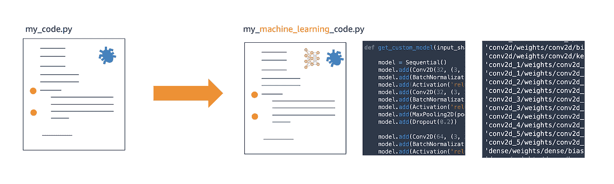

传统软件代码与机器学习代码

让我们考虑一下典型的(简化的)数据科学问题——你有一个数据集和一个问题陈述，你必须建立一个模型来根据数据预测一些事情。然后你衡量它的准确性，如果满意就使用这个模型——例如，部署它，集成到一个更大的软件项目中，出售它等等。

与传统软件相比，机器学习代码有更多的活动部分。存在数据集、模型架构、在训练期间微调的模型权重、优化算法及其参数、在训练期间改变的梯度等等。

在某种意义上，机器学习代码在训练阶段是“动态的”。我的意思是，你的“源代码”本质上是随着你的模型训练而变化或发展的。在训练过程中，模型中的数百万个参数或权重在每一步都在变化。一旦训练完成，它就停止变化，此时您在训练中没有发现的错误现在是模型的一部分。与传统软件形成对比——代码中的逻辑和规则不会在每次运行时改变。可能会有条件分支，但代码仍然是“静态的”，因为不像机器学习训练那样有无限的结果。

调试这种动态的、不断发展的代码需要不同的工具。你需要的是一种方法，通过分析数百万个不断发展的变量来检查训练进度，并在满足某些条件时采取行动。您希望能够监控模型参数、优化参数和指标，以捕捉消失梯度、激活饱和度等问题。

在这个领域缺乏适当的工具是我们许多人使用打印报表和记录器来分析培训的原因。

## (2)在机器学习训练期间的监控和干预是困难的

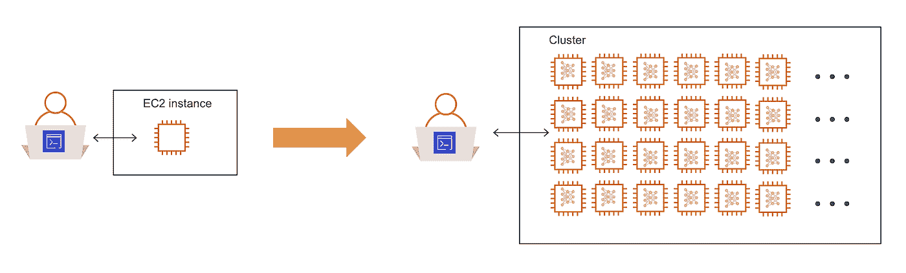

调试运行在集群上的代码比调试运行在笔记本电脑或 Amazon EC2 实例上的代码更难

大量的机器学习训练代码运行在集群上，或者至少运行在云中远离你的计算机上。这是因为在进行大规模培训时，短期租用大量具有 GPU 的强大机器更加高效和经济。

> 那么，如何在集群中运行的代码上设置条件断点呢？

当您的编程范式改变时，您的调试工具和方法也应该改变。当您在集群上运行一个[分布式培训](/a-quick-guide-to-distributed-training-with-tensorflow-and-horovod-on-amazon-sagemaker-dae18371ef6e?source=friends_link&sk=0a1f6a2e7716d4272c79156cf7c5f294)任务时，监控进度的主要方法是检测您的代码以生成日志，并将它们保存在一个中心位置以供分析。相反，您需要一种简单的方法来实时监控进度，并在满足特定条件时向您发出警报或采取一些措施。如果你不必修改你的训练脚本，那就更好了。这让我们面临下一个挑战。

## (3)调试机器学习代码可能需要大量的重写或转换框架

在其核心，机器学习代码依赖于一系列用 C、C++和 CUDA 等语言编写的高度优化和微调的线性代数子程序。诸如 TensorFlow、PyTorch、MXNet 等更高级别的框架抽象出底层的复杂性，并为您提供一种简单方便的方法来设计和训练您的模型。当你隐藏了复杂性，你就为了易用性而牺牲了控制，调试就变得困难了。

机器学习框架遵循两种不同的哲学——(1)声明性方法，其中您将模型架构定义为图形，该图形被编译、优化，然后被执行(例如 TensorFlow) (2)命令性方法，其中您将模型架构定义为图形，并且它按照定义被执行(例如 PyTorch、TensorFlow eager mode)。在声明式方法中，您无法访问优化的图，因此调试会更加困难。在命令式方法中，调试更容易，但是需要努力在较低的级别检测代码以捕获调试数据，并且在某些情况下需要牺牲性能。

为了更好地调试，您必须编写额外的代码来检测您的训练脚本，或者重写您的代码来支持命令式风格或切换框架。或者更糟，在多个框架上维护相同的副本。所有这些选择都是更多错误的机会。

## (4)错误会让您付出代价—基础架构成本，更重要的是，您的时间

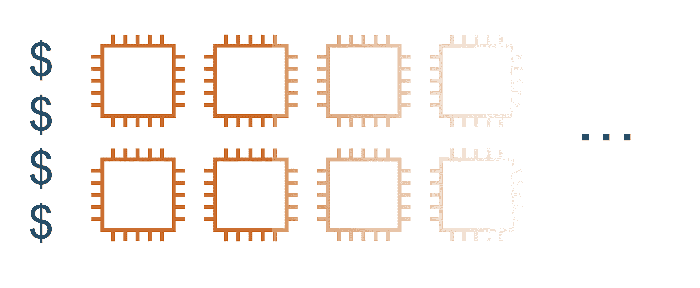

机器学习会浪费计算和存储资源

大多数机器学习问题可以在训练过程的早期发现。一些常见的问题，比如初始化不好，渐变消失，激活函数饱和，可以而且应该尽早发现，以防止时间和资源的浪费。随着时间的推移，其他问题也会显现出来，比如过度适应或过度训练。早期和晚期发生的问题都会让你付出代价。

早期发生的问题是不可挽救的，并且由于训练运行产生垃圾，导致基础设施资源浪费。如果实践了良好的检查点，后期出现的问题是可以补救的。通过在问题发生时回退到检查点，您仍然可以获得一个好的模型。然而，在问题发生后用于培训的所有资源再次被浪费。

这种浪费会累积起来，耗费你的金钱和时间，尤其是当你有多个团队并行运行多个项目的时候。

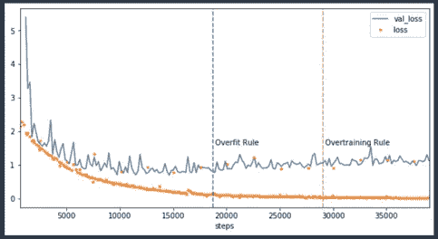

尽早发现过度合身等问题，并采取措施减少浪费

在随附的图表中，您可以看到一个示例，当模型在 20k 步左右开始过度拟合时，应该停止训练。相反，培训一直持续到大约 40k，花费了您两倍的基础设施成本。诸如此类的问题很常见，因为我们指定了固定数量的时期来运行培训作业，然后出去吃午饭。

# 在机器学习调试器中寻找什么？

如果传统的软件开发调试工具对机器学习不起作用，你如何着手调试机器学习代码？

以下是一个好的机器学习调试器应该具备的显著特征:

1.  **捕获**:调试器必须能够在训练期间捕获模型和优化器的特定信息。用户必须能够指定粒度(频率)和后处理(在张量上应用缩减)来管理调试数据。
2.  **反应**:调试器必须能够监控捕获数据的变化并做出反应。用户必须能够指定满足条件时触发的断言规则，例如分解渐变或过度拟合。
3.  **分析**:调试器必须允许你在训练期间实时分析捕获的数据。用户还必须能够对捕获的数据进行离线分析。

现在让我们看看如何使用 Amazon SageMaker 调试器来执行这些调试步骤。

# 使用 Amazon SageMaker 调试器进行调试

Amazon SageMaker Debugger 是 Amazon SageMaker 服务套件的一项新功能，使用它，您可以通过监控、记录和分析捕获训练作业状态的张量数据来全面了解模型训练。有两种方法可以使用它:

1.  **Amazon SageMaker 托管训练:**使用 Amazon SageMaker 训练模型时会自动启用调试器，您不需要对您的训练脚本进行任何更改。只需指定要监控的问题，它就会自动运行监控作业，可以捕捉许多条件，如消失的梯度，爆炸张量，过度拟合和训练期间的其他情况。它还会在训练期间捕捉张量，并将其保存在亚马逊 S3 中，以供实时或离线分析。
2.  `**smdebug**` **开源库:**对于 DIY 体验，你可以使用开源库对你用 TensorFlow、Keras、PyTorch、MXNet 或 XGBoost 编写的训练脚本进行插装，保存调试信息。然后，您可以在本地设置和运行监控。您可以使用它来调试 Amazon SageMaker 上的定制培训容器，或者在 Amazon SageMaker 上运行缩放之前，在您的笔记本电脑、台式机或 Amazon EC2 实例上本地调试框架。

让我们来看看亚马逊 SageMaker 调试器如何让您能够 **(1)** **捕获**调试数据， **(2)对特定调试条件做出**反应，并为您提供工具来 **(3)分析**调试数据。

# (1)使用调试器钩子捕获调试数据

机器学习训练期间的大部分繁重工作都发生在优化例程中。非常明确地说，我指的是数值优化例程，如随机梯度下降(SGD)，而不是编译器优化。

这些例程负责将您的模型预测与实际值进行比较，计算梯度并更新权重以缩小预测损失的差距。这一步发生在机器学习框架的深处，并负责使用计算的梯度更新数百万个模型参数或权重和偏差。

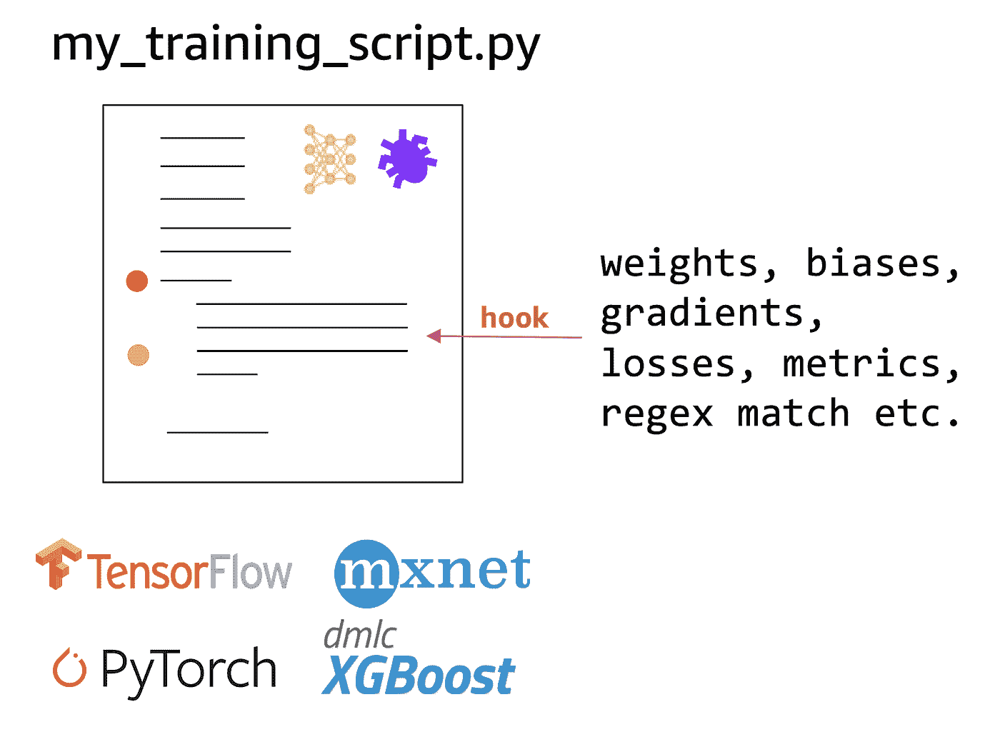

钩子允许你捕获和保存模型和优化变量，如权重，偏差，梯度等。

为了在培训期间捕获这些信息，Amazon SageMaker 调试器可以自动将钩子插入到您的 TensorFlow、Keras、PyTorch、MXNet 或 XGBoost 代码中。当指定一个 SageMaker 调试器钩子时，你可以告诉它在训练期间需要保存什么信息。Amazon SageMaker 调试器支持一个[预定义的张量列表](https://github.com/awslabs/sagemaker-debugger/blob/1bb5a1ed6b73efc52779948dabf94552d5b227b2/docs/api.md#collection)，您可以要求它保存这些张量，其中包括权重、偏差、梯度、损失、度量、优化器变量等。如果想要在模型的特定层中捕获特定张量，也可以指定正则表达式字符串。

让我们来看看在使用(1) Amazon SageMaker 和(2) `smdebug`开源库进行本地调试或在定制容器中使用时，如何指定一个钩子

## 在 Amazon SageMaker 上使用钩子

如果您使用 Amazon SageMaker 运行培训作业，Amazon SageMaker 调试器会在 TensorFlow、PyTorch、MXNet 和 XGBoost 培训作业容器中自动配置，您不必更改您的培训脚本。

当指定您的培训工作时，您需要做的就是指定一个挂钩配置，如下所示。

在这个例子中，钩子被指定为每`save_interval` = 100 步节省(1)损失，(2)重量，(3)梯度和(4)偏差。如果您不想保存整个培训期间的信息，也可以提供开始和停止步骤。

当调用 SageMaker TensorFlow 估算器时，使用 Amazon SageMaker Python SDK 只需将钩子传递给`debugger_hook_config`参数。

如果你是亚马逊 SageMaker 的新手，请观看这个介绍性的[网络研讨会](https://www.youtube.com/watch?v=02Ft-rCssRs)，了解如何在亚马逊 SageMaker 上开展培训工作。TL；DR-Amazon sage maker 为您的培训工作提供全面管理的体验。只需提供如上所示的培训脚本，它就会自动提供所需的资源并运行培训。亚马逊 SageMaker [网页](https://aws.amazon.com/sagemaker/developer-resources/)上也有大量资源，包括培训、模型调整和部署。

您看到了在 Amazon SageMaker 上运行培训作业时如何使用调试器挂钩。接下来，我们将看到如何使用开源的`smdebug`库，在你的笔记本电脑、台式机或亚马逊 EC2 机器上本地使用亚马逊 SageMaker 调试器。

## 通过开源 smdebug 库使用钩子

如果你想在你的训练脚本中加入钩子，你可以使用`smdebug`库:

1.  在您的笔记本电脑或台式机上运行您的培训脚本，亚马逊 SageMaker 无法自动为您提供帮助
2.  运行在 Amazon SageMaker 上，但是您使用了一个定制的容器映像，Amazon SageMaker 不能自动为您放置钩子

如果你是这两种情况中的一种，你可以使用`smdebug`库来放置钩子，只需要最小的代码修改。我在下面提供了 Keras 和 PyTorch 脚本的例子。

**在 Keras 中放置挂钩**

使用`smdebug`库，首先创建一个`KerasHook`，并指定钩子参数。在这个例子中，我要求`KerasHook`在`out_dir`保存张量值，在`tensorboard_dir`保存张量板日志。我想保存的张量是梯度和偏差。我可以扩展这个列表来保存其他值，比如权重、optimizer_variables 等等。在后台`KerasHook`将配置必要的回调函数来捕获数据。

**将吊钩放入 PyTorch**

使用`smdebug`库，创建一个类似于上面 Keras 方法的钩子，然后在 net 变量中用神经网络注册这个钩子。您还可以使用损失函数注册挂钩，以在训练期间捕获损失值。

在你的训练循环中，使用钩子记录特定的张量值，使用`hook.record_tensor_value`

# (2)使用调试器规则对调试数据中的变化做出反应

如果您不能在训练期间实时地对它们采取行动，那么使用钩子保存的调试数据就没有多大用处。这就是调试器规则的用武之地。规则是一段 Python 代码，用于在训练过程中检测特定条件。当规则状态改变时，会触发一个 [Amazon CloudWatch](https://aws.amazon.com/cloudwatch/) 事件，您可以对该事件采取行动，例如停止训练，或者向您发送电子邮件或短信。

Amazon SageMaker 调试器为常见问题提供了几个内置规则，所以你不必为它们编写逻辑。这些包括:死 relu，爆炸张量，差权重初始化，饱和激活，消失梯度，全零，类不平衡，损失不减，过度拟合，过度训练和许多其他问题。如果您正在寻找的规则不在这里，那么您可以使用`smdebug`库编写一个自定义规则，我们将在下面看到。

对于主动监控培训作业和捕捉问题的规则，它需要作为服务与您的培训作业同时运行。如果你正在使用 Amazon SageMaker 运行培训作业，一个规则容器会自动运行来监控你的培训作业，不需要你做任何操作。

或者，您也可以使用`smdebug`库在您的笔记本电脑或台式机上本地运行规则。让我们来看看如何做到这两点。

## 对 Amazon SageMaker 培训工作使用规则

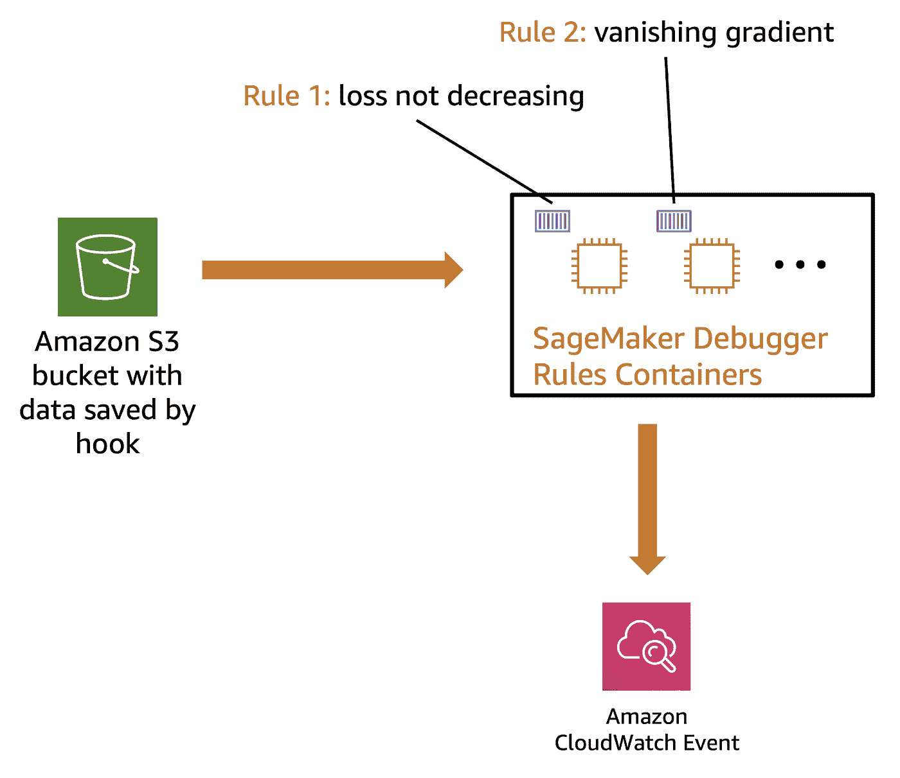

如果您使用 Amazon SageMaker 运行培训作业，一个规则作业将自动安排与培训作业一起运行。在训练期间，规则作业获取 Hook 保存的张量(来自 S3 ),并调用规则逻辑。

您可以拥有任意多的规则，系统会自动为您安排一个单独的规则作业。在附图中，我展示了两条规则:损失不减少和消失梯度。每个都将在 Amazon SageMaker 管理的独立容器中运行。

指定培训工作时，请指定挂钩配置，如下所示。

此示例显示了 3 个规则— 2 个内置规则(`overtraining`、`overfitting`)和 1 个自定义规则(`CustomGradientRule`)

对于`CustomGradientRule`，您应该指定您希望 SageMaker 使用什么资源来运行规则。在这个例子中，我指定了一个`t2.medium`实例，它应该足以运行一个实现定制规则的简单 Python 脚本。

在您的 SageMaker 框架估计器函数(例如下面的 TensorFlow 估计器)中，您提供您的规则配置作为规则的参数。这将指示 Amazon SageMaker 不仅启动一个培训作业，还将规则作业，数量相当于您指定的规则数量。在本例中，有 3 条规则。

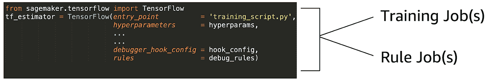

具有规则规范的培训作业将启动一个培训作业和监视该培训作业的规则作业

## 使用 smdebug 库的规则在本地运行它们

要在培训期间在你的笔记本电脑、台式机或 Amazon EC2 实例上本地运行规则，你需要使用`smdebug`库指定一个规则。

在下面的例子中，我定义了一个名为`CustomGradientRule`的规则。您可以通过从 Rule 类派生来定义自定义规则。核心逻辑在`invoke_at_step`函数中。在这里，我检查梯度的绝对平均值是否大于某个阈值——如果没有指定阈值，则阈值为 10。

为了调用规则，创建一个自定义规则类的对象并调用`invoke_rule`

输出:

```
INFO rule_invoker.py:15] Started execution of rule CustomGradientRule at step 0
```

# (3)在训练期间离线或实时分析和可视化调试数据

使用钩子，你可以导出数据，如体重，梯度和其他在训练中，规则让你检查条件，以便你可以采取行动。在某些情况下，您只想分析原始数据并绘制图表，以找到您还不了解的问题。当你这样做的时候，你可以把它转换成一个规则，这样你就可以在下一次训练中抓住它。

有两种可视化结果的方法:

1.  在 Amazon SageMaker Studio 上使用内置的可视化工具
2.  在本地笔记本电脑、台式机或 Amazon EC2 实例上进行定制分析和可视化

## 使用亚马逊 SageMaker Studio 可视化

Amazon SageMaker Studio 建立在熟悉的 Jupyter 笔记本体验的基础上，集成了跟踪实验、可视化训练期间的性能曲线以及比较实验中不同试验的结果的功能。您还可以通过选择由调试器挂钩保存的值来调出自定义图表。

> 关于如何使用 Amazon SageMaker Studio 图表和可视化以及 Amazon SageMaker 调试器的演示演练，请观看我的 NVIDIA GTC 2020 会议演讲视频:
> [GTC 2020:使用 Amazon SageMaker 调试器提高 ML 培训性能](https://developer.nvidia.com/gtc/2020/video/s22493)

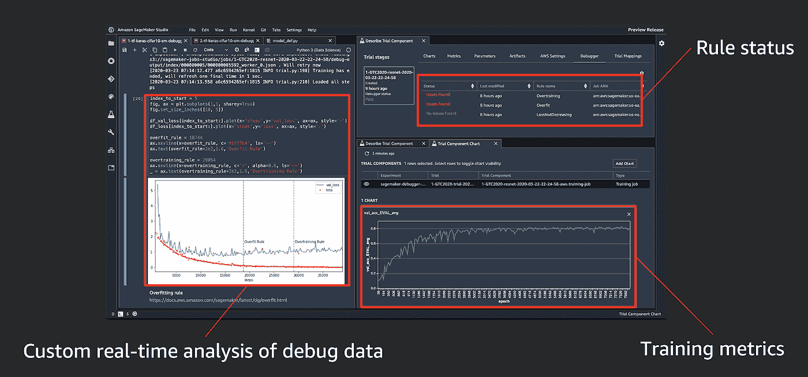

[GTC 2020:利用亚马逊 SageMaker 调试器提高人工智能训练性能](https://developer.nvidia.com/gtc/2020/video/s22493)

## 使用 smdebug 库进行本地分析和可视化

为了在本地分析您的数据，您需要使用`smdebug`库创建一个试验。试用对象可用于查询张量名称、张量值等。

例如，如果您已经使用以下钩子训练了 PyTorch 模型来保存梯度和偏差:

```
hook = smd.Hook(out_dir=f'./smd_outputs/{job_name}',
               save_config=smd.SaveConfig(save_interval=10),
               include_collections=['gradients', 'biases'])
```

您可以在训练仍在运行时创建一个试验以进行实时分析:

```
import smdebug.pytorch as smd
trial = smd.create_trial(path=PATH_TO_S3_OR_LOCAL_DIR')
```

要查询保存了哪些张量，请运行:

```
trial.tensor_names()
```

因为我们要求保存梯度和偏差，所以当你调用 tensor_names 时，你会看到两者。

输出:

```
[2020-03-30 06:02:17.108 ip-172-31-28-67:31414 INFO local_trial.py:35] Loading trial pytorch-exp03-30-05-53-52 at path ./smd_outputs/pytorch-exp03-30-05-53-52
[8]:
['CrossEntropyLoss_output_0',
 'Net_conv1.bias',
 'Net_conv2.bias',
 'Net_fc1.bias',
 'Net_fc2.bias',
 'Net_fc3.bias',
 'gradient/Net_conv1.bias',
 'gradient/Net_conv1.weight',
 'gradient/Net_conv2.bias',
 'gradient/Net_conv2.weight',
 'gradient/Net_fc1.bias',
 'gradient/Net_fc1.weight',
 'gradient/Net_fc2.bias',
 'gradient/Net_fc2.weight',
 'gradient/Net_fc3.bias',
 'gradient/Net_fc3.weight',
 'loss_output_0']
```

检索和分析`gradient/Net_conv1.bias`运行:

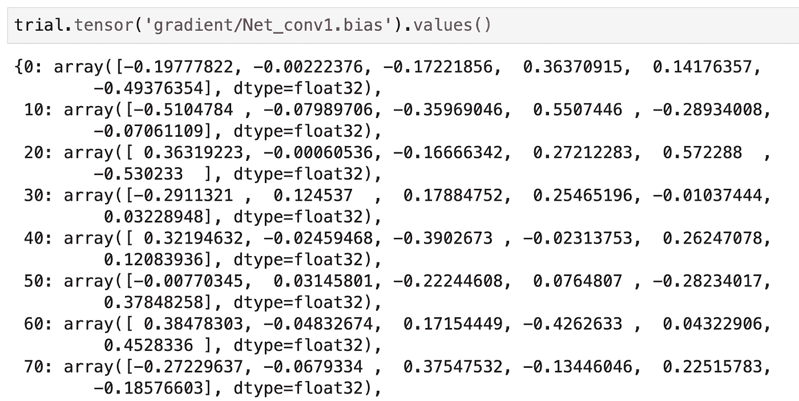

你会注意到渐变是每 10 步保存一次，这是我们在钩子中指定的。通过循环运行上述命令来查询最近的值，可以在训练期间检索张量。这样，您可以绘制性能曲线，或者随着训练的进行，可视化过滤器权重的变化。看看这个演示如何使用`smdebug`在训练期间[实时监控课程激活](https://github.com/awslabs/amazon-sagemaker-examples/tree/master/sagemaker debugger/model_specific_realtime_analysis/cnn_class_activation_maps)

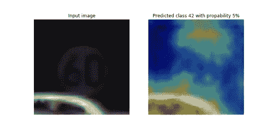

[https://github . com/aw slabs/Amazon-sage maker-examples/tree/master/sage maker debugger/model _ specific _ real time _ analysis/](https://github.com/awslabs/amazon-sagemaker-examples/tree/master/sagemaker-debugger/model_specific_realtime_analysis/bert_attention_head_view)[CNN _ class _ activation _ maps](https://github.com/awslabs/amazon-sagemaker-examples/tree/master/sagemaker-debugger/model_specific_realtime_analysis/cnn_class_activation_maps)

# 这一切是如何协同工作的

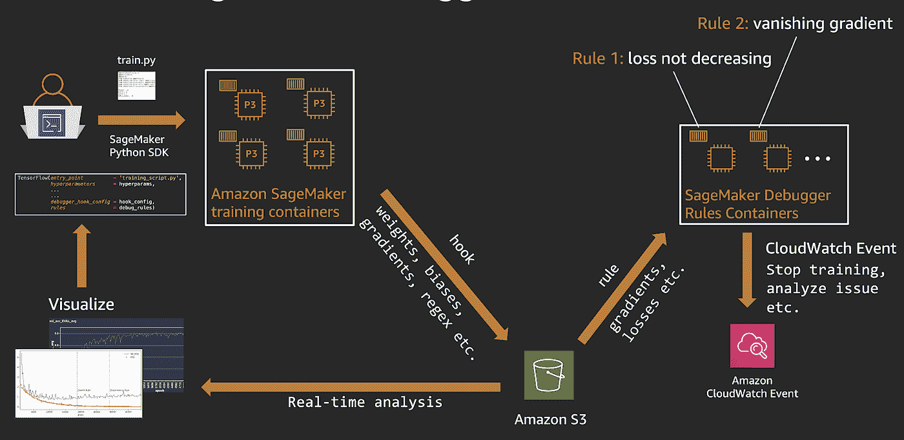

端到端 Amazon SageMaker 调试器工作流

让我们快速回顾一下 Amazon SageMaker 调试器如何与 Amazon SageMaker 的培训一起工作:

1.  您使用 SageMaker Python SDK 和框架(TensorFlow、PyTorch 等)开始了一项 Amazon SageMaker 培训工作。)估计量。
2.  Amazon SageMaker 在指定数量的 CPU 或 GPU 实例上启动了一项培训工作。SageMaker 还将启动规则工作来监控培训工作。
3.  使用调试钩子配置，Amazon SageMaker 将把权重、偏差和其他张量保存到指定的 S3 位置。
4.  当挂钩数据可用时，嵌线作业开始运行指定的嵌线逻辑(过度拟合、渐层消失等)。)在他们身上。
5.  当规则状态发生变化时，会生成一个 CloudWatch 事件，您可以指定一个 CouldWatch 规则来采取诸如停止训练或向您发送文本消息之类的操作。这里是一个[当规则被触发](https://github.com/awslabs/amazon-sagemaker-examples/blob/master/sagemaker-debugger/tensorflow_action_on_rule/tf-mnist-stop-training-job.ipynb)时使用 AWS Lambda 停止训练的例子。
6.  要对调试数据执行实时或离线分析，您可以使用`smdebug`库通过提供调试数据位置来创建一个试验对象。trail 对象可用于查询张量，您可以绘制它们来分析结果

# 摘要

调试很难，调试机器学习更难。在这篇文章中，我讨论了如何使用 Amazon SageMaker 调试器来减轻一些机器学习调试的痛苦。这里有 3 种方法可以将 Amazon SageMaker 调试器用于您的机器学习工作流:

*   在 Amazon SageMaker 上运行培训作业时，您可以将它作为一个完全托管的服务来使用，无需对您的培训脚本进行任何更改。调试规则作业是自动计划和运行的，以检查问题。
*   你可以使用开源的`smdebug`库在你的笔记本电脑、台式机或 Amazon EC2 实例上进行本地调试，通过检测你的代码来添加钩子和运行规则。
*   通过使用 Amazon SageMaker 进行训练，并在本地使用`smdebug`来运行规则和分析调试张量，您可以在混合设置中使用这两者

因为它非常灵活，还允许您使用自定义规则扩展其功能，并使用正则表达式查询自定义张量。这篇博文中讨论的所有例子，以及一些额外的例子都可以在这里找到:

> [https://github . com/shashankprasanna/sagemaker-debugger-examples](https://github.com/shashankprasanna/sagemaker-debugger-examples)

对于亚马逊 SageMaker 调试器以及亚马逊 SageMaker 工作室演示的视频演练，请查看我在 NVIDIA GTC 2020 上的演讲:

> [GTC 2020:用亚马逊 SageMaker 调试器提高 ML 训练性能](https://developer.nvidia.com/gtc/2020/video/s22493)

如果你对这篇文章有疑问，对如何改进它有建议或者对新帖子有想法，请在 twitter ( [@shshnkp](https://twitter.com/shshnkp) )， [LinkedIn](https://www.linkedin.com/in/shashankprasanna/) 联系我或者在下面留下评论。尽情享受吧！