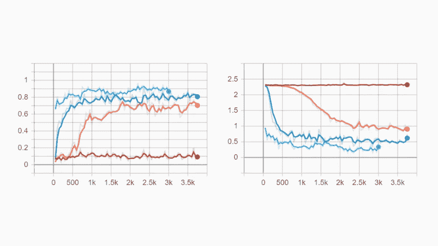
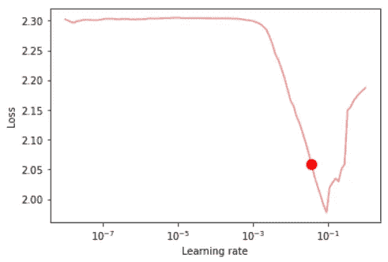
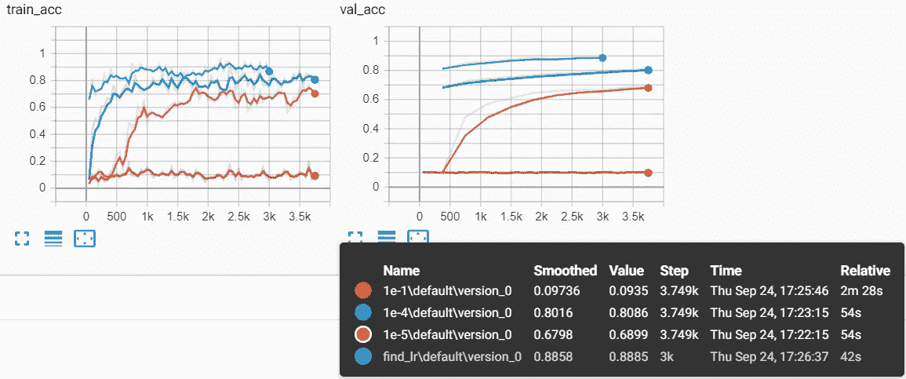
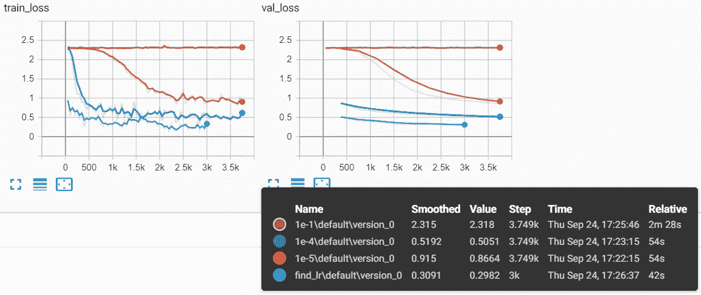

# 如何决定学习速度

> 原文：<https://towardsdatascience.com/how-to-decide-on-learning-rate-6b6996510c98?source=collection_archive---------9----------------------->

## 使用 PyTorch Lightning 为您的神经网络找到好的 LR

用 PyTorch Lightning 为你的神经网络寻找 LR(图片由作者提供)

在机器学习算法中使用的所有超参数中，学习率可能是你最先了解的一个参数。很有可能这也是你开始玩的第一个。通过一点超参数优化，有机会找到最佳值，但这需要大量的实验。那么，为什么不让您的工具来做这件事(更快)？

# 了解学习速度

对什么是学习率的最简短的解释是，它控制着你的网络(或任何算法)学习的速度。如果你还记得[监督学习](https://en.wikipedia.org/wiki/Supervised_learning)是如何工作的，你应该熟悉神经网络的概念，它根据监督人的反应来适应问题，例如:

*   *错误类别*——对于分类任务，
*   *输出值过低/过高* —用于回归问题。

由于这一点，它可以迭代地给出越来越准确的答案。每当它收到来自主管的反馈时，它就会知道正确的答案应该是什么。而学习率控制了响应于最近的错误(反馈)而改变模型感知的程度。

## 好的学习率，差的学习率

如果存在我们所寻求的“好的学习率”，“坏的学习”是否也存在？这意味着什么？让我坚持监督学习的概念，讨论一个微不足道的例子:

*   我们在玩“猜数字”游戏，
*   每猜错一次，你都会得到一个回应:*【太低】*或者*【太高】*。

虽然这不是一个真正的神经网络的例子，让我们想象一下如何玩这个游戏，让我们假设这次不是纯粹的随机猜测。

每次你得到反馈时，你是愿意向正确答案迈出一小步还是一大步？虽然这个例子不是真正关于神经网络或机器学习，但这本质上是学习率如何工作的。

现在，想象一下，只迈出很小的一步，每一步都让你更接近正确的数字。这能行吗？当然了。然而，这真的需要一些时间，直到你到达那里。这是**小学习率**的情况。在机器学习的背景下，LR 太小的模型学习速度会很慢，并且需要更多的迭代来解决问题。有时你可能已经决定在训练结束前停止训练(或者玩猜数字游戏)。

你也可以选择一个太大的值。然后呢？例如，它可能会导致神经网络**过多地**(并且过于频繁地)改变它的想法。每一个新的样本都会对你的网络信仰产生巨大的影响。这样的训练会**高度不稳定**。它不再是一个学习缓慢的人，但它可能更糟糕:你的模型可能最终没有学到任何有用的东西。

# 学习率范围测试

Leslie N. Smith 在 2015 年撰写的论文 [*《训练神经网络的循环学习率》*](https://arxiv.org/abs/1506.01186) 引入了一个循环学习率的概念——在训练过程中轮流增加和减少。然而，论文中提到了一件重要的事情，即所谓的“LR 范围测试”(第 3.3 节)。

整个事情相对简单:我们运行一个短的(几个时期)训练会话，其中在两个边界值 `min_lr`和`max_lr`之间**学习率增加**(线性)**。在开始时，学习率小，网络将开始慢慢收敛，导致损失值越来越低。在某些时候，学习率会变得太大，导致网络发散。**

*图一。lr_find 方法建议的学习率(图片由作者提供)*

如果您绘制损失值与测试学习率的关系图(图 1。)，你通常会在最陡下降损失曲线中间的某个地方**寻找学习的最佳初始值——这仍然可以让你使用学习速率调度器减少一点 LR。在图 1 中。当损耗在 LR 0.001 和 0.1 之间开始显著下降时，红点表示 PyTorch Lightning 框架选择的最佳值。**

# 在 PyTorch 闪电中寻找 LR

最近 PyTorch Lightning 成为我短期机器学习项目的首选工具。几个月前我第一次使用它，从那以后我一直在使用它。除了所有很酷的东西，它还提供了[学习率查找器](https://pytorch-lightning.readthedocs.io/en/latest/lr_finder.html)类，帮助我们找到一个好的学习率。

使用 LR Finder 无非是*训练器*类中的 *auto_lr_find* 参数:

现在，当你调用`trainer.fit`方法时，它在下面执行学习率范围测试，找到一个好的初始学习率，然后直接训练(拟合)你的模型。因此，基本上这一切都是在`fit`通话中自动发生的，你完全不用担心。

如[文档](https://pytorch-lightning.readthedocs.io/en/latest/lr_finder.html)中所述，有一种替代方法允许您手动使用 LR Finder 并检查其结果。这一次你必须创建一个默认值为`auto_lr_find` (False)的`Trainer`对象，并手动调用`lr_find`方法:

仅此而已。这种方法的主要优点是，您可以更仔细地查看显示选择了哪个值的图(参见图 1。).

# 例如:时尚 MNIST 的 LR 搜索器

我决定在时尚 MNIST 数据集上训练一个相当简单的网络架构。我运行了四个**独立的实验，它们的不同之处仅在于初始学习率**值。其中三个是亲手挑选的(1e-5、1e-4、1e-1)，最后一个是 Learning Rate Finder 建议的。整个实现和其他参数我就不描述了(自己看[这里](https://github.com/mtszkw))。让我给你看看我的发现。

大概用了 12 秒(！)来找到最佳的初始学习率，对于我的网络和正在解决的问题，结果是 0.0363。看着 loss versusLR 图(完全是图 1 中的图)，我很惊讶，因为建议的点并不完全是*“最陡下坡的中途”*(如论文中所述)。然而，我不知道这是好是坏，所以开始训练模型。

为了记录和可视化，我使用 TensorBoard 来记录训练和验证步骤中的损失和准确性。下面您可以看到四个实验中每个实验的指标历史。

*图二。培训和验证。对于 4 个实验(图片由作者提供)*

闪电(浅蓝色)建议的学习率似乎在训练和验证阶段都优于其他值。最后，它在验证集上达到 88，85%的准确率，这是所有实验的最高分(*图 2* )。不仅如此，损失函数值显然是“find_lr”实验的最佳值。在最后一个验证步骤中，损失达到 0.3091，这是与图 3 中的其他曲线相比的最低值。

*图三。4 个实验的训练和验证损失(图片由作者提供)*

# 结论

在这个短暂的实验中，学习率查找器的表现超过了我亲手挑选的学习率。当然，有可能我会选择 0.0363 作为我最初的猜测，但是**LR Finder 的整个要点是最小化所有的猜测**(除非你是一个幸运的人)。

我认为使用这个功能是有用的，正如莱斯利·n·史密斯所写的:

> 每当一个人开始一个新的架构或数据集，一个单一的 LR 范围测试提供了良好的 LR 值和良好的范围。那么应该比较具有固定 LR 的运行和具有该范围的 CLR。无论哪一次获胜，都可以放心地用于余下的实验。

如果你不想使用不同的值来执行超参数搜索，这可能需要很长时间，**你有两个选择**:随机选择初始值(这可能会让你的性能和收敛性非常差，但如果你是一个幸运的人，可能会工作得很好)或使用你选择的机器学习框架中包含的学习率查找器。

你会选哪一个？