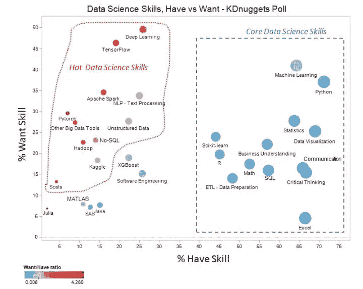

# 如何决定学习什么数据技能

> 原文：<https://towardsdatascience.com/how-to-decide-what-data-skills-to-learn-e456be194137?source=collection_archive---------4----------------------->

## 获得就业市场上最有价值的技能

如果你用谷歌搜索“如何学习”,你可能会找到至少一门在线课程、youtube 教程、书籍或文章很好地涵盖了它。许多资源甚至是免费的。当决定在哪里学习一项技能时，有许多观点。持有这些观点的人没有尝试过每一个教育产品(甚至可能试图向你推销某些东西)，所以很难说什么是最好的资源。说到挑选资源，我没有什么建议，除了*到* *不喜欢就不要坚持*。几乎总是有更好的资源可供选择。这里真正的问题是。你打算在谷歌搜索中加入什么技能？

# 不要按照工作描述去做

好吧，这听起来违背直觉。如果你不知道求职申请上有什么，你将如何吸引雇主？我有两个理由认为求职申请不是一个好的晴雨表。首先，要求的顶级技能包括像 Excel 和 Tableau 这样的东西，对我来说，以这些为主要要求的工作不是真正的数据科学工作。当然，您可能偶尔会将他们用作数据科学家，但这更多是数据分析师、商业智能人员或商业分析师的工作。从本质上来说，各公司对数据科学家和数据分析师的定义并不相同，因此求职应用程序并不是一个有效的衡量标准。

我不使用职位描述的主要原因是，它们通常是由人力资源和/或招聘人员编写的，而不是由你的未来经理编写的。我见过要求 5 年 PyTorch 经验的工作，考虑到它只有 3 年左右的历史，这种经验很难找到。你真的应该排队向不从事数据科学工作的人学习什么吗？我不这么认为。知道什么是有价值的技能的人是其他数据科学家。此外，你很有可能会在某个时候接受一位资深数据科学家的面试。因为他们可能是最难通过的过滤器，你应该优化给数据科学家留下深刻印象，而不是招聘人员。

# 不要只是做其他数据科学家做的事情

但是我刚刚告诉你要这么做！我建议这些条件。你首先需要拥有每个人都拥有的核心技能。这实际上是指 Python，包括 matplotlib、pandas、sklearn 和 numpy。但是如果你正在读这篇文章，你可能已经知道了。从那以后，我会用下面的图来帮助决定接下来要学什么。该图的数据来自数据科学家的 KDnuggets 调查；询问他们拥有什么技能，想要什么。我在这里提出的观点是，你不能只是问数据科学家他们使用什么工具，然后也学习这些工具。你必须将自己与其他数据科学家区分开来。要做到这一点，你必须学习他们中很少人拥有的技能。更好的是从少数人拥有的技能中挑出最想要的技能。本质上，你需要在这张图的左上方获得技能。

[KD 掘金投票](https://www.kdnuggets.com/2019/09/core-hot-data-science-skills.html)

我将图的左上方分为 4 个部分，大致排列如下:

1.  深度学习——学习理论，然后如何在 TensorFlow 或 PyTorch 中实现(选哪个不是超级重要)
2.  NLP——排名比下面两个高，因为工具时好时坏，但是无论你如何实现它，NLP 知识都是有用的
3.  大数据工具—Hadoop 是利用大数据的一项很好的技能，但大数据绝不仅限于 Hadoop。
4.  火花

同样，我不知道学习这些技能的最佳方法，我认为其他人也不知道(希望有人有一个令人兴奋的数据集，可以证明我是对的还是错的)。尽管我确实相信这是选择*学什么*的最佳框架。了解其他数据科学家不知道但希望他们知道的东西，在就业市场上是一个强大的优势。