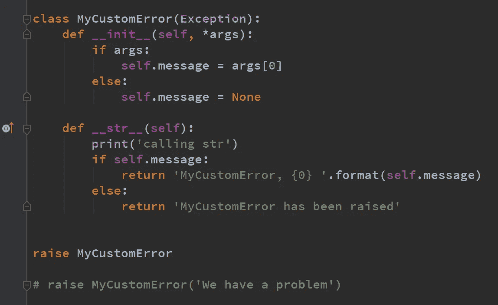
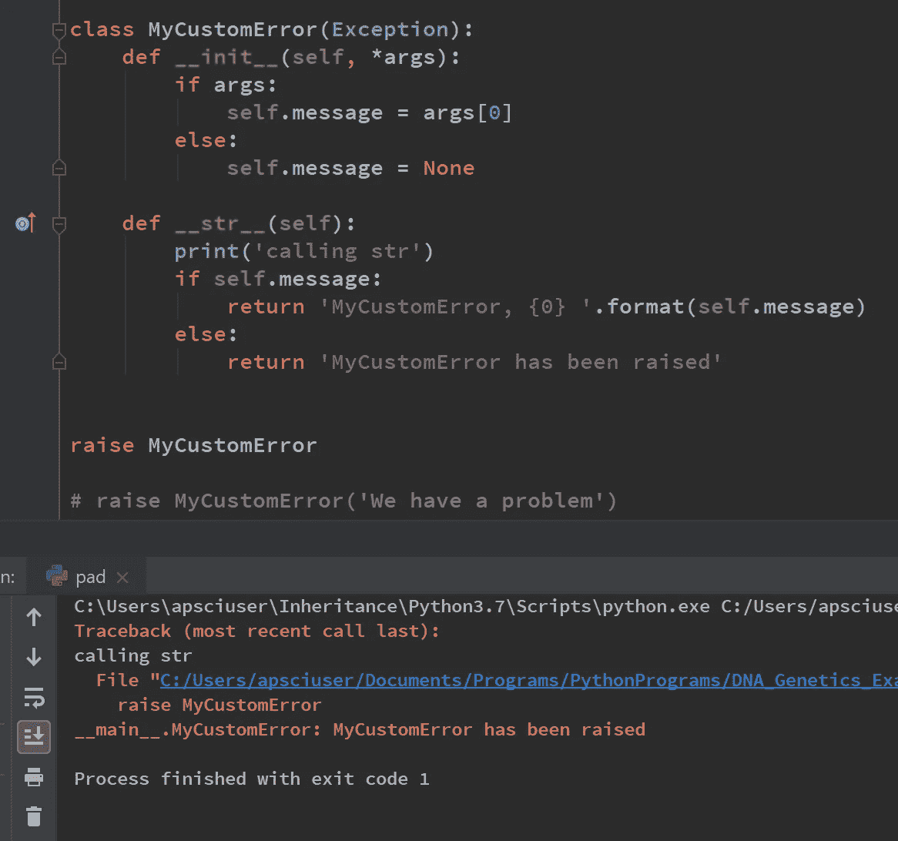
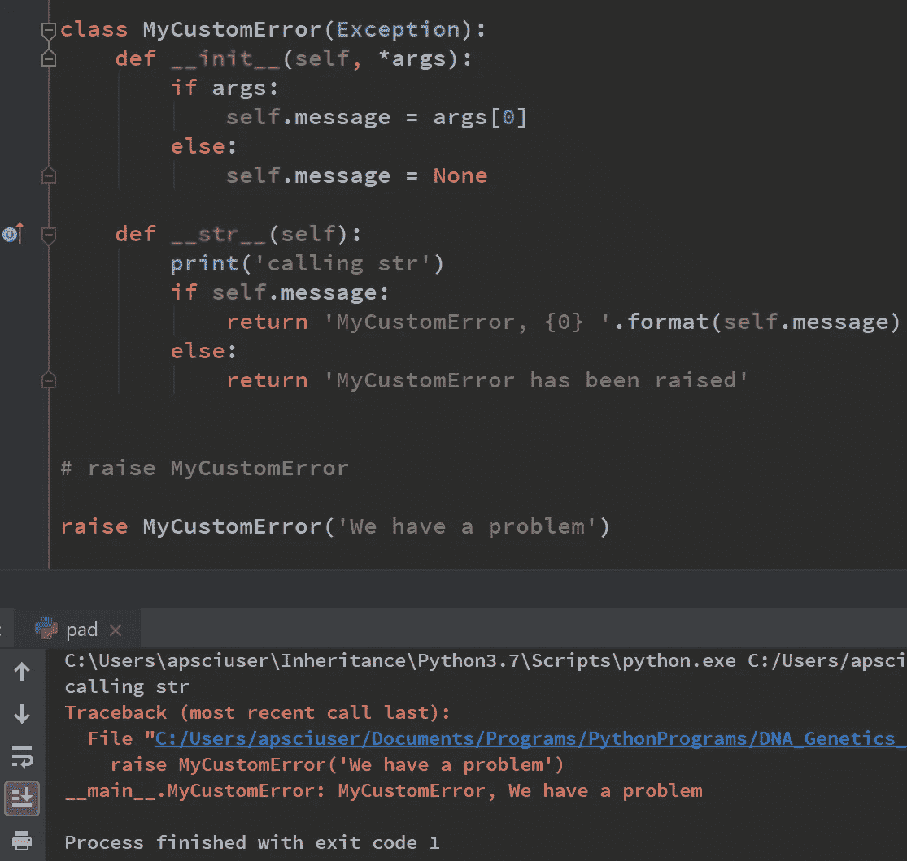
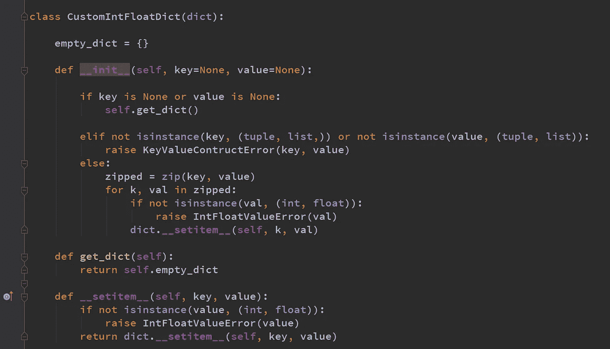
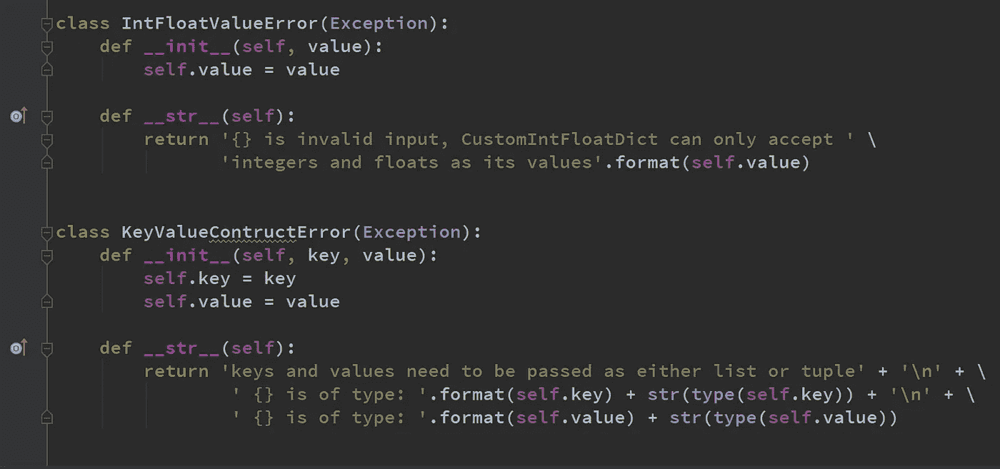
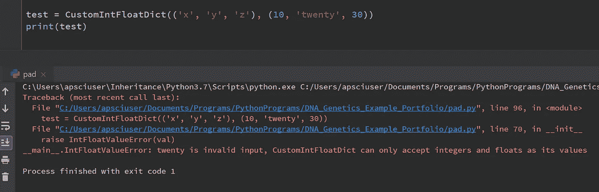
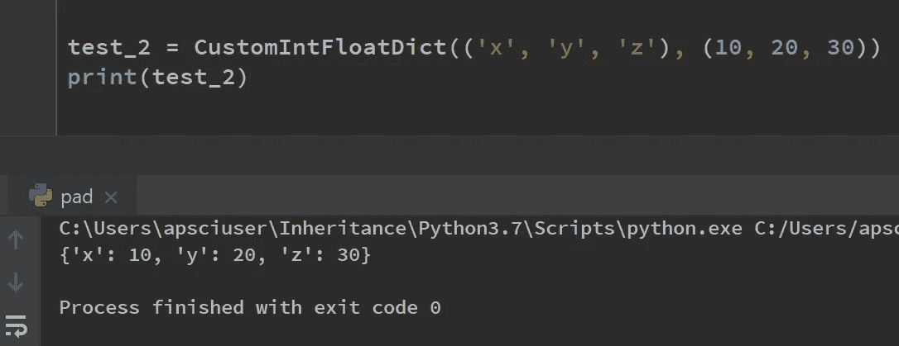
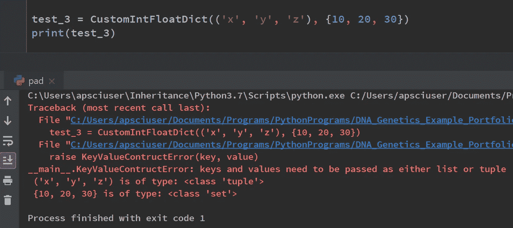
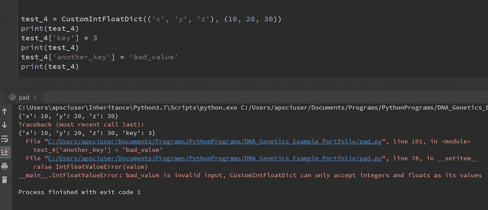

# 如何在 Python 中定义自定义异常类

> 原文：<https://towardsdatascience.com/how-to-define-custom-exception-classes-in-python-bfa346629bca?source=collection_archive---------4----------------------->

## 编写自己的错误类

图片由[西格蒙德](https://unsplash.com/@sigmund)通过 [Unsplash](https://unsplash.com/photos/By-tZImt0Ms) 提供

## 创建自定义错误类

在 Python 中，我们有能力创建自己的异常类。自定义异常类的构造可以丰富我们的类设计。自定义错误类可以记录错误，检查对象。异常类做什么由我们决定，尽管自定义类除了显示一条消息之外通常不会*做更多的事情。*

当然，*类型的错误*本身就很重要，我们经常创建自己的错误类型来指示 Python 通常不涵盖的特定情况。这样，遇到错误的类的用户将确切地知道发生了什么。

这篇教程由两部分组成。首先，将孤立地定义一个异常类。第二部分将展示我们如何将定制异常类集成到我们的 Python 程序中，并演示这如何增强我们设计的类的可用性。

## 自定义异常类 MyCustomError

*引发异常时需要 __init__()和 __str__()方法*

当我们*引发*一个异常时，我们实际上是在创建一个异常实例并同时打印它。让我们分析一下下面显示的定制异常类。

在上面的 MyCustomError 类中，有两个神奇的方法 __init__ 和 __str__ 会在异常处理过程中自动调用。Init 是创建实例时调用的方法，str 是打印实例时调用的神奇方法。因此，当出现异常时，它们通常会被连续调用。Python 中的 raise 语句将程序置于错误状态。

__init__ 方法的参数列表中有*个参数。*args 是在函数和方法中使用的特殊模式匹配模式。它允许传递多个参数，并将传递的参数存储为一个元组，但也不允许传递任何参数。

在我们的例子中，我们说，如果有任何参数被传递给 MyCustomError 构造函数，我们将获取传递的第一个参数，并将其赋给对象 message 中的一个属性。如果没有传递任何参数，则不会将任何参数分配给消息属性。

在第一个示例中，在没有任何参数的情况下引发了 MyCustomError，因此不会将任何参数设置为对象中的 message 属性。str 方法将被调用，并将打印消息“MyCustomError 消息已引发”。

引发 MyCustomError 时，括号中没有任何参数。换句话说，它看起来不像一个标准的对象构造。这只是 Python 在您引发异常时添加的语法帮助

在第二个示例中，使用字符串参数“我们有问题”传递 MyCustomError。这被设置为对象中的消息属性，并在引发异常时打印在错误信息中。

MyCustomError 异常类的代码可以在[这里](https://gist.github.com/StephenFordham/8ea287187a0fde02a8ee82d5a1f2039f)找到。

# CustomIntFloatDic 类

## 创建一个只能存储整数和浮点数作为其值的自定义字典

现在让我们继续，演示自定义错误类是如何轻松有效地集成到我们自己的程序中的。首先，我将创建一个略显做作的示例。在这个虚构的例子中，我将创建一个自定义字典，它只能接受整数或浮点数作为它的值。

如果用户试图将任何其他数据类型设置为该字典中的值，将会引发异常。引发的异常将有效地通知用户如何使用字典。*在我们的例子*中，一条消息明确通知用户在这个自定义字典中只有整数和浮点数可以被设置为值。

我们必须注意，当我们创建自定义字典时，有两个地方可以添加值。第一种是在 init 方法中构造对象时(对象可能已经被赋予了键和值)，另一种是在字典中设置键和值时。在这两个地方，我们都需要编写代码来确保值只能是 int 或 float 类型。

首先，我定义了一个名为 CustomIntFloatDict 的类，它继承自内置的 Dict 类。dict 在类名 CustomIntFloatDict 后面括号中的参数列表中传递。

如果创建了 CustomIntFloatDict 的实例，并且没有参数传递给键和值参数，则它们将被设置为 None。if 表达式的计算结果是，如果键为 None 或值为 None，将对对象调用 get_dict()方法，该方法将返回对象的 empty_dict 属性，该属性指向一个空列表。请记住，类属性可用于该类的所有实例。

这个类的目的是让用户传递一个列表或元组，其中包含键和值。如果用户为键和值输入一个列表或元组，这两个 iterables 将使用 python zip 函数压缩在一起。指向 zip 对象的压缩变量可以被迭代，元组可以被解包。当我们遍历元组时，我检查 val 是 int 还是 float 类的实例。如果不是，我将引发一个自定义的 IntFloatValueError，并将 val 作为参数传递。

## IntFloatValueError 异常类

当我们引发一个 IntFloatValueError 异常时，我们正在创建一个 IntFloatValueError 类的实例并同时打印它。这意味着 init 和 str 魔法方法将被调用。

导致引发异常的值在 IntFloatValueError 类中被设置为名为 value 的属性。当调用 str magic 方法时，会出现一条错误消息，通知用户传递给 CustomIntFloatDict 的 init 的值无效。用户现在将知道他们必须做什么来纠正这个错误。

IntFloatValueError 和 KeyValueConstructError 异常类

如果没有引发异常，也就是说，如果压缩对象中的每个 val 都是 int 或 float 类型，它们将在字典中使用 __setitem__()进行设置，dict 父类方法为我们完成这项工作，如下所示。

## KeyValueConstructError 异常类

如果用户输入的类型不是带有键和值的列表或元组，会发生什么？

同样，这个例子有些做作，但是将展示如何使用定制的异常类。

如果用户没有将键和值指定为列表或元组，将引发 KeyValueConstructError 异常。该异常类的目的是通知用户，为了将键和值获取到 CustomIntFloatDict 对象中，必须为 CustomIntFloatDict 类中的 init 构造函数指定一个列表或元组。

在所示的示例中，一个集合作为第二个参数传递给了 init constrictor，这导致了自定义 KeyValueConstructError 异常的引发。有用的是，显示的错误消息通知用户键和值需要作为列表或元组传递。

当引发异常时，将再次创建 keyvalueconstructor 的实例，并将键和值作为参数传递给 keyvalueconstructor 构造函数。这些属性在 KeyValueConstructError 中被设置为键和值属性，并在 __str__ 方法中用于在打印对象时产生有用的错误信息。

此外，我甚至包括了添加到 init 构造函数中的对象的数据类型，以增强清晰度。

## 在 CustomIntFloatDict 中设置键和值

CustomIntFloatDict 继承自 Dict。这意味着除了我们选择有选择地修改其行为的地方之外，它的行为将与字典完全一样。

__setitem__ 是我们在字典中设置键和值时调用的神奇方法。在我们的 setitem 实现中，我们验证该值是 int 还是 float 类型，然后才能在字典中设置它。如果不是，我们可以再次使用 IntFloatValueError 异常类。在这里，我们可以看到，当我们试图将字符串' bad_value '设置为字典 test_4 中的一个值时，会引发一个异常。

本教程的代码在下面的 Github gist 中显示，可以在这里获得[。](https://gist.github.com/StephenFordham/549973c9a6099914d2758e3e144e19fa)

## 总结:

自定义异常增强了类的可用性。异常类应该有 init 和 str 魔法方法，在异常处理过程中会自动调用这些方法。我们希望我们的自定义错误类做什么完全取决于我们自己。显示的方法包括检查对象和打印有用的错误消息。在这两种情况下，异常类使得该类的用户在错误发生时更容易处理错误！