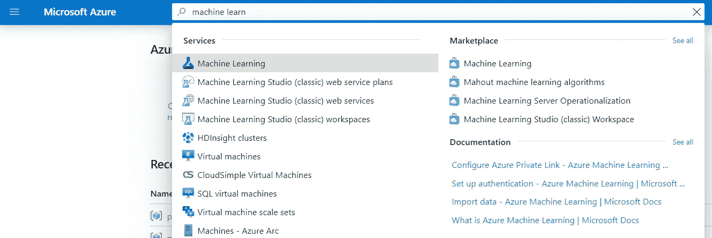
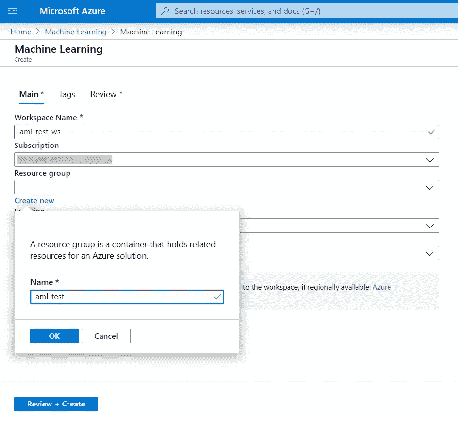
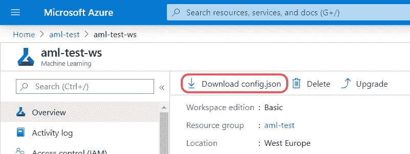
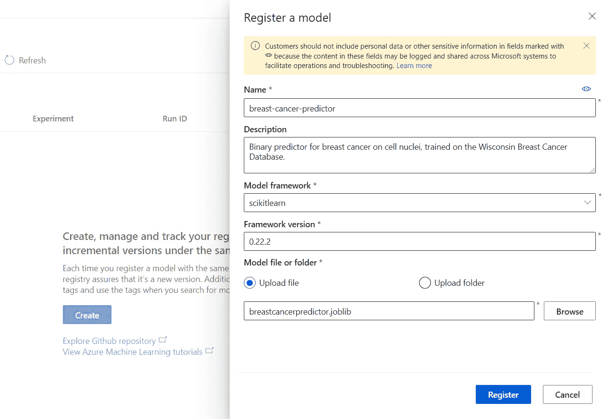
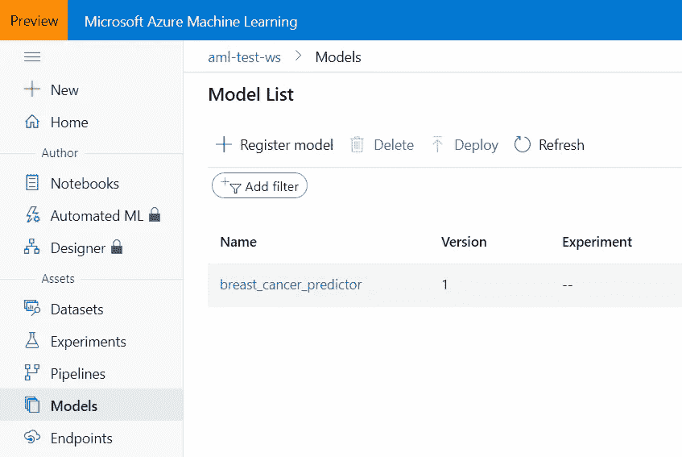
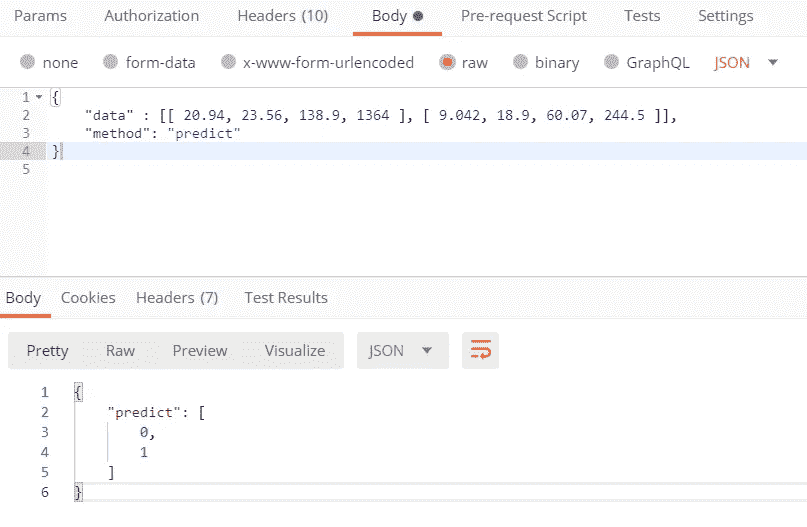
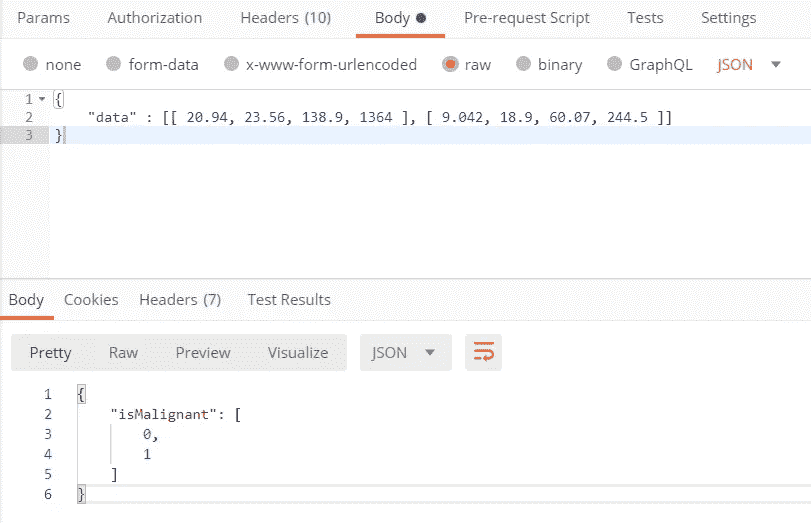

# 如何在不到 5 分钟的时间内将机器学习模型部署到云中

> 原文：<https://towardsdatascience.com/how-to-deploy-a-machine-learning-model-to-the-cloud-in-less-than-5-minutes-1811fb6aef3e?source=collection_archive---------22----------------------->

## 使用 Azure 机器学习和 Python 为训练好的 ML 模型创建一个 web 服务


西蒙·艾布拉姆斯在 [Unsplash](https://unsplash.com/) 上拍摄的照片

想象以下情况:

> 你是一名数据科学家，被要求创建一个预测模型。您执行数据探索和清理，选择一个模型，调整它，训练它。经过几次迭代和修复后，您运行了一些性能指标，结果非常好。您认为您在这里的工作已经完成了，但是接下来您被要求将您的模型投入生产。该模型在您的笔记本电脑上运行良好，但他们希望您创建一个用户可以消费的模型，对吗？

数据科学家有时面临的一个问题是，他们的工作似乎与其他人的工作脱节。他们独自工作，修补他们的模型，并产生一些可能与手头问题相关的结果。如果结果确实有用，涉众将希望最好的模型投入生产。然而，在这一点上，模型通常不适合生产。通常，数据、ML 和/或软件工程师团队必须将它们转换成可用的模型，以便进行部署，并可能与一些现有的应用程序或管道集成。

幸运的是，生产一个机器学习模型正变得越来越容易，越来越快，越来越容易被所有人接受。主要的云提供商提供开发机器学习解决方案的专用服务，如微软的 [Azure 机器学习](https://azure.microsoft.com/en-us/services/machine-learning/)，亚马逊的 [AWS SageMaker](https://aws.amazon.com/sagemaker/) ，或谷歌云 [AI 平台](https://cloud.google.com/ai-platform)。这些服务通过实施面向机器学习的 DevOps(也称为 MLOps)在自动化管道中构建、训练和部署模型，实现了端到端机器学习生命周期的管理。它们都支持流行的框架和编程语言(如 Python、R、scikit-learn、XGBoost、Tensorflow 或 PyTorch)，无论人们习惯使用哪种工具，都可以平稳地从本地工作过渡到本地工作。

如果数据科学家不熟悉工程任务，前面提到的数据科学和工程任务之间的脱节可能会有问题。但是随着这些云服务的易用性，这种情况不会再发生了。即使具备云基础设施的一些基础知识和使用这些工具的初步经验，数据科学家也已经能够更好地理解工程师的工作和决策，促进双方的沟通和合作，从而快速跟踪机器学习解决方案的生产。

## 放弃

对于本教程，我们将使用微软 Azure 及其机器学习服务，以及用于 Python 的 Azure ML SDK。

注意，本文的目的是展示 Azure 机器学习服务的易用性和速度，特别是对于模型部署。因此，在 Azure 中快速部署可以被其他应用程序和用户使用的工作模型所需的代码和解释被减少到最低限度。

然而，要为现实世界的应用程序生产机器学习模型，在部署期间需要考虑几个额外的方面。主要是，部署任务预计将包含在 CI/CD 管道中，但在 Azure 机器学习服务本身中还有进一步的考虑要做。一些例子是在 REST 端点上执行身份验证，或者如果我们希望服务是可伸缩的，则在计算集群而不是单个容器中部署模型。

此外，在[信息支持](https://www.infosupport.com/)，我们提倡在整个开发生命周期中使用 Azure 机器学习和类似的 MLOps 框架，而不仅仅是在部署期间。在本文中，我决定将重点放在后者上，假设在模型的构建和训练过程中遵循了良好的 MLOps 实践——希望这些可以在以后的文章中涉及到。

# 我真的可以在不到 5 分钟的时间内部署我的模型吗？

是的，真的。虽然有些操作可能需要几分钟的等待时间(即创建 Azure 机器学习工作区和 web 服务部署)，但需要完成的实际工作可以在几分钟内完成。

为了证明这一点，我制作了下面的视频，其中涵盖了执行所有步骤的最快方法(从上传已经训练好的模型到使用已部署的 web 服务):

如果您想更深入地研究这些步骤，或者如果您更喜欢学习如何使用纯代码方法来执行每个步骤，请继续阅读。

# 我如何部署我的模型？

## 出发点

正如我前面提到的，我们假设我们已经成功地完成了部署之前的所有步骤:我们已经获得、探索和清理了数据；选择一个模型，并训练它，达到足够好的性能，开始在生产中使用这个模型。

为了便于演示，我们将以一个非常简单的解决方案开始本教程，该解决方案基于 scikit-learn 中直接提供的[玩具数据集:](https://scikit-learn.org/stable/modules/generated/sklearn.datasets.load_breast_cancer.html) [*威斯康星州乳腺癌诊断数据库*](https://archive.ics.uci.edu/ml/datasets/Breast+Cancer+Wisconsin+(Diagnostic)) 。我们将建立一个决策树来尝试预测乳腺肿瘤是良性还是恶性的几率。

该数据集包含从其细胞图像中提取的乳房肿块的几个特征的测量值。我们将利用前 4 个可用特征，它们大致对应于乳房肿块的半径、纹理、周长和面积的平均值。

请再次注意，该模型用于演示目的，因此我们不关注算法选择或实际性能。我们的目标是获得任何经过训练的模型，以便在 Azure 机器学习中部署和测试它。

## 保存模型

假设我们已经在测试分割上运行了一些评估指标，我们对模型的性能感到满意。我们准备让其他用户或外部应用程序可以访问它。但是为了将我们的模型加载到云中，我们首先需要存储它。

经过训练的模型可以通过序列化来存储——也就是 Python 中通常所说的“酸洗”。pickle 一个模型意味着将它转换成一个二进制文件，这个文件可以被存储、复制、移动、传输和最终加载，以便检索原始模型。

这可以通过使用一个名为 *pickle* 的库来完成。但是，对于用 Python 序列化机器学习模型，经常推荐一个替代库: *joblib* 。该库支持有效存储和加载可能包含大型数据结构的 Python 对象，这可以从一些机器学习模型中预期。

继续我们之前的脚本，我们可以像这样轻松地序列化和存储我们训练好的模型:

对于文件名，。joblib 或者。bin 是支持的扩展的例子。也可以使用其他扩展(例如。z)用于进一步压缩，如果需要的话。

强烈建议记下用于创建存储模型的 Python 版本和依赖项的版本，因为可能需要它们来反序列化和使用它，同时确保完全兼容。在这种特定情况下，我们确实需要 Python 版本来匹配 Azure 机器学习当前支持的任何 Python 版本，以及在注册我们的模型时指示 scikit-learn 的版本。

## 安装 Azure ML SDK

可以只使用 Azure 机器学习门户 GUI 在 Azure 机器学习中部署一个已经训练好的模型，而不需要一行额外的代码。然而，在单个容器中部署 web 端点(这是部署模型的最快方式)只能通过代码或命令行来实现。

这就是为什么，在本教程中，我们将使用 Python 的 Azure ML SDK。除了通过 GUI(如果适用)解释程序之外，还将提供用于执行部署的每个步骤的代码片段。

为了安装带有默认包的 Azure ML SDK，我们在本地终端中运行以下命令:

```
pip install --upgrade azureml-sdk
```

注意，Azure Machine Learning 在用 Azure ML SDK 开发时使用了交互式 UI 认证。我们第一次使用带有订阅 ID 的 SDK 时，Azure 会提示我们登录我们的订阅帐户。

## 在 Azure 中创建工作区

我们在仓库里有一个功能模型，太好了！现在我们实际上可以开始钻研 Azure 机器学习了。

假设我们在 Azure 中已经有了一个帐户和一个有效的订阅，我们导航到 Azure 门户并搜索*服务>机器学习*。



Azure 门户中的机器学习服务搜索

我们为我们的新工作区命名，并选择我们想要使用的订阅。因为我们假设从头开始一个项目，所以我们将创建一个新的资源组。我们可以选择*基础版*工作空间版，因为它提供了我们教程所需的所有功能。



在 Azure 门户中创建机器学习工作区

也可以使用 Azure ML SDK 直接创建工作空间。使用来自 *Workspace* 类的 *create()* 方法，我们可以提供与通过 Azure 门户提供的参数相同的参数:

一旦创建了资源组和工作空间，我们就可以通过 Azure Machine Learning dashboard 在[ml.azure.com](http://ml.azure.com/)访问后者。

现在，我们需要获得包含工作区和订阅细节的 JSON 文件。在 Azure ML 门户中，在右上角的导航栏上，我们单击*更改订阅>下载配置文件*，并将文件放在我们的项目目录中。这个配置文件也可以通过在 Azure 门户中导航到新创建的工作区并在概览页面中点击*下载配置文件*来下载。一旦这个文件位于我们的项目文件夹中，我们就可以直接从 Python IDE 中部署我们的模型。



可下载的 JSON 配置文件的位置

## 注册模型

要上传并注册我们已经训练好的模型，我们进入左侧菜单的*模型*部分，点击*注册模型*。我们命名我们的模型，指出我们用来训练它的框架(在这种情况下，scikit-learn)，并可选地为附加元数据编写描述。我们浏览我们的机器，选择并上传我们的序列化模型文件，然后我们点击*注册*。



Azure ML 门户中的模型注册

使用 Python 脚本和 Azure ML SDK 也可以快速完成整个过程。我们首先需要使用 *from_config()* 方法连接到工作区，这将在项目的根目录中搜索我们的配置文件。然后，我们能够通过使用*模型*类来注册我们训练好的模型。我们可以定义与之前在 GUI 中指示的参数相同的参数:

运行这个脚本后，我们可以返回到 Azure 机器学习门户，并验证我们的模型已经在 Models 部分下注册。



Azure ML 门户中注册模型的列表

## 部署模型

一旦我们的模型被注册，我们就可以按原样部署它了。这意味着我们部署的 web 服务将接受与我们训练的模型相同的输入数据(在这种情况下，四个浮点数的数组表示我们选择的四个特征)，并将输出预测(在这里，1 表示良性，0 表示恶性)。

为此，我们在工作区中定位我们注册的模型，并利用来自 *Model* 类的 *deploy()* 方法，为我们的 web 服务提供一个名称和指向模型的指针:

通过这样做，我们的模型将被部署在 ACI (Azure 容器实例)中。Azure 机器学习中的 ACI 旨在用于开发和测试目的，因为它们只支持 CPU 上的低规模工作负载。然而，他们可以利用高达 16GB 的 RAM 和 4 个 CPU，这可能足以进行概念验证，甚至足以生产原型模型，这取决于应用程序。

就是这样！我们的 web 服务现在将出现在 Azure 机器学习门户的*端点*部分下。在那里，我们可以获得其 REST 端点的 URI，并向 API 发送一些测试 POST 请求，以验证部署是否成功。该 web 服务期望的 JSON 格式的输入如下:

```
{
    "data" : [ <feature-value1>, <feature-value2>, <feature-value3>, <feature-value4> ],
    "method": "predict"
}
```

注意“*数据*键的值也可以是包含几个样本的 2D 数组，然后 web 服务将返回所有相应的预测。

使用*方法*参数，如果我们希望 web 服务输出预测的标签(0 或 1 ),我们可以指定值 *predict* ,或者如果我们希望获得每个标签的精确概率输出，我们可以指定值 *predict_proba* 。

当发送来自分割评估数据集的两个样本时(例如，通过 [Postman](https://www.postman.com/product/api-client/) ，我们看到我们获得了预期的预测(第一个样本对应于良性肿瘤，第二个对应于恶性肿瘤):



示例请求通过邮递员发送到我们的模型，部署为 web 服务

因此，我们部署的模型可以被外部应用程序使用。作为如何使用 Python 来使用它的示例，我们发送一个以前的数据示例:

## 使用自定义条目脚本的替代部署

我们已经看到按原样部署我们的模型是多么容易。然而，根据我们的模型或我们想要构建的应用程序的种类，它可能会受到限制。

当我们使用上面的脚本部署我们的模型时，我们实际上是在一个计算实例中部署它，该实例具有预定义的配置(单个 CPU 内核和 0.5 GB RAM 的 10%使用限制)和具有默认包和框架的环境(确切地说包括 scikit-learn)。

但是如果这个计算目标设置不能为我们的模型提供足够的计算能力呢？或者，如果我们使用默认环境中不包含的某些库，该怎么办？此外，我们可能希望更灵活地定义 web 服务如何与外部用户交互:例如，我们可能需要在将输入数据提供给模型之前对其执行额外的操作，比如规范化输入特性或以某种特定的方式处理缺失值。

我们可以通过两个额外的步骤来完成所有这些:指定一个推理配置(通过为我们的 web 服务和定制环境提供一个入口脚本)和一个部署配置。

参赛脚本(也称为评分脚本)必须包含以下两个功能:

*   ***【init()***:它在托管我们的 web 服务的 Docker 容器启动时运行一次，通常用于将我们注册的模型作为全局对象加载
*   ***run(****input _ data****)***:每次 web 服务收到请求时运行，负责接收输入数据，发送给模型，返回模型的响应

我们模型的简单评分脚本示例如下:

我们的推理配置需要的另一个参数是执行环境。我们可以创建一个*环境*对象，给它一个名称，并指出我们想要安装的 Conda 或 pip 依赖项。请注意， *azureml-defaults* 包始终是模型作为 web 服务托管所必需的。

我们现在可以创建部署模型所需的推理配置:

最后，我们定义部署配置。例如，我们可以创建一个具有一个 CPU 内核和 2GB RAM 的计算实例:

我们将两个配置对象都提供给在默认部署期间已经使用的 *deploy()* 方法:

我们现在可以运行它来部署新的 web 服务，只需提供输入数据就可以向其发送请求:



示例请求通过邮递员发送到我们的客户 web 服务

# 搞定了。接下来呢？

我们的模型已经成功部署在 Azure 中。正如本文开头提到的，我的目标是展示我们使用 Azure 机器学习服务部署模型有多快多容易。然而，如果我们想在现实世界的应用中生产我们的模型，还有很多工作要做。

为了继续深入研究 Azure Machine Learning 必须提供什么，[查看来自微软的这个资源库](https://github.com/Azure/MachineLearningNotebooks)，在那里他们提供了几个关于如何使用 Azure ML SDK 的 Python 笔记本，以及 [Azure Machine Learning 的官方文档](https://docs.microsoft.com/en-us/azure/machine-learning/)。

此外，如果你对教程的某些步骤有任何疑问，或者如果你在执行代码时遇到任何问题，请随时在下面的评论中问我，或者通过 LinkedIn 问我[。](https://www.linkedin.com/in/luciaconde95/)