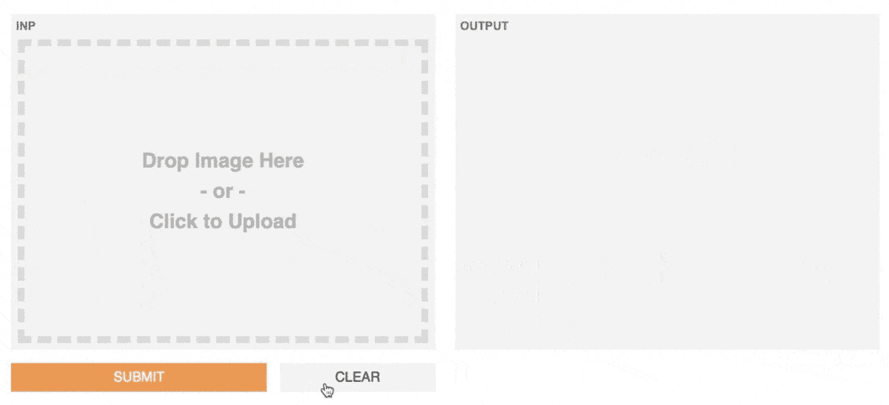
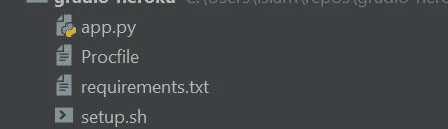
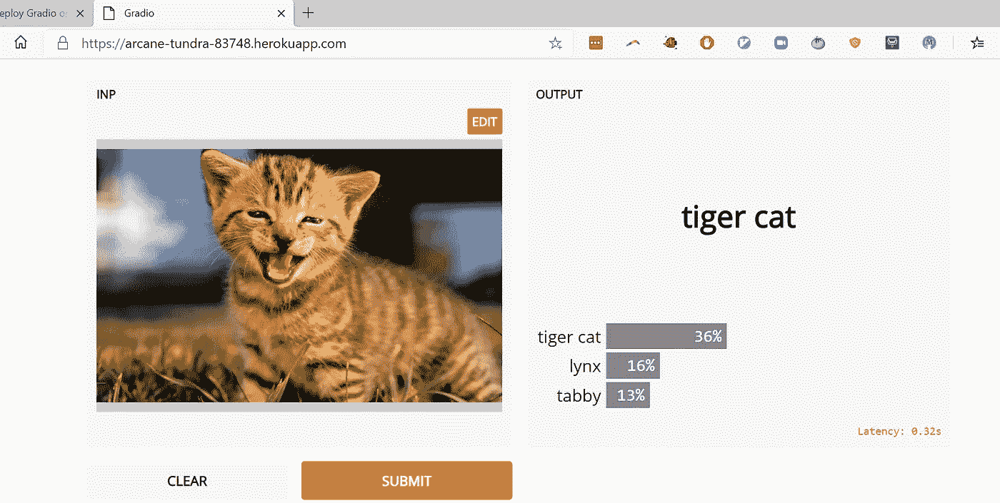

# 如何用 5 个步骤在 Heroku 上部署机器学习 UI

> 原文：<https://towardsdatascience.com/how-to-deploy-a-machine-learning-ui-on-heroku-in-5-steps-b8cd3c9208e6?source=collection_archive---------27----------------------->

## Gradio 让你为你的机器学习模型建立一个 UI。Heroku 让你主持。以下是如何一起使用它们。

在本教程中，我将一步一步地向您展示如何在 Heroku 上创建和部署您的机器学习模型和 UI。我将使用我为 Inception Net 模型创建的这个拖放图像界面作为一个例子:



您可以在:[https://arcane-tundra-83748.herokuapp.com/](https://arcane-tundra-83748.herokuapp.com/)试用 GUI(dyno 启动可能需要一分钟)

## 格拉迪欧的作品

我假设你已经对 Gradio 库([https://github.com/gradio-app/gradio](https://github.com/gradio-app/gradio))有所了解。如果没有，[这个 MNIST 教程](https://medium.com/swlh/a-gui-to-recognize-handwritten-digits-in-19-lines-of-python-fda715e525d0)是一个开始的好地方。快速概述是:Gradio 是一个 Python 库，它允许您通过指定三件事情来围绕您的机器学习模型创建 ui:Python 函数、输入组件和输出组件。

**第一步:创建你的 Gradio 应用**

我们将从一个脚本开始，该脚本围绕先启模型创建一个拖放图像界面。创建一个全新的目录，并将下面的代码复制粘贴到一个 python 文件中，我们称之为`app.py`:

这个脚本中发生的事情是，我们正在使用 Tensorflow Keras 加载 Inception Net 图像分类器。由于这是一个图像分类模型，我们将使用`Image`输入接口。我们将使用`Label`输出接口输出一个标签字典和它们相应的置信度得分。(*要部署您自己的模型，请用您自己的代码来替换它*)。

**第二步:编写你的** `**requirements.txt**` **文件**

我们需要确保将所有需要的 Python 库指定为依赖项。所以在与`**app.py**`相同的目录下创建一个`**requirements.txt**` 文件。对我来说，那就是:

让包版本在 Heroku 上工作可能有点棘手，但是上面的包和版本对我来说是有效的。**重要提示:** Heroku 将您的构建大小限制为 500 MB，考虑到 Tensorflow 包的大小，这很容易填满。**我建议用 Tensorflow 2.0.0 库，比其他一些版本的库要小一些。**

如果您想在本地测试脚本(您应该这样做！)，从终端运行:`pip install -r requirements.txt`安装依赖项，然后`python app.py`启动 UI。此时，您应该看到您的界面正在`localhost:7860`(或另一个端口)上运行，如果您在浏览器中导航到该端口，应该会显示您的 GUI！

此 URL 可在本地访问。我们如何与世界分享这些？Gradio 带有一个内置的`share`参数，可以创建公共 URL，但这些 URL 会在一定时间后过期。为了创建永久的公共链接，我们将使用 Heroku！

## Heroku 的作品

要在 Heroku 上部署您的 web 应用程序，您需要有一个 Heroku 帐户，拥有 Heroku CLI 也非常方便。因此，如果你还没有做的话，请继续[创建一个 Heroku 帐户](https://signup.heroku.com/)并[下载 CLI](https://devcenter.heroku.com/articles/heroku-cli#download-and-install) 。

现在，开始部署！

**第三步:创建一个** `**setup.sh**` **文件**

为了在 Heroku 上正确部署我们的应用程序，我们需要确保它服务于正确的 URL 和端口。下面的命令可以做到这一点，所以把它们放在一个名为`**setup.sh**` 的文件中，这个文件和你的应用程序在同一个目录下。

这里发生的事情是，我们告诉 Gradio 在`0.0.0.0`上提供 UI，特别是使用 Heroku dyno 让世界可见的端口。

**第四步:创建一个**

现在，我们要创建一个名为`**Procfile**`的文件(就是它，这个文件没有扩展名！)它的工作是告诉 Heroku 运行什么命令来启动 Gradio 应用程序。只有两个命令:运行我们在上一步创建的 bash 脚本，然后启动我们的应用程序。所以我们的 Heroku `**Procfile**` 看起来是这样的:

```
web: source setup.sh && python app.py
```

如果你想知道为什么我们使用`source`而不是`sh`，那是因为我们需要在脚本执行完毕后保存环境变量。

**第五步:部署！**

此时，您的目录应该如下所示:



一个目录中只有 4 个文件——超级简单！

如果您还没有将这些文件添加到 git repo 中，请在您的终端中运行以下命令:

```
git init
git add -A
git commit -am "commit message here"
```

我们只需要把这个推到 Heroku dyno 上。首先，让我们通过运行以下命令为我们的应用程序分配一个 Heroku dyno:

```
heroku create
```

Heroku 会自动旋转并给你的应用程序分配一个随机的名字。现在，我们把我们的改变推给 Heroku:

```
git push heroku master
```

给它几分钟时间在你的 dyno 上安装所有的依赖项。这里可能会遇到依赖性问题，您可以通过阅读错误消息并安装每个库的正确版本来解决这个问题(*参见我上面关于 Heroku 大小限制的注释*)。如果您没有看到任何错误，那么您应该能够通过运行以下命令打开您的应用程序:

```
heroku ps:scale web=1
heroku open
```

最后一个命令将打开您的默认浏览器，并把您带到应用程序。您会注意到网址是自动生成的实例名加上 Heroku 域。



就是这样！您有一个可以与任何人分享的实时链接。是时候开始运行一些预测了:)