# 如何免费部署 Postgres 数据库

> 原文：<https://towardsdatascience.com/how-to-deploy-a-postgres-database-for-free-95cf1d8387bf?source=collection_archive---------6----------------------->

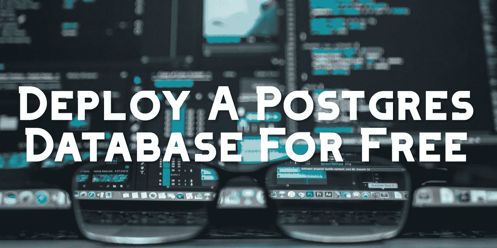

凯文·Ku 在 [Unsplash](https://unsplash.com/photos/w7ZyuGYNpRQ) 上的图片

## 数据存储

## 使用流行的数据库管理系统获得实际经验

PostgreSQL 是世界上最流行的关系数据库管理系统之一，为一些最大的企业提供支持。如果你下载 Postgres，你可能会很恼火地发现你只能把它托管在你机器的 localhost 服务器上，除非你支付一笔经常性的费用把它托管在 AWS 或 Azure 这样的平台上。在本指南中，我将向您展示如何使用 Heroku 免费部署您的数据库，并使用 Python 向其写入数据。

# 先决条件:

[安装最新版本的 Postgres](https://www.enterprisedb.com/downloads/postgres-postgresql-downloads) ，[安装 pgadmin4](https://www.pgadmin.org/download/) ，[安装 python3](https://www.python.org/downloads/release/python-377/) ，pip3 安装 [sqlalchemy](https://pypi.org/project/SQLAlchemy/) 和 [psycopg2](https://pypi.org/project/psycopg2/)

# 1:创建你的 Heroku 账户&创建你的第一个应用程序

部署我们免费 Postgres 数据库的第一步是[在 Heroku](https://signup.heroku.com/login) 上创建一个免费账户。Heroku 是一个云平台，你可以在上面部署你的应用和数据库。创建您的帐户并登录后，您应该会看到类似以下内容的控制面板屏幕:

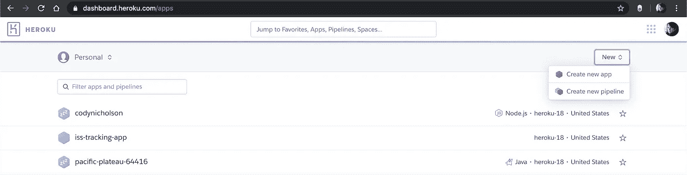

你的新帐户不会有我上面列出的任何应用程序。找到并点击“创建新应用”按钮，进入以下页面:

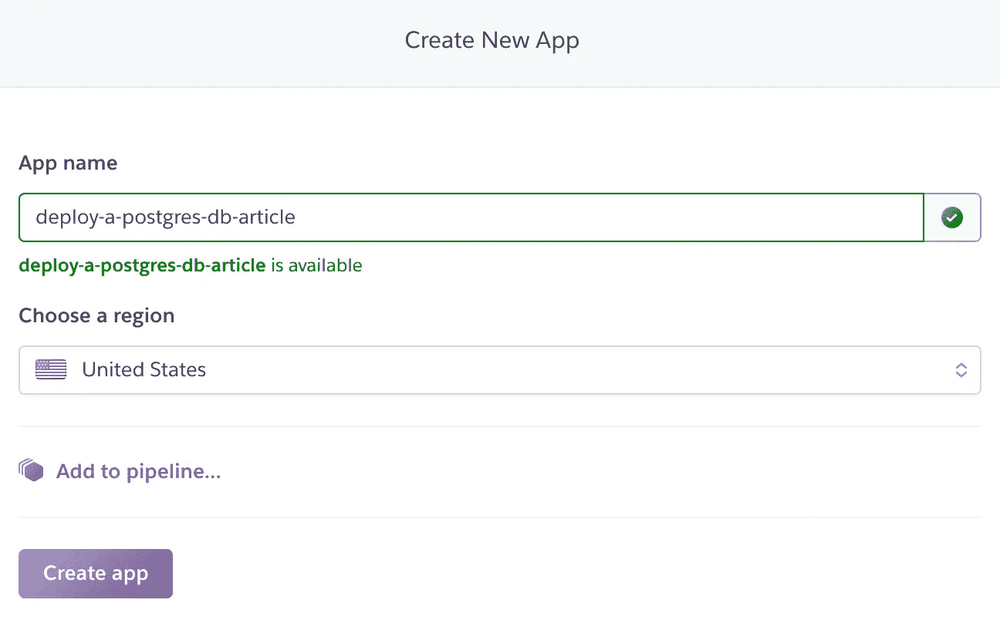

为尚未使用的应用程序选择一个名称并创建它。点击“创建应用程序”按钮后，您应该会看到以下页面:

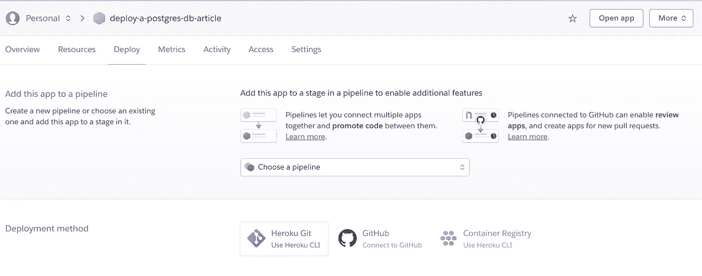

你现在有了你的第一个 Heroku 应用程序，让我们添加一个数据库！

# 2:将 Postgres 数据库添加到您的应用程序中

从你的应用程序的 Heroku 页面点击“资源”标签，查看你的项目拥有的 Dynos 和附加组件的空列表。我们希望将 Heroku Postgres 附加组件附加到您的项目中，因此请单击下图右侧的紫色“查找更多附加组件”按钮:

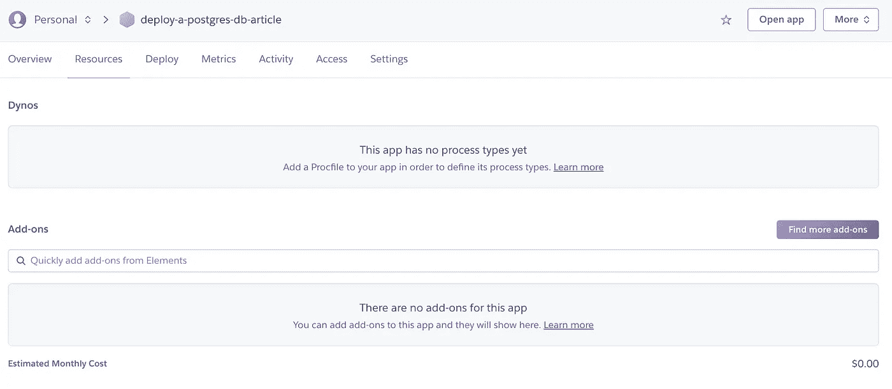

进入 Heroku 附件页面后，在页面右上角的“搜索元素”栏中输入“Heroku Postgres ”:

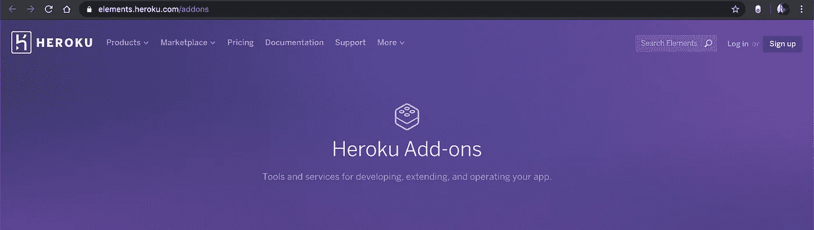

你现在应该已经找到了 Heroku Postgres 的附件，如下图所示。从这里，点击右上角的紫色“安装 Heroku Postgres”按钮，这样我们就可以将其添加到您新创建的应用程序中。

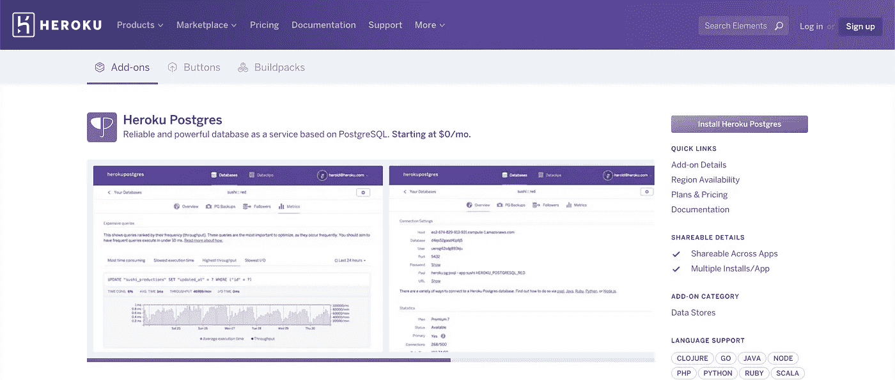

在将 Heroku Postgres 附加组件附加到您的项目的最后一页，您可以选择要附加该附加组件的计划和项目。确保你选择了“业余爱好自由发展”计划，这样你就不用为任何事情付费了！之后，搜索您的项目名称，选择它，然后单击紫色的“Provision add-on”按钮。

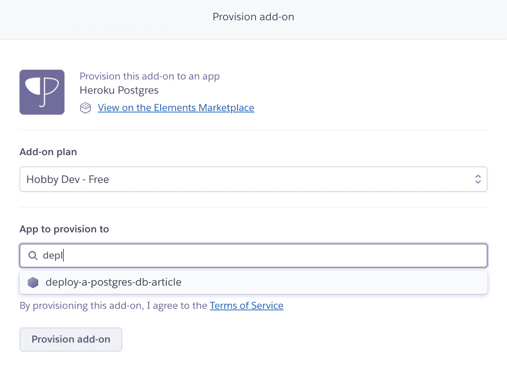

让我们学习如何连接到您的新 Postgres 数据库！

# 3:在 pgadmin4 中连接到数据库

要连接到您的新数据库，请返回 Heroku 应用程序的“资源”页面。你应该看到附件“Heroku Postgres”。点击下图右下方的“Heroku Postgres”链接，进入数据库管理页面。

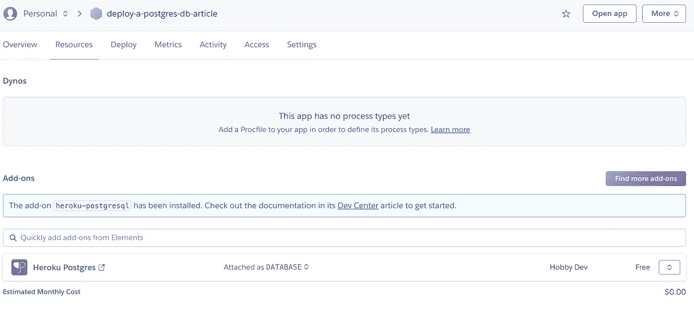

“数据库概览”页显示了有关数据库的高级信息。最初，您应该没有连接、行或表。数据大小从 7.9 兆字节开始，这说明了与您的数据库相关的程序文件，您永远不需要看到或担心。一旦您添加更多数据，该大小将会增加。在免费计划中，您的数据库中只允许有 20 个连接和 10，000 行数据——这对于个人项目和实验来说非常实用。

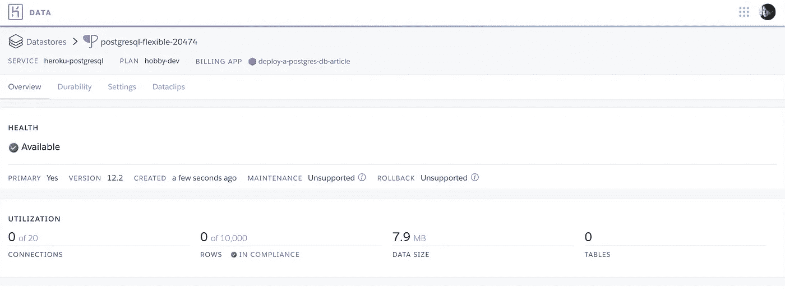

如果您转到“设置”选项卡，然后单击“查看凭据”按钮，您将能够看到用于连接到数据库的数据库凭据。不要分享这些信息！

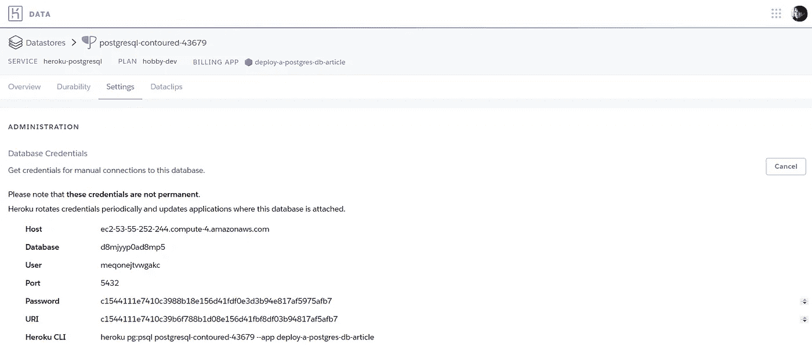

**注意**:以上凭证均未激活

现在我们有了数据库凭证，可以连接到 pgadmin。打开您应该已经安装在计算机上的 pgadmin 应用程序，它应该在您的默认浏览器中打开一个窗口，如下所示:

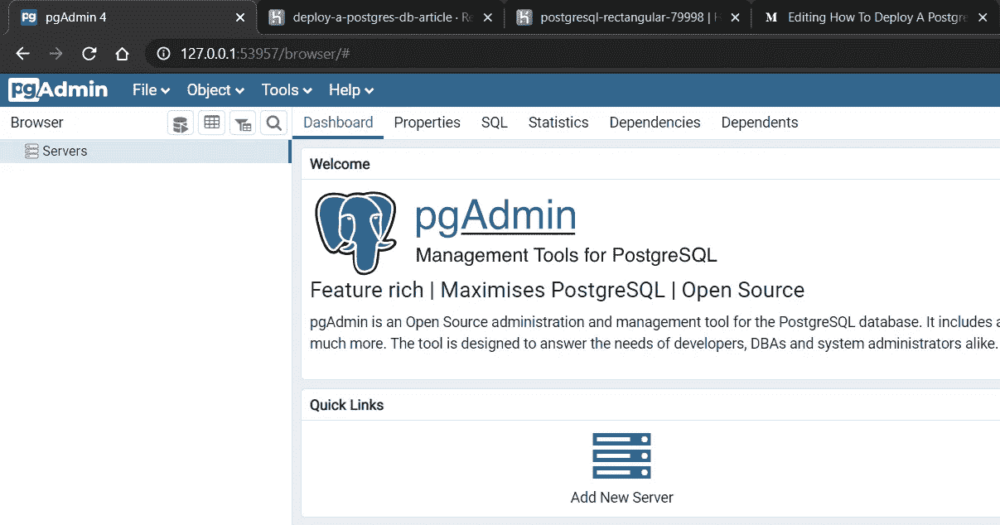

在这里，您可以单击 pgadmin 仪表板上的“Add New Server”按钮，并在提示符下输入您的数据库凭据。您不需要角色或服务:

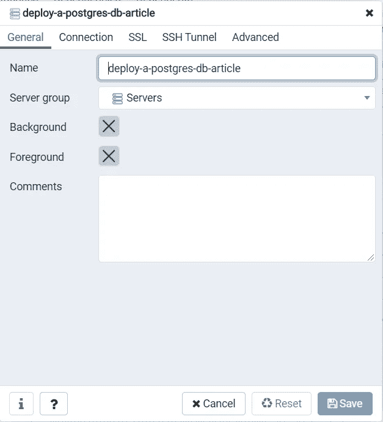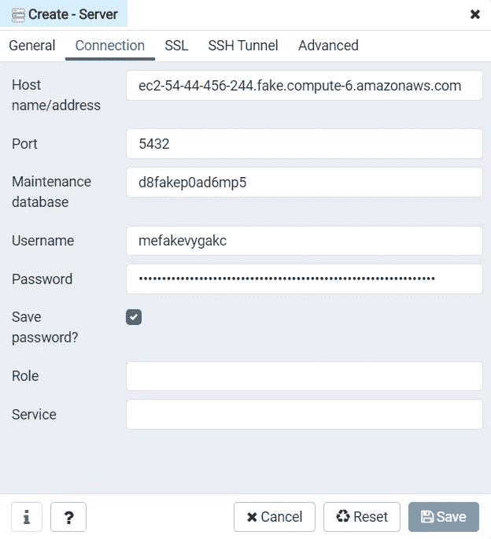

**注意**:以上凭证均不有效

一旦你正确地输入了所有的字段，你可以点击“保存”,应该会看到你的 Postgres 服务器如下所示。这是一个有许多数据库的共享服务器，您只能通过在列表中找到它来访问您的数据库:

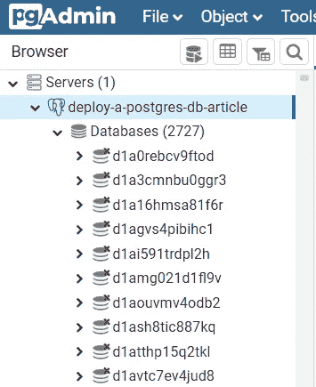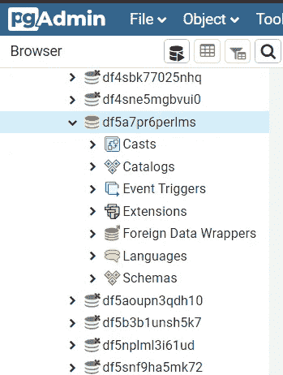

您现在已经连接到 pgadmin 中的免费 Postgres 数据库了！

# 4:从数据库中写入和读取数据

在最后一步中，我们将编写 python 代码来创建一个表，并将数据添加到数据库中。我们将首先创建一个 **config.py** 文件来存储我们的数据库凭证。我们的数据库凭据应该存储在一个单独的文件中，这样我们就可以将该文件添加到我们的。gitignore 在 GitHub 上分享我们的代码，不用担心有人访问我们的数据库。

## 配置. py

```
**host** = ec2-34-200-42-57.compute-1.amazonaws.com
**port** = 5432
**database** = dfg5a7fake6perlms
**user** = fdpbgfakeggheshfbv
**password** = a7cb88511fakea656dd5bb175220caa9646defd4f79e62085486b
```

下面的脚本 **create_table.py** 与 **config.py** 位于同一个文件夹中。首先，我们导入所有的配置变量和 sqlalchemy。然后，我们创建一个引擎，它接受所有的配置变量，并使用“ **engine.connect()** ”将它们连接到数据库。一旦我们连接到数据库，我们就获取数据库的元数据，这样我们就可以在" **metadata = MetaData()** "行上修改模式。我们已经准备好创建我们的第一个表了！

## 创建第一个表格

```
from **sqlalchemy** import *
from **config** import **host**, **port**, **database**, **user**, **password****conn_str** = f"postgresql://{**user**}:{**password**}@{**host**}/{**database**}"
**engine** = create_engine(**conn_str**)
**connection** = **engine**.connect()
**metadata** = MetaData()**first_tb** = Table('first_table', metadata,
   Column('id', Integer, primary_key=True),
   Column('name', String(255), nullable=False),
   Column('isHappy', Boolean, nullable=False)
)**metadata**.create_all(**engine**)
**query** = insert(**first_tb**).values(id=1, name="Student", isHappy=True)
**ResultProxy** = connection.execute(**query**)
```

在以“ **first_table** ”开始的行上，我们通过传递表名、元数据和所有列来创建我们的表。对于每一列，我们可以设置名称、类型以及我们希望每一列具有的约束。最后，在“**metadata . create _ all(engine)**”行上，我们在数据库中创建新表。现在我们的表已经创建好了，我们可以使用 **insert()** sqlAlchemy 方法创建一个查询，并向它提供表和我们想要添加到该表中的值。最后，我们可以在最后一行执行查询。

回到 pgadmin，我们可以转到:" database _ name "-> " Schemas "-> " public "-> " Tables "。如果你右击“first_table”，你可以选择:“查看/编辑数据”->“所有行”。这将运行一个选择查询，并将我们添加的行返回给您——如下所示！

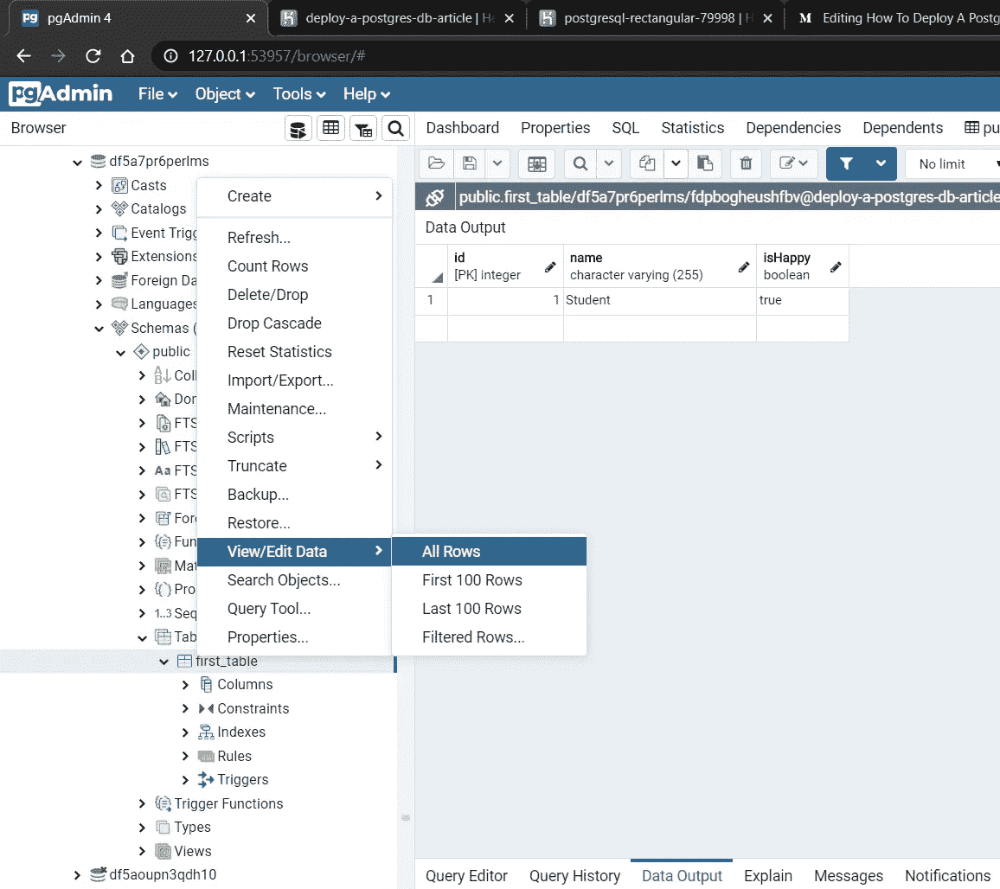

# 结论

感谢阅读！我很乐意听到你的反馈或回答你的任何问题，所以请在下面评论。如果任何图片或信息不再是最新的，请让我知道！