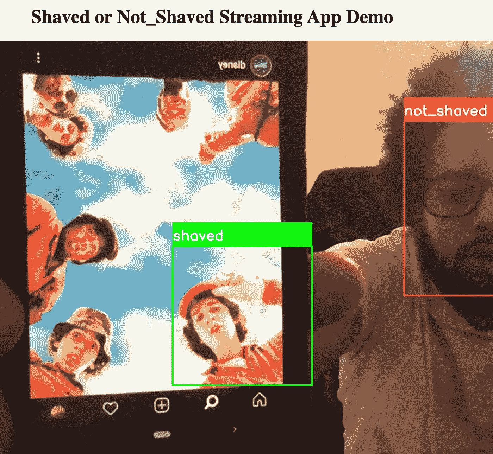

# 如何使用 OpenCV 和 Flask 部署预先训练好的 Keras 模型

> 原文：<https://towardsdatascience.com/how-to-deploy-a-pre-trained-keras-model-with-opencv-and-flask-86c9dab76a9c?source=collection_archive---------11----------------------->



作者照片

在这篇文章中，我将分享如何使用 Flask、OpenCV 和 Keras 将预训练的模型部署到本地托管的计算机上。我最初使用 Flask、Keras 和 jquery 在 PythonAnywhere 上部署了这个模型。该应用程序是为要求学生或员工剃掉面部毛发的远程学校教室或工作场所设置而设计的。

该应用程序允许用户上传一张照片，然后点击一个按钮将带有编码图像数据的 post 请求发送到网站的后端。图像转换和分类在后端处理，结果在 html 响应中返回到前端。响应动态更新页面，如`Shaved`或`Unshaved`。

该应用程序的后端是在 Flask 中构建的，但我想允许一个实时视频流检测用户的面部，并在屏幕上标记分类。因为我已经有了一个模型和一个基本的 Flask 框架，所以我想在我的本地机器上使用 OpenCV 来完成剩下的工作。

如果你有一个模型，你可以遵循相同的格式，但如果你没有，我会推荐阅读我以前的博客文章([建立一个卷积神经网络来识别剃毛与未剃毛的脸](/building-a-convolutional-neural-network-to-recognize-shaved-vs-unshaved-faces-cb96ea5bc0f0) & [如何分割一个腌制的模型文件以绕过 PythonAnywhere 上的上传限制](/how-to-spit-a-pickled-model-file-to-bypass-upload-limits-on-pythonanywhere-e051ea1cec2d))。

# OpenCV

> *OpenCV(开源计算机视觉库)是一个开源的计算机视觉和机器学习软件库。OpenCV 旨在为计算机视觉应用提供一个公共基础设施，并加速机器感知在商业产品中的应用。*
> 
> [*https://opencv.org/about/*](https://opencv.org/about/)

在阅读文档，观看 YouTube 视频和阅读博客帖子后，我发现了一篇非常有帮助的文章，[新冠肺炎:使用 TensorFlow 和 OpenCV](/covid-19-face-mask-detection-using-tensorflow-and-opencv-702dd833515b) 的人脸面具检测，作者 [Gurucharan M K](https://towardsdatascience.com/@mk.gurucharan?source=post_page-----702dd833515b----------------------) 。虽然 Gurucharan 使用 OpenCV 来检测新冠肺炎的面具，但我想先使用类似的格式来检测 a 是否有脸，然后确定该脸是否被剃掉。

对我的难题最有帮助的部分是首先检测人脸，这是通过使用人脸检测程序 ***基于 Haar 特征的级联分类器*** 来检测人脸特征来完成的。

```
face_classifier = cv2.CascadeClassifier('haarcascade_frontalface_default.xml')
```

> ***Haar Cascade****是一种* ***机器学习*** *对象检测算法，用于识别图像或视频中的对象，基于 Paul Viola 和 Michael Jones 在 2001 年发表的论文《使用简单特征的快速对象检测****Cascade****中提出的特征概念*
> 
> [*http://www.willberger.org/cascade-haar-explained/*](http://www.willberger.org/cascade-haar-explained/)

**视频捕捉**

```
video = cv2.VideoCapture(0)
```

**停止视频**

```
video.release()
```

**显示视频**

```
(rval, im) =video.read()
```

**翻转视频**

```
im = cv2.flip(im, 1, 1)
```

**调整视频大小**

```
mini = cv2.resize(im, (im.shape[1] // 4, im.shape[0] // 4))
```

**检测人脸**

```
faces = face_classifier.detectMultiScale(mini)
```

# 瓶

Flask 是一个用 Python 编写的微型 web 框架。它被归类为微框架，因为它不需要特殊的工具或库。它没有数据库抽象层、表单验证或任何其他组件，而现有的第三方库提供了通用功能。

安摩尔·贝尔有一篇写得很好的文章，题为“使用 Flask 和 OpenCV 的视频流”。根据这篇文章，我能够构建一个 html 网页模板，以及使用计算机内置摄像头将每帧预测的视频流传输到浏览器所需的路径。

html 页面类似于我之前构建的页面，没有 jquery。

下面是我用来显示主页的简单代码:

```
<!DOCTYPE html>
<html lang="en">
  <head>
    <title>Shaved or Not_Shaved </title></head>
  </head>
  <body>
    <center><h1>Shaved or Not_Shaved Streaming App Demo</h1></center>
    <center></center>
    <video id="video" autoplay>Video Stream not available.</video>
  </body>
</html>
```

为了构建路线，我使用了以下代码来处理页面何时被加载，以及从我们的`camera.py`文件中提取的摄像机图像，该文件在网站被加载时被初始化。

以下是我在`main.py`文件中使用的烧瓶代码:

```
from flask import Flask, render_template, Response
from camera import VideoCameraimport os
os.environ['TF_CPP_MIN_LOG_LEVEL'] = '2'
app = Flask(__name__)@app.route('/')
def index():
    # rendering webpage
    return render_template('index.html')def gen(camera):
    while True:
        #get camera frame
        frame = camera.get_frame()
        yield (b'--frame\r\n'
               b'Content-Type: image/jpeg\r\n\r\n' + frame + b'\r\n\r\n')@app.route('/video_feed')
def video_feed():
    return Response(gen(VideoCamera()),
                    mimetype='multipart/x-mixed-replace; boundary=frame')
if __name__ == '__main__':
    # defining server ip address and port
    app.run(host='0.0.0.0',port='5000', debug=True)
```

# 克拉斯

> *Keras 是用 Python 编写的深度学习 API，运行在机器学习平台*[*tensor flow*](https://github.com/tensorflow/tensorflow)*之上。它的开发重点是支持快速实验。能够尽快从想法到结果是做好研究的关键。*
> 
> 【https://keras.io/about/】T5[T6](https://keras.io/about/)

由于 Keras 运行在 TensorFlow 之上，我们可以利用 TensorFlow 模块中的 Graph 和 Session 方法。虽然图和会话的细节超出了本文的范围，但是在部署您的模型以便在预定的会话期间可以访问时，您仍然可以使用下面的代码。

```
import pickle
from keras import backend as K
from tensorflow import Graph, Sessionglobal loaded_model
graph1 = Graph()
with graph1.as_default():
	session1 = Session(graph=graph1)
	with session1.as_default():
		loaded_model = pickle.load(open('Combined_Model.p', 'rb'))
```

# 把这一切结合在一起。

最后一块是我们的`camera.py`文件。在这个例子中，我们的文件将包含一个函数，将我们的分割模型合并到一个 pickle 文件中。当应用程序加载时，我们将使用一个类摄像机来初始化相机，并将人脸检测程序与我们预先训练的 Keras 模型相结合。

```
import cv2
import numpy as np
import pickle
from keras import backend as K
from tensorflow import Graph, Session# defining face detector
classifier=cv2.CascadeClassifier('haarcascade_frontalface_default.xml')size = 4labels_dict={0:'shaved',1:'not_shaved'}color_dict={0:(0,255,0),1:(0,0,255)}global loaded_model
graph1 = Graph()
with graph1.as_default():
	session1 = Session(graph=graph1)
	with session1.as_default():
		loaded_model = pickle.load(open('Combined_Model.p', 'rb'))class VideoCamera(object):
    def __init__(self):
        # capturing video
        self.video = cv2.VideoCapture(0) def __del__(self):
        # releasing camera
        self.video.release() def get_frame(self):
        # extracting frames
        (rval, im) = self.video.read()
        im = cv2.flip(im, 1, 1)
        mini = cv2.resize(im, (im.shape[1] // size, im.shape[0] // size))
        faces = classifier.detectMultiScale(mini)
        for f in faces:
            (x, y, w, h) = [v * size for v in f] #Scale the shapesize backup
            #Save just the rectangle faces in SubRecFaces
            face_img = im[y:y+h, x:x+w]
            resized=cv2.resize(face_img,(300,300))
            normalized=resized/255.0
            reshaped=np.reshape(normalized,(1,300,300,3))
            reshaped = np.vstack([reshaped])
            K.set_session(session1)
            with graph1.as_default():
                results=loaded_model.predict(reshaped)
            if results >.5:
                result = np.array([[1]])
            else:
                result = np.array([[0]])
            label = np.argmax(result)
            cv2.rectangle(im,(x,y),(x+w,y+h),color_dict[result[label][0]],2)
            cv2.rectangle(im,(x,y-40),(x+w,y),color_dict[result[label][0]],-1)
            cv2.putText(im, labels_dict[result[label][0]], (x, y-10),cv2.FONT_HERSHEY_SIMPLEX,0.8,(255,255,255),2)
            # encode OpenCV raw frame to jpg and displaying it
        ret, jpeg = cv2.imencode('.jpg', im)
        return jpeg.tobytes()
```

请注意，此应用程序仅限于您的本地计算机。希望这篇文章有帮助。我很乐意使用`Node.js`、`Tensorflow.js`和`OpenCV.js`公开部署这个模型，但是这超出了本文的范围。如果我得到 100 条评论，我会把它作为我的下一篇文章！

# 以下是我的 GitHub 回购的链接:

[https://github.com/cousinskeeta/shavedVnotShaved_opencv](https://github.com/cousinskeeta/shavedVnotShaved_opencv)

# 资源:

[新冠肺炎:Gurucharan M K](/covid-19-face-mask-detection-using-tensorflow-and-opencv-702dd833515b)[使用 TensorFlow 和 OpenCV](https://towardsdatascience.com/@mk.gurucharan?source=post_page-----702dd833515b----------------------) 的人脸面具检测

[Anmol Behl](https://medium.com/datadriveninvestor/video-streaming-using-flask-and-opencv-c464bf8473d6)使用 Flask 和 OpenCV 进行视频流传输