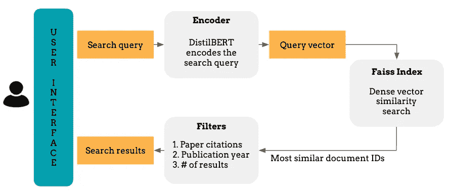
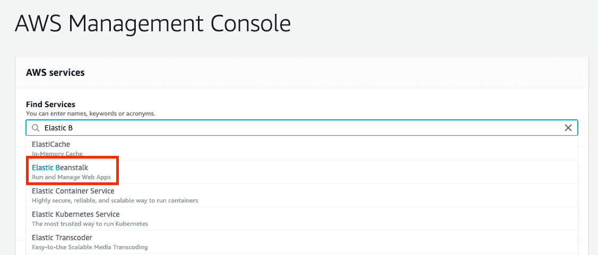
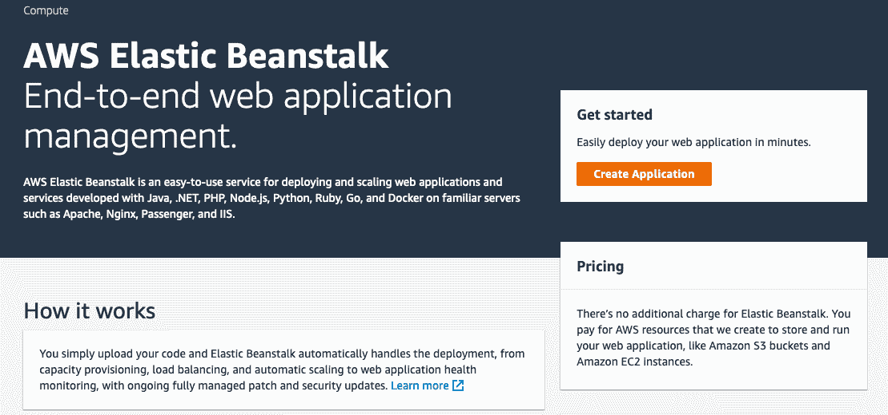
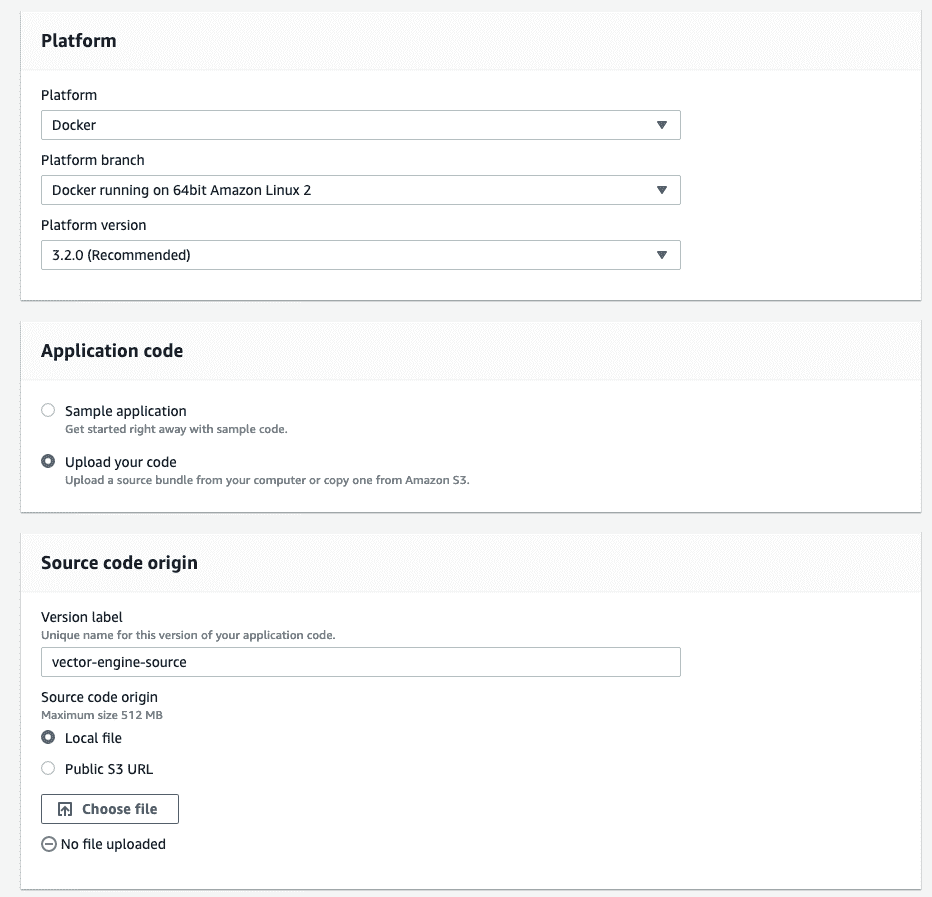
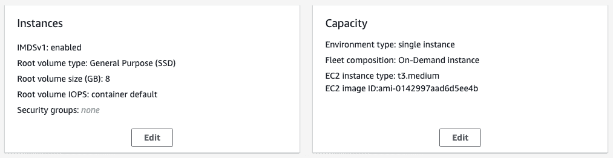
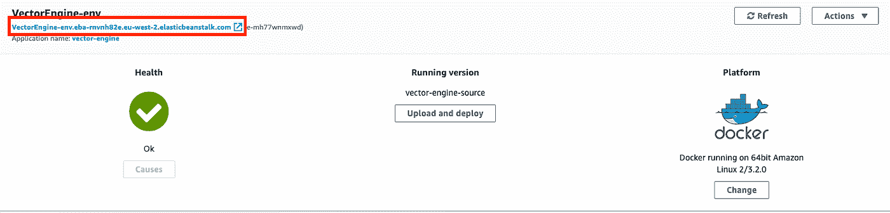

# 在 AWS 上使用 Streamlit 和 Docker 部署机器学习应用程序

> 原文：<https://towardsdatascience.com/how-to-deploy-a-semantic-search-engine-with-streamlit-and-docker-on-aws-elastic-beanstalk-42ddce0422f3?source=collection_archive---------17----------------------->



图片由 Kostas Stathoulopoulos 提供

在之前的博客中，我们讨论了如何用句子转换器和 Faiss 构建一个语义搜索引擎。这里，我们将创建一个 Streamlit 应用程序，并在本地和 AWS Elastic Beanstalk 上部署搜索引擎。

如果您想直接进入代码，请查看 [GitHub repo！](https://github.com/kstathou/vector_engine)

# 简化应用程序

Streamlit 是一个开源的 Python 库，可以轻松创建用于机器学习和数据科学的应用程序。使用 Streamlit，您不需要学习 Flask 或任何前端开发，您可以专注于您的应用程序。

我们的应用程序将帮助用户搜索学术文章。用户将在搜索框中键入文本查询，并检索最相关的出版物及其元数据。他们还可以选择返回结果的数量，并根据论文引用数量和出版年份进行筛选。

在幕后，我们将使用句子蒸馏模型对搜索查询进行矢量化，并将其传递到预先构建的 Faiss 索引中进行相似性匹配。Faiss 将测量查询向量和索引纸张向量之间的 L2 距离，并返回与查询最接近的纸张 id 列表。

让我们看看这个应用程序会是什么样子，然后深入研究代码。

## 建立简化应用的原型

让我们导入所需的 Python 包。

接下来，我们将编写几个函数来加载数据、transformer 模型和 Faiss 索引。我们将使用 [Streamlit 的](https://docs.streamlit.io/en/stable/caching.html) `[@st.cache](https://docs.streamlit.io/en/stable/caching.html)` [装饰器](https://docs.streamlit.io/en/stable/caching.html)来缓存它们，以加速我们的应用程序。

最后，我们将创建应用程序的主体。

让我们一行一行地检查代码:

*   **第 4–6 行**:调用上面显示的函数，加载并缓存数据和模型。
*   **第 8 行**:设置我们应用的标题。
*   **第 11 行**:在页面主体上创建一个[多行文本输入小部件](https://docs.streamlit.io/en/stable/api.html#streamlit.text_area)。那是我们的搜索框！
*   **第 14–17 行**:创建搜索引擎过滤器，并将它们放在侧边栏上。
*   **第 22 行**:对给定的文本查询进行语义搜索，并返回最相关结果的论文 id。这些将基于它们与文本查询的相似性来排序。
*   **第 24–28 行**:根据发表年份和论文引用次数过滤数据。
*   **第 30–34 行**:对于第 22 行中检索到的每个纸张 ID，从过滤后的数据集中提取其元数据。
*   **第 36–43 行**:打印论文的元数据，即标题、引文、出版年份和摘要。

# 将申请归档

我们将使用 Docker 将应用程序及其所有依赖项打包到一个容器中。我们将创建一个`Dockerfile`,它是一个包含命令(即指令)的文本文档，用来组合一个图像。如果你不熟悉 Docker，[本指南提供了深入的介绍](https://docker-curriculum.com/)。

```
FROM python:3.8-slim-buster
COPY . /app
WORKDIR /app
RUN pip install -r requirements.txt
EXPOSE 8501
ENTRYPOINT ["streamlit","run"]
CMD ["app.py"]
```

让我们一行一行地解释这个 docker 文件将做什么:

*   **第 1 行**:取一个 Python [基图](https://docs.docker.com/develop/develop-images/baseimages/)。
*   **第二行**:将这个 [GitHub repo](https://github.com/kstathou/vector_engine) 的内容复制到一个名为`/app`的目录下
*   **第 3 行**:将工作目录更改为`/app`
*   **第四行** : Pip 安装`requirements.txt`文件。
*   **第 5 行**:让容器在运行时监听 8501 端口。
*   **第 6 行**:启动集装箱时执行`streamlit run`命令。
*   **第 7 行**:指定将提供给`ENTRYPOINT`的参数，在我们的例子中，是应用程序的文件名。

现在，假设 Docker 正在您的机器上运行，我们可以用下面的命令[构建](https://docs.docker.com/engine/reference/commandline/build/)映像:

```
$ docker build -t <USERNAME>/<YOUR_IMAGE_NAME> .
```

**构建**命令将创建一个符合`Dockerfile`规范的图像。现在，我们准备好部署我们的应用程序了！

# 部署应用程序

## 本地部署

在本地部署我们的语义搜索引擎非常简单。构建完映像后，我们将使用 [run](https://docs.docker.com/engine/reference/run/) 命令在容器中旋转我们的应用程序。我们还将添加`-p`参数，以在 8501 发布容器的端口。

```
$ docker run -p 8501:8501 <USERNAME>/<YOUR_IMAGE_NAME>
```

您可以通过以下地址访问该应用程序:

```
http://localhost:8501/
```

## AWS 弹性豆茎展开

为了在 AWS 上部署我们的应用程序，我们需要将我们的图像发布到一个注册中心，云提供商可以访问这个注册中心。为了方便起见，我们还是用 [Docker Hub](https://hub.docker.com/) 吧。如果您以前没有推送过图像，客户端可能会要求您登录。提供用于登录 Docker Hub 的相同凭据。请注意，这一步可能需要一段时间，因为我们的图像相当大！

```
$ docker push <USERNAME>/<YOUR_IMAGE_NAME> .
```

> 在公共注册表上发布您的映像并不是强制性的，但是，它通过跳过一些配置步骤简化了部署。

现在，我们几乎可以在 AWS Elastic Beanstalk (EB)上部署我们的映像了。让我们列出步骤:

*   登录 [AWS 控制台](https://aws.amazon.com/console/)，搜索**弹性豆茎**。



图片由 Kostas Stathoulopoulos 提供

*   点击**创建应用**按钮，并命名您的应用。



图片由 Kostas Stathoulopoulos 提供

*   选择 **Docker** 作为平台。现在，我们需要从本地文件**上传我们的代码**。因为我们的应用程序是 dockerized 的，所以我们只需要提供容器的细节。我们将通过点击**选择文件**按钮并上传`[Dockerrun.aws.json](https://github.com/kstathou/vector_engine/blob/master/Dockerrun.aws.json)` [文件](https://github.com/kstathou/vector_engine/blob/master/Dockerrun.aws.json)来完成此操作。这是一个特定于 AWS 的文件，它与 EB 共享我们的应用程序的详细信息和 docker 配置。在上传之前，请确保您已经将`Dockerrun.aws.json`中的图像名称从`kstathou/vector_engine`更改为您之前使用的`<USERNAME>/<YOUR_IMAGE_NAME>`。上传文件后，点击**配置更多选项。**



图片由 Kostas Stathoulopoulos 提供

*   编辑**实例**和**产能**。从**实例**开始，将**根卷类型**更改为*通用(SSD)* 并将**大小**更改为 8GB。滚动到页面底部，点击**保存。**接下来，选择 **Capacity** 并将**实例类型**从 t2.micro 更改为 t3.medium。注意，我们选择的 EC2 实例不在空闲层中，您将因使用它而付费。请确保在使用完应用程序后关闭它！



图片由 Kostas Stathoulopoulos 提供

*   点击**创建应用程序。EB 将需要几分钟来部署我们的应用程序。一旦完成，你将能够通过它的 URL 访问和分享语义搜索引擎！**



图片由 Kostas Stathoulopoulos 提供

# 结论

在本教程中，我向您展示了如何使用 Streamlit 构建应用程序原型，以及如何使用 Docker 在本地和 AWS Elastic Beanstalk 上进行部署。如果你有任何问题，请在评论中告诉我。

代码可以在 [GitHub](https://github.com/kstathou/vector_engine) 上找到！