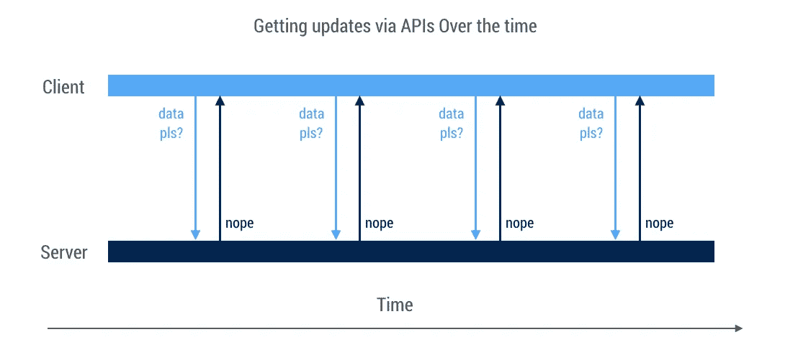
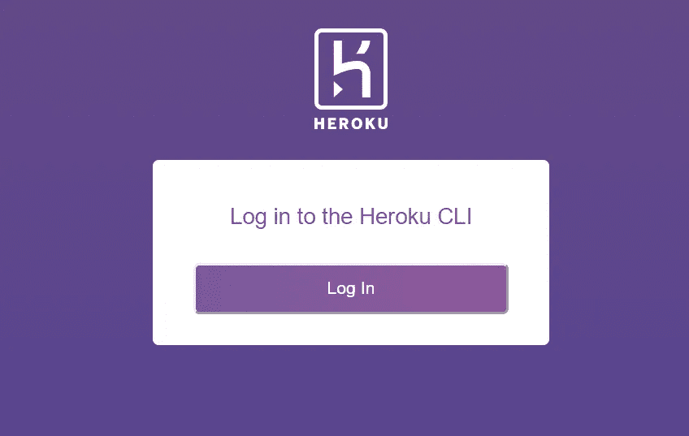
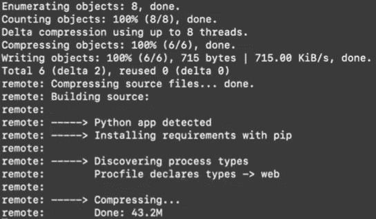

# 如何免费使用 Heroku 部署电报机器人

> 原文：<https://towardsdatascience.com/how-to-deploy-a-telegram-bot-using-heroku-for-free-9436f89575d2?source=collection_archive---------1----------------------->

## 使用 python-telegram-bot 库的完整指南

在本地运行你的电报机器人足以满足简单的应用。但是，如果您想要扩展您的 bot 并使其他人能够使用您的 bot，即使您没有在本地运行 bot，您将需要更进一步来部署 bot。


由[伊恩·巴塔格利亚](https://unsplash.com/@ianjbattaglia?utm_source=medium&utm_medium=referral)在 [Unsplash](https://unsplash.com?utm_source=medium&utm_medium=referral) 上拍摄

在本教程中，我将介绍如何使用 Heroku 的 [python-telegram-bot 库](https://github.com/python-telegram-bot/python-telegram-bot)部署您创建的电报机器人。更棒的是，我们可以完全免费地做到这一点！忘掉你从其他主机选项中产生的所有费用，Heroku 将很可能满足你的需求，你不用支付一分钱，也不用输入你的信用卡信息。

为此，我将使用一个取自 python-telegram-bot Github 存储库中示例的简单启动脚本，在该存储库中，bot 只是简单地回应用户发送的任何内容。您可能有不同的脚本，但是我将向您展示要修改哪些部分，以便使用 Heroku 部署 bot。

如果你想直接找到需要的文件，就去这个 [Github 库](https://github.com/liuhh02/python-telegram-bot-heroku)下载吧！

这是我们的起点:

# 修改 python-telegram-bot 脚本

## 从轮询更改为 Webhooks

首先，我们将修改机器人获取新数据的方式。python-telegram-bot 脚本使用轮询而不是 webhooks 来获取新数据。对于简单的测试来说，轮询就足够了，因为它很容易实现。然而，轮询的缺点是效率低，而且它获取的数据总是旧的，从来不是实时的。这是因为轮询以预定的频率发送请求以检测数据中的任何变化，这意味着它不断检查数据是否被修改，而不是在数据发生变化时得到“通知”。



图片摘自[https://community . Stuart . engineering/t/web hooks-vs-polling/257](https://community.stuart.engineering/t/webhooks-vs-polling/257)

另一方面，webhooks 的作用类似于推送通知。当数据被修改时，webhooks 被触发，而不是获取信息。这允许实时信息，也使它更有效，因为不需要不断地发送请求来检查数据。


图片取自[https://community . Stuart . engineering/t/web hooks-vs-polling/257](https://community.stuart.engineering/t/webhooks-vs-polling/257)

我们首先导入 os，然后设置端口号来监听 webhook。

```
import os
PORT = int(os.environ.get('PORT', 5000))
```

接下来，我们修改下面的代码行

```
updater.start_polling()
```

到

```
updater.start_webhook(listen="0.0.0.0",
                          port=int(PORT),
                          url_path=TOKEN)
updater.bot.setWebhook('[https://yourherokuappname.herokuapp.com/'](https://yourherokuappname.herokuapp.com/') + TOKEN)
```

这样做的目的是将轮询方法更改为 webhook，使用上面用 port 变量指定的端口监听 0.0.0.0。令牌指的是你的电报机器人的 API 令牌，应该在代码的顶部定义。下一行是设置带有 heroku 应用程序链接的 Webhook，我们将在下一步讨论。

在对 python 文件进行了所有更改之后，它应该类似于下面这样(使用您自己的 Telegram bot 令牌):

## 创建 Heroku Webapp —设置目录

我们已经完成了 python-telegram-bot 脚本的编辑，除了更改 heroku 应用程序的名称之外，我们将很快进行更改。为了让 heroku 将以下内容识别为 python 应用程序，您需要将以下文件放在同一个目录中:

```
bot.py
Procfile
requirements.txt
```

python 代码应该在 bot.py 文件中，我将完成创建 Procfile 和 requirements.txt 的过程。

首先，将终端/命令提示符的目录更改为包含 python 脚本的目录。然后，创建包含以下行的 requirements.txt 文件:

```
python-telegram-bot==12.7
```

这需要告诉 heroku 需要安装哪些库来执行代码。假设你用的是上面的样例代码，你唯一需要的库是 python-telegram-bot，我们用的版本是 12.7。如果要导入其他库来运行 python 代码，请确保在 requirements.txt 文件中也包含其他库。

接下来，您需要一个 Procfile。procfile 以 <process type="">: <command></command>的格式声明进程类型，后跟命令。这里，我们使用 web 进程类型，它从 Heroku 的路由器接收外部 HTTP 流量。命令是 python3 bot.py，它告诉 Heroku 执行 python 文件，就像您通常在本地处理 python 文件一样。因此，您的 Procfile 应该包含这样一行:</process>

```
web: python3 bot.py
```

确保 Procfile 没有任何文件扩展名，如。txt 在后面，因为行不通。

## 创建您的 Heroku Webapp

将这三个文件放在同一个目录中，我们现在将创建 Heroku Webapp。

1.  登录/ [创建](https://signup.heroku.com/dc)一个 Heroku 账号。
2.  安装 [Heroku CLI](https://devcenter.heroku.com/articles/getting-started-with-python#set-up) 。如果您没有安装 Git，请先[安装 Git](https://git-scm.com/book/en/v2/Getting-Started-Installing-Git) ，然后再继续使用 Heroku CLI。
3.  安装后，您可以在终端/命令提示符下使用 *heroku* 命令。转到 python 文件所在的目录，然后输入:

```
heroku login
```

一个新的窗口将在你的浏览器中打开，提示你登录，所以只需点击按钮。



4.登录后，返回命令行。输入

```
heroku create
```

创建您的新 webapp。在这里，heroku 将为您的 webapp 分配一个名称以及指向您的 webapp 的链接，其格式应该是【https://yourherokuappname.herokuapp.com/.将 URL 粘贴到 bot.py 代码中

```
updater.bot.setWebhook('[https://yourherokuappname.herokuapp.com/'](https://yourherokuappname.herokuapp.com/') + TOKEN)
```

对您的 bot.py 文件进行所有更改后，它看起来应该类似于以下内容(当然，使用您自己的 Telegram bot 令牌和 heroku 应用程序名称):

5.接下来，在命令行中输入

```
git init
git add .
git commit -m "first commit"
heroku git:remote -a YourAppNamegit push heroku master
```

第一行创建了一个新的 Git 存储库。第二行告诉 Git，您希望在下一次提交中包含对特定文件的更新。然后第三行提交更改。在第四行中，将“YourAppName”更改为 heroku 应用程序的名称。最后，第五行将所有内容推送到服务器。

然后，您应该会看到以下消息:



特别是，它会说检测到一个 Python 应用程序，并使用 pip 在 requirements.txt 文件中安装所需的库。然后，它将读取指定要执行 bot.py 文件的 Procfile。

原来如此！一旦它完成执行，你可以简单地去电报和信息/开始你的机器人。它现在应该按照您期望的那样运行。

由于你在 heroku 上使用免费计划，机器人将在 30 分钟不活动后休眠。所以，如果你在使用它超过 30 分钟后才开始使用它，那么你要期待机器人会花几秒钟来响应你的/start。除此之外，机器人几乎会瞬间做出反应~

# 如果你的机器人停止响应该怎么办

我注意到，在大约 24 小时不活动后，机器人停止响应(因为我们使用的是 Heroku 的免费版本)，所以如果您想“唤醒”机器人，一种方法是对其中一个文件进行更改(例如，将 procfile 中的 python3 更改为 python，反之亦然)，然后用下面的代码行提交更改:

```
git add .
git commit -m "changing python3 to python in Procfile"
git push heroku master
```

您应该再次看到关于 Python 应用程序被检测到的消息，并且一旦它完成执行，您的 bot 现在应该恢复了！