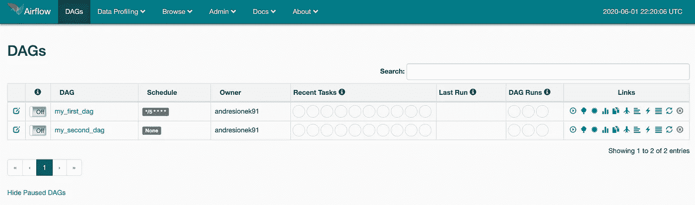

# 如何在 AWS 上部署气流:最佳实践

> 原文：<https://towardsdatascience.com/how-to-deploy-airflow-on-aws-best-practices-63778d6eab9e?source=collection_archive---------10----------------------->

## 在 AWS 上部署气流对于没有 DevOps 经验的人，也就是几乎所有从事数据工作的人来说，都是一个相当大的挑战。

## TL；DR；

我创建了一个 [repo，按照软件工程最佳实践在 AWS](https://github.com/andresionek91/airflow-autoscaling-ecs) 上部署气流。如果你不想读这篇文章，你可以直接去[那里](https://github.com/andresionek91/airflow-autoscaling-ecs)。但我确实描述了一些你可能会觉得有用的东西。


[荷兰 Zaandijk Zaanse Schans](https://unsplash.com/s/photos/zaanse-schans%2C-zaandijk%2C-netherlands)|照片由 [Wim van 't Einde](https://unsplash.com/@wimvanteinde?utm_source=unsplash&utm_medium=referral&utm_content=creditCopyText) 在 [Unsplash](https://unsplash.com/s/photos/mill?utm_source=unsplash&utm_medium=referral&utm_content=creditCopyText) 上拍摄

运行 docker-compose 命令和 voíla，您就有了在本地环境中运行的 Airflow，并且您已经准备好开发一些 Dag 了。一段时间后，您已经为在生产环境中部署 Dag(和气流)做好了准备。然后你开始搜索如何在 AWS 上部署气流的说明。以下是您可能会发现的内容:

*   没有关于气流文件的说明。
*   有些帖子，[像这个](/how-to-deploy-apache-airflow-with-celery-on-aws-ce2518dbf631)，教你如何在 AWS ECS 上部署。相当有趣的方法。问题是，整个教程都是基于通过在 AWS 控制台上点击来创建资源。相信我；您不希望在生产环境中部署时走这条路。想象一下创建三个不同的环境(开发、试运行和生产)并不得不重复该过程三次的噩梦。现在想象一下更新环境并使它们保持同步。想象一下，你可以很容易地花一整个星期来修复一个错误，这个错误是由一个被错误删除的资源引起的。
*   [另一篇文章](https://medium.com/swlh/deploy-and-run-apache-airflow-on-aws-ecs-following-software-development-best-practices-613173f3b70d)相对较新，采用了更好的方法，但它仍然使用 AWS CLI 创建资源(如 ECS 集群)。比控制台上的点击式稍好一点，但仍不能用于生产。
*   其他文章，可能会提到使用基础设施作为代码，这将解决上述问题。但是，它们在技术细节和实现上都非常肤浅。因此，尽管提供了很好的概述和最佳实践，但对于没有 DevOps 经验的人来说，它们并不实用。
*   [GitHub](https://github.com/nicor88/aws-ecs-airflow)上的这个回购可能是你在遵循软件工程最佳实践的 AWS 上正确实现 Airflow 的最接近的方式。但它仍然缺乏一些基本的东西，如 web 服务器和工作人员的自动缩放，或者配置设置的方法，如 RDS 实例类型，而不必挖掘 Terraform 代码。

你可能会在你的[谷歌搜索](https://www.google.com/search?q=deploy+airflow+on+aws)的第二页上看一下，但是如果一个好的结果没有出现在第一页上，那么这可能意味着它不存在。

# 入门指南

只需[克隆 repo](https://github.com/andresionek91/airflow-autoscaling-ecs) ，遵循一些说明并安装[自述文件](https://github.com/andresionek91/airflow-autoscaling-ecs/blob/master/README.md)中描述的要求，然后运行:

```
make airflow-deploy
```

这将向您的 AWS 帐户部署一个 Airflow 实例！



搞定了。您将在启用自动缩放的 AWS ECS 上部署 Airflow。图片由作者提供，气流用户界面的打印屏幕。

# 它如何帮助您遵循最佳实践？

## service.yml 文件

该回购使用 [AWS Cloudformation](https://aws.amazon.com/pt/cloudformation/) 实现所有基础设施。在[*/cloud formation*](https://github.com/andresionek91/airflow-autoscaling-ecs/tree/master/cloudformation)*目录中，您将找到创建运行 Airflow 所需的基础设施的所有模板。好的一面是你不需要担心学习 Cloudformation 来做简单的部署，因为在根中有一个[**service . yml**](https://github.com/andresionek91/airflow-autoscaling-ecs/blob/master/service.yml)**来帮助你。***

***假设您想要将特定 IP(如您的办公室 IP)列入白名单，以便访问 Airflow UI。您唯一需要做的事情就是修改 [service.yml](https://github.com/andresionek91/airflow-autoscaling-ecs/blob/master/service.yml) 中的几行代码:***

***添加要加入白名单的 IP 地址列表。默认情况下，所有服务将对所有 IP 开放(0.0.0.0/0)。***

***如果你想改变气流数据库实例类型，你也可以去 [service.yml](https://github.com/andresionek91/airflow-autoscaling-ecs/blob/master/service.yml) :***

***很容易改变你的气流的元数据数据库引擎版本，更新实例类型等。***

***你要的只是气流工作者的 CPU 和内存？微调自动缩放？ [service.yml](https://github.com/andresionek91/airflow-autoscaling-ecs/blob/master/service.yml) 是一站式商店。***

***轻松微调气流服务的自动缩放规则。***

## ***在 AWS Secrets Manager 中管理密码***

***不要硬编码你的密码是软件工程 101。但是有时候，如果没有硬编码，很难在运行时自动部署和创建密码。在这个气流回购中，我们使用 AWS Secrets Manager 来帮助我们解决这个问题。***

*   *****气流元数据数据库*****

***我们的 Postgres 数据库将保存气流元数据，是需要管理员用户名和密码的资源之一。使用 AWS Secrets Manager，在部署时会创建一个强随机密码，并将其附加到集群。要获得密码值，您必须登录到您的 AWS 帐户，并转到 Secrets Manager。***

***Cloudformation 代码将为您创建一个强数据库密码。创建数据库时会引用用户名和密码。***

***也可以用 Secrets Manager 实现自动密码轮换，但是这个项目没有实现。***

*   *****费尔内键*****

***Airflow 使用 Fernet 密钥对保存在元数据数据库中的密码(如连接凭证)进行加密。该部署在部署时生成一个随机的 Fernet 密钥，并将其添加到 Secrets Manager 中。然后，它在气流容器中作为环境变量被引用。***

## ***自动缩放已启用***

***将气流投入生产的最大挑战之一是处理资源管理。如果出现使用高峰，如何避免 web 服务器崩溃？或者，如果某个特定的日常工作需要更多的 CPU/内存，该怎么办？***

***自动缩放为您解决了这些问题。在这个存储库中，您可以轻松地配置阈值，并且可以放心，您的基础架构将根据需求进行伸缩。***

## ***轻松部署到不同的环境***

***在生产设置中，您会希望将代码部署到不同的环境中。假设你需要:制作，舞台和开发。***

***这个 repo 允许您通过更改一个环境变量将相同的代码部署到不同的环境中，这可以在您的 CI/CD 管道上自动推断出来。要改变环境，请执行以下操作:***

```
***export ENVIRONMENT=dev; # this will deploy airflow to dev environment
make airflow-deploy;***
```

## ***更新 Dag 而不触及基础架构***

***Airflow 的美妙之处在于能够将工作流写成代码。这意味着您更改 DAGs 代码的频率要比更改基础设施的频率高得多。通过这种气流部署，您将向 Dag 提交更改，它不会尝试为您重新部署基础架构。***

***您唯一想做的事情是构建一个新的气流图像，将其推送到 ECR，然后更新您的 ECS 服务以加载最新的图像。为此，只需运行:***

```
***make airflow-push-image;***
```

***这里的情况并非如此，但是您甚至可以将 Dag 放在单独的存储库中。这将使基础设施与软件更加分离。***

## ***标记您的资源***

***标记资源将使我们能够轻松地创建自动警报、确定所有权和跟踪基础架构成本。这就是为什么这个气流储存库会标记所有资源。***

***当在云上运行多个服务时，标记资源是一个关键的实践。***

# ***你这边应该怎么做？***

***您应该将部署流程添加到 CI/CD 管道中。为了运行一些自动化测试，我使用 GitHub Actions(但是您的公司可能使用其他工具，如 CircleCI 或 Jenkins)。***

***您可以遵循类似的过程来自动化您的部署和测试。看看[测试工作流程](https://github.com/andresionek91/airflow-autoscaling-ecs/blob/master/.github/workflows/run_tests.yml)来获得一些灵感。***

# ***这要花多少钱？***

***在采用默认配置的 AWS 上运行气流(同时考虑到集群没有纵向扩展)**每天应该花费 5 到 7 美元**。这取决于您正在部署的区域。***

***通过降低 service.yml 上的 [CPU 和内存](https://github.com/andresionek91/airflow-autoscaling-ecs/blob/master/service.yml#L42-L43)以及[改变工人的最小数量](https://github.com/andresionek91/airflow-autoscaling-ecs/blob/master/service.yml#L60-L63)，可以进一步降低成本。默认设置将允许气流在需要增加资源之前运行相当多的 Dag。微调并找到最适合您的用例的方法。***

***我希望这篇文章([和资源库](https://github.com/andresionek91/airflow-autoscaling-ecs))能帮助你轻松地生产气流。如果您有任何问题、建议或要求，请通过 [LinkedIn](https://www.linkedin.com/in/andresionek/) 联系我，或在回购上打开问题。此外，欢迎您打开 PRs 并与该项目合作！***