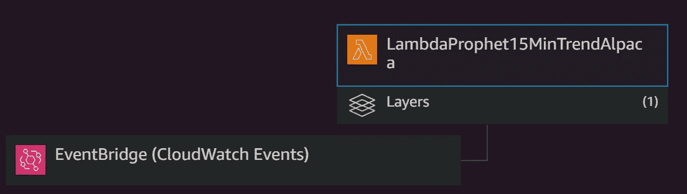

# 如何使用脸书先知机器学习模型将自动交易机器人部署到 AWS Lambda(无服务器)

> 原文：<https://towardsdatascience.com/how-to-deploy-an-automated-trading-bot-using-the-facebook-prophet-machine-learning-model-to-aws-1182c603e280?source=collection_archive---------35----------------------->

AWS Lambda“设计者”这篇文章的算法概述

在这篇文章中，我将介绍我的无服务器投资算法，使用 AWS Lambda，脸书先知作为 ML 模型，以及我的自定义 Lambda 层。

我把这篇文章分为“我为什么要这么做”和“技术方法”两部分。如果你想跳过“为什么”的部分，可以直接跳到技术部分。

# 我为什么要在 AWS Lambda 中部署机器学习模型？

**1。可靠性:**算法将独立于其他系统、更新、…

**2。性能效率:**我可以在一个(小)系统上运行几个算法，彼此独立。

**3。成本节约:** AWS 允许每月[320 万计算秒](https://aws.amazon.com/lambda/?did=ft_card&trk=ft_card)，基本上让我免费运行我所有的算法。

我一直在寻找一种方法，首先确保我的投资机器人肯定会执行，因为如果交易方向错误，没有及时取消，失败的执行可能会花费很多钱。此外，我想避免让我的计算机一直运行，并确保几个算法可以彼此相邻运行，而不会影响或延迟它们的执行。

此外，让一个投资算法运行而不用担心操作系统更新、硬件故障和断电等，这是一个很好的想法，这是无服务器技术的一般优势。

现在，我可以运行算法的几个变体来测试算法的变化，并且可以确定它将运行。另一件好事？AWS 提供了大约 100 万次免费的 Lambda 调用，这让我可以在其免费层中运行整个架构。

# 投资算法

我将在我的网站 [www.datafortress.cloud](http://www.datafortress.cloud/) 上的另一篇文章中更深入地解释该算法，但我的典型投资算法设置包括:

1.  使用用 python 编写的开源回溯测试框架 [Backtrader](https://www.backtrader.com/) 测试算法
2.  将成功的算法转换成包含 run()方法的单个 python 文件，该方法返回已经完成的投资
3.  将 python 文件传输到 AWS Lambda，在这里我用 AWS Lambda 的 lambda_handler 函数调用 run()函数

在这个示例算法中，我根据当前价格是高于还是低于由[脸书的先知模型](https://facebook.github.io/prophet/)预测的趋势线来做出投资决定。我[从肖恩·凯利](http://seangtkelley.me/blog/2018/08/15/algo-trading-pt2)那里得到了灵感，他写了一个关于如何利用预言家和反向交易者的反向交易者设置。

在这个设置中，我的股票范围是通过从 SPY500 指数中选择在过去 X 个时间步中获得最高回报的前 20 只股票来计算的。

数据来源是雅虎财经，使用的是[免费的 yfinance 库](https://pypi.org/project/yfinance/)，作为我选择的算法经纪人，我选择了[羊驼网](https://alpaca.markets/)。

在我的设置中，算法将在每天下午 3 点执行一次，或者在交易时间每 15 分钟执行一次。

# 将脸书先知部署到 AWS Lambda 时遇到的问题

AWS Lambda 预装了一些 python 库，但正如许多人可能知道的那样，这在默认情况下是非常有限的(这对 Lambda 的承诺来说是合理的)。尽管如此，Lambda 允许安装私有包，这对于较小的包来说非常容易(参见[官方文档](https://docs.aws.amazon.com/lambda/latest/dg/python-package.html))，但是如果处理大小超过 250 Mb 的包，就变得有点复杂了。不幸的是，脸书的 prophet 模型超出了这个界限，但幸运的是[亚历山大·巴甫洛夫·马采诺夫通过减少包的大小](/how-to-get-fbprophet-work-on-aws-lambda-c3a33a081aaf)解决了这个问题，而[马克·梅斯处理了编译问题，使其可以在 AWS Lambda](https://github.com/marcmetz/How-To-Deploy-Facebook-Prophet-on-AWS-Lambda) 上运行。

通过使用层，可以将非默认库添加到 AWS Lambda 中，层包含所有需要的包。如果导入了某个图层，您可以像在本地设置中一样，在 python 函数中导入包。

# 如何(技术)

最后，让我来解释一下你到底是如何做到这一点的。不耐烦的人可以看看这个 TLDR，或者下面更详细的版本。

**TLDR；**

1.  你将需要一个 Lambda 层，上传我的([下载](https://github.com/JustinGuese/How-To-Deploy-Facebook-Prophet-on-AWS-Lambda/raw/master/python.zip))包含先知，金融，…到一个 S3 桶(私人访问)
2.  选择 AWS Lambda，创建一个函数，添加一个层，然后粘贴到您的 S3 对象 URL 中
3.  将你的 lambda_function.py 粘贴到 lambda 编辑器中([或使用我的](https://github.com/JustinGuese/How-To-Deploy-Facebook-Prophet-on-AWS-Lambda/blob/master/lambda_function.py))
4.  设置环境变量(可选)
5.  要么通过单击“测试”手动运行它，要么前往 CloudWatch -> Rules -> Create Rule 并设置“计划执行”以在指定的时间间隔运行它

**详解**:

# 1.为 AWS Lambda 创建自定义层

你可以使用我的 Lambda 层，其中包含脸书先知、NumPy、熊猫、[羊驼-交易-API](https://github.com/alpacahq/alpaca-trade-api-python) 、yfinance ( [GitHub](https://github.com/JustinGuese/How-To-Deploy-Facebook-Prophet-on-AWS-Lambda) )或者使用 [Marc](https://medium.com/@marc.a.metz/docker-run-rm-it-v-pwd-var-task-lambci-lambda-build-python3-7-bash-c7d53f3b7eb2) 给出的解释来编译你自己的层。

**使用我的 Lambda 图层**

1.  从我的 [Github repo](https://github.com/JustinGuese/How-To-Deploy-Facebook-Prophet-on-AWS-Lambda/raw/master/python.zip) 下载包含所有包的 zip 文件([链接](https://github.com/JustinGuese/How-To-Deploy-Facebook-Prophet-on-AWS-Lambda/raw/master/python.zip))。
2.  由于你只能直接上传层到 Lambda 直到 50 Mb 的大小，我们将首先需要上传文件到 AWS S3。
3.  创建一个 bucket 并将下载的 zip 文件放入其中。访问可以保持私密，不需要公开！将 URL 复制到您的文件中(例如[https://BUCKETNAME.s3.REGION.amazonaws.com/python.zip](https://bucketname.s3.region.amazonaws.com/python.zip))。
4.  登录 AWS，进入 Lambda-> Layers([EU central Link](https://eu-central-1.console.aws.amazon.com/lambda/home?region=eu-central-1#/layers))。
5.  点击“创建层”，给它一个匹配的名称，并选择“从亚马逊 S3 上传文件”，并复制第 3 步的代码到其中。运行时选择 Python 3.7。单击创建。

**编译自己的 Lambda 图层**

请[遵循 Marc](https://medium.com/@marc.a.metz/docker-run-rm-it-v-pwd-var-task-lambci-lambda-build-python3-7-bash-c7d53f3b7eb2) 的指示。

# 2.设置 AWS Lambda 函数

1.  打开 Lambda 功能仪表板( [EU central Link](https://eu-central-1.console.aws.amazon.com/lambda/home?region=eu-central-1#/functions) )并点击“创建功能”
2.  保留“从头开始创作”复选框，并给它一个合适的名称。
3.  在“运行时”中，选择 Python 3.7，其余保持不变，点击“创建函数”。
4.  在“设计器”选项卡的概述中，您将看到 Lambda 函数的图形表示。点击它下面的“图层”框，点击“添加图层”。如果你正确地设置了层，你将能够在下面的对话框中选择它。最后，点击“添加”。
5.  在“设计器”标签中，选择你的 Lambda 函数。如果向下滚动，您将看到一个名为“lambda_function.py”的文件中的默认 python 代码片段。如果你的代码结构和我的一样( [Link](https://github.com/JustinGuese/How-To-Deploy-Facebook-Prophet-on-AWS-Lambda/blob/master/lambda_function.py) )，你可以用 run()函数执行你的函数。如果一个 Lambda 函数被调用，它将执行 lambda_handler(事件，上下文)函数，你可以从这个函数调用 run()函数。当然，您可以重命名所有的文件和函数，但是为了这个项目的简单性，我让它保持原样。
6.  请随意粘贴[我的功能](https://github.com/JustinGuese/How-To-Deploy-Facebook-Prophet-on-AWS-Lambda/blob/master/lambda_function.py)并测试它。
7.  单击“Test”应该会成功执行，否则，它会在对话框中显示错误。

# 3.在 AWS Lambda 中使用环境变量

你不应该在你的代码中把你的用户和密码留为明文，这就是为什么你应该总是使用环境变量！幸运的是，Lambda 也使用它们，并且可以很容易地用 python os 包调用它们。例如，在我的脚本中，我使用 os.environ['ALPACAUSER']调用用户变量。当向下滚动到代码编辑器下方时，可以在 Lambda 函数主屏幕中设置环境变量。

# 4.在指定的时间间隔触发 AWS Lambda 函数

无服务器和 AWS Lambda 的概念是建立在当触发事件发生时执行一个功能的思想上的。在我的设置中，我希望在交易时间(周一至周五)每隔 15 分钟调用一次该函数。幸运的是，AWS 使用 CloudWatch 服务提供了一种无需运行服务器就能触发事件的方法。

1.  前往 CloudWatch ( [欧盟中央联系](https://eu-central-1.console.aws.amazon.com/cloudwatch/home?region=eu-central-1))。
2.  在左侧面板中，选择“事件”和“规则”。
3.  点击“创建规则”，并选择“时间表”而不是“事件模式”。在这里，您可以使用简单的“固定比率”对话，或者创建一个 cron 表达式。我正在使用[https://crontab.guru/](https://crontab.guru/)(免费)来创建 cron 表达式。我对上述用例的 cron 表达式是“0/15 13–21？*周一至周五*"。
4.  在右侧面板中，选择“添加目标”并选择您的 Lambda 函数。它将自动添加到 Lambda 中。
5.  最后点击“配置细节”，给它一个名字，然后点击“创建规则”。

# 5.(可选)日志分析、错误搜索

如果你做到了这一步，你就应该完成了！但是如果你想检查一切是否正常，你可以使用 CloudWatch 来查看 Lambda 函数的输出。前往 cloud watch-> Logs-> Log groups([EU central Link](https://eu-central-1.console.aws.amazon.com/cloudwatch/home?region=eu-central-1#logsV2:log-groups))并选择您的 Lambda 函数。在这个概述中，您应该能够看到函数的输出。

如果你喜欢这篇文章，请留下评论或者到我的博客 [www.datafortress.cloud](http://www.datafortress.cloud/) 来激励我😊。