# 如何在 AWS 上部署带芹菜的阿帕奇气流

> 原文：<https://towardsdatascience.com/how-to-deploy-apache-airflow-with-celery-on-aws-ce2518dbf631?source=collection_archive---------1----------------------->

## 完全指南

[](https://pixabay.com/es/photos/parque-e%C3%B3lico-energ%C3%ADa-verde-1209335/)

图片由[在](https://pixabay.com/photos/?utm_source=link-attribution&utm_medium=referral&utm_campaign=image&utm_content=1209335) [Pixabay](https://pixabay.com/es/?utm_source=link-attribution&utm_medium=referral&utm_campaign=image&utm_content=1209335) 上的免费照片提供

*免责声明:本帖假设基本了解* ***气流*** *、* ***AWS ECS、*** *(安全组等)和****Docker****。我建议一种架构，在您的特定情况下，* ***可能不完美，也可能不是最好的*** *。在这种情况下，从这个讲座中得到你想要的。*

# 一点背景

在我工作的地方，我们广泛使用*阿帕奇气流*。我们大约有 15 个 Dag，看起来可能不多，但其中一些有许多步骤(任务),包括下载大型 SQL 备份、使用 Python 转换一些值并将其重新上传到我们的仓库。

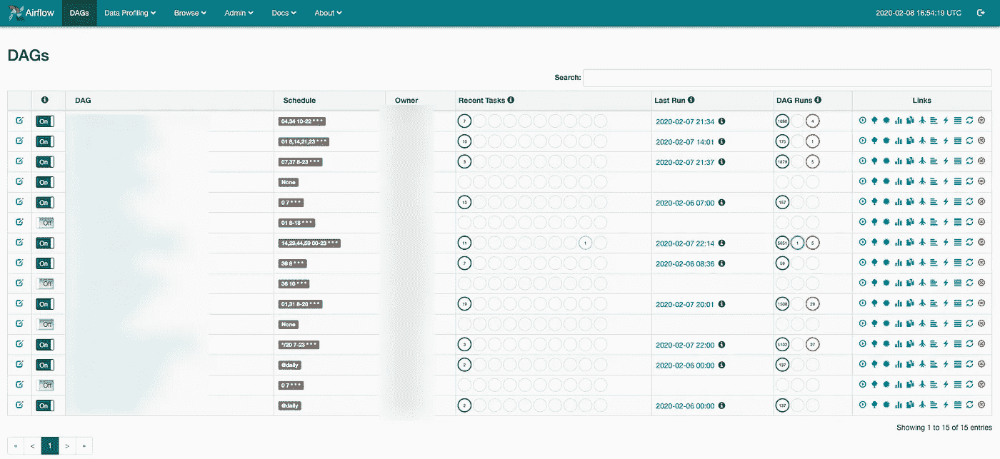

我们的气流仪表板截图

起初，我们开始使用顺序执行器(没有并行性，一次只运行一个任务),因为设置简单，而且没有很多 Dag。随着时间的推移，dag 不断增加，其中一些提供了利用并行性的机会，因此对于一些配置，我们开始使用本地执行器。

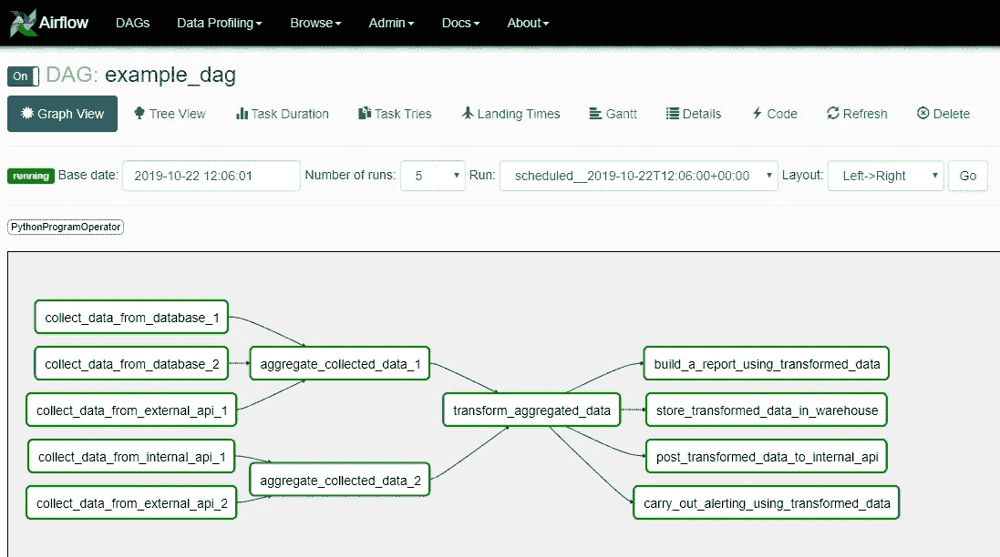

利用并行设置的 DAG 示例

你可能会问……为什么整件事不再有用了？

这两种情况都只在 AWS ECS 中部署了一个容器来做所有的事情:服务于 web UI、调度作业和执行它们的工作进程。这不是*可扩展的*，我们唯一的选择是垂直扩展(你知道，添加更多 vCPU、更多 RAM 等等)。没有其他选择。

此外，如果容器中的某个东西失败了，**整个东西都失败了(没有高可用性)**。同样**，整个服务必须是公共的**，以便通过互联网访问网络服务器。如果你想使某些组件私有(如调度器和工人)**这在这里是不可能的。**

# 为什么要创建这个指南？

没有任何指南谈论如何在 AWS 中部署气流，或者利用他们广泛提供的服务。使用`docker-compose`在本地或 EC2 中部署整个系统很容易，但是这真的是您想要的吗？**在同一个 VPC 中，完全隔离的节点如何相互通信？把需要保密的事情保密，把需要公开的事情公开？**

# 建筑

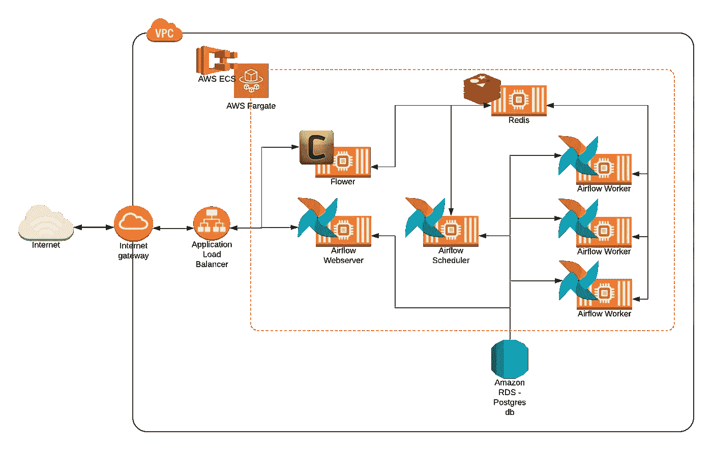

用 [Lucichart](http://lucidchart.com/) 制作的建筑图

乍一看，这整个图表可能很复杂，甚至可能会让*感到害怕*，但是不要担心。由此你要了解的大概只是以下几点:

*   一个人只能通过入口**连接到 Airflow 的 web 服务器或 Flower(我们稍后会谈到 Flower)。**没有从外部**到调度器、工作器、Redis 甚至元数据数据库的访问点。**你不会想从外面连接那里**。**
*   一切都在同一个 VPC 内，让事情变得更简单。每个对象都有自己的[安全组](https://cloudacademy.com/blog/aws-security-groups-instance-level-security/)，只允许来自正确服务的连接。
*   一切都是 AWS Fargate 的任务，同样，我们稍后将讨论 Fargate。

# 我们将使用什么服务？为什么？

主要来说， **AWS ECS 和 Fargate** 是其中的明星。

> Amazon Elastic Container Service(Amazon ECS)是一个完全托管的容器编排服务[…]您可以选择使用 [AWS Fargate](https://aws.amazon.com/fargate/) 来运行您的 ECS 集群，这是一个针对容器的无服务器计算。Fargate 消除了供应和管理服务器的需要，允许您为每个应用程序指定和支付资源，并通过设计应用程序隔离来提高安全性。

关于无服务器计算的一个很好的类比是我在这篇[酷帖](https://www.zdnet.com/article/stop-saying-the-cloud-is-just-someone-elses-computer-because-its-not/)中读到的:

> 无服务器计算就像无人驾驶汽车；还有一个司机，只是你看不到。你不需要问司机是饿了、累了、喝醉了还是需要停下来上厕所。如果我们让无人驾驶汽车在我们的道路上行驶，那将是因为我们不必关心司机，只是他们会带我们去我们想去的地方这个事实——[玛丽·布兰斯科姆](https://www.zdnet.com/meet-the-team/uk/mary-branscombe/)

我喜欢说 ECS 只是一个 *chill* Kubernetes，不需要太多的配置，它可以使用 Docker 映像和一些额外的设置来部署您的应用程序，例如您希望您的应用程序能够使用多少 CPU 或 RAM，如果您希望[自动扩展](https://aws.amazon.com/es/autoscaling/)，使用开箱即用的负载平衡器等等。

我们还应该建立一个元数据数据库，为此我们将使用方便的 RDS。

# 指南

在做任何事情之前，我们必须设置我们将使用哪个 Docker 图像，并将其设置为基础图像以在其上构建。为此，我使用了[普克尔的气流](https://hub.docker.com/r/puckel/docker-airflow)。这张 docker 图片为你提供了在 3 个主要执行器中设置气流所需的一切。下载量超过 500 万，可以肯定地说这家伙做得很棒。

## Dockerfile 文件

让我们创建我们的自定义 docker 文件。我使用了以下方法:

我添加了一个个人的`airflow.cfg`(包含 s3 日志和 SMTP 服务器凭证的配置)、一个自定义的`entrypoint.sh`和一个包含我所有 Dag 的`dags`文件夹。在这种情况下，已经使用指令`WORKDIR`在基础图像中将`.`定义为`/usr/local/airflow`。

我的切入点如下:

我去掉了基本图像的入口点中的一些行，这些行是为不同的执行者服务的条件，并且只为芹菜做了这些行，还去掉了一个烦人的不工作的`wait_for_port`函数。

这整个事情首先做的是，设置有用的环境变量，然后，根据`docker run`中给出的命令，跟随一个执行代码不同部分的开关。比方说，如果您正在启动一个`worker`，它将安装您的 Python 需求，然后执行 worker 进程。如果是`webserver`，它也会安装需求，但也会用`airflow initdb`命令初始化数据库，然后打开 air flow UI 的 web 服务器。

## 本地测试

如果你想测试整个事情，并确保一切正常，你可以用 [Puckel 的 docker-compose 芹菜 YAML 文件](https://github.com/puckel/docker-airflow/blob/master/docker-compose-CeleryExecutor.yml)来做。

过一会儿，你应该能够访问`localhost:8080`并看到气流的仪表板。你还不如访问`localhost:5555`和看花。从这一点出发，运行一些示例 DAGs 甚至是您的示例——并亲自看看 web 服务器中的触发器是如何处理事情的，调度程序抓取任务并将其发送到队列，最后，工作人员拾取并运行它。

# 上传 docker 图像

对于本教程，我们将保持简单，使用 AWS ECR。ECR 只是一个 Docker 图像库。

ECR 与 ECS 集成，开箱即用。


来源: [AWS ECR](https://aws.amazon.com/ecr/)

要创建存储库，请进入 ECR 控制台，点击*创建存储库*，选择您认为合适的名称。提示:您可以有一个用于暂存气流的存储库，一个用于生产。请记住，所有的气流过程都将使用相同的图像，以避免冗余和干燥。

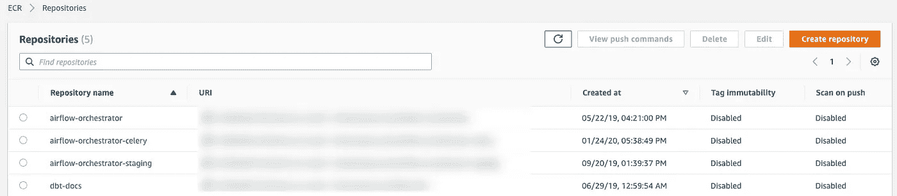

我的 AWS ECR 截图

现在进入新的存储库，点击*查看推送命令*。这将引导您将气流图像推向回购。如果在第一步中出现错误，比如`unable to locate credentials`您可能还没有设置您的`awscli`凭证，请查看[这个](https://docs.aws.amazon.com/cli/latest/userguide/cli-chap-configure.html)。

一旦您推送图像并在 ECR 控制台中看到它，您就为下一步做好了准备！

# 在 ECS 上部署服务

让我们从创建 ECS 群集开始，转到“Services ”,然后选择“ECS”。

可能因为这是你第一次，你会看到一个向你展示服务的屏幕和一个简单的第一个集群按钮。这里您需要做的只是创建一个*纯网络*集群。

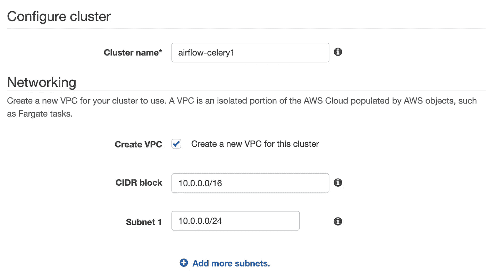

AWS ECS 中集群创建的屏幕截图

此时，您可能会看到一个类似这样的窗口。这是您自己的选择，是使用与其余实例相同的 VPC，还是专门为该集群创建另一个——我选择了后者。如果您选择这样做，我认为一个子网就足够了。

## 设置数据库(如果您还没有)

我们将建立一个 PostgreSQL 9.6 微实例数据库。如果您熟悉如何做到这一点，请随意操作并跳到下一步。

转到服务-> RDS。转到*数据库*部分和*创建数据库*。选择 PostgreSQL 徽标，转到版本 9.6.X，任何次要版本都可以。现在，我仍然在考虑是否*我非常便宜*或者气流元数据数据库真的不需要*那么*健壮，所以我选择了一个*自由层微*实例。如果你发现这对你来说还不够，以后很容易升级，所以不要担心。

接下来的配置由您决定，无论实例名称、用户名、密码是什么，**只要确保它将创建在 ECS 使用的同一个群集中。**

## 创建任务定义

太好了，我们现在有空的星团了。让我们创建我们的*任务定义。*

> 任务定义就像蓝图一样，它们定义了您的服务将如何执行——它将使用哪个容器，分配给它多少 CPU 和 RAM，映射哪些端口，它有哪些环境变量，等等。

转到左侧面板的任务定义，点击*创建新的任务定义*。


AWS ECS 截图

记住，我们想要 Fargate，所以选择它并点击*下一步*。

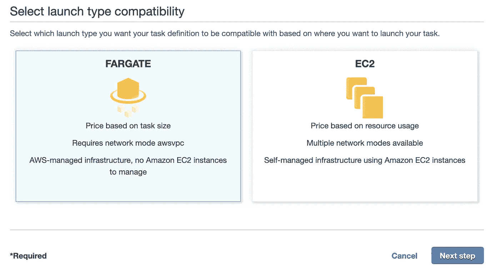

AWS ECS 截图

从现在开始，我们必须为 web 服务器、调度器和工作器创建一个任务定义。

我将向您介绍您必须为每项任务正确工作提供的所有必要配置。

**任务定义名称:**标识名称。选择一些描述性的东西，如 airflow-webserver、airflow-worker 等。
**任务角色:**任务将要注入到容器中的 IAM 角色。选择一个对你的任务必须做的事情有权限的人——从秘密管理器提取秘密，用`awslogs`日志驱动程序记录日志，从 S3 查询存储桶。如果你不确定，就使用基本的`ecsTaskExecutionRole`，如果下拉列表中没有，请在此处检查。
**网络模式:** `awsvpc`既然我们用的是 Fargate。
**任务执行角色:**能够从 AWS ECR 提取图像并登录 Cloudwatch 的角色。`ecsTaskExecutionRole`这两种政策都有。
**任务大小:**几乎完全取决于你。你的大部分资源将花在工人身上，因此他们会做所有的脏活。只是提供一个指南，这些是我的配置:

```
Webserver: 1GB, 0.5vCPU
Scheduler: 2GB, 0.5vCPU
Flower: 512MB, 0,25vCPU
Worker: 3GB, 1vCPU
Redis: 2GB, 1vCPU
```

现在点击**添加容器**。右侧面板将会弹出。
**集装箱名称:**集装箱的标识名。
**图像:**ECR 存储库的 URL。例:*1234567890 . dkr . ECR . us-east-1 . Amazon AWS . com/air flow-celery:最新。*对于 Redis，使用:*docker.io/redis:5.0.5
T21**端口映射:**对于 webserver 写 8080。对于花，5555。对于工人，8793-访问日志。对于 Redis，6379。*

在**环境**部分，在*命令*中，根据您正在创建的任务选择`webserver`、`flower`、`worker`或`scheduler`。

你也可以利用环境变量！您可以使用`value`来硬编码 env，或者使用`valueFrom`来使用*秘密管理器*或 *AWS 参数存储库*。**但是请不要在没有安全措施的情况下注入秘密。**更多信息[这里](https://docs.aws.amazon.com/AmazonECS/latest/userguide/specifying-sensitive-data.html)。

对于除 flower 之外的所有服务，您必须设置`POSTGRES_`变量，记得我们在`entrypoint.sh`中提到的那些变量吗？如果没有这些，服务在尝试连接到一个不存在的数据库时将会悲惨地失败。

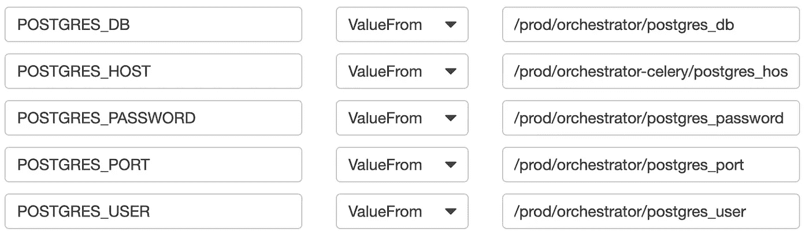

对于**调度器**和**工作器**的任务定义，需要设置`REDIS_HOST`。您可以像我在这里一样设置 IP 或内部 DNS。我们没有设置用户和密码认证，我不认为这是必要的，因为服务本身是私人的。尽管如此，请随意。


我们正式完成了任务定义！坚持住，从现在开始事情会变得更容易。*。*

## 启动服务

转到您的 ECS 集群，在*服务*选项卡中单击*创建*。

1.  选择相应的任务定义。
2.  写服务的名字: *webserver，scheduler，workers 等。*
3.  对于 webserver、Redis、flower 和 scheduler，我们应该总是有一个任务。对于工人，我们想要多少就有多少，**还记得横向缩放吗？**
4.  点击下一步。选取您的群集的 VPC 以及您想要使用的任何子网。
5.  对于安全组，只需确保将名称更改为更容易识别的名称。比如:*气流-web server-安全-群组。我们稍后会弄乱这些。*
6.  公有 IP:还记得第一张架构图吗？嗯，除非你不想使用负载平衡器/入口，否则所有服务都应该是私有的。
7.  对于 webserver 和 flower，我们可以添加一个*应用负载均衡器*，作为*弹性* *IPs* 的替代。为什么不能用 EIPs？[目前不可能](https://forums.aws.amazon.com/thread.jspa?messageID=931880)。要在 AWS 中设置 LB，参考此处的。
8.  确认并点击创建！
9.  每隔一个服务重复一次。

过一会儿，所有的服务都应该是这样的。不要担心，如果一些服务不工作。我们将在下一节整理出它们之间的联系。

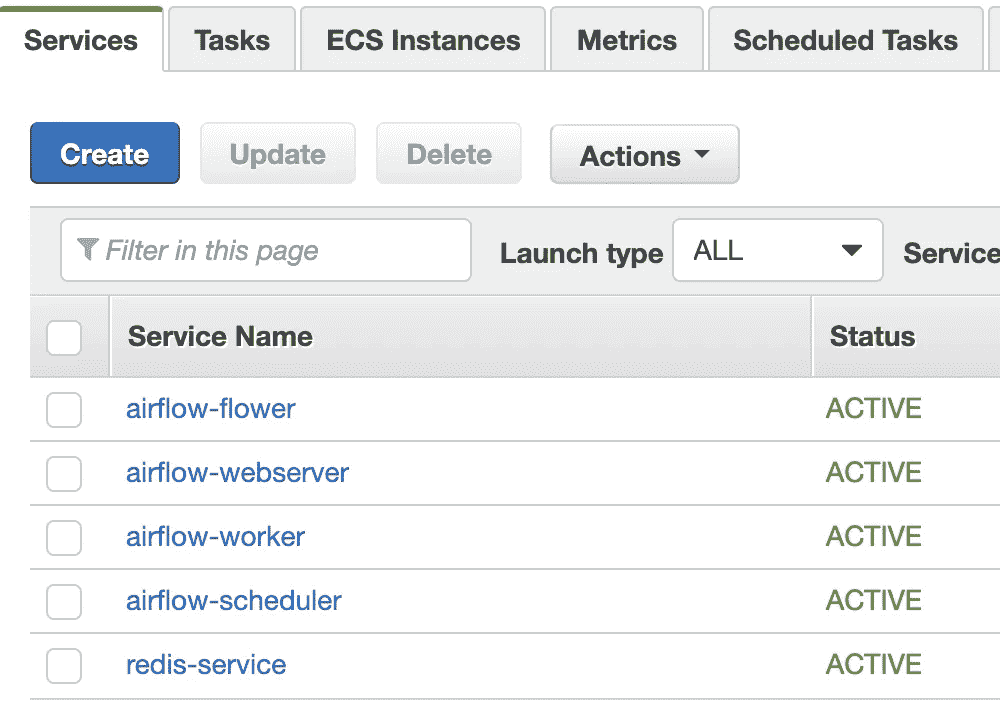

# 连接—安全组

我们现在应该做的是确保每个服务从相应的来源接收信息。我们要设置他们的安全组。

> 一个*安全组*充当您的实例的虚拟防火墙，控制入站和出站流量。在 VPC 中启动实例时，最多可以为该实例分配五个安全组。安全组在实例级起作用，而不是在子网级。因此，可以将 VPC 子网中的每个实例分配给不同的安全组。–[AWS 文档](https://docs.aws.amazon.com/vpc/latest/userguide/VPC_SecurityGroups.html)

以下是气流芹菜架构的官方文档:

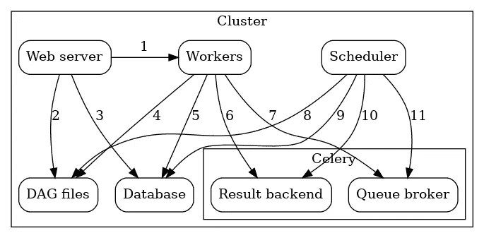

[来源](https://airflow.apache.org/docs/stable/executor/celery.html?highlight=celery)

我将借用 Airflow 文档中的一些语句:

```
Airflow consist of several components:
**Workers** - Execute the assigned tasks
**Scheduler** - Responsible for adding the necessary tasks to the queue
**Web server** - HTTP Server provides access to DAG/task status information
**Database** - Contains information about the status of tasks, DAGs, Variables, connections, etc.
**Celery** - Queue mechanismThe components communicate with each other in many places
**[1] Web server –> Workers** - Fetches task execution logs
**[2] Web server –> DAG files** - Reveal the DAG structure
**[3] Web server –> Database** - Fetch the status of the tasks
**[4] Workers –> DAG files** - Reveal the DAG structure and execute the tasks
**[5] Workers –> Database** - Gets and stores information about connection configuration, variables and XCOM.
**[6] Workers –> Celery’s result backend** - Saves the status of tasks
**[7] Workers –> Celery’s broker** - Stores commands for execution
**[8] Scheduler –> Database** - Store a DAG run and related tasks
**[9] Scheduler –> DAG files** - Reveal the DAG structure and execute the tasks
**[10] Scheduler –> Celery’s result backend** - Gets information about the status of completed tasks
**[11] Scheduler –> Celery’s broker** - Put the commands to be executed
```

**上述内容应在安全组中得到反映。**

进入 AWS 中的 VPC 服务，选择*安全组*。在设置所有服务时，我要求您用一个合适的名称来标识它们，这样您可以方便地过滤它们并提供配置。

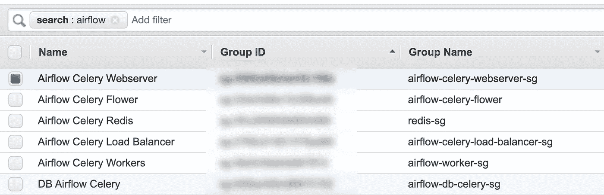

我的气流安全组的屏幕截图

从这里，选择每个组并设置正确的**入站规则。**以雷迪斯为例:

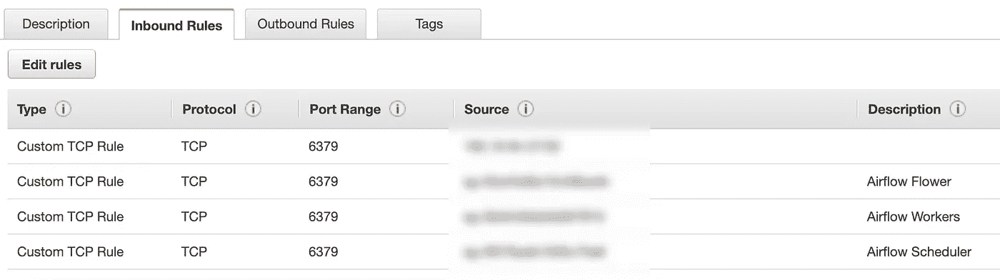

Redis 服务器运行在端口 6379 上(我们在任务定义中启用的端口)。架构图向我们展示了工作人员和调度人员应该可以访问它。我们还包括 flower 来检查经纪人状态。**因此，我们为那些实例的每个源安全组包含了行**。


[来源](https://airflow.apache.org/docs/stable/executor/celery.html?highlight=celery)

请记住，按照图表并相应地设置所有服务的安全组。这确保了应该被允许的服务之间的每个连接。如您所见，数据库应该接受来自每个气流过程的连接。

# 测试整个事情

测试很容易，只需访问 web 服务器和 flower。启动一个示例 DAG，看看在执行任务时，*活动*计数器如何快速增加和减少。

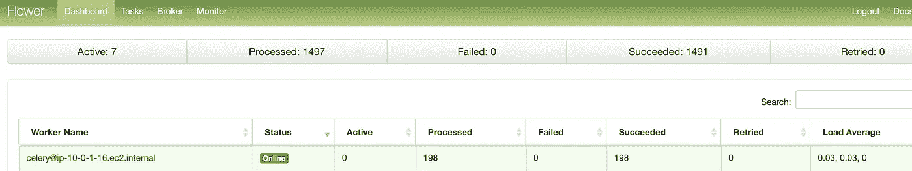

不要担心，如果有什么不工作，去检查失败的容器任务的日志并做一些研究，解决方案应该很快出现。

如果你仍然失败，很可能是你忘记做什么了(*或者是我忘记告诉你了，哈哈*)。欢迎评论，我会尽力帮助你！

如果一切顺利…

# 恭喜你！你成功了！

就是这个！你的气流集群准备好了！我知道我知道…这很长，甚至有点混乱，但是嘿！你成功做到了！👏👏😄。


照片由[阿里·叶海亚](https://unsplash.com/@ayahya09?utm_source=medium&utm_medium=referral)在 [Unsplash](https://unsplash.com?utm_source=medium&utm_medium=referral)

这对我来说是一次漫长的旅行，我在建立自己的集群时经历了许多问题、错误和异常。我真的希望我的这份指南能让你少一些头疼。

在那之前，谢谢你，再见！👋👋👋