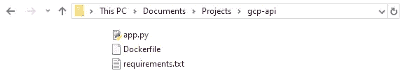
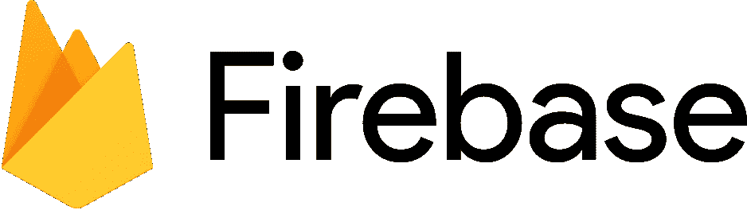
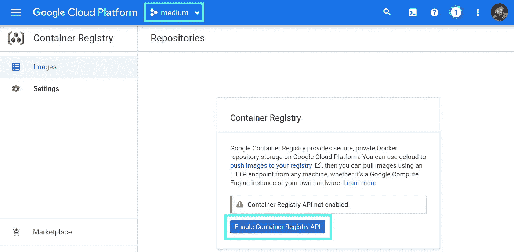
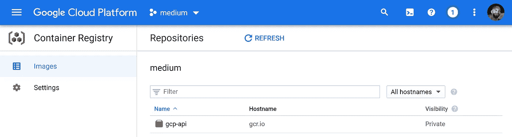
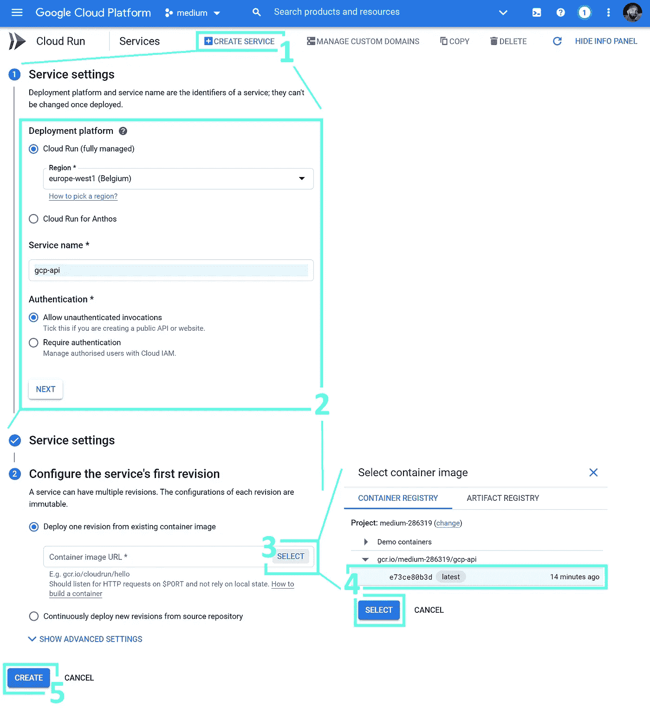
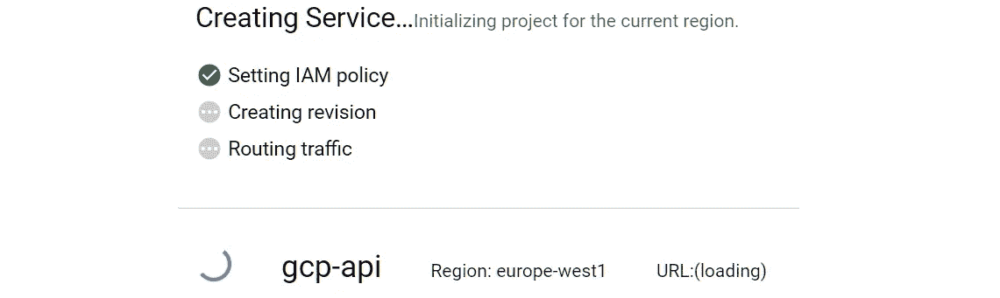

# 如何将 Docker 容器部署到云中

> 原文：<https://towardsdatascience.com/how-to-deploy-docker-containers-to-the-cloud-b4d89b2c6c31?source=collection_archive---------2----------------------->

## Docker 和 GCP 让与世界分享你的作品变得容易


[Zoltan·塔斯](https://unsplash.com/@zoltantasi?utm_source=medium&utm_medium=referral)在 [Unsplash](https://unsplash.com?utm_source=medium&utm_medium=referral) 上的照片

ocker 容器是很棒的小东西。它们本质上是独立的应用程序，可以在任何操作系统上运行。

假设您有一个 Python 应用程序，您将它与运行它所需的一切捆绑到 Docker 容器中——该容器现在可以在任何 Windows、Linux 或 macOS 系统上运行，无需安装任何东西！

Docker 的另一个好处是对云平台上的容器的支持，比如我们将在本文中使用的 Google Cloud (GCP)。

我们可以快速构建一个应用程序，使用 Docker 将其打包到一个容器中，然后使用 GCP 在全球范围内部署它。

这就是我们在本文中要做的。我们将采用一个简单的 Python API，用 Docker 打包，用 GCP 部署，涵盖:

```
**> Project Setup****> Dockerfile**
  - FROM
  - WORKDIR and COPY
  - RUN
  - CMD**> Building the Docker Image****> Deploy with Google Cloud Platform**
  - GCloud SDK
  - Cloud Build and Container Registry
  - Cloud Run
```

# 项目设置

我们不会仅仅关注 Python 代码，因为这不是本文的目的。相反，带上你自己的代码——或者，[这是我之前做的一些东西](https://github.com/jamescalam/gcp-api/blob/master/app.py)。



我们的 **gcp-api** 目录应该是这样的。

我们将代码存储在一个名为`gcp-api`(你可以随便叫它什么)的目录中，命名为`app.py`。除了我们的脚本，我们还需要:

*   a**Docker file**——Docker 的使用说明书
*   **requirements.txt** —一组 Python 模块，供我们的 docker 文件安装

当然，我们用的是 Docker，所以；我们也需要码头工人。可以从[这里](https://docs.docker.com/docker-for-windows/install/)安装。

如果您在安装 Docker 时遇到任何特定于操作系统的问题，此视频中的 1:46:21 标记说明了 Windows 安装，随后是 macOS 的 1:53:22 标记。

# Dockerfile 文件

docker 文件是我们的容器构建蓝图。它确切地告诉 Docker 如何以一种产生自包含应用程序的方式重新排列我们的脚本和文件。

就像盖房子一样。


兰迪·法特在 [Unsplash](https://unsplash.com?utm_source=medium&utm_medium=referral) 拍摄的照片

我们的脚本和文件是原材料(木材、砖块等)。).我们创建了一套我们希望我们的房子是什么样子的说明(Dockerfile)，然后我们把它交给我们的建筑师(Docker)，他然后做所有的技术工作来产生一个房子蓝图(图像)。

稍后，我们还将把蓝图交给我们的建造者(Google Build)，他将为我们建造房子(容器)——但现在还不是时候。

我们的档案。看起来是这样的:

```
FROM python:3.6-slim-busterWORKDIR /app
COPY . .RUN pip install -r requirements.txtCMD exec gunicorn --bind :$PORT --workers 1 --threads 8 --timeout 0 app:app
```

最初，它可能看起来令人困惑，但它非常简单。

## 来自 python:3.6-slim-buster

Docker 文件的第一行用另一个预构建的 Docker 映像初始化我们的容器映像。

这个预构建的映像本质上就是一个包含 Python 3.6 的轻量级 Linux 操作系统。

但为什么是*【瘦身达人】*？嗯， **buster** 是 Debian(一个 Linux 发行版)所有版本 10 变体的代号。

至于他们为什么选择“buster”这个词——我想有人打开字典，选择了他们看到的第一个词。

另一方面，斯利姆确实有道理。正如你可能已经猜到的，它意味着 Debian 10 . x——但是被削减了，导致一个更小的包大小。

官方 Python 图片的完整列表[可从这里](https://hub.docker.com/_/python)获得。



Firestore (NoSQL 数据库)通过谷歌的 Firebase 平台提供。[图像来源](https://firebase.google.com/brand-guidelines)。

***警告:*** *另外值得注意的是，我们这里用的是 Python 3.6 你不需要坚持这一点，除非你将使用 Google Firebase(我们不会在这里使用，但意识到这一点是很好的)。*

*如果您碰巧在 Python 中使用 Google Firebase，您可能会使用* `*python-firebase*` *模块，其中包含一个名为* `*async*` *的导入。*

不幸的是，Python 3.7 引入了这个词作为关键字。我们坚持使用 Python 3.6 来避免由此产生的语法错误。

## 工作目录和副本

接下来是`WORKDIR`和`COPY`。

我们使用`WORKDIR`将我们的映像(我们的容器的构造站点)中的活动目录设置为`/app`。从现在开始，我们映像外部的`.`是指我们当前的目录(例如`/gcp-api`),我们映像内部的`.`是指`/app`。

在`WORKDIR`之后，我们`COPY`从本地目录`/gcp-api`到内部活动目录`/app`的所有内容。

我们在图像中复制`app.py`到`/app`的原因是因为这是我们的谷歌云实例所期望的结构。我们可以改变这一点，但这是我们将在这里使用的。

## 奔跑

现在，我们有了自己的`pip install`指令。我们使用`RUN`告诉 Docker 运行下面的命令。下面的命令是`pip install -r requirements.txt`。

通过编写`pip install -r requirements.txt`,我们告诉 Docker 对包含在`requirements.txt`中的每一行递归运行`pip install`。

那么`requirements.txt`长什么样？

```
pandas==1.1.1
gunicorn==20.0.4
flask==1.1.2
flask-api==2.0
```

当它被输入到我们的递归`pip install`指令中时，它被翻译成:

```
pip install pandas==1.1.1
pip install gunicorn==20.0.4
pip install flask==1.1.2
pip install flask-api==2.0
```

我相信每个人都知道这一点。

## 煤矿管理局

根据我们的应用程序，我们的最终指令不是必需的。在这种情况下，它使用`gunicorn` Python 包来托管我们的 API。

尽管如此，`CMD`指令相当于打开我们计算机的命令行界面 CLI 并键入我们提供的任何命令，在本例中为`exec gunicorn — bind :$PORT --workers 1 --threads 8 --timeout 0 app:app`。

# 建立码头工人形象

在本文的前面，我们描述了 Docker 容器的房屋建筑隐喻。到目前为止，我们已经获得了原材料(脚本和文件)，并编写了一套说明，解释我们希望我们的房子是什么样的(Dockerfile)。

现在，是时候创建我们的蓝图了 Docker 图像。

我们可以通过执行以下命令来创建它:

```
docker build -t gcp-api .
```

*   这里，Docker 映像构建命令是`docker build`
*   接下来，我们使用`-t`标志来指定我们的图像名称— `gcp-api`
*   最后，我们告诉 Docker 用`.`包含当前目录中的所有内容

此时，我们已经有了蓝图，现在我们需要的是我们的构建者——云——所以让我们开始设置它。

# 使用谷歌云平台进行部署

要将容器部署到云中，我们需要采取三个步骤。首先我们:

*   下载 Google Cloud SDK，我们将使用它来—
*   用云构建构建我们的容器。
*   将集装箱上传到 GCP 的集装箱登记处。
*   使用云运行部署它。

## GCloud SDK

我们可以在这里找到 [SDK 安装程序](https://cloud.google.com/sdk/docs/downloads-interactive)。安装完成后，我们需要通过打开 CMD 提示符(或等效的 CLI)并键入以下命令来验证我们的 GCloud SDK:

```
gcloud auth login
```

这个命令打开我们的 web 浏览器，并允许我们像往常一样登录到 Google Cloud。我们将 Docker 配置为将我们的 GCP 凭据用于:

```
gcloud auth configure-docker
```

最后，将活动项目设置为您的项目 ID(我的是`medium-286319`),使用:

```
gcloud config set project *medium-286319*
```

## 云构建和容器注册

Google 的容器注册(GCR)服务允许我们存储 Docker 容器，我们可以将其用作部署的发射台。


我们需要一个现有的项目来部署我们的容器。图片作者。

在我们可以使用 GCR(或任何其他 GCP 服务)之前，我们需要创建一个项目。我们可以通过在 GCP 控制台中导航到[项目选择器页面并点击**创建项目**来实现。](https://console.cloud.google.com/projectselector2/home/dashboard)


建立一个新项目非常简单。图片作者。

我们需要做的就是给我们的项目起一个名字。我用的是**介质**。



如果这是我们第一次在项目中使用 GCR，我们将需要启用 GCR API。图片作者。

现在我们有了项目设置；我们应该能够访问[容器注册表](https://console.cloud.google.com/gcr)。在这里，我们应该能够在顶栏中看到我们新创建的项目的名称。

要使用 GCR，我们需要点击控制台窗口中央的**Enable Container Registry API**。

最后，我们可以通过将容器提交到 Cloud Build——构建 Docker 容器的 GCP 服务——来将容器上传到 GCR。

为此，我们在项目目录(`gcp-api`)中打开 CLI，并键入:

```
gcloud builds submit --tag gcr.io/[PROJECT-ID]/gcp-api
```

*   `gcloud builds submit`将附加到我们当前目录的 Docker 映像提交到 Cloud Build——它将被打包到一个容器中。

我们的容器注册位置被提供给`--tag`标志，其中:

*   `*gcr.io*` *就是* [*GCR 主机名*](https://cloud.google.com/container-registry/docs/pushing-and-pulling#tag_the_local_image_with_the_registry_name) *。*
*   `*[PROJECT-ID]*` *是我们的项目 ID；我们在创建我们的项目时看到了这一点——对我来说，它是* `*medium-286319*` *。*
*   `*gcp-api*` *是我们的形象名称。*



我们的项目 **gcp-api** 在容器注册表中。图片作者。

如果我们回到我们的 [GCR](https://console.cloud.google.com/gcr) 窗口，我们应该能够看到我们新上传的 Docker 图像。如果它还没有出现，很可能还在构建过程中——这可以在我们的[云构建仪表板](https://console.cloud.google.com/cloud-build/dashboard)中找到。

## 云运行

现在我们已经准备好了 Docker 容器；我们可以用[云运行](https://console.cloud.google.com/run)来部署它。



使用云运行部署容器的分步过程。图片作者。

在云运行界面中，我们通过以下方式进行部署:(1)单击创建服务，(2)配置我们的部署，(3–4)选择容器，以及(5)创建我们的部署！



云运行中正在进行的部署。图片作者。

我们将在云运行控制台中看到部署状态，这应该不会超过几分钟。


完成后，我们的部署名称和区域旁边会出现一个绿色勾号和 URL。图片作者。

完成后，我们会看到部署名称旁边有一个绿色勾号，旁边有我们的部署 URL。

# 完成了的

就是这样，我们已经把我们的 Python 应用程序打包到 Docker 容器中，并使用 Google Cloud 将其部署到 web 上！

多亏了一些出色的工具——即 Docker 和 GCP——这个过程没有痛苦，并且(通常)一次又一次地导致完美的部署。

现在，比人类历史上任何时候都多。我们可以将脑海中的想法和概念在现实世界中有形地呈现出来——这可以产生一些真正令人惊叹的创作。

我希望这篇文章能帮助你们中的一些人——如果你有任何问题、反馈或想法，请随时通过 [Twitter](https://twitter.com/jamescalam) 或在下面的评论中联系。感谢阅读！

有兴趣了解云上的 SQL 吗？试试 Google 出色的 MySQL、PostgreSQL 和 SQL Server 数据库服务:

[](/sql-on-the-cloud-with-python-c08a30807661) [## 使用 Python 在云上运行 SQL

### Google 云和 Python 上的 SQL 简明指南

towardsdatascience.com](/sql-on-the-cloud-with-python-c08a30807661)