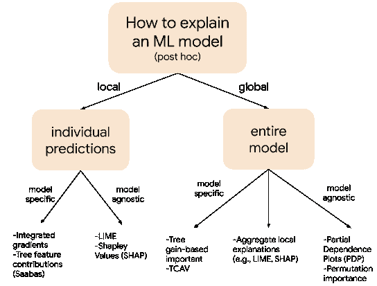
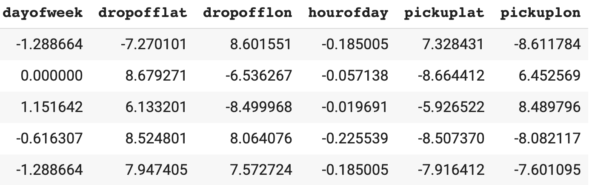
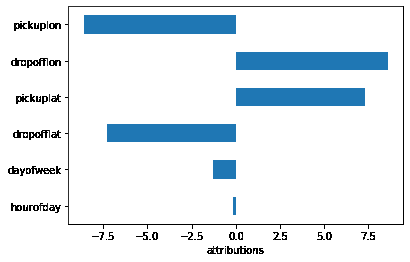
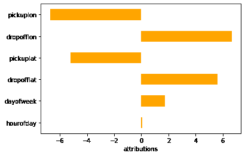

# 如何在谷歌云平台上部署可解释模型

> 原文：<https://towardsdatascience.com/how-to-deploy-interpretable-models-on-google-cloud-platform-8da93f2e131d?source=collection_archive---------24----------------------->

## 获取生产张量流模型的本地和全球解释


图片来源于 [Pixabay](https://pixabay.com/photos/splashing-splash-aqua-water-165192/) 。

*由 Chris Rawles，Michael Munn 和 Michael Abel 发布。*

现代机器学习和人工智能已经证明了在解决非常复杂的问题方面令人印象深刻的结果。然而，更复杂的问题往往意味着更复杂的数据，这必然导致更复杂的模型。真正理解一个模型为什么做出某种预测，可以和原问题本身一样复杂！

这可能会有问题，因为许多这样的 ML 系统已经影响到医疗干预、自主运输、刑事司法、风险管理和许多其他社会领域的用例。在许多情况下，这些人工智能系统的有用性和公平性受到我们理解、解释和控制它们的能力的限制。因此，相当多的努力和研究已经进入了解开强大而复杂的 ML 模型的黑盒，如深度神经网络。

可解释的人工智能指的是方法和技术的集合，这些方法和技术使人类能够理解为什么一个模型会给出特定的结果。模型可解释性是我们在谷歌云的[高级解决方案实验室](https://cloud.google.com/asl)教给客户的一个关键话题，在这篇文章中，我们将展示如何使用谷歌云的[可解释人工智能](https://cloud.google.com/explainable-ai/)来部署可解释和包容的机器学习模型。

这篇文章中使用的所有代码都可以在[这里](https://github.com/GoogleCloudPlatform/training-data-analyst/tree/master/blogs/explainable_ai)找到。

# 可解释方法的分类



*(事后)模型可解释性方法的概述和不同技术的例子。*

大多数可解释性方法可以沿着三个轴分开[ [来源](https://christophm.github.io/interpretable-ml-book/) ]:

**内在与事后。**所谓内在，我们指的是内在可解释的模型。也就是说，它们在结构上足够简单，我们可以通过简单地查看模型本身来理解模型是如何进行预测的。例如，线性模型的学习权重或通过决策树学习的拆分可用于解释模型做出预测的原因。

事后方法包括使用经过训练的模型和数据来理解为什么做出某些预测。在某些情况下，事后方法也可以应用于具有内在可解释性的模型。

在这篇文章中，我们将关注后特设模型的可解释性，因为许多先进的方法，如梯度推进和神经网络，是最好的理解使用这些方法。

**模型不可知与模型特定。**模型不可知意味着可解释性方法可以应用于*任何*模型，而特定于模型的方法只能用于某些模型类型。例如，如果该方法只适用于神经网络，那么它将被认为是特定于模型的。相反，如果一个可解释性方法将训练好的模型视为一个黑盒，那么它将被认为是模型不可知的。

**局部与全局**:局部可解释性方法旨在解释单个数据点或预测，而全局方法试图提供模型整体表现的综合解释。通过使用局部结果的集合，所有局部方法都可以变成全局技术。

# 在谷歌云上部署可解释的模型

你可以使用可解释的人工智能在 GCP 部署可解释的模型，并使用`gcloud beta ai-platform explain`命令进行预测。

使用解释进行训练和预测的步骤是

1.  训练一个模型并将其部署在 GCP 上。
2.  将一个包含基线特征值的 JSON 文件上传到一个云存储桶。
3.  使用这个 JSON 文件创建模型的一个版本，并指定`explanation-method`。
4.  致电`gcloud beta ai-platform explain`获取解释。

下面我们将更详细地展示这些步骤。

首先，你需要一个在谷歌云人工智能平台(CAIP)上训练和部署的模型。我们将查看纽约市出租车数据集。你可以看看这篇博文，看看如何在 CAIP 轻松训练一个模特。在撰写本文时，AI 解释仅支持 TensorFlow 1.x，因此无论您构建什么模型，请确保您使用 TensorFlow 1.x。一旦您将模型保存为 [SavedModel](https://www.google.com/search?q=tensorflow+model+format&oq=tensorflow+model+format&aqs=chrome.0.0l2j69i61j69i65j69i60l4.2431j0j7&sourceid=chrome&ie=UTF-8) 格式，我们将在 CAIP 上创建一个新模型:

```
gcloud ai-platform models create taxifare
```

在部署我们的模型之前，我们必须配置一个`explanations_metadata.json`文件，并将其复制到模型目录中。在这个 JSON 文件中，我们需要告诉 AI 解释我们的模型所期望的输入和输出张量的名称。

此外，在这个文件中，我们需要设置`input_baselines`，它告诉解释服务我们的模型的基线输入应该是什么。理解基线对于许多模型解释技术的有效使用是很重要的。两种支持的技术，采样 Shapley 和综合梯度，将预测与基线特征值和预测进行比较。选择合适的基线很重要，因为本质上您是在比较模型的预测与基线值的比较。要阅读更多关于基线的内容，请查看[可解释的人工智能白皮书。](https://storage.googleapis.com/cloud-ai-whitepapers/AI%20Explainability%20Whitepaper.pdf)

一般来说，对于数字数据，我们建议您选择一个简单的基线，如平均值或中值。对于本例，我们将使用每个要素的中值-这意味着此模型的基线预测将是我们的模型使用数据集中每个要素的中值预测的出租车费用。

我们可以将这个 Python 字典写出到一个 JSON 文件中:

```
# Write the json to a local file
with open(‘explanation_metadata.json’, ‘w’) as output_file:
    json.dump(explanation_metadata, output_file)
    # Copy the json to the model directory.
```

然后在 bash 中，我们使用`gsutil.`将 JSON 文件复制到您的模型目录中

```
$ gsutil cp explanation_metadata.json $model_dir
```

现在我们已经创建了我们的`explanations_metadata.json`文件，我们将部署模型的新版本。这段代码非常类似于使用`gcloud`创建模型版本的通常过程，但是有一些额外的标志:

```
gcloud beta ai-platform versions create $VERSION_IG \
  -- model $MODEL \
  --origin $model_dir \
  --runtime-version 1.15 \
  --framework TENSORFLOW \
  --python-version 3.5 \
  --machine-type n1-standard-4 \
  **--explanation-method ‘integrated-gradients’ \
  --num-integral-steps 25**
```

使用`**解释方法`**标志，您可以指定解释方法——目前支持`[integrated-gradients](https://github.com/ankurtaly/Integrated-Gradients)`和`[sampled-shapley](https://christophm.github.io/interpretable-ml-book/shapley.html)`。

*注意:在综合渐变和采样 Shapley 之间做出决定时，我们引用了白皮书*[](https://storage.googleapis.com/cloud-ai-whitepapers/AI%20Explainability%20Whitepaper.pdf)**:**

> *一般来说，对于神经网络和可微分模型，推荐使用积分梯度。它提供了计算优势，特别是对于大的输入特征空间(例如，具有数千个输入像素的图像)。对于不可微模型，建议使用采样 Shapley，这是由树和神经网络的集成组成的 AutoML 表模型的情况。*

**此外，对于那些想知道采样的 Shapley 方法与流行的*[*【SHAP】*](https://github.com/slundberg/shap)*库有何不同的人，我们还引用了白皮书:**

> *应用 Shapley 值的方法有很多种，不同之处在于它们引用模型、定型数据和解释上下文的方式。这导致了用于解释模型预测的 Shapley 值的多样性，
> 考虑到 Shapley 的唯一性，这是有点不幸的。Mukund Sundararajan 和 Amir Najmi 的《模型解释的多个 Shapley 值》中对该主题进行了全面的讨论。我们的方法属于基线 Shapley 类别，并支持跨各种输入数据模态的多个同步基线。*

*现在我们的模型已经部署好了，我们可以从 Jupyter 笔记本中获得本地属性:*

```
*resp_obj = !gcloud beta ai-platform explain — model $MODEL \
           — version $VERSION_IG — json-instances=’taxi-data.txt’
response_IG = json.loads(resp_obj.s)# Analyze individual example.
explanations_IG = response_IG[‘explanations’][0][‘attributions_by_label’][0]*
```

*我们可以将这些加载到 Pandas 数据框架中，并绘制各个示例的属性:*

```
*df = pd.DataFrame(explanations_IG)
df.head()*
```

**

```
*row = df.iloc[0] # First example.
row.plot(kind=’barh’)*
```

**

*最后，我们可以通过聚集局部属性来获得全局模型可解释性:*

```
*df.mean(axis=0).plot(kind=’barh’, color=’orange’)*
```

**

*有关使用采样 Shapley 全局属性的更多信息，请参考[本文](https://arxiv.org/pdf/1908.08474.pdf)。*

# *结论*

*就是这样！在这篇文章中，我们展示了如何使用可解释的人工智能在谷歌云平台上部署可解释的模型。可解释的人工智能工具允许用户从已部署的模型中获得本地解释。这些解释可以组合在一起，以提供全局可解释性。除了上述步骤，您还可以查看[假设工具](https://pair-code.github.io/what-if-tool/index.html#features)来检查和解释您的模型。*

# *额外资源*

*   *[用谷歌人工智能平台解释模型预测](https://cloud.google.com/blog/products/ai-machine-learning/explaining-model-predictions-structured-data)*
*   *[欺诈检测和可解释人工智能](https://sararobinson.dev/2020/01/15/fraud-detection-tensorflow.html)*
*   *[谷歌人工智能可解释性白皮书](https://storage.googleapis.com/cloud-ai-whitepapers/AI%20Explainability%20Whitepaper.pdf)*
*   *[克里斯多佛·莫尔纳尔的可解释 ML](https://christophm.github.io/interpretable-ml-book/index.html)*