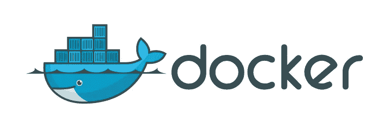
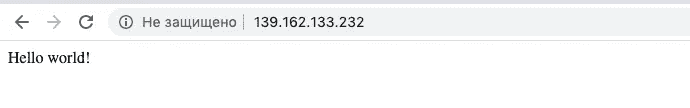
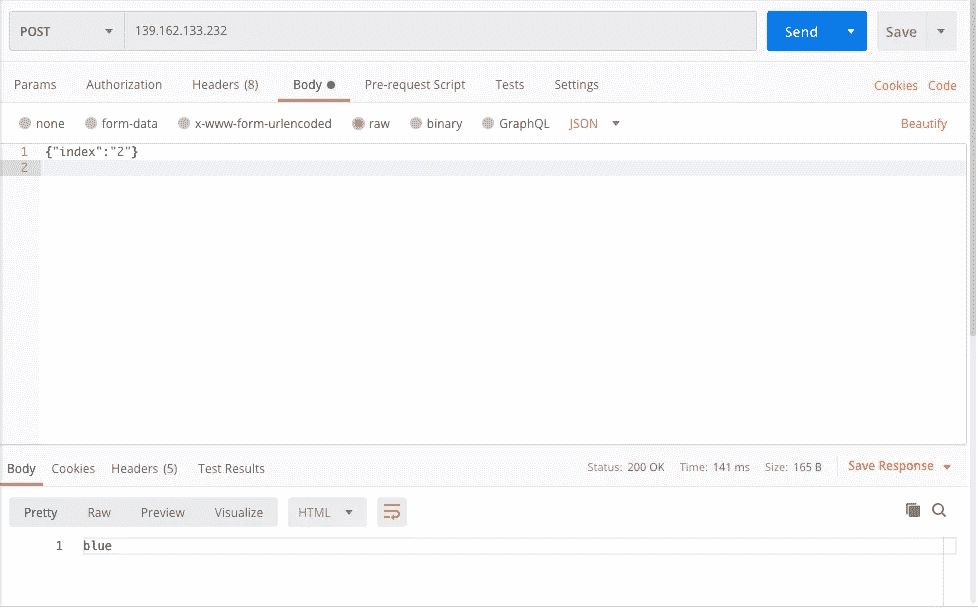

# 如何使用 Flask + Gunicorn + Nginx + Docker 部署 ML 模型

> 原文：<https://towardsdatascience.com/how-to-deploy-ml-models-using-flask-gunicorn-nginx-docker-9b32055b3d0?source=collection_archive---------2----------------------->

## 一个配置 Flask + Gunicorn + Nginx + Docker 的模板，并附有详细的解释，这应该会让你更接近使用微服务、构建 MVP 等等。



[吴伯毅](https://www.flickr.com/photos/appleboy/) via flickr

开发一个好的机器学习模型可能很棘手，但即使有人成功做到了，在你部署它以便其他人可以访问它之前，它仍然几乎没有用处。

部署模型有很多方法，我想谈谈一个非常简单的适用于基本 MVP 的解决方案——用 Flask 为您的模型编写一个 API，用 Gunicorn 为应用服务器编写 API，用 Nginx 为 web 服务器编写 API，用 Docker 包装它，这样就可以更容易地部署在其他机器上(特别是 AWS 和 GCP)。

**完整代码**可以在 [GitHub repo](https://github.com/ivanpanshin/flask_gunicorn_nginx_docker) 中找到。

# 设置服务器

我更喜欢在我专门租用的服务器上用新配置做实验，而不是使用我的个人或工作硬件。这样，如果你把什么东西弄坏了，也没什么大不了的。我推荐使用 Linode 来实现这些目的，因为我个人在我的实验中使用它们，它们的硬件工作得很好。但是你可以随意使用任何其他服务，只要是在 LTS Ubuntu 18.04 上。


曼努埃尔·盖辛格

如果你决定使用 Linode，那么这一部分就是为你准备的。导航至 Linodes 并点击“添加 Linode”。有几件事你应该填写。在发行版中，我建议选择 Ubuntu 18.04 LTS 映像、区域—任何离你更近的地方(我使用法兰克福，DE)、Linode 计划— Nanode(每月仅花费 5 美元，但对于我们的目的来说已经足够了)、root password —你的密码，然后单击“创建”。一段时间后(大约几分钟)，你可以进入“网络”，在那里你可以找到通过 SSH 访问你的服务器的信息。


我建议做的下一件事是连接到服务器并创建具有 sudo 特权的非 root 用户。该操作背后的逻辑相当简单:您不希望以 root 用户身份运行任何东西来扰乱服务器，因为这样更容易破坏东西。

```
adduser usernameusermod -aG sudo username
```

最后，切换到您的新用户:

```
su — username
```

# 创建应用程序容器

整个系统配置分为两部分:应用容器(Flask + Gunicorn)和 web 容器(Nginx web 服务器)。先说第一个。

## 步骤 0 —安装 Docker 和 Docker Compose

Docker 和 docker-compose 安装非常容易。它们分别在 4 行和 2 行中完成。因此，我建议遵循以下页面:

> [码头工人安装](https://docs.docker.com/engine/install/ubuntu/)
> 
> [让 Docker 无根运行](https://docs.docker.com/engine/install/linux-postinstall/)
> 
> [码头工人作曲装置](https://docs.docker.com/compose/install/)

## 步骤 1 —创建 Flask 应用程序和 WSGI 入口点

在主目录中创建 *flask_app* 目录，并将以下文件放在那里。

这是最基本的 Flask 应用程序，几乎没有任何功能。我们不加载任何模型，不添加任何 GET/POST 请求之类的东西。那是以后的事。目前，我们只有一个在主页上显示“hello world”的应用程序。

这是一个非常简单的部分——我们只需为 Gunicorn 创建一个单独的文件，让它在端口 8000 上运行。

## 步骤 2 —为 Flask 创建一个 Docker 映像

现在，我们需要创建一个 Dockerfile 来使用这些文件，并创建一个稍后可以运行的映像。

对于那些不熟悉 Docker 的人来说，这个脚本的作用如下:导入 Python 3.6.7 图像，为所有文件设置工作目录，复制包含 Flask、Gunicorn 和运行 Flask 应用程序所需的所有内容的需求文件。之后，通过 RUN 命令安装来自需求的所有包，最后我们将所有文件从 flask dir 复制到容器内的 *usr/scr/flask_app* 。

现在你只需要把这个文件放在同一个 flask_app 目录下，并添加 *requirements.txt* 。在这种特殊情况下，这是非常基本的:

*附言*记住，如果你对目录之类的东西有点困惑，可以在文章末尾查看完整的项目结构，或者访问 GitHub repo。

## 步骤 3 —创建 Nginx 文件

为了运行 Nginx，您需要进行一些配置。但是在我们继续之前，在您的主目录中创建 nginx 目录(与 *flask_app* 在同一层)。之后，我们需要的第一个文件是 *nginx.conf* ，它包含了所有基本的 nginx 信息和变量。一个非常基本的 Nginx 设置示例:

第二个文件—我们特定应用程序的配置。有两种流行的方法可以做到这一点。第一种是在*/etc/nginx/sites-available/your _ project*中创建一个配置文件，然后创建一个指向*/etc/nginx/sites-enabled/your _ project*的符号链接。第二种方法是在主 Nginx 目录中创建一个 *project.conf* 。我们将采用第二种方法。

有几件事你应该注意。首先看一下*听 80。这个命令指定了你的应用程序将在哪个端口运行。作为默认端口，我们选择 80。其次，服务器名。你可以指定你从 Linode 得到的 IP 地址，或者你可以只使用你的 docker 镜像名称。最后但同样重要的是，*代理传递*命令，将您的 Nginx 配置指向 flask 项目。由于 flask 容器名为 flask_app(我们稍后会用到它)，所以我们只使用容器的名称，以及我们在 flask 项目中指定的端口。*

## 步骤 4 —为 Nginx 创建一个 Docker 映像

这个特定的 Docker 图像相当简单。和 Flask 的情况一样，它也只包含 5 行代码，只做了两件事:导入 nginx 图像，复制我们的文件，并用默认文件替换它们。

## 步骤 5-用 docker-compose 组合 docker 文件

所以，现在我们有两个 docker 文件:一个用于 Flask + Gunicorn，另一个用于 Nginx。是时候让他们互相交流，运行整个系统了。为了做到这一点，我们需要 docker-compose。

我们需要做的唯一基本更改是在主目录中创建 docker-compose.yml 文件。

为了理解它是如何工作的，我们应该解决几个重要的问题。首先， *docker-compose* 拆分成 2 个部分(2 个服务): *flask_app* 和 *nginx* 。从下面几行可以看出，flask_app 容器执行 Gunicorn，guni corn 运行 flask 应用程序，并使用 1 个 worker 将其转换为 8000 端口。而第二个容器只是在 80 端口上运行 Nginx。另外，注意*依赖于*部分。它告诉 docker-compose 首先启动 *flask_app* 容器，然后才启动 *nginx* 容器，因为它们相互依赖。

实际上，我们还应该添加一个东西，这样就可以更容易地运行这个 docker 设置。那就是 *run_docker.sh* 文件

它只是运行 docker-compose，但首先确保此时没有旧的 docker 进程处于活动状态。

## 第六步——把所有东西放在一起

好的，请记住，当前的项目结构应该是这样的:

```
.
├── flask_app 
│   ├── app.py          
│   ├── wsgi.py
│   └── Dockerfile
├── nginx
│   ├── nginx.conf          
│   ├── project.conf
│   └── Dockerfile
├── docker-compose.yml
└── run_docker.sh
```

确保一切就绪后，就该运行 docker 了:

```
bash run_docker.sh
```

通过导航到您从 Linode 获得的 IP 地址，在浏览器中查看主页:



## 第 7 步—我什么也没得到。我该怎么办？

嗯，首先在 Linode 租一个服务器，安装 docker 和 docker-compose，然后克隆 git 库，运行 *bash run_docker.sh.* 在你确定运行成功后，开始改东西。玩玩 Flask、Dockerfiles 或 docker-compose，直到你打破一些东西。之后，试着找出问题所在并修复它。

此外，如果你不精通 Flask、Gunicorn、Nginx 或 Docker，我强烈推荐这些教程:

> [初学者 Docker](https://docker-curriculum.com/)
> 
> [学烧瓶](https://www.tutorialspoint.com/flask/index.htm)
> 
> [烧瓶+ Gunicorn + Nginx](https://www.digitalocean.com/community/tutorials/how-to-serve-flask-applications-with-gunicorn-and-nginx-on-ubuntu-18-04-ru)

## 第八步——好吧，我明白了。下一步是什么？

接下来要添加的是 Flask App 中的 POST 请求支持。这样，您可以向您的模型发送请求，并获得响应。所以，我们需要两样东西。第一个是处理请求的模型。第二— POST 请求支持本身。

为了简单起见，本例中的模型只返回颜色列表的第 I 个元素。但是运行的是哪种模型并不重要，只需在所有方法之上创建模型的实例(*)就可以了，这里有 server = Flask(__name__)* 。

现在，如果您导航到您的 IP 地址，您将看到一条消息"*模型已启动并正在运行。*发送 POST 请求”，因为只是去 IP 就有资格成为 GET 请求。然而，让我们试着发送一个包含模型索引的 json 文件的 POST 请求。就我个人而言，我使用 Postman，但您可以使用任何您喜欢的名称(即 Curl)。



嘿，成功了！现在，您可以添加能够接收 GET/POST 请求的附加路由。这个想法背后的原因是，您可以加载几个模型，并根据 URL 向特定的模型发送请求。

## 第九步——更进一步怎么样？

实际上还有一件大事要做。为了部署这个 docker 设置，将它部署在云中可能是个好主意。例如，我建议看一看将 Docker 部署到 Amazon ECS 的[。这种方法的主要优点之一是 AWS 将负责集群管理基础设施。](https://medium.com/underscoretec/deploy-your-own-custom-docker-image-on-amazon-ecs-b1584e62484)

# 结论

我们已经用 Gunicorn + Nginx + Docker 在 Flask 应用程序中运行了一个模型。请注意，如果您有任何问题，请随时在评论、GitHub 问题或我的电子邮件地址 ivan.panshin@protonmail.com 联系我